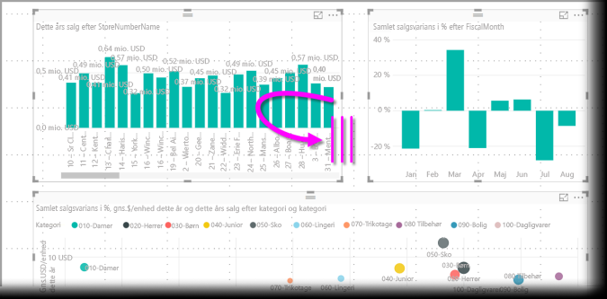
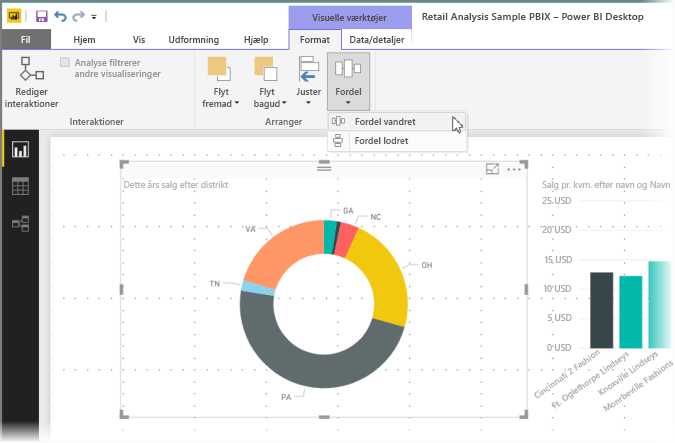

# Brug gitterlinjer og fastgørelse til gitter i Power BI Desktop-rapporter
**Power BI Desktop**-rapportlærredet indeholder gitterlinjer, som du kan bruge til at justere visuelle elementer på en rapportside, så det ser pænt ud, og det indeholder også funktionen for fastgørelse til gitter, så dine visuelle elementer i dine rapporter ser jævne ud, er justeret og har lige stor afstand.

I **Power BI Desktop** kan du også tilpasse z-rækkefølgen (flytte fremad eller bagud) for objekter i en rapport samt justere eller fordele valgte visuelle elementer på lærredet på en jævn måde.

### Aktivér gitterlinjer og fastgørelse til gitter
Hvis du vil aktivere gitterlinjer og fastgørelse til gitter, skal du vælge båndet **Vis** og derefter markere afkrydsningsfeltet for **Vis gitterlinjer** og **Fastgør objekter til gitter**. Du kan vælge et eller begge felter. De fungerer uafhængigt af hinanden.

> [!NOTE]
> Hvis **Vis gitterlinjer** og **Fastgør objekter til gitter** er deaktiveret, kan du oprette forbindelse til en datakilde for at aktivere dem.
> 
> 

### Brug af gitterlinjer
Gitterlinjer er visuelle hjælpelinjer, som viser dig, om to eller flere visuelle elementer er justeret korrekt. Når du forsøger at bestemme, om to (eller flere) visuelle elementer er justeret vandret eller lodret, kan du bruge gitterlinjerne til at se, om kanterne er justeret.

Du kan bruge *Ctrl + klik* til at vælge mere end ét visuelt element ad gangen, hvilket viser alle de valgte visuelle kanter, så du nemt kan se, om de visuelle elementer er justeret korrekt.

#### Brug af gitterlinjer i visuelle elementer
I Power BI er der også gitterlinjer i visuelle elementer, som indeholder visuelle hjælpelinjer til sammenligning af datapunkter og værdier. Fra og med versionen af **Power BI Desktop** fra september 2017 kan du nu administrere gitterlinjerne i visuelle elementer ved hjælp af kortet **X-akse** eller **Y-akse** (afhængigt af typen af visuelt element), der findes i sektionen **Format** i ruden **Visualiseringer**. Du kan administrere følgende gitterlinjeelementer i et visuelt element:

* Slå gitterlinjer til eller fra
* Skift farve på gitterlinjer
* Juster stregen (tykkelsen) i gitterlinjer
* Vælg stregtypen for gitterlinjerne i det visuelle element, f.eks. udfyldt, stiplet eller prikket

Det kan især være en god ide at ændre bestemte elementer i gitterlinjer i rapporter, hvor der bruges en mørk baggrund til visuelle elementer. På følgende billede vises sektionen *Gitterlinjer* på kortet **X-akse**.

### Brug fastgørelse til gitter
Når du aktiverer **Fastgør objekter til gitter**, justeres alle visuelle elementer på lærredet i **Power BI Desktop**, som du flytter (eller ændrer størrelsen på), automatisk i forhold til den nærmeste akse i gitteret for at sikre, at to eller flere visuelle elementer justeres i forhold til den samme vandrette eller lodrette placering eller størrelse.

Og det er det eneste, du skal vide om at bruge **gitterlinjer** og **fastgørelse til gitter**, så du nemt kan sikre, at de visuelle elementer i dine rapporter justeres, som de skal.

### Brug z-rækkefølge, justering og fordeling
Du kan også administrere rækkefølgen fra den første til den sidste af de visuelle elementer i en rapport, ofte kaldet *z-rækkefølgen* af elementer. Det giver dig mulighed for at overlappe visuelle elementer, som du ønsker det, og derefter justere rækkefølgen fra første til sidste for de enkelte visuelle elementer. Denne sortering udføres ved hjælp af knapperne **Flyt fremad** og **Flyt bagud**, der findes i sektionen **Arranger** på båndet **Format**, der vises, når du vælger et eller flere visuelle elementer på siden (og den er ikke tilgængelig, hvis der ikke er valgt visuelle elementer).

På båndet **Format** kan du også justere visuelle elementer på mange forskellige måder. Det giver dig mulighed at sikre, at visuelle elementer vises på siden med den justering, som du synes fungerer og ser bedst ud.

Når der er valgt ét visuelt element og du bruger knappen **Juster**, justeres dette visuelle element til kanten (eller midten) af rapportlærredet, som vist på følgende billede.

Når der er valgt to eller flere visuelle elementer, justeres de sammen og bruger den eksisterende justerede grænse i de visuelle elementer til justering. Hvis der for eksempel er valgt to visuelle elementer, og knappen *Venstrejuster* er valgt, justeres de visuelle elementer i forhold til grænsen længst til venstre for alle de valgte visuelle elementer.

Du kan også fordele dine visuelle elementer jævnt over hele rapportlærredet lodret eller vandret. Du skal bare bruge knappen **Fordel** på båndet **Format**.

Med bare et par indstillinger i disse værktøjer til gitterlinjer, justering og fordeling kommer dine rapporter til at se ud, som du ønsker det.

