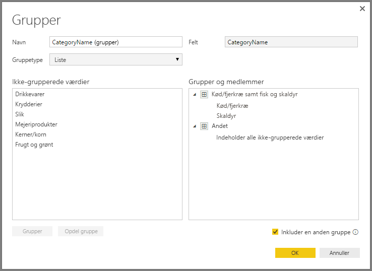

# Brug gruppering og gruppering i beholder i Power BI Desktop
Når der oprettes visualiseringer i **Power BI Desktop**, samles dine data i dele (eller **grupper**) baseret på de værdier, der bliver fundet i de underliggende data. Det er ofte fint, men der kan være tilfælde, hvor du gerne vil justere, hvordan disse dele vises. Eksempel: Du vil måske placere tre produktkategorier i én større kategori (én *gruppe*). Det kan også være, at du vil se salgstal, der er placeret i beholderstørrelser på USD 1.000.000 i stedet for jævnt fordelt på USD 923.983.

I Power BI Desktop kan du **gruppere** datapunkter, så du kan få vist, analysere og udforske data og tendenser i dine visualiseringer på en mere klar måde. Du kan også definere **beholderstørrelsen**, som ofte kaldes **gruppering i beholder**, for at sortere værdierne i lige store grupper, så du bedre kan visualisere data på en meningsfuld måde.

### Brug af gruppering
For at bruge **gruppering** skal du vælge to eller flere elementer i en visualisering ved hjælp af Ctrl + klik. Højreklik derefter på et af elementerne, og vælg *Gruppér* i den menu, der vises.

Når du har oprettet gruppen, føjes den til området **Forklaring** for visualiseringen og vises også på listen **Felter**.

Når du har en gruppe, kan du nemt redigere medlemmerne i denne gruppe ved at højreklikke på feltet i området **Forklaring** eller på listen **Felter** og vælge *Rediger grupper*.

I vinduet **Grupper**, der vises, kan du oprette nye grupper eller redigere eksisterende grupper. Du kan også *omdøbe* en gruppe ved at dobbeltklikke på titlen **Gruppe** i feltet **Grupper og medlemmer** og skrive et nyt navn.

Du kan udføre mange forskellige handlinger for grupper i dette vindue. Du kan føje elementer fra listen **Ikkegrupperede værdier** til en ny gruppe eller til en af de eksisterende grupper. Hvis du vil oprette en ny gruppe, skal du vælge to eller flere elementer (ved hjælp af Ctrl + klik) fra feltet **Ikkegrupperede værdier** og derefter klikke på knappen **Gruppér** under dette felt.

Du kan føje en ikkegrupperet værdi til en eksisterende gruppe: Du skal blot vælge den værdi, der ikke er grupperet, og derefter vælge den eksisterende gruppe, som du vil føje den til, og til sidst klikke på knappen **Gruppér**. Hvis du vil fjerne et element fra en gruppe, skal du vælge det i feltet **Grupper og medlemmer** og derefter klikke på **Opdel gruppe**. Du kan også vælge, om ikkegrupperede kategorier skal placeres i gruppen **Andre** eller skal forblive ikkegrupperede.

> [!NOTE]
> Du kan oprette grupper for et hvilket som helst felt i brønden **Felter** uden at skulle vælge flere i en eksisterende visualisering. Du skal blot højreklikke på feltet og vælge **Gruppér** i den menu, der vises.
> 
> 

### Brug af gruppering i beholder
Du kan angive beholderstørrelsen for numeriske felter og klokkeslætsfelter i **Power BI Desktop.** Du kan bruge gruppering i beholder til at tilpasse de data, der vises i **Power BI Desktop**, til den korrekte størrelse.

Du anvender en beholderstørrelse ved at højreklikke på et **Felt** og vælge **Gruppér**.

I vinduet **Grupper** skal du angive den **Grupperingsstørrelse**, du vil have for beholderen.

Når du vælger **OK**, kan du se, at der vises et nyt felt i ruden **Felter**, hvor *(grupperinger)* er tilføjet. Du kan derefter trække dette felt til canvasset, så du kan bruge beholderstørrelsen i en visualisering.

Du kan se, hvordan **gruppering i beholdere** fungerer i denne [video](https://www.youtube.com/watch?v=BRvdZSfO0DY).

Så nemt er det at bruge **gruppering** og **gruppering i beholder** til at sikre, at dine data vises lige præcis på den måde, du gerne vil, i dine visualiseringer.

