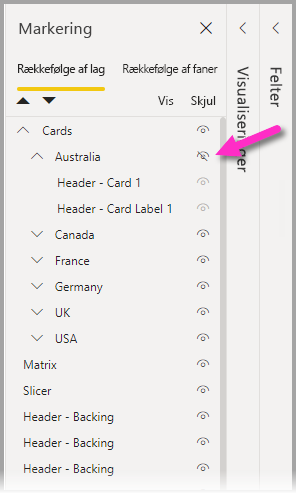
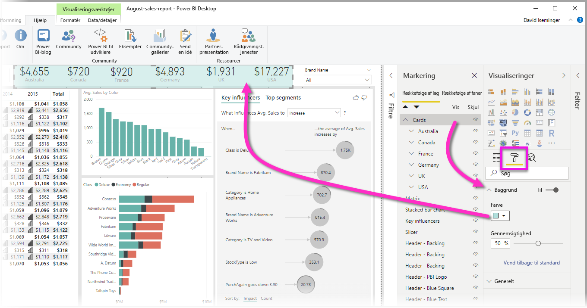

# Gruppér visualiseringer i Power BI Desktop-rapporter
Med **gruppering** kan du i **Power BI Desktop** gruppere visuelle elementer i din rapport, f.eks. knapper, tekstfelter, figurbilleder og alle visuelle elementer, som du opretter, på samme måde som du grupperer elementer i PowerPoint. Når du grupperer visuelle elementer i en rapport, kan du behandle gruppen som et enkelt objekt, så det bliver nemmere, hurtigere og mere intuitivt at flytte, tilpasse størrelsen og arbejde med lag i din rapport.

## Oprettelse af grupper

Hvis du vil oprette en gruppe visuelle elementer i Power BI Desktop, skal du vælge det første visuelle element på lærredet og derefter holde Ctrl-tasten nede, klikke på en eller flere visuelle elementer, som du vil have med i gruppen, og derefter højreklikke på samlingen af visuelle elementer og vælge **Gruppér** i den menu, der vises.

Grupper vises i ruden **Valg**. Du kan have lige så mange grupper af visualiseringer, som du har brug for i dine rapporter, og du kan også indlejre grupper af visuelle elementer. På følgende billede er gruppen *Australien* indlejret i gruppen *Kort*. Du kan udvide en gruppe ved at vælge indsætningspunktet ud for gruppenavnet og skjule den ved at vælge indsætningspunktet igen. 

Du kan også trække og slippe individuelle visuelle elementer i ruden **Valg** for at inkludere dem i en gruppe, fjerne dem fra en gruppe, indlejre en gruppe eller fjerne en gruppe eller et individuelt visuelt element fra en indlejring. Du skal blot trække det visuelle element, du vil justere, og placere det på det ønskede sted. Lagdelingen af visuelle elementer, hvis de overlapper hinanden, bestemmes af deres rækkefølge på *Rækkefølge for lag*.

Hvis du kun vil opdele gruppen, skal du markere gruppen, højreklikke og vælge **Opdel gruppe** i den menu, der vises.

## Skjul og vis visuelle elementer eller grupper

Du kan nemt skjule eller få vist grupper ved hjælp af ruden **Valg**. Hvis du vil skjule en gruppe, skal du vælge knappen med øjet ud for gruppenavnet (eller et enkelt visuelt element) for at skifte mellem, om det visuelle element eller gruppen er skjult eller vist. På følgende billede er gruppen *Australien* skjult, og resten af grupperne, der er indlejret i gruppen *Kort*, vises.

Når du skjuler en gruppe, skjules alle visuelle elementer i den pågældende gruppe, hvilket vises, ved at knappen med øjet nedtones (ikke muligt at slå til og fra, da hele gruppen er skjult). Hvis du kun vil skjule bestemte visuelle elementer i en gruppe, skal du bare slå knappen med øjet ud for det visuelle element fra, hvorefter det kun er det visuelle element i gruppen, der er skjult.

## Valg af visuelle elementer i en gruppe

Der er et par måder at navigere på og vælge elementer i en gruppe visuelle elementer. På følgende liste beskrives funktionsmåden:

* Hvis du klikker på et tomt område i en gruppe (f.eks. et tomt område mellem visuelle elementer), markeres der ikke noget.
* Hvis du klikker på et visuelt element i en gruppe, vælges hele gruppen. Hvis du klikker endnu en gang, markeres det enkelte visuelle element.
* Når du markerer en gruppe og derefter et andet objekt på rapportlærredet, oprettes en indlejret gruppe, hvis du vælger **Gruppér** i menuen, når du højreklikker.
* Når du vælger to grupper, vises der en mulighed for at flette de valgte grupper i stedet for at indlejre dem, når du højreklikker

## Anvend baggrundsfarve

Du kan også anvende en baggrundsfarve for en gruppe ved hjælp afsnittet **Formatering** i ruden **Visualiseringer**, som vist på følgende billede. 

Når du har anvendt en baggrundsfarve, markerer du gruppen ved at klikke på området mellem de visuelle elementer i gruppen (sammenlign dette med at klikke på det tomme område mellem visuelle elementer i en gruppe, hvilket ikke markerer gruppen). 

## De næste trin
Du kan få flere oplysninger om gruppering ved at se følgende video:

* [Gruppering i Power BI Desktop – video](https://youtu.be/sf4n7VXoQHY?t=10)

Du vil måske også være interesseret i følgende artikler:

* [Brug tværgående detaljeadgang i rapport i Power BI Desktop](desktop-cross-report-drill-through.md)
* [Brug af udsnitsværktøjer i Power BI Desktop](visuals/power-bi-visualization-slicers.md)

