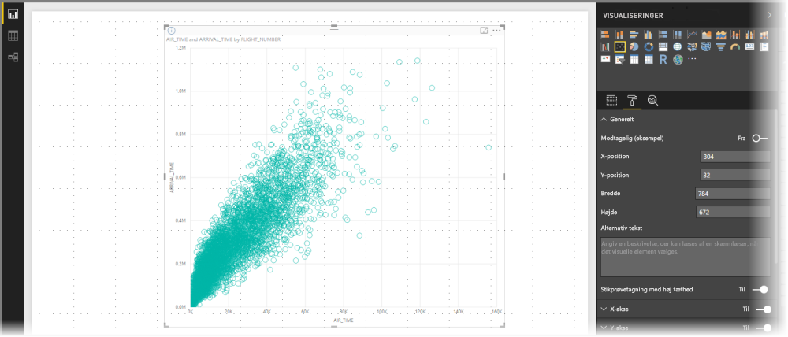
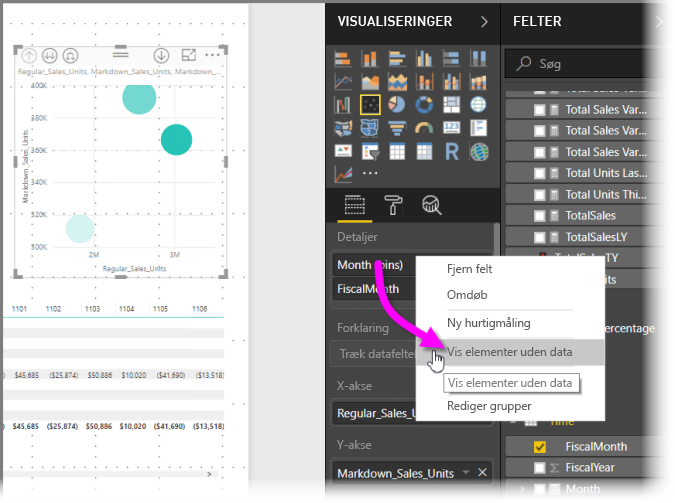
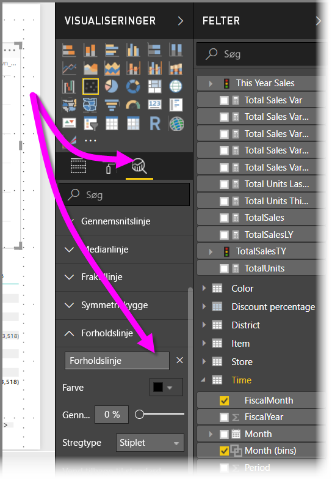
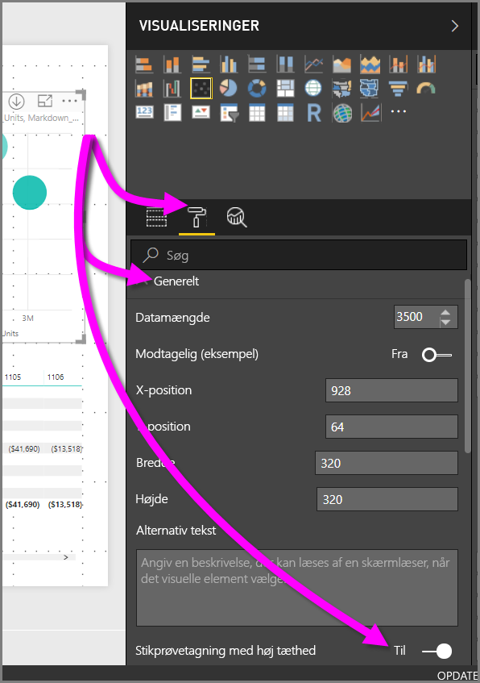

# Udsnit med høj tæthed i Power BI-punktdiagrammer
Fra og med udgivelsen af **Power BI Desktop** fra september 2017 og opdateringerne til **Power BI-tjenesten**, er der en ny algoritme til udsnit tilgængelig, som forbedrer den måde, punktdiagrammer viser data på med høj tæthed.

Du kan f.eks. oprette et punktdiagram på baggrund af organisationens salgsaktiviteter, hvor hver butik har titusinde datapunkter hvert år. Et punktdiagram med disse oplysninger indsamler data (vælg en relevant repræsentation af disse data for at illustrere, hvordan salget er sket med tiden) fra de tilgængelige data og opretter et punktdiagram, der repræsenterer de underliggende data. Dette er almindelig praksis i punktdiagrammer med høj tæthed, og Power BI har forbedret dette udsnit af data med høj tæthed. Disse oplysninger er beskrevet i denne artikel.

> [!NOTE]
> Den algoritme for **udsnit med høj tæthed**, der er beskrevet i denne artikel, gælder for, og er tilgængelig i, punktdiagrammer i både **Power BI Desktop** og **Power BI-tjenesten**.
> 
> 

## Sådan fungerer punktdiagrammer med høj tæthed
Tidligere valgte **Power BI** et udsnit af eksempeldatapunkter i alle de underliggende data på en deterministisk måde for at oprette et punktdiagram. Power BI ville specifikt vælge de første og sidste rækker med data i serien af punktdiagrammer, og derefter ville de resterende rækker blive jævnt fordelt, så 3.500 datapunkter i alt ville blive afbilledet i punktdiagrammet. Hvis udsnittet f.eks. havde 35.000 rækker, ville de første og sidste rækker blive valgt til afbildning, og derefter ville hver 10. række også blive afbilledet (35.000/10 = hver 10 række = 3.500 datapunkter). Tidligere blev null-værdier eller punkter, der ikke kunne afbilledes (f.eks. tekstværdier) i dataserierne, ikke vist, og derfor blev de ikke taget i betragtning, når visualiseringen skulle genereres. Med denne type udsnit blev den opfattede tæthed i punktdiagrammet også baseret på repræsentative datapunkter. Dermed var den implicitte visuelle tæthed en omstændighed for udsnittet af punkter, og ikke for den fulde samling af underliggende data.

Når du aktiverer **Udsnit med høj tæthed**, implementeres en algoritme i Power BI, der fjerner overlappende punkter og sikrer, at punkterne i visualiseringen kan nås, når der interageres med visualiseringen. Den sikrer også , at alle punkterne i datasættet repræsenteres i visualiseringen, hvilket giver en kontekst for de udvalgte punkter og ikke bare en afbildning af et repræsentativt udsnit.

Pr. definition er der lavet et udsnit af data med høj tæthed for at gøre det muligt hurtigere at oprette visualiseringer. Dataene reagerer også på interaktivitet (for mange datapunkter i en visualisering kan fryse en visualisering og dermed forringe synligheden af tendenser). Det, der ligger til grund for et udsnit af disse data for at give den bedste visualisering og sikring af, at alle data er repræsenteret, er det, der driver oprettelsen af udsnitsalgoritmen. I Power BI er algoritmen blevet forbedret for at opnå den bedste kombination af svartid, repræsentation, og tydelig bevarelse af vigtige punkter i det overordnede datasæt.

> [!NOTE]
> Punktdiagrammer, der bruger algoritmen for **udsnit med høj tæthed** afbildes bedst i firkantede visualiseringer, som det er tilfældet med alle punktdiagrammer.
> 
> 

## Sådan fungerer den nye algoritme for udsnit i punktdiagrammer
Den nye algoritme for **udsnit med høj tæthed** for punktdiagrammer anvender metoder, der fanger og repræsenterer de underliggende data mere effektivt og samtidig fjerner overlappende punkter. Det gøres ved at starte med en lille radius for hvert datapunkt (den synlige cirkelstørrelse for et givet punkt i visualiseringen). Derefter øges radius for alle datapunkterne. Når to (eller flere) datapunkter overlapper hinanden, repræsenterer en enkelt cirkel (med den øgede radiusstørrelse) disse overlappede datapunkter. Algoritmen fortsætter med at øge radius for datapunkterne, indtil radiusværdien resulterer i et rimeligt antal datapunkter – 3.500 – der vises i punktdiagrammet.

Metoderne i denne algoritme sikrer, at udenforliggende værdier repræsenteres i den visualisering, der genereres. Algoritmen respekterer også skaleringen, når overlappet bestemmes, så der visualiseres eksponentielle skaleringer med nøjagtige gengivelser af de underliggende visualiserede punkter.

Algoritmen bevarer også den overordnede form af punktdiagrammet.

> [!NOTE]
> Når du bruger algoritmen for **Udsnit med høj tæthed** for punktdiagrammer, er målet *korrekt distribution* af dataene, og underforstået visuel tæthed er *ikke* målet. Du kan f.eks. få vist et punktdiagram med mange overlappende cirkler (tæthed) i et bestemt område og forestille dig, hvor mange datapunkter der er samlet der i klynger. Da algoritmen for **Udsnit med høj tæthed** kan bruge én cirkel til at repræsentere mange datapunkter, vises en sådan underforstået visuel tæthed (eller "klyngedannelse") ikke. Hvis du vil have flere detaljer i et bestemt område, kan du bruge udsnitsværktøjerne til at zoome ind.
> 
> 

Desuden kan nogle datapunkter ikke afbildes (f.eks. null-værdier og tekstværdier) og ignoreres derfor, så en anden værdi, der kan afbildes, vælges. Dette sikrer, at punktdiagrammets sande form bevares.

### Når standardalgoritmen for punktdiagrammer anvendes
Der er omstændigheder, som gør, at **Udsnit med høj tæthed** ikke kan anvendes på et punktdiagram, og den oprindelige algoritme anvendes i stedet for. Det drejer sig om følgende tilfælde:

* Hvis du højreklikker på **Oplysninger** og derefter vælger **Vis elementer uden data** i den viste menu, returneres punktdiagrammet til den oprindelige algoritme.
  
  
* Alle værdier på aksen **Afspil** vil medføre, at punktdiagrammet returneres til den oprindelige algoritme.
* Hvis både X og Y-akserne mangler i et punktdiagram, returneres diagrammet til den oprindelige algoritme.
* Brugen af en **Forholdslinje** i ruden **Analyse** rude medfører, at punktdiagrammet returneres til den oprindelige algoritme.
  
  

## Sådan aktiveres udsnit med høj tæthed for et punktdiagram
Hvis du vil slå **Udsnit med høj tæthed** til, skal du vælge et punktdiagram og derefter gå til ruden **Formatering** og udvide kortet **Generelt**. I bunden af dette kort er der en skyder kaldet **Udsnit med høj tæthed**. Hvis du vil slå den til, skal du skubbe den hen på **Til**.

> [!NOTE]
> Når skyderen er aktiveret, forsøger Power BI at bruge algoritmen **Udsnit med høj tæthed**, når det er muligt. Når algoritmen ikke kan bruges (hvis du f.eks. anbringer en værdi på aksen *Afspil*), forbliver skyderen i placeringen **Til**, selvom diagrammet er returneret til standardalgoritmen. Hvis du fjerner en værdi fra aksen *Afspil* (eller betingelserne ændres for at aktivere brugen af algoritmen for udsnit med høj tæthed), vil algoritmen for udsnit med høj tæthed automatisk blive anvendt, da skyderen findes i det pågældende diagram.
> 
> [!NOTE]
> Datapunkter grupperes og/eller vælges af indekset. Hvis der er en forklaring, påvirker den ikke udsnittet for algoritmen. Den påvirker kun rækkefølgen i visualiseringen.
> 
> 

## Overvejelser og begrænsninger
Algoritmen for udsnit med høj tæthed er en vigtig forbedring af Power BI, men der er endnu et par ting, du skal vide, når du arbejder med værdier med høj tæthed og punktdiagrammer.

* Algoritmen **Udsnit med høj tæthed** fungerer kun med liveforbindelser til modeller, der er baseret på Power BI-tjenesten, importerede modeller eller DirectQuery.

## Næste trin
Du kan finde flere oplysninger om udsnit med høj tæthed i andre diagrammer i følgende artikel.

* [Linjeudsnit med høj tæthed i Power BI](desktop-high-density-sampling.md)

