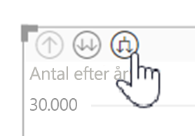
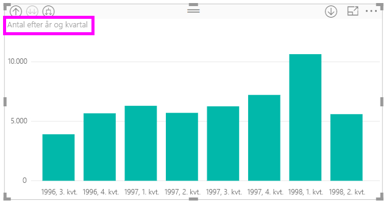
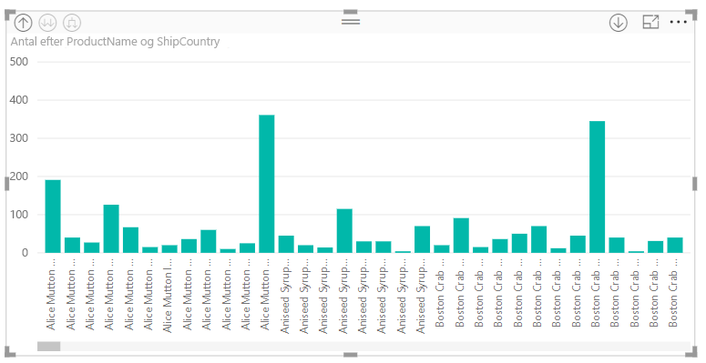

# Brug indbyggede hierarkietiketter i Power BI Desktop
**Power BI Desktop** understøtter brugen af **indbyggede hierarkietiketter**, som er den første af to funktioner, der skal bruges til at forbedre den hierarkiske detailudledning. Den anden funktion, som i øjeblikket er under udvikling, er muligheden for at bruge indlejrede hierarkietiketter (hold øje med den – der sker jævnligt opdateringer).   

## Sådan fungerer indbyggede hierarkietiketter
Med indbyggede hierarkietiketter kan du se hierarkietiketter, når du udvider visuelle elementer ved hjælp af funktionen **Udvid alle**. En af fordelene ved at se disse hierarkietiketter er, at du også kan vælge at **sortere** efter disse forskellige hierarkietiketter, når du udvider dine hierarkiske data.

### Brug den indbyggede funktion Udvid (uden at sortere efter hierarkietiketter)
Før vi kigger på, hvordan indbyggede hierarkietiketter fungerer, skal vi se på, hvordan standardfunktionen **Udvid til næste niveau** fungerer. Det hjælper os med at forstå (og sætte pris på), hvor nyttige indbyggede hierarkietiketter kan være.

På følgende billede vises et visuelt element i et liggende søjlediagram for årligt salg. Når du højreklikker på en søjle, kan du vælge **Udvid til næste niveau**.

> [!NOTE]
> Som et alternativ til at højreklikke på en søjle kan du vælge knappen *Udvid* øverst til venstre for visualiseringen.

  

Når **Udvid til næste niveau** er markeret, udvider det visuelle element datohierarkiet fra *År* til *Kvartal*, som vist på følgende billede.

Bemærk, at etiketterne *År* og *Kvartal* vises indlejret sammen. Dette etiketskema fortsætter, efterhånden som du bruger **Udvid alle** ned til bunden af hierarkiet.

Sådan fungerer det indbyggede *Dato*-hierarki, der er knyttet til felter, som har datatypen *dato/klokkeslæt*. Lad os gå videre til næste afsnit og se på, hvordan den nye funktion for indbyggede hierarkietiketter adskiller sig.

### Brug indbyggede hierarkietiketter
Lad os nu se på en anden diagramtype – ved hjælp af data med uformelle hierarkier. I det følgende visuelle element har vi et liggende søjlediagram med **Mængde**, der bruger *ProductName* som akse. I disse data danner *ProductName* og *ShipCountry* et uformelt hierarki. Her kan du igen vælge *Udvid til næste niveau* for at analysere ned i hierarkiet.

Hvis du vælger **Udvid til næste niveau**, vises næste niveau med indbygget visning af hierarkietiketter. Som standard er indbyggede hierarkier sorteret efter måleværdien – i dette tilfælde **Mængde**. Hvis indbyggede hierarkietiketter er aktiveret, kan du også vælge at sortere disse data efter hierarki ved at vælge ellipsen i øverste højre hjørne (**...** ) og derefter vælge **Sortér efter ProductName ShipCountry** som vist på følgende billede.

Når **ShipCountry** er valgt, sorteres dataene på baggrund af det valgte uformelle hierarki som vist på følgende billede.

> [!NOTE]
> Funktionen for indbyggede hierarkietiketter tillader endnu ikke, at det indbyggede tidshierarki sorteres efter værdi. Det kan kun sorteres efter hierarkiets rækkefølge.
> 
> 

## Fejlfinding
Det kan ske, at dine visuelle elementer er fastlåst i en tilstand, hvor det indbyggede hierarkiniveau er udvidet. I nogle tilfælde er nogle af de visuelle elementer fastlåst i den tilstand, hvor de blev udvidet, og i dette tilfælde virker det ikke at fjerne sig fra detaljerne. Det kan ske, hvis du har udført følgende trin (løsningen på dette problem findes *under* disse trin):

Trin, der kan forårsage, at dine visuelle elementer er fastlåst i udvidet tilstand:

1. Du aktiverer funktionen for **indbyggede hierarkietiketter**
2. Du opretter nogle visuelle elementer med hierarkier
3. Derefter vælger du **Udvid alle** og gemmer din fil
4. Derefter *deaktiverer* du funktionen for **indbyggede hierarkietiketter** og genstarter Power BI Desktop
5. Så åbner du filen igen

Hvis du kommer til at udføre disse trin, og dine visuelle elementer er fastlåst i udvidet tilstand, kan du gøre følgende for at løse problemet:

1. Aktivér funktionen for **indbyggede hierarkietiketter** igen, og genstart derefter Power BI Desktop
2. Åbn din fil igen, og gå tilbage til toppen af de berørte visuelle elementer
3. Gem filen
4. Deaktiver funktionen for **indbyggede hierarkietiketter** igen, og genstart derefter Power BI Desktop
5. Åbn filen igen

Du kan også bare slette det visuelle element og oprette det igen.

