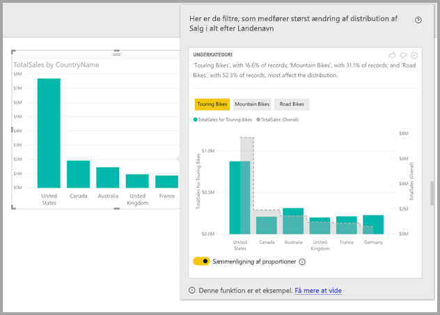
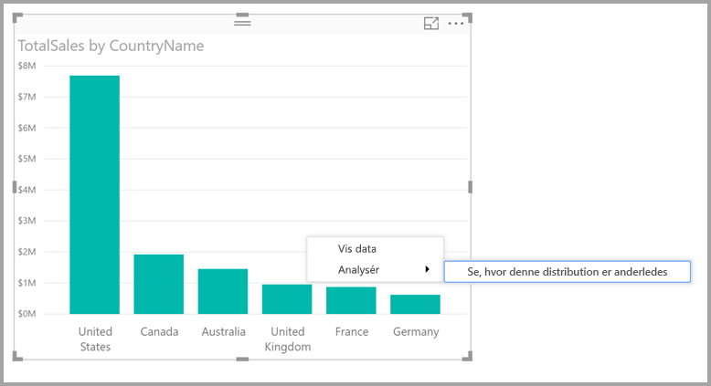

# Brug indsigter i Power BI Desktop til at finde ud af, hvor distributionen er anderledes (Preview)

I visualiseringer vil du ofte se et datapunkt, hvor du undrer dig over, om distributionen vil være den samme for forskellige kategorier. Med **indsigter** i **Power BI Desktop** kan du finde ud af det med nogle få klik.

Overvej følgende visualisering, som viser *Total Sales* efter *Country*. Som det vises i diagrammet, sker den største del af salget i USA. Det står for 57 % af hele omsætningen med mindre bidrag fra andre lande. I sådanne tilfælde er det ofte interessant at undersøge, om den samme distribution gælder for forskellige delpopulationer. Gælder det for eksempel for alle år, alle salgskanaler og alle produktkategorier?  Selvom du kan anvende forskellige filtre og sammenligne resultaterne visuelt, kan det være tidskrævende, og der er risiko for fejl. 

Du kan få **Power BI Desktop** til at finde ud af, hvor en distribution er anderledes, så du får hurtig og automatisk indsigtsanalyse i dine data. Du skal blot højreklikke på et datapunkt og vælge **Analysér > Find ud af, hvor distributionen er anderledes**, så får du vist oplysningerne i et nyt vindue.

I dette eksempel viser den automatiske analyse, at for *Touring Bikes* er andelen af salget i USA og Canada lavere, mens den andel, der kommer fra andre lande, er højere.   

> [!NOTE]
> Denne funktion leveres som prøveversion og ændres måske. Indsigtsfunktionen er aktiveret og slået til som standard (du behøver ikke at markere et afkrydsningsfelt for eksempelvisning for at aktivere den) fra og med versionen af **Power BI Desktop** fra september 2017.
> 
> 

## Brug af indsigt
Hvis du vil bruge indsigt for at finde ud af, hvor distributioner i et diagram er anderledes, skal du højreklikke på et vilkårligt datapunkt (eller på en visualisering som et hele) og vælge **Analysér > Find ud af, hvor en distribution er anderledes**.

**Power BI Desktop** kører nogle algoritmer, der bruger maskinlæring, på dataene. Et vindue udfyldes med en visualisering og en beskrivelse med kategorier (kolonner) og de værdier i kategorierne, som resulterer i den største afvigelse i distributionen. Dataene vises som et søjlediagram som i følgende billede. 

Værdierne med det valgte filter anvendt vises med den almindelige standardfarve. De samlede værdier, som vises i den oprindelige visualisering, vises med grå farve, så de er nemme at sammenligne. Der kan inkluderes op til tre forskellige filtre (*Touring Bikes*, *Mountain Bikes*, *Road Bikes* i dette eksempel), og der kan vælges forskellige filtre ved at klikke på dem (eller du kan Ctrl+klikke for at vælge flere).

For enkle additive målinger, f.eks. *Total Sales* i dette eksempel, er sammenligningen baseret på relative værdier. Det betyder, at selvom salget af Touring Bikes er lavere end det samlede salg for alle kategorier, vil visualiseringen bruge en dobbelt akse for at tillade sammenligning af forholdet mellem salget på tværs af de forskellige lande for Touring Bikes i forhold til alle kategorier af cykler.  Hvis du skifter til/fra-knappen under visualiseringen, kan de to værdier vises på den samme akse, så det er nemt at sammenligne absolutte værdier (som vist i følgende billede).    

Den beskrivende tekst giver også en indikation af, hvor vigtigt et anvendt filter kan være. Det gøres ved at vise, hvor mange poster der matcher filteret. I dette eksempel kan du se, at mens distributionen for *Touring Bikes* er meget anderledes, udgør det kun 16,6 % af posterne.

Du kan bruge ikonerne med *tommel op* og *tommel ned* øverst på siden til at give feedback på det visuelle element og funktionen. Det giver feedback, men det træner ikke algoritmen til at påvirke det resultat, der returneres næste gang, du bruger funktionen.

Og læg især mærke til, at knappen **+** øverst i det visuelle element gør det muligt at tilføje det valgte visuelle element i rapporten på samme måde, som hvis du havde oprettet det visuelle element manuelt. Du kan derefter formatere eller på anden måde justere det tilføjede visuelle element på samme måde som alle andre visuelle elementer i rapporten. Du kan kun tilføje et visuelt element for den valgte indsigt, når du redigerer en rapport i **Power BI Desktop**.

Du kan bruge indsigt, når rapporten er i læse- eller redigeringstilstand, hvilket betyder, at du både kan analyse data og oprette visuelle elementer, som du nemt kan føje til dine rapporter.

## Oplysninger om de returnerede resultater
Du kan tænke på algoritmen som en metode til at tage alle kolonnerne i modellen, og for alle værdierne i disse kolonner, anvendes de som filtre på den oprindelige visualisering, hvorefter den finder de filtrerede værdier, som medfører den største *forskel* i forhold til originalen.

Du vil måske undre dig over, hvad *forskel* helt præcis betyder. Vi kan f.eks. antage, at fordelingen af det samlede salg for USA og Canada er følgende:

|Land  |Salg ($ mio.)|
|---------|----------|
|USA      |15        |
|Canada   |5         |

For en bestemt produktkategori, f.eks. *“Road Bike*, kan fordelingen være:

|Land  |Salg ($ mio.)|
|---------|----------|
|USA      |3        |
|Canada   |1         |

Selvom tallene i tabellerne er forskellige, er de relative værdier mellem USA og Canada identiske (75 % og 25 % i alt for Road Bikes). Derfor betragtes det ikke som en forskel. For enkle additive målinger som denne vil algoritmen derfor se efter forskelle i den *relative* værdi.  

I modsætning til dette kan du overveje en måling som fortjenesten, som beregnes som profit/omkostninger, og du kan have følgende avance for USA og Canada

|Land  |Avance (%)|
|---------|----------|
|USA      |15        |
|Canada   |5         |

For en bestemt produktkategori, f.eks. *“Road Bike*, kan fordelingen være:

|Land  |Avance (%)|
|---------|----------|
|USA      |3        |
|Canada   |1         |

På grund af betydningen af målingen *bliver* dette betragtet som en interessant forskel. Så for målinger, der ikke er additive, f.eks. beregning af avancen i procent, vil algoritmen se efter forskelle i den absolutte værdi.

De viste visualiseringer er derfor beregnet til tydeligt at vise de forskelle, der blev fundet mellem den samlede distribution (som vist i den oprindelige visualisering), og værdien med det bestemte filtre anvendt.  

For additive målinger, f.eks. *Sales*, i det foregående eksempel, blev der brugt et søjle- og kurvediagram, hvor det er nemt at sammenligne skaleringen af relative værdier med de to akser. Søjlerne viser værdien med filteret anvendt, mens kurven viser den samlede værdi (hvor aksen for søjlen vises til venstre, mens aksen for kurven vises til højre). Kurven viser et *trinvist* format med en stiplet linje, som er udfyldt med grå farve. Hvis maksimumværdien på aksen for søjlediagrammet i det forrige eksempel er 4, og maksimumværdien på aksen for kurvediagrammet er 20, vil det være nemt at sammenligne de relative værdier mellem USA og Canada for de filtrerede og samlede værdier. 

Tilsvarende bruges der et søjle- og kurvediagram til målinger, der ikke er additive, f.eks. for *Avance* i det forrige eksempel, hvor brugen af en enkelt akse betyder, at det er nemt at sammenligne værdierne. Igen viser kurven (udfyldt med grå) den samlede værdi. Uanset om du sammenligner faktiske eller relative tal, handler det ikke kun om at beregne forskellen i værdierne for at fastslå, hvilke to distributioner der er forskellige. Eksempel:

* Der tages højde for størrelsen på populationen, da en forskel har mindre statistisk signifikans og er mindre interessant, når den gælder en mindre andel af den samlede population. Eksempelvis kan distributionen af salget afvige meget fra land til land for et bestemt produkt, men det anses ikke for at være interessant, hvis der er tusindvis af produkter, da det enkelte produkt kun udgjorde en lille procentdel af det samlede salg.

* Forskellene for de kategorier, hvor de oprindelige værdier var meget høje eller meget tæt på nul, vægtes højere end andre. Hvis et land f.eks. kun bidrager til 1 % af det samlede salg, men at det for et specifikt produkt bidrager med 6 % af salget, har det større statistisk signifikans, og det vil derfor blive betragtet som mere interessant end et land, hvor andelen er ændret fra 50 % til 55 %. 

* Der anvendes forskellige typer heuristik for at kunne vælge de mest betydende resultater, f.eks. ved at overveje andre relationer mellem dataene.
     
Efter at have undersøgt forskellige kolonner og værdierne i hver af disse kolonner, vælges de værdier, der giver de største forskelle. Af hensyn til at gøre det nemmere at forstå bliver outputtet grupperet efter kolonne, hvor den kolonne, som har værdier med den største forskel, vises først. Der vises op til tre værdier pr. kolonne, men der kan også blive vist færre, hvis der enten var færre end tre værdier, som har en stor indflydelse, eller hvis nogle værdier har meget større indflydelse end andre. 

Det er ikke sikkert, at alle kolonner i modellen bliver undersøgt på den tilgængelige tid, så det kan ikke garanteres, at du får vist de kolonner og værdier, som har den største indflydelse. Der anvendes dog forskellige typer heuristik for at sikre, at de mest sandsynlige kolonner undersøges først. Det kan f.eks. ske, at efter, at alle kolonner er blevet undersøgt, bliver det fastslået, at følgende kolonner/værdier har den største indflydelse på distributionen angivet fra største til mindste indflydelse:

    Subcategory = Touring Bikes
    Channel = Direct
    Subcategory = Mountain Bikes
    Subcategory = Road Bikes
    Subcategory = Kids Bikes
    Channel = Store

Disse bliver vist i kolonnerækkefølge på følgende måde:

    Subcategory: Touring Bikes, Mountain Bikes, Road Bikes (only three listed, with the text including “...amongst others” to indicate that more than three have a significant impact) 

    Channel = Direct (only Direct listed, if it’s level of impact was much greater than Store)

## Overvejelser og begrænsninger
Følgende liste er en samling af scenarier, der ikke understøttes i øjeblikket for **indsigt**:

* TopN-filtre
* Målingsfiltre
* Ikke-numeriske målinger
* Brug af "Vis værdi som"
* Filtrerede målinger – Filtrerede målinger er beregninger på visuelt niveau med et bestemt filter anvendt, f.eks. *Samlet salg i Frankrig*, og de bruges på nogle af de visualiseringer, som blev oprettet af indsigtsfunktionen

Desuden understøttes følgende modeltyper og datakilder ikke i øjeblikket for indsigt:

* DirectQuery
* Live Connect
* Reporting Services i det lokale miljø
* Integration

## Næste trin
Du kan finde flere oplysninger om **Power BI Desktop**, og hvordan du kommer i gang, i følgende artikler.

* [Hvad er Power BI Desktop?](desktop-what-is-desktop.md)
* [Oversigt over forespørgsler i Power BI Desktop](desktop-query-overview.md)
* [Datakilder i Power BI Desktop](desktop-data-sources.md)
* [Opret forbindelse til data i Power BI Desktop](desktop-connect-to-data.md)
* [Udform og kombiner data med Power BI Desktop](desktop-shape-and-combine-data.md)
* [Almindelige forespørgselsopgaver i Power BI Desktop](desktop-common-query-tasks.md)   

