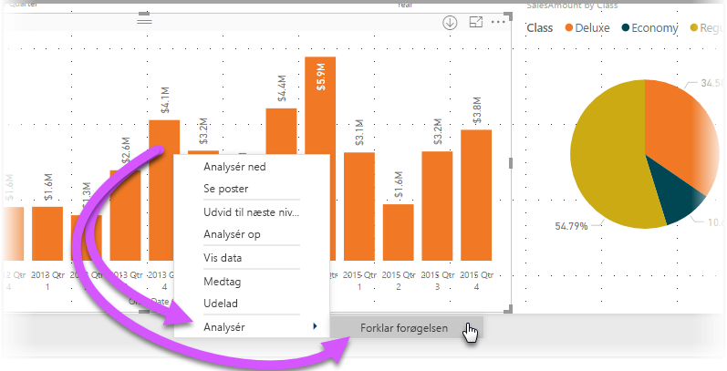

# Brug indsigt i Power BI Desktop (prøveversion)
Du kan bede **Power BI Desktop** om at forklare forøgelser eller reduktioner i diagrammer og få hurtige og automatiske indsigtsanalyser om dine data. Du skal blot højreklikke på et datapunkt og vælge **Analysér > Forklar reduktionen** (eller forøgelsen, hvis den tidligere linje var lavere), så leveres der indsigt til dig i et brugervenligt vindue.

Indsigtsfunktionen er kontekstafhængig, og den er baseret på det umiddelbart forrige datapunkt – f.eks. den forrige søjle eller kolonne.

> [!NOTE]
> Denne funktion leveres som prøveversion og ændres måske. Indsigtsfunktionen er aktiveret og slået til som standard (du behøver ikke at markere et afkrydsningsfelt for eksempelvisning for at aktivere den) fra og med versionen af **Power BI Desktop** fra september 2017.
> 
> 

## Brug af indsigt
Hvis du vil bruge indsigt, skal du bare højreklikke på et datapunkt på en vist søjle eller linje og vælge **Analysér > Forklar forøgelsen** (eller *Forklar reduktionen*, da al indsigt er baseret på ændringen fra det forrige datapunkt).

**Power BI Desktop** kører algoritmerne for maskinlæring via dataene, og derefter udfyldes et vindue med et visuelt element og en beskrivelse af, hvilke kategorier der er mest påvirket af forøgelsen eller reduktionen. Som standard leveres indsigt som en visuel gengivelse af et *vandfald* som det vises på følgende billede.

Ved at vælge små ikoner nederst i vandfaldet kan du vælge at få indsigt til at vise et punktdiagram, et stablet søjlediagram eller et bånddiagram.

Du kan bruge ikonerne med *tommel op* og *tommel ned* øverst på siden til at give feedback på det visuelle element og funktionen.

Og læg især mærke til, at knappen  **+**  øverst i det visuelle element gør det muligt at tilføje det valgte visuelle element i rapporten på samme måde, som hvis du havde oprettet det visuelle element manuelt. Du kan derefter formatere eller på anden måde justere det tilføjede visuelle element på samme måde som alle andre visuelle elementer i rapporten. Du kan kun tilføje et visuelt element for den valgte indsigt, når du redigerer en rapport i **Power BI Desktop**.

Du kan bruge indsigt, når rapporten er i læse- eller redigeringstilstand, hvilket betyder, at du både kan analyse data og oprette visuelle elementer, som du nemt kan føje til dine rapporter.

## Overvejelser og begrænsninger
Da indsigt er baseret på ændringen fra det tidligere datapunkt, er de ikke tilgængelige, når du vælger det første datapunkt i et visuelt element. 

Følgende liste er en samling af scenarier, der ikke understøttes i øjeblikket for **indsigt**:

* TopN-filtre
* Medtag/udelad filtre
* Målingsfiltre
* Ikke-additive målinger og aggregeringer
* Vis værdi som
* Filtrerede målinger (det er det nye, vi bruger til punktdiagrammet i indsigt)
* Kategoriske kolonner på x-aksen, medmindre det definerer en sortering efter kolonne, der kan skaleres. Hvis du bruger et hierarki, skal alle kolonner i det aktive hierarki opfylde denne betingelse
* Ikke-numeriske målinger

Desuden understøttes følgende modeltyper og datakilder ikke i øjeblikket for indsigt:

* DirectQuery
* Live Connect
* Reporting Services i det lokale miljø
* Integration

## Næste trin
Du kan finde flere oplysninger om **Power BI Desktop**, og hvordan du kommer i gang, i følgende artikler.

* [Kom i gang med Power BI Desktop](desktop-getting-started.md)
* [Oversigt over forespørgsler i Power BI Desktop](desktop-query-overview.md)
* [Datakilder i Power BI Desktop](desktop-data-sources.md)
* [Opret forbindelse til data i Power BI Desktop](desktop-connect-to-data.md)
* [Udform og kombiner data med Power BI Desktop](desktop-shape-and-combine-data.md)
* [Almindelige forespørgselsopgaver i Power BI Desktop](desktop-common-query-tasks.md)   

