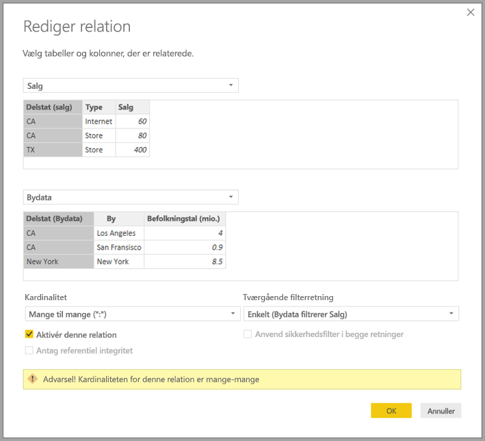
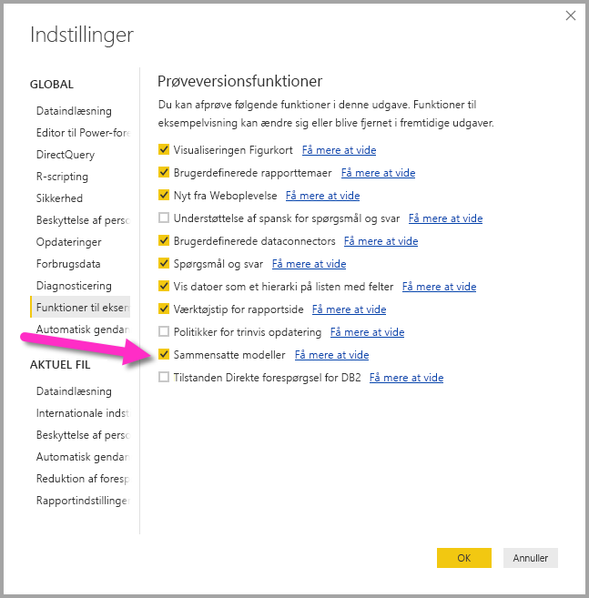

# Mange til mange-relationer i Power BI Desktop (prøveversion)

Med funktionen *Mange til mange-relationer* i Power BI Desktop kan du joinforbinde tabeller, der bruger en kardinalitet på *Mange til mange*. Du kan nemmere og mere intuitivt oprette datamodeller, der indeholder to eller flere datakilder. Funktionen *Mange til mange-relationer* er en del af den mere omfattende funktionalitet til *sammensatte modeller* i Power BI Desktop.

Funktionaliteten *Mange til mange-relationer* i Power BI Desktop er en del af tre relaterede funktioner:

* **Sammensatte modeller**:Gør det muligt for en rapport at have to eller flere dataforbindelser, herunder DirectQuery-forbindelser eller Import, i en hvilken som helst kombination. Du kan finde flere oplysninger under [Sammensatte modeller i Power BI Desktop (prøveversion)](desktop-composite-models.md).

* **Mange til mange-relationer**: Via *sammensatte modeller* kan du oprette *mange til mange-relationer* mellem tabeller. Med denne tilgang fjernes kravene for entydige værdier i tabeller. Tidligere midlertidige løsninger, f.eks. introduktion af nye tabeller kun for at oprette relationer, fjernes også. Funktionen er beskrevet nærmere i denne artikel.

* **Lagringstilstand**: Du kan nu angive, hvilke visualiseringer der kræver en forespørgsel til back end-datakilder. Visuelle elementer, der ikke kræver en forespørgsel, importeres, også selvom de er baseret på DirectQuery. Denne funktion hjælper med at forbedre ydeevnen og reducere belastningen af back-end. Tidligere startede selv enkle visualiseringer (f.eks. udsnit) forespørgsler, der blev sendt til back end-kilderne. Du kan finde flere oplysninger i [Lagringstilstand i Power BI Desktop (prøveversion)](desktop-storage-mode.md).

## Aktivér prøveversionsfunktionen *Mange til mange-relationer*

Funktionen *Mange til mange-relationer* skal være aktiveret i Power BI Desktop. Du aktiverer sammensatte modeller ved at vælge **Filer** > **Indstillinger** > **Indstillinger** > **Prøveversionsfunktioner** og derefter markere afkrydsningsfeltet **Sammensatte modeller**.

Du aktiverer funktionen ved at genstarte Power BI Desktop.

## Formålet med *Mange til mange-relationer*

Før funktionen *Mange til mange-relationer* blev tilgængelig, var relationen mellem to tabeller defineret i Power BI. Mindst en af tabelkolonnerne i relationen skulle indeholde entydige værdier. Men ofte indeholdt ingen af kolonnerne entydige værdier. 

To tabeller kunne f.eks. have en kolonne med mærkaten *Country*, men værdierne for *Country* var ikke entydige i nogen af tabellerne. Det var nødvendigt at oprette en midlertidig løsning for at joinforbinde sådanne tabeller. En sådan midlertidig løsning kunne være at introducere flere tabeller med de nødvendige entydige værdier i modellen. Med funktionen *Mange til mange-relationer* kan du joinforbinde sådanne tabeller direkte ved hjælp af en relation med en kardinalitet på **Mange til mange**.  

## Brug af *Mange til mange-relationer*

Når du definerer en relation mellem to tabeller i Power BI, skal du definere kardinaliteten af relationen. Relationen mellem *ProductSales* og *Product* &mdash; ved hjælp af kolonnerne *ProductSales[ProductCode]* og *Product[ProductCode]* &mdash; ville f.eks. defineres som *Mange-1*. Vi definerer relationen på denne måde, fordi der er mange salg for hvert produkt, og kolonnen i tabellen *Product* *(ProductCode)* er entydig. Når du definerer en relations kardinalitet som *Mange-1*, *1-Mange* eller *1-1*, validerer Power BI den for at sikre, at den valgte kardinalitet stemmer overens med de faktiske data.

Se f.eks. nærmere på den enkle model på følgende billede:

Forestil dig nu, at der kun vises to rækker i tabellen *Product*, som vist:

Forestil dig også, at der kun er fire rækker i tabellen *Sales*, herunder en række for produkt C. På grund af et problem med referentiel integritet eksisterer rækken for produkt C ikke i tabellen *Product*.

*ProductName* og *Price* (fra tabellen *Product*) samt totalen af *Qty* for hvert produkt (fra tabellen *ProductSales*) ville blive vist på følgende måde: 

Som du kan se på foregående billede, er der en tom række med navnet *ProductName*, som er knyttet til salg for produkt C. Denne tomme række står for følgende:

* Alle rækker i tabellen *ProductSales*, hvor der ikke findes nogen tilsvarende række i tabellen *Product*. Vi kan se, at der er et problem med referentiel integritet for produkt *C* i dette eksempel.

* Alle rækker i tabellen *ProductSales*, hvor kolonnen med den fremmede nøgle er null. 

Af disse årsager står den tomme række for de salg, hvor *ProductName* og *Price* er ukendt.

Nogle gange sker der det, at tabellerne er joinforbundet af to kolonner, men ingen af kolonnerne er entydige. Du kan f.eks. overveje følgende to tabeller:

* I tabellen *Sales* vises salgsdata efter *State*, og hver række indeholder salgsbeløbet for den type salg i den pågældende delstat. Staterne omfatter CA, WA og TX. 

    

* I tabellen *CityData* vises data om byer, herunder indbyggertal og delstat (inklusive CA, WA og New York).

    

Selvom kolonnen *State* findes i begge tabeller, og det er almindeligt at ville rapportere om både det samlede salg efter delstat og befolkningstal i hver stat, opstår der et problem: kolonnen *State* er ikke entydig i nogen af kolonnerne. 

## Tidligere midlertidig løsning

I tidligere versioner af Power BI Desktop end udgivelsen i juli 2018, kunne brugere ikke oprette en direkte relation mellem disse tabeller. En almindelig midlertidig løsning var at gøre følgende:

* Opret en tredje tabel, der kun indeholder de entydige id'er for *State*. Tabellen kunne være en eller flere af følgende:
  * En beregnet tabel (defineret ved hjælp af Data Analysis Expressions [DAX]).
  * En tabel baseret på en forespørgsel, der er defineret i Forespørgselseditor, som kunne vise de entydige id'er, der er trukket fra en af tabellerne.
  * Hele sættet kombineret.

* Opret en relation mellem de to oprindelige tabeller til den nye tabel ved hjælp af almindelige *Mange-1*-relationer.

Du kan enten lade tabellen fra den midlertidige løsning være synlig eller skjule den, så den ikke vises på listen **Fields**. Hvis du skjuler tabellen, vil relationen *Mange-1* ofte være angivet til at filtrere i begge retninger, og du kan bruge feltet *State* fra begge tabeller. Efterfølgende tværgående filtrering vil blive overført til den anden tabel. Denne tilgang er vist på følgende billede:

En visualisering, der viser *State* (fra tabellen *CityData*) sammen med totalen af *Population* og totalen af *Sales*, vil derefter se ud på følgende måde:

> [!NOTE]
> Da delstaten fra tabellen *CityData* bruges i denne midlertidige løsning, vises der kun delstater fra den tabel, og delstaten TX vises derfor ikke. Rækken Total indeholder oplysninger om alt *Sales* (inklusive for TX), men i modsætning til *Mange-1*-relationer vises der ikke en tom række for sådanne rækker, der ikke stemmer overens. På samme måde vil der ikke være en tom række, der dækker *Sales*, hvor der er en null-værdi for *State*.

Hvis du også føjer *City* til visualiseringen, vil *Sales*, der vises for *City*, simpelthen være en gentagelse af *Sales* for den tilsvarende *State*, selvom indbyggertallet pr. *City* er kendt. Dette er normalt tilfældet, når gruppering i en kolonne ikke er relateret til en samlet måling, som vist på følgende billede:

Hvis vi definerer den nye *Sales*-tabel som en kombination af alle *States* i denne midlertidige løsning, og vi gør den synlig på listen **Fields**, vil både *State* (i den nye tabel) og samlet *Population* og samlet *Sales* blive vist i den samme visualisering, som vist på følgende billede:

Som du kan se, er *TX* &mdash; med *Sales*-data, men ukendte *Population*-data &mdash; og *New York* &mdash; med kendte *Population*-data, men ingen *Sales*-data &mdash; inkluderet. Denne midlertidige løsning er ikke optimal, og der er mange problemer forbundet med den. Med oprettelsen af Mange til mange-relationer bliver de medfølgende problemer løst, som beskrevet i næste afsnit.

## Brug *mange til mange-relationer* i stedet for den midlertidige løsning

Fra og med versionen af Power BI Desktop fra juli 2018 kan du oprette direkte relationer mellem tabeller, ligesom dem vi beskrev tidligere, uden at skulle ty til lignende midlertidige løsninger. Det er nu muligt at angive kardinaliteten for relationen til *Mange til mange*. Denne indstilling indikerer, at ingen af tabellerne indeholder entydige værdier. For sådanne relationer kan du stadig styre, hvilke tabeller der filtrerer den anden tabel, eller du kan anvende tovejsfiltrering, hvor begge tabeller filtrerer hinanden.  

> [!NOTE]
> Muligheden for at oprette *mange til mange-relationer* er tilgængelig som en prøveversion. Mens det er en prøveversion, er det ikke muligt at publicere modeller i Power BI-tjenesten, der bruger *mange til mange-relationer*. 

I Power BI Desktop vil kardinalitet som standard være *Mange til mange*, når det er fastslået, at ingen af tabellerne indeholder entydige værdier for kolonnerne i relationen. Når det er tilfældet, vises der en advarsel, hvor du skal bekræfte, at denne relationsindstilling er bevidst og ikke en utilsigtet effekt af et dataproblem. 

Hvis du f.eks. opretter en relation direkte mellem *CityData* og *Sales* &mdash; hvor filtre skal gå fra *CityData* til *Sales* &mdash; vises vinduet **Rediger relation** i Power BI Desktop, som vist på følgende billede:

Den resulterende **Relationsvisning** vil derefter indeholde den direkte mange til mange-relation mellem de to tabeller. Tabellernes udseende på listen **Fields** og deres efterfølgende funktionsmåde, når der oprettes visualiseringer, ligner den samme, som da vi anvendte den midlertidige løsning. I den midlertidige løsning er den ekstra tabel, som viser de enkelte *State*-data, ikke synlig. Som beskrevet i forrige afsnit, vil en visualisering med data for *State*, *Population* og *Sales* f.eks. blive vist på følgende måde:

Den primære forskel mellem *mange til mange-relationer* og de mere almindelige *Mange-1*-relationer er følgende:

* De viste værdier omfatter ikke en tom række, der står for rækker, som ikke stemmer overens med den anden tabel. Værdierne står heller ikke for rækker, hvor den kolonne, der bruges i relationen i den anden tabel, er null.
* Det er ikke muligt at bruge funktionen `RELATED()`, da der kan være en relation til mere end én række.
* Brug af funktionen `ALL()` i en tabel fjerner ikke de filtre, som er anvendt på andre relaterede tabeller med en mange til mange-relation. I det forrige eksempel fjernede en måling, der er defineret som vist i følgende script, ikke filtre på kolonner i den relaterede *CityData*-tabel:

    

    En visualisering, der viser data for *State*, *Sales* og *Sales total*, ville resultere i følgende:

    

Med de foregående forskelle in mente skal du sørge for, at beregningerne, hvor der bruges `ALL(\<Table>)`, f.eks.   *% af totalen*, returnerer de forventede resultater. 

## Begrænsninger og overvejelser

Der er nogle få begrænsninger for denne udgivelse af *mange til mange-relationer* og sammensatte modeller.

Følgende Live Connect-kilder (flerdimensionelle) kan ikke bruges sammen med sammensatte modeller:

* SAP HANA
* SAP Business Warehouse
* SQL Server Analysis Services
* Power BI-datasæt
* Azure Analysis Services

Når du opretter forbindelse til disse flerdimensionelle kilder ved hjælp af DirectQuery, kan du ikke oprette forbindelse til en anden DirectQuery-kilde eller kombinere den med importerede data.

De eksisterende begrænsninger ved at bruge DirectQuery gælder stadig, når du bruger *mange til mange-relationer*. Mange af disse begrænsninger gælder nu for de enkelte tabeller afhængigt af tabellens lagringstilstand. En beregnet kolonne i en importeret tabel kan f.eks. referere til andre tabeller, men en beregnet kolonne i en DirectQuery-tabel kan stadig kun referere til kolonner i den samme tabel. Andre begrænsninger gælder for modellen som helhed, hvis nogle af tabellerne i modellen er DirectQuery. Funktionerne Hurtig indsigt og Spørgsmål og svar er f.eks. ikke tilgængelige for en model, hvis nogen af tabellerne i den har lagringstilstanden DirectQuery. 

## Næste trin

Du kan finde flere oplysninger om sammensatte modeller og DirectQuery i følgende artikler:
* [Sammensatte modeller i Power BI Desktop (prøveversion)](desktop-composite-models.md)
* [Lagringstilstand i Power BI Desktop (prøveversion)](desktop-storage-mode.md)
* [Brug DirectQuery i Power BI Desktop](desktop-directquery-about.md)
* [Understøttede datakilder i forbindelse med DirectQuery i Power BI Desktop](desktop-directquery-data-sources.md)
