# Brug matrixvisualisering i Power BI Desktop
Når du bruger **Matrix**-visualisering kan du oprette matrixvisualiseringer (også kaldet *tabeller*) i rapporter i **Power BI Desktop** og få tværgående fremhævning af elementer i matrixen med andre visualiseringer. Derudover kan du vælge rækker, kolonner og endda individuelle celler og tværgående fremhævning. Endelig kan du udnytte pladsen i layoutet bedre, fordi matrixvisualisering understøtter et trinvist layout.

Der er mange funktioner knyttet til matrixen, og vi vil gennemgå dem i følgende afsnit i denne artikel.

> [!NOTE]
> Fra og med udgivelsen i juli 2017 af **Power BI Desktop** afspejler matrix- og tabelvisualiseringer formatering (herunder farver) fra det anvendte **rapporttema**. Det er måske ikke de farver, du forventer til din matrixvisualisering, og du kan ændre dem i konfigurationen **Rapporttema**. Se [**Use Report Themes in Power BI Desktop**](desktop-report-themes.md) (Brug rapporttemaer i Power BI Desktop), hvor du kan finde flere oplysninger om temaer.
> 
> 

## Brug detailudledning til matrixvisualiseringen
Med **Matrix**-visualiseringen kan du foretage en mængde interessante aktiviteter til detailudledning, der ikke var tilgængelig før. Dette omfatter mulighed for at foretage detailudledning ved hjælp af rækker, kolonner og endda til individuelle afsnit og celler. Lad os se på, hvordan hver enkelt af disse fungerer.

### Detailudledning på rækkeoverskrifter
Når du i ruden **Visualiseringer** føjer flere felter til sektionen **Rækker** i området **Felter**, aktiverer du detailudledning på rækkerne i matrixvisualiseringen. Dette minder om oprettelse af et hierarki, hvor du derefter kan foretage detailudledning (og så sikkerhedskopiering) via hierarkiet og analysere dataene på hvert niveau.

I det følgende billede indeholder sektionen **Rækker** *Kategori* og *Underkategori* og opretter en gruppering (eller et hierarki) i rækkerne, som vi kan foretage detailudledning af.

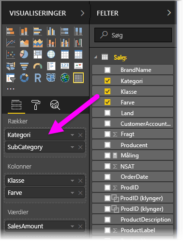

Når der er oprettet gruppering for visualiseringen i sektionen **Rækker**, viser selve visualiseringen *detailudledningen* og *udvider* ikonerne i øverste venstre hjørne i visualiseringen.

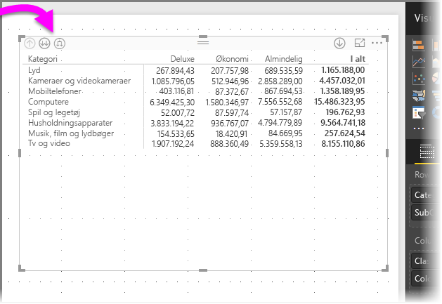

Som der er tilfældet med funktionsmåden til detailudledning og udvidelse i andre visualiseringer kan vi ved at vælge disse knapper bruge detailudledning (eller sikkerhedskopiering) gennem hierarkiet. I dette tilfælde kan vi foretage detailudledning fra *Kategori* til *Underkategori* som vist i følgende billede, hvor ikonet for vis detaljer for ét niveau (fork) er valgt.

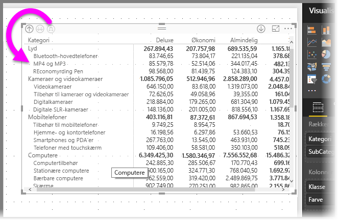

Ud over at bruge disse ikoner kan du højreklikke på en af rækkeoverskrifterne og foretage detailudledning ved at vælge i menuen, der vises.

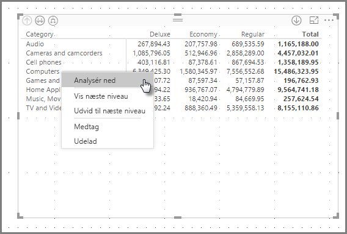

Bemærk, at der er nogle indstillinger i den viste menu, der udløser forskellige resultater:

Valg af **Foretag detailudledning** udvider matrixen for *det pågældende* rækkeniveau og *udelader* alle andre rækkeoverskrifter bortset fra den rækkeoverskrift, der blev højreklikket på. I det følgende billede blev der højreklikket på *Computers*, og der blev valgt **Foretag detailudledning**. Bemærk, at andre rækker på øverste niveau ikke længere vises i matrixen. Det er en nyttig funktion, og den er specielt god, når vi når til afsnittet om **tværgående fremhævning**.

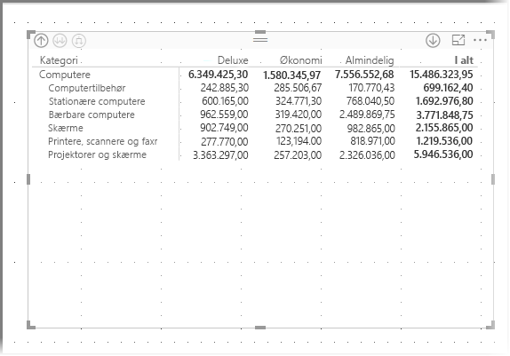

Vi kan også klikke på ikonet for **færre detaljer** for at komme tilbage til den forrige visning af øverste niveau. Hvis vi derefter vælger **Vis næste niveau** i genvejsmenuen, får vi vist en alfabetiske liste over alle elementer på næste niveau (i dette tilfælde feltet *Underkategori*) uden den hierarkiske kategorisering på højere niveau.

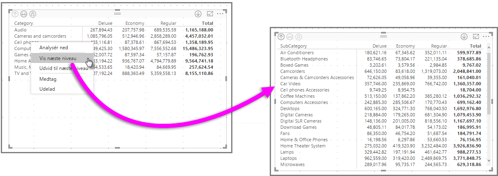

Når vi klikker på ikonet for **færre detaljer** i øverste venstre hjørne for at få matrixen til at vise alle kategorier på øverste niveau og derefter højreklikker igen og vælger **Udvid til næste niveau**, får vi vist følgende:

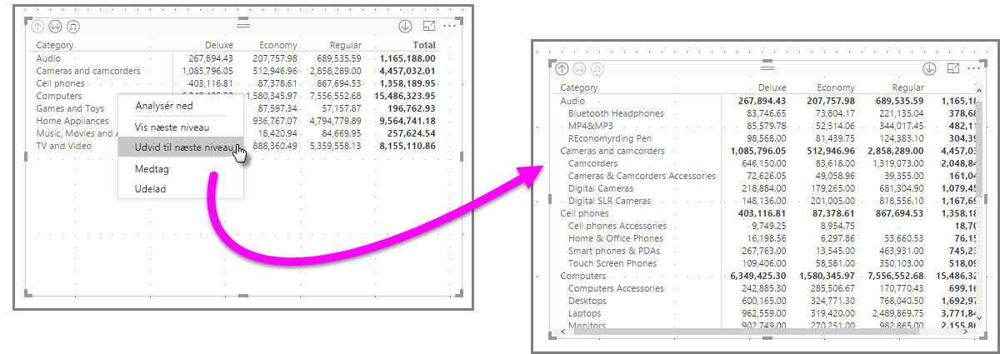

Du kan også bruge menupunkterne **Include** (Medtag) og **Exclude** (Udelad) til at bevare (eller hhv. fjerne) den række, der blev højreklikket på (og evt. underkategorier) fra matrixen.

### Detailudledning på kolonneoverskrifter
Du kan også foretage detailudledning på **kolonner**, hvilket minder meget om detailudledning på rækker. I det følgende billede kan du se, at der er to felter i feltområdet **Kolonner**, hvilket opretter et hierarki, der minder om det, der blev brugt til rækkerne tidligere i denne artikel. I feltområdet **Kolonner** har vi *Klasse* og *Farve*.

Når vi i **Matrix**-visualiseringen højreklikker på en kolonne, får vi mulighed for at foretage detailudledning. I det følgende billede skal du højreklikke på *Deluxe* og vælge **Foretag detailudledning**.

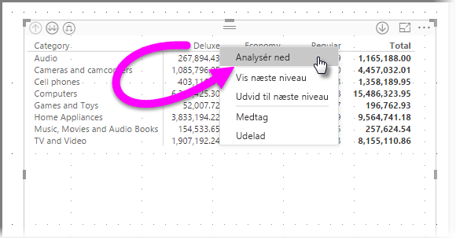

Når der er valgt **Foretag detailudledning**, vises næste niveau i kolonnehierarkiet for *Deluxe*, hvilket i dette tilfælde er *Farve*.

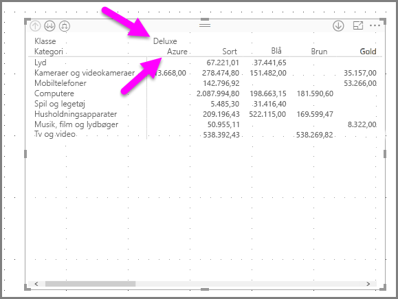

Resten af punkterne i genvejsmenuen fungerer i kolonner på samme måde, som de gør i rækker (se forrige afsnit, **Detailudledning på rækkeoverskrifter**). Du kan vælge **Vis næste niveau**, **Udvid til næste niveau** og **Include** (Medtag) eller **Exclude** (Udelad) på samme måde, som du kan med rækker.

> [!NOTE]
> Ikonerne for detailudledning og færre detaljer øverst til venstre i matrixvisualiseringen gælder kun for rækker. Hvis du vil foretage detailudledning for kolonner, skal du bruge genvejsmenuen.
> 
> 

## Trinvist layout med matrixvisualisering
**Matrix**-visualiseringen indrykker automatisk underkategorier i et hierarki under hvert overordnet element, hvilket kaldes et **trinvist layout**.

I den *oprindelige* version af matrixvisualiseringen blev underkategorier vist i en helt anden kolonne, der optager meget mere plads i visualiseringen. Billedet herunder viser tabellen i den oprindelige **matrix**-visualisering. Bemærk, at underkategorier er i en fuldstændig separat kolonne.

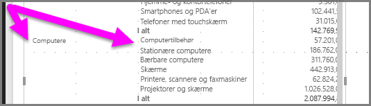

I det følgende billede kan du se en rigtig **Matrix**-visualisering med **trinvist layout**. Bemærk, at kategorien *Computers* har underkategorier (Computers Accessories (Computertilbehør), Desktops (Stationære computere), Laptops (Bærbare computere), Monitors (Skærme) og osv.) let indrykket, hvilket visuelt giver et meget renere og mere komprimeret indtryk.

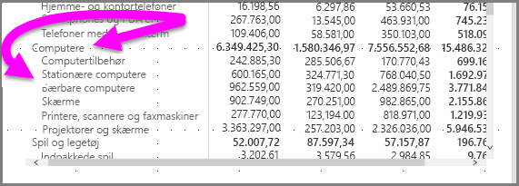

Du kan nemt justere indstillingerne for det **trinvise layout**. Når visualiseringen **Matrix** er valgt i sektionen **Format** (malerrulleikonet) i ruden **Visualiseringer**, kan du udvide sektionen **Rækkeoverskrifter**. Der er to muligheder: til/fra-knappen til **trinvist layout** (som slår det til eller fra) og **indrykningen af det trinvise layout** (angiver mængden af indrykning i pixels).

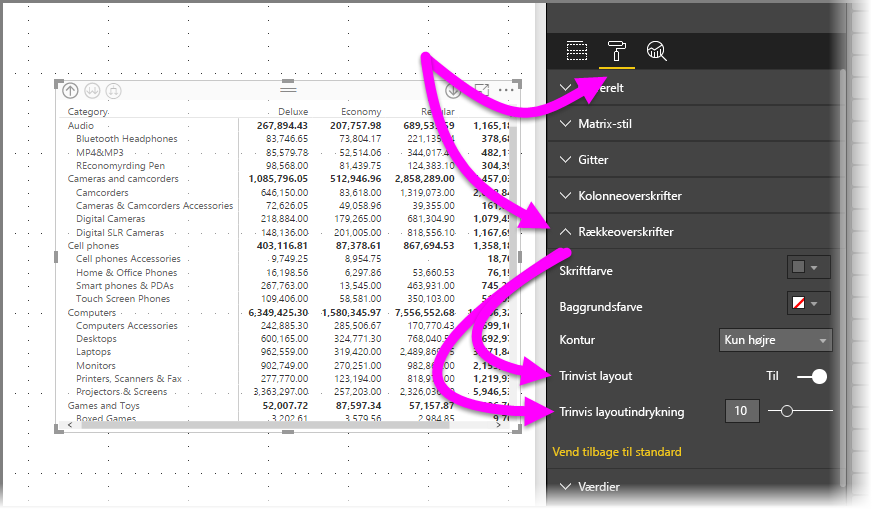

Hvis du deaktiverer **det trinvise layout**, vises underkategorier i en anden kolonne og ikke indrykket under den overordnede kategori.

## Subtotaler med matrixvisualiseringer
Du kan slå subtotaler til eller fra i matrixvisualiseringer både for rækker og kolonner. I det følgende billede kan du se, at rækkesubtotaler er slået **til**.

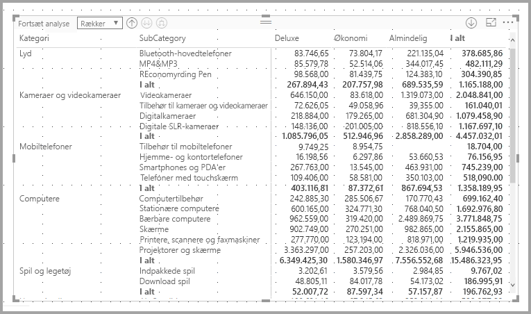

I sektionen **Format** i ruden **Visualiseringer** kan du udvide kortet **Subtotaler** og sætte skyderen **Rækkesubtotaler**  til **Fra**. Når du gør det, vises subtotaler ikke.

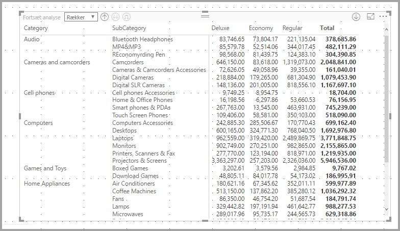

Den samme proces gælder for kolonnesubtotaler.

## Tværgående fremhævning med matrixvisualiseringer
Med **Matrix**-visualiseringen kan alle elementer i matrixen vælges som basis for tværgående fremhævning. Når du markerer en kolonne i en **Matrix**, fremhæves kolonnen, og det samme gør andre visuelle elementer på rapportsiden. Dette har været en almindelig funktion i andre visualiseringer, og markering af et datapunkt og nu **Matrix**-visualiseringen kan få del i den.

Derudover fungerer Ctrl+klik også for tværgående fremhævning. I eksemplet herunder er en samling underkategorier f.eks. markeret i **Matrix**-visualiseringen. Bemærk, hvordan elementer, der ikke er valgt i visualiseringen, er nedtonet, og hvordan de andre visualiseringer på siden afspejler de valg, der er foretaget i **Matrix**-visualiseringen.

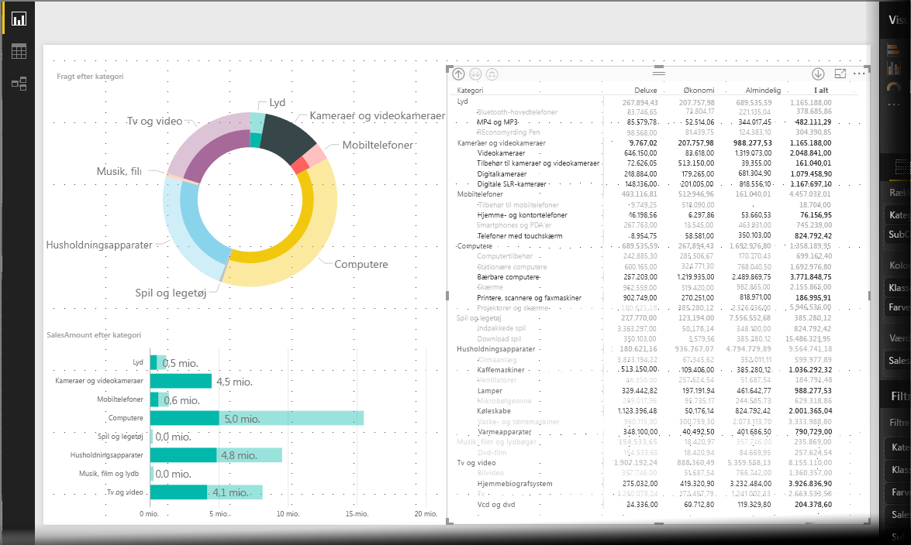

## Skygge og skrifttypefarver med matrixvisualiseringer
Når du bruger **Matrix**-visualiseringen kan du anvende **betinget formatering** (farver og skygge) til baggrunden af celler i matrixen, og du kan anvende betinget formatering til selve teksten og værdierne.

Hvis du vil anvende betinget formatering, kan du gøre et af følgende, når en matrixvisualisering er valgt:

* Højreklik på feltet i ruden **Felter**, og vælg **Betinget formatering** i menuen.
  
  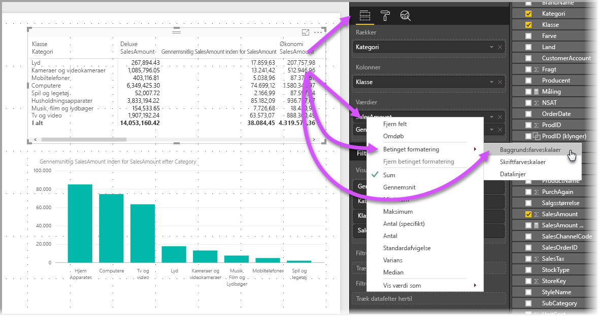
* Du kan også udvide kortet **Betinget formatering** i ruden **Format** og indstille skyderen til **Til** for enten **Baggrundsfarveskalaer** eller **Skriftfarveskalaer**. Når en af dem aktiveres, vises et link for *Avancerede kontrolelementer*, hvor du kan tilpasse farver og værdier for farveformateringen.
  
  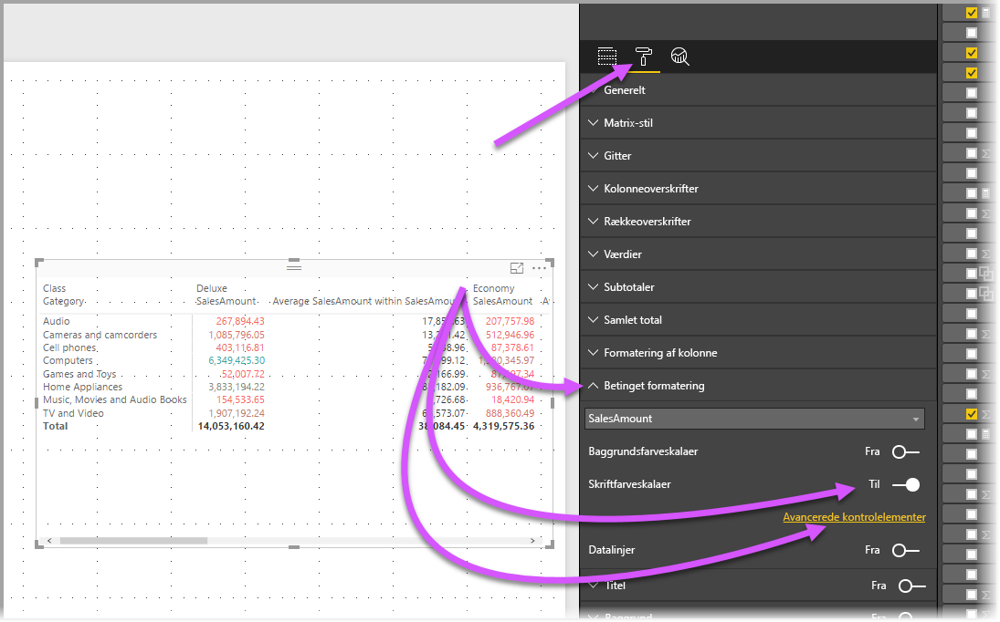

Begge fremgangsmåde giver samme resultat. Hvis du vælger *Avancerede kontrolelementer* vises følgende dialogboks, hvor du kan foretage justeringer:

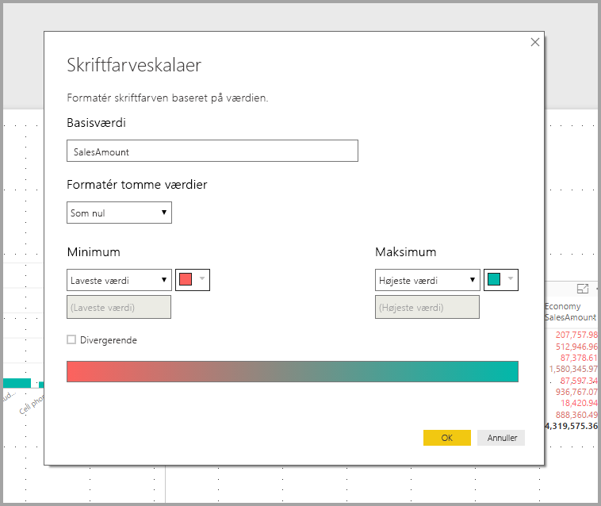

## Begrænsninger og overvejelser
I denne version af **Matrix** er der et par begrænsninger og overvejelser, du skal være opmærksom på.

* Detailudledning for kolonner kan kun udføres ved hjælp af genvejsmenuen, og der er i øjeblikket ingen indikation i visualiseringen på, at du kan foretage detailudledning på række- eller kolonnegrupper
* Du kan kun udvide alle elementer på et niveau på én gang og ikke udvide én kategori ad gangen
* Du kan få vist **See Records** (Se poster) i en menu, når du højreklikker på en kolonneoverskrift, men det fungerer ikke
* Der er i øjeblikket ingen række med *Grand total* (Hovedtotal)
* Hvis du deaktiverer subtotalrækken i det trinvise layout, har det ingen virkning
* Kolonneoverskrifter kan afkortes, hvis indre grupper har tekst, der er kortere end den ydre gruppe
* Ændring af indrykning i det trinvise layout bør ikke indrykke den yderste rækkegruppes indrykning

Vi vil altid gerne høre din mening. Vi foretager i øjeblikket en **undersøgelse** af denne **Matrix**-visualisering, så hvis du har et par minutter, vil vi gerne bede dig om at [deltage i undersøgelsen](https://www.instant.ly/s/PYXT1).

