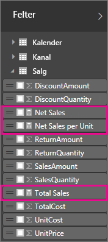
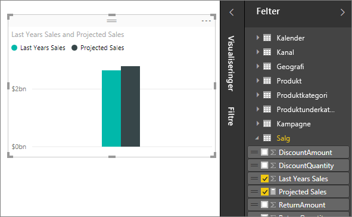

# <a name="create-measures-for-data-analysis-in-power-bi-desktop"></a>Opret målinger til dataanalyse i Power BI Desktop

Du kan få hjælp af Power BI Desktop til at oprette indsigt i dine data med nogle få klik. Men nogle gange indeholder disse data bare ikke alt det, du skal bruge for at få svar på nogle af dine vigtigste spørgsmål. Det kan målinger hjælpe dig med.

Målinger bruges i nogle af de mest almindelige dataanalyser. Enkle opsummeringer, f.eks. sum, gennemsnit, minimum, maksimum og antal, kan angives via området **Felter**. De beregnede resultater fra målinger ændres altid som reaktion på din interaktion med dine rapporter. Det giver mulighed hurtig og dynamisk dataudforskning ad hoc. Lad os se nærmere på det. Du kan finde flere oplysninger under [Opret beregnede mål](/learn/modules/model-data-power-bi/4b-create-calculated-measures).

## <a name="understanding-measures"></a>Om målinger

I Power BI Desktop oprettes målinger, og de vises i *Rapportvisning* eller *Datavisning*. Målinger, som du selv har oprettet, vises på listen **Felter** med et lommeregnerikon. Du kan navngive målinger, som du ønsker det, og føje dem til en ny eller eksisterende visualisering på samme måde som alle andre felter.



> [!NOTE]
> Du er måske også interesseret i *hurtig målinger*, som er færdige målinger, som du kan vælge fra dialogbokse. De er velegnet, hvis du hurtigt vil oprette målinger, og hvis du vil have mere at vide om DAX-syntaks (Data Analysis Expressions), da de automatisk oprettede DAX-formler er tilgængelige til gennemsyn. Du finder flere oplysninger i [hurtige målinger](desktop-quick-measures.md).
> 
> 

## <a name="data-analysis-expressions"></a>Data Analysis Expressions

Målinger beregner et resultat af en udtryksformel. Når du opretter dine egne målinger, skal du bruge formelsproget [Data Analysis Expressions](/dax/) (DAX). DAX inkluderer et bibliotek med mere end 200 funktioner, operatorer og konstruktioner. Biblioteket giver stor fleksibilitet, når du opretter målinger til beregning af resultater for stort set alle typer dataanalyse.

DAX-formler ligner Excel-formler meget. DAX har oven i købet mange af de samme funktioner, du kender fra Excel, f.eks. `DATE`, `SUM` og `LEFT`. Men funktionerne i DAX er beregnet til at arbejde med relationsdata, som vi har i Power BI Desktop.

## <a name="lets-look-at-an-example"></a>Lad os se på et eksempel

Jane er salgschef hos Contoso. Jane er blevet bedt om at angive projektioner for forhandlersalg for det kommende regnskabsår. Jane beslutter sig for at basere sine estimater på sidste års salgsbeløb med en årlig stigning på 6 % som følge af forskellige kampagner, der er planlagt for de næste seks måneder.

For at rapportere estimaterne importerer hun sidste års salgsdata i Power BI Desktop. Jane finder feltet **Salgsbeløb** i tabellen **Forhandlersalg**. Eftersom de importerede data kun indeholder beløb for sidste år, omdøber hun feltet **Salgsbeløb** til *Sidste års salg*. Jane trækker derefter **Sidste års salg** til rapportlærredet. I en diagramvisualisering ser det ud som en enkelt værdi, der er summen af alle forhandlersalg fra sidste år.

Jane bemærker, at selvom hun ikke har angivet en beregning, er der angivet en automatisk. I Power BI Desktop er der automatisk blevet oprettet en måling, der summerer alle værdierne i **Sidste års salg**.

Men Jane har brug for en måling til at beregne salgsprojektioner for det kommende år, som er baseret på sidste års salg ganget med 1,06 for at indregne den forventede stigning på 6 %. Jane opretter sin en måling til denne beregning. Ved hjælp af funktionen *Ny måling* opretter hun en ny måling og angiver derefter følgende DAX-formel:

```dax
    Projected Sales = SUM('Sales'[Last Years Sales])*1.06
```

Derefter trækker Jane den nye måling Projekteret salg til diagrammet.



Jane har nu hurtigt og med en minimal indsats en måling til at beregne det projekterede salg. Jane kan analysere sine projektioner yderligere ved at filtrere efter bestemte forhandlere eller ved at føje andre felter til rapporten.

## <a name="data-categories-for-measures"></a>Datakategorier til målinger

Du kan også vælge datakategorier til målinger.

Blandt andet giver datakategorier dig mulighed for at bruge målinger til at oprette URL-adresser dynamisk og markere datakategorien som en URL-adresse.

Du kan oprette tabeller, der vises målingerne som URL-adresser, og du kan klikke på den URL-adresse, der er oprettet ud fra dine valg. Denne fremgangsmåde er især nyttig, når du vil oprette links til andre Power BI-rapporter med [URL-filterparametre](service-url-filters.md).

## <a name="organizing-your-measures"></a>Organisering af dine målinger

Målinger har en *hjemmetabel*, der definerer, hvor de findes på feltlisten. Du kan ændre deres placering ved at vælge en placering blandt tabellerne i din model.


Du kan også organisere felter i en tabel i *visningsmapper.* Vælg **Model** fra venstre kant i Power BI Desktop. I ruden **Egenskaber** skal du vælge det felt, du vil flytte, på listen over tilgængelige felter. Angiv et navn til en ny mappe i **Visningsmappe** for at oprette en mappe. Når du opretter en mappe, flyttes det markerede felt til mappen.


Du kan oprette undermapper ved hjælp af en omvendt skråstreg. *Finance\Currencies* opretter f.eks. en *Finance*-mappe og deri en *Currencies*-mappe.

Du kan få vist et felt i flere mapper ved at bruge et semikolon til at adskille mappenavnene. *Products\Names;Departments* medfører f.eks., at feltet vises i en *Departments*-mappe samt i en *Names*-mappe, der findes i en *Products*-mappe.

Du kan oprette en speciel tabel, der kun indeholder målinger. Den tabel vises altid øverst i **Felter**. Det gør du ved at oprette en tabel med kun én kolonne. Du kan bruge **Angiv data** til at oprette tabellen. Flyt derefter dine målinger til denne tabel. Til sidst skal du skjule den kolonne (ikke tabellen), du har oprettet. Vælg pilen øverst i **Felter** for at lukke og åbne listen Felter igen for at se ændringerne.


## <a name="learn-more"></a>Få mere at vide

Vi har kun givet en hurtig introduktion til målinger her. Der er meget mere, der kan hjælpe dig med at finde ud af, hvordan du opretter din egen. Du kan finde flere oplysninger under [Selvstudium: Opret dine egne målinger i Power BI Desktop](desktop-tutorial-create-measures.md). Du kan downloade en eksempelfil og få trinvise vejledninger i, hvordan du opretter flere målinger.  

Hvis du vil gå mere i dybden med DAX, skal du se [Grundlæggende oplysninger om DAX i Power BI Desktop](desktop-quickstart-learn-dax-basics.md). [Data Analysis Expressions-referencen](/dax/) indeholder detaljerede artikler om hver enkelt funktion, syntaks, operatorer og navngivningskonventioner. DAX er blevet brugt i flere år i Power Pivot i Excel og SQL Server Analysis Services. Der er også mange andre gode ressourcer tilgængelige. Sørg for at se i [DAX Resource Center Wiki](https://social.technet.microsoft.com/wiki/contents/articles/1088.dax-resource-center.aspx), hvor vigtige medlemmer af BI-community'et deler deres viden om DAX.
