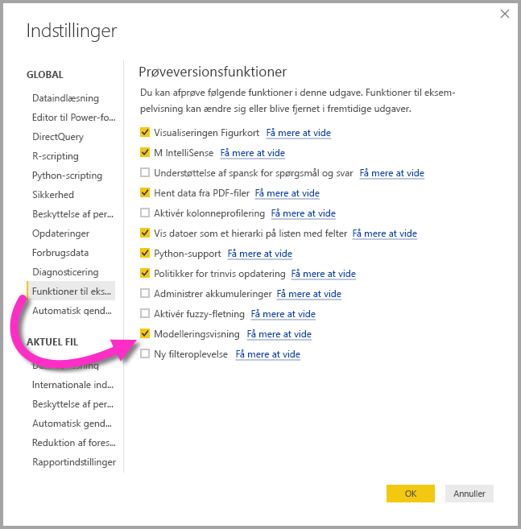
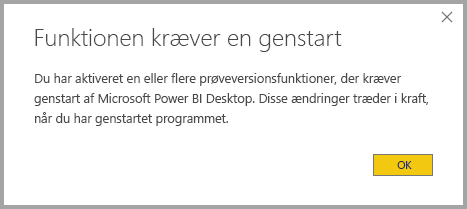

# Udformningsvisning i Power BI Desktop (prøveversion)

Med **Udformningsvisning** i **Power BI Desktop** kan du få vist og arbejde med komplekse datasæt, der indeholder mange tabeller. Med Udformningsvisning kan du gøre følgende:

## Aktivering af prøveversionsfunktionen Udformningsvisning

Funktionen Udformningsvisning er en prøveversion og skal aktiveres i **Power BI Desktop**. For at aktivere Udformningsvisning skal du vælge **Filer > Indstillinger > Indstillinger > Prøveversionsfunktioner** og derefter markere afkrydsningsfeltet **Udformningsvisning**, som vist på følgende billede.

Du skal genstarte **Power BI Desktop**, før prøveversionsfunktionen bliver aktiveret. 

## Brug af Udformningsvisning

Du tilgår Udformningsvisning ved at vælge ikonet Udformningsvisning, som du finder i venstre side af **Power BI Desktop**, som vist på følgende billede.

## Oprettelse af separate diagrammer

Med Udformningsvisning kan du oprette diagrammer over din model, der kun indeholder et undersæt af tabellerne i modellen. Dette kan hjælpe med at give et tydeligere overblik over tabeller, du vil arbejde med, og gør det lettere at arbejde med komplekse datasæt. Hvis du vil oprette et nyt diagram kun med et undersæt af tabellerne, skal du klikke på tegnet **+** ud for fanen **Alle tabeller** i bunden af Power BI Desktop-vinduet.

Du kan derefter trække en tabel fra listen **Felter** til diagramoverfladen. Højreklik på tabellen, og vælg derefter **Tilføj relaterede tabeller** i den menu, der vises.

Når du gør det, vises tabeller, der er relateret til den oprindelige tabel, i det nye diagram. På følgende billede kan du se, hvordan relaterede tabeller vises, når du har valgt menupunktet **Tilføj relaterede tabeller**.

## Angivelse af fælles egenskaber

Du kan vælge flere objekter på én gang i Udformningsvisning ved at holde **CTRL**-tasten nede og klikke på flere tabeller. Når du vælger flere tabeller, fremhæves de i Udformningsvisning. Når flere tabeller er fremhævet, gælder ændringer, der er anvendt i ruden **Egenskaber**, for alle valgte tabeller.

Du kan f.eks. ændre [lagringstilstanden](desktop-storage-mode.md) for flere tabeller i diagramvisningen ved at holde **CTRL**-tasten nede, vælge tabeller og derefter ændre indstillingen for lagringstilstand i ruden **Egenskaber**.

## Næste trin

I følgende artikler beskrives flere detaljer om datamodeller og DirectQuery.

* [Sammenlægninger i Power BI Desktop (prøveversion)](desktop-aggregations.md)
* [Sammensatte modeller i Power BI Desktop (Preview)](desktop-composite-models.md)
* [Lagringstilstand i Power BI Desktop (Preview)](desktop-storage-mode.md)
* [Mange til mange-relationer i Power BI Desktop (Preview)](desktop-many-to-many-relationships.md)

Artikler om DirectQuery:

* [Brug af DirectQuery in Power BI](desktop-directquery-about.md)
* [Understøttede datakilder i forbindelse med DirectQuery i Power BI](desktop-directquery-data-sources.md)
