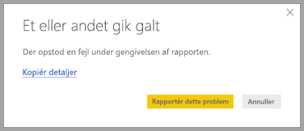

# Beskyttelse af personlige oplysninger i Power BI Desktop

Hos Microsoft bestræber vi os på at beskytte dine personlige oplysninger og samtidig levere produkter, der giver dig den ønskede ydeevne, effektivitet og brugervenlighed. Microsoft indsamler visse oplysninger om din brug af Power BI Desktop som en hjælp til at diagnosticere problemer og forbedre produktet. Du kan finde flere oplysninger om Microsofts beskyttelse af personlige oplysninger i Microsofts erklæring om beskyttelse af personlige oplysninger. Erklæringen gælder for alle de data, vi indsamler om din brug af **Power BI Desktop**.
 
De oplysninger, vi indsamler fra **Power BI Desktop**-brugere, kan omfatte oplysninger om, hvilket operativsystem de bruger, samt oplysninger om deres versioner af Power BI Desktop og Internet Explorer. 
 
Du kan fravælge indsamlingen af disse data ved at gå til **Filer > Indstillinger > Indstillinger** og fjerne markeringen i afkrydsningsfeltet **Send statistikoplysninger** under fanen **Statistikoplysninger** som vist på følgende billede.

## Fremsendelse af yderligere oplysninger

Hvis du oplever nedbrud eller andre problemer, kan du vælge at indsende fejlrapporter og yderligere oplysninger, som kan hjælpe os med at løse problemet i en fremtidig version. Vi indsamler også oplysninger om tilstanden for den **Power BI Desktop**-fil, du arbejder på, f.eks. landestandarden for dokumentet, aktiverede funktionseksempler og lagringstilstand. Det kan omfatte skærmbilleder, fejlmeddelelser og formler fra din model. Elmenterne kan omfatte indhold i de filer, du brugte, da fejlen opstod, så du bør gennemse dem, inden du indsender dem. Inden du indsender oplysningerne, minder vi dig om, at du selv kan vælge, hvilke oplysninger du vil sende til Microsoft.  
 
Hvis du ikke ønsker at indsende oplysninger, kan du klikke på **Luk**, når der opstår en fejl, eller fravælge, at der indsendes statistikoplysninger som beskrevet ovenfor. 

