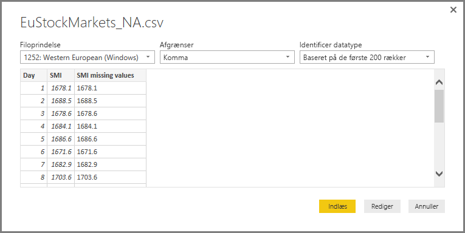
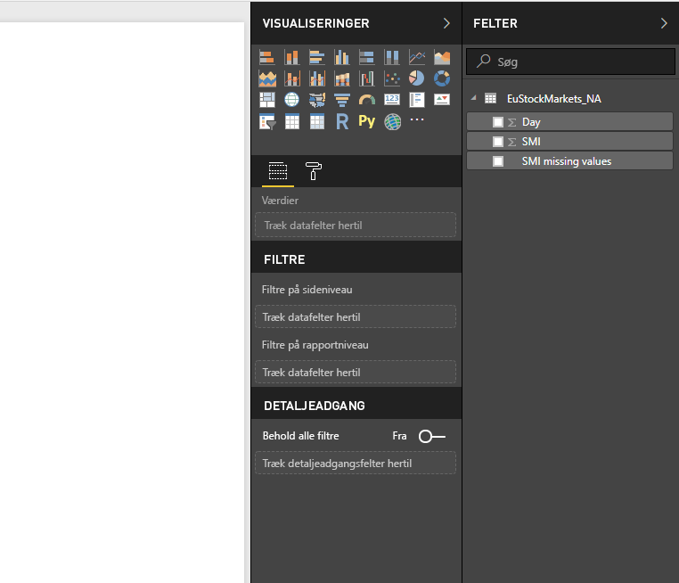
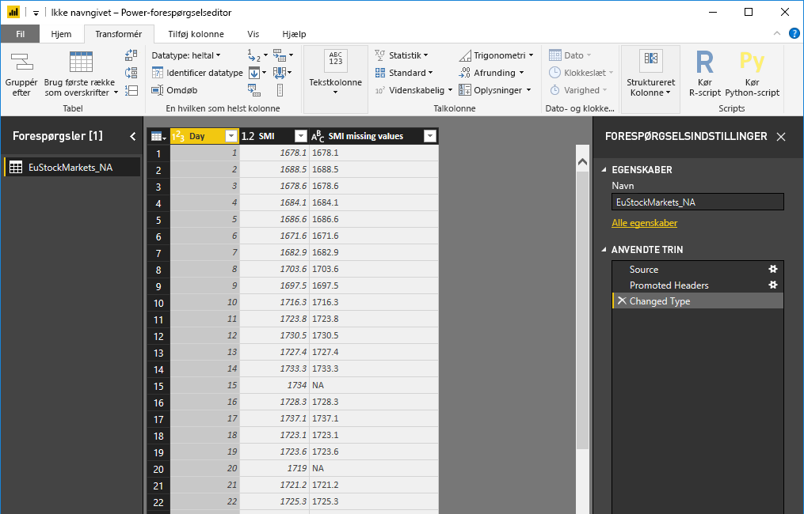
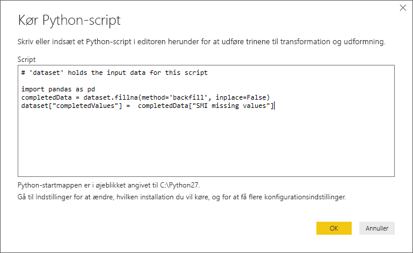
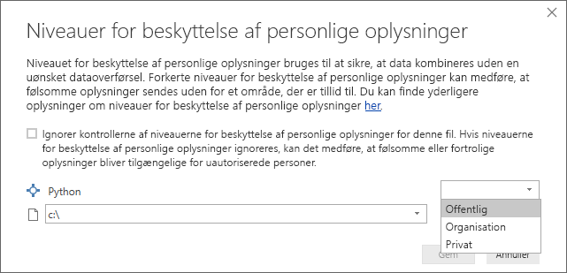

# <a name="using-python-in-query-editor"></a>Brug af Python i Forespørgselseditor
Du kan bruge **Python**, som er et programmeringssprog, der bruges af statistikere, datavidenskabsfolk og dataanalytikere, i **Forespørgselseditor** i Power BI Desktop. Denne integration af Phyton i **Forespørgselseditor** gør det muligt at udføre datarensning ved hjælp af R og udføre avanceret dataudformning og -analyser i datasæt, herunder fuldførelse af manglende data, forudsigelser og klyngedannelse, blot for at nævne nogle få. **Phyton** er et effektivt sprog og kan bruges i **Forespørgselseditor** til at forberede din datamodel og oprette rapporter.

## <a name="installing-python"></a>Installation af Phyton
Hvis du vil bruge **Phyton** i Power BI Desktops **forespørgselseditor**, skal du installere **Phyton** på din lokale maskine. Du kan downloade og installere **Python** gratis fra mange forskellige steder, herunder den [officielle overførselsside for Python](https://www.python.org/) og [Anaconda](https://anaconda.org/anaconda/python/).

## <a name="using-python-in-query-editor"></a>Brug af Python i Forespørgselseditor
Du kan se, hvordan du bruger **Phyton** i **Forespørgselseditor** ved at kigge på et eksempel fra et aktiemarkeds datasæt, der er baseret på en CSV-fil, som du kan [downloade herfra](http://download.microsoft.com/download/F/8/A/F8AA9DC9-8545-4AAE-9305-27AD1D01DC03/EuStockMarkets_NA.csv), og derefter følge med. Fremgangsmåden i dette eksempel er følgende:

1. Først skal du indlæse data i **Power BI Desktop**. I dette eksempel skal du indlæse filen *EuStockMarkets_NA.csv* og vælge **Hent data > CSV** på båndet **Hjem** i **Power BI Desktop**.
   
   
2. Vælg filen, og vælg **Åbn**, hvorefter CSV-filen vises i dialogboksen **CSV-fil**.
   
   
3. Når dataene er indlæst, vises de i ruden **Felter** i Power BI Desktop.
   
   
4. Åbn **Forespørgselseditor** ved at vælge **Rediger forespørgsler** på fanen **Hjem** i **Power BI Desktop**.
   
   
5. Vælg **Kør Python-script** under fanen **Transformér**, hvorefter editoren **Kør Python-script** vises (vises i næste trin). Bemærk, at der mangler data i række 15 og 20 på samme måde som i andre rækker, som du ikke kan se på det følgende billede. Fremgangsmåden nedenfor viser, hvordan Python kan udfylde rækkerne for dig.
   
   
6. I dette eksempel skal du angive følgende scriptkode:
   
    ```python
       import pandas as pd
       completedData = dataset.fillna(method='backfill', inplace=False)
       dataset["completedValues"] =  completedData["SMI missing values"]
   ```

   > [!NOTE]
   > Biblioteket *pandas* skal være installeret i Python-miljøet, hvis den forrige scriptkode skal fungere korrekt. Du installerer pandas ved at køre følgende kommando i Python-installationen: |      > pip install pandas
   > 
   > 
   
   Når koden indsættes i dialogboksen **Kør Python-script**, ser den ud på følgende måde:
   
   
7. Når du har trykket på **OK**, vises en advarsel om beskyttelse af personlige data i **Forespørgselseditor**.
   
   
8. Hvis Python-scriptene skal fungere korrekt i Power BI-tjenesten, skal alle datakilder være angivet til *offentlige*. Du kan få flere oplysninger om indstillinger for beskyttelse af personlige oplysninger og deres konsekvenser under [Niveauer for beskyttelse af personlige oplysninger](desktop-privacy-levels.md).
   
   
   
   Bemærk den nye kolonne i ruden **Felter** ved navn *completedValues*. Bemærk, at der mangler et par dataelementer, f.eks. i række 15 og 18. Se, hvordan Python håndterer dette, i næste afsnit.
   

Med blot fem linjer Python-script udfyldte **Forespørgselseditor** de manglende værdier med en forudsigende model.

## <a name="creating-visuals-from-python-script-data"></a>Oprettelse af visuals fra Python-scriptdata
Nu kan vi oprette en visual for at se, hvordan Python-scriptkoden udfyldte de manglende værdier ved hjælp af biblioteket *pandas* som vist på følgende billede:


Når denne visual er fuldført – og alle andre visuals, som du muligvis vil oprette ved hjælp af **Power BI Desktop** – kan du gemme **Power BI Desktop**-filen (der gemmes som en .pbix-fil) og derefter bruge datamodellen, herunder de Python-scripts, der er en del af modellen, i Power BI tjenesten.

> [!NOTE]
> Vil du gerne se, hvordan en udført PBIX-fil ser ud, når disse trin er fuldført? Det er ikke noget problem – du kan hente den fuldførte **Power BI Desktop**-fil, der bruges i eksemplerne, [lige her](http://download.microsoft.com/download/A/B/C/ABCF5589-B88F-49D4-ADEB-4A623589FC09/Complete%20Values%20with%20Python%20in%20PQ.pbix).

Når du har overført PBIX-filen til Power BI-tjenesten, er der et par trin mere, der er nødvendige for at aktivere opdatering af data (i tjenesten) og gøre det muligt for visuals at blive opdateret i tjenesten (dataene skal have adgang til Python, for at dine visuals kan opdateres). De ekstra trin er følgende:

* **Aktivér planlagt opdatering af datasættet** – hvis du vil aktivere planlagt opdatering af den projektmappe, der indeholder dit datasæt med Python-scripts, skal du se [Konfiguration af planlagt opdatering](refresh-scheduled-refresh.md), som også indeholder oplysninger om **Personlig gateway**.
* **Installér den personlige Gateway** – du skal installere en **personlig gateway** på maskinen dér, hvor filen er placeret, og hvor Python er installeret. Power BI-tjenesten skal kunne få adgang til denne projektmappe og gengive de visuelle elementer, der måtte være blevet opdateret. Du kan få flere oplysninger om, hvordan du [installerer og konfigurerer en personlig gateway](personal-gateway.md).

## <a name="limitations"></a>Begrænsninger
Der er nogle begrænsninger til forespørgsler, der indeholder Python-scripts, der er oprettet i **Forespørgselseditor**:

* Alle Python-indstillinger for datakilde for skal være angivet til *offentlige*, og alle andre trin i en forespørgsel, der er oprettet i **Forespørgselseditor**, skal også være offentlige. Du henter indstillinger for datakilde ved at vælge **Fil > Indstillinger og Indstillinger > Indstillinger for datakilde** i **Power BI Desktop**.
  
  
  
  Vælg datakilderne i dialogboksen **Indstillinger for datakilde**, og vælg derefter **Rediger tilladelser...** . Kontrollér, at **Niveau for beskyttelse af personlige oplysninger** er angivet til *Offentlig*.
  
      
* Hvis du vil aktivere planlagt opdatering af dine Python-visuals eller datasættet, skal du aktivere **Planlagt opdatering** og have en **personlig gateway** installeret på den computer, der indeholder projektmappen og Python-installationen. Du kan få flere oplysninger om begge dele i det forrige afsnit i denne artikel, der indeholder links, så du kan få mere at vide.
* Indlejrede tabeller (tabel over tabeller) understøttes ikke i øjeblikket 

Du kan lave alle mulige forskellige ting med Python og brugerdefinerede forespørgsler, så udforsk og form dine data, som du gerne vil have, at de skal vises.

