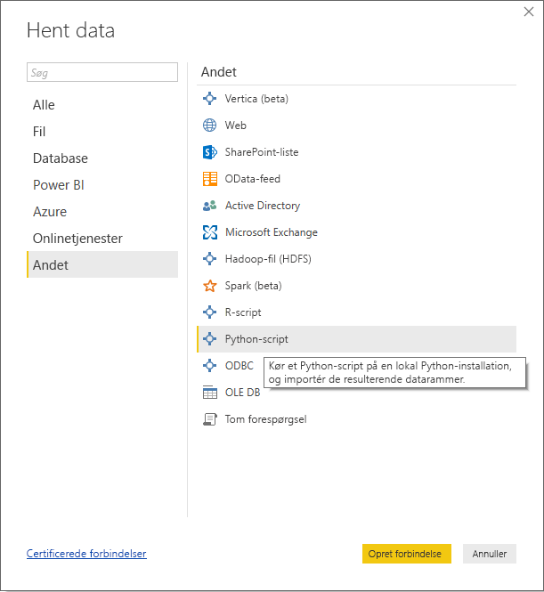
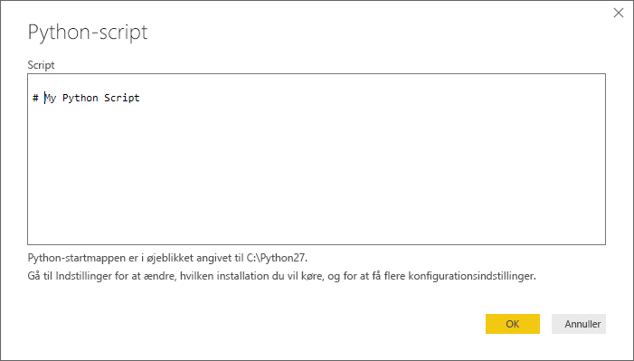
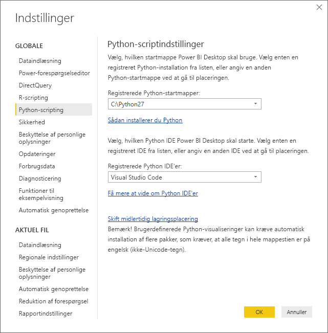

# <a name="run-python-scripts-in-power-bi-desktop"></a>Kør Python-scripts i Power BI Desktop
Du kan køre Python-scripts direkte i **Power BI Desktop** og importere de resulterende datasæt i en datamodel i Power BI Desktop.

## <a name="install-python"></a>Installér Python
Hvis du vil køre Python-scripts i Power BI Desktop, skal du installere **Python** på din lokale maskine. Du kan downloade og installere **Python** gratis fra mange forskellige steder, herunder den [officielle downloadside for Python](https://www.python.org/) og [Anaconda](https://anaconda.org/anaconda/python/). Den aktuelle version af Python-scriptet i Power BI Desktop understøtter Unicode-tegn og mellemrum (tomme tegn) i installationsstien.

### <a name="install-required-python-packages"></a>Installér påkrævede Python-pakker
Integration af Power BI Python kræver, at der er installeret to Python-pakker (Pandas og Matplotlib).  Installér følgende to pakker ved hjælp af pip-kommandolinjeværktøjet:

```
pip install pandas
pip install matplotlib
```

## <a name="run-python-scripts"></a>Kør Python-scripts
Med blot nogle få trin i Power BI Desktop kan du køre Python-scripts og oprette en datamodel, hvorfra du kan oprette rapporter og dele dem i Power BI tjenesten.

### <a name="prepare-a-python-script"></a>Klargør et Python-script
Hvis du vil køre et Python-script i Power BI Desktop, skal du oprette scriptet i dit lokale Python-udviklingsmiljø og sørge for, at det kører korrekt.

Hvis du vil køre scriptet i Power BI Desktop, skal du kontrollere, at scriptet kører korrekt i et nyt og uændret arbejdsområde. Det betyder, at alle pakker og afhængigheder udtrykkeligt skal være indlæst og køre.

Når du forbereder og kører et Python-script i Power BI Desktop, er der et par begrænsninger:

* Det er kun Pandas-datarammer, der importeres, og derfor skal du sørge for, at de data, du vil importere til Power BI, er repræsenteret i en dataramme
* Der opstår timeout for Python-scripts, som har kørt i mere end 30 minutter
* Interaktive kald i Python-scriptet, f.eks. venten på brugerinput, stopper kørslen af scriptet
* Når arbejdsmappen angives i Python-scriptet, *skal* du definere en fuld sti til arbejdsmappen i stedet for en relativ sti
* Indlejrede tabeller (tabel over tabeller) understøttes ikke i øjeblikket 

### <a name="run-your-python-script-and-import-data"></a>Kør Python-scriptet, og importér data
1. I Power BI Desktop findes dataconnectoren for Python-scriptet under **Hent data**. Hvis du vil køre Python-scriptet, skal du vælge **Hent data &gt; Mere...**  og derefter vælge **Andet &gt; Python-script** som vist på følgende billede:
   
   
2. Hvis Python er installeret på din lokale maskine, vælges den senest installerede version som Python-programmet. Du skal blot kopiere scriptet ind i scriptvinduet og vælge **OK**.
   
   
3. Hvis Python ikke er installeret, ikke kan identificeres, eller hvis der er flere installationer på din lokale maskine, vises der en advarsel.
   
   
   
   Indstillingerne for Python-installationen findes centralt i afsnittet om Python-scripts i dialogboksen Indstillinger. Du angiver indstillingerne for din Python-installation ved at vælge **Filer > Indstillinger**  og derefter **Indstillinger > Python-script**. Hvis der er flere Python-installationer tilgængelige, vises der en rullemenu, hvor du kan vælge, hvilken installation der skal bruges. Du kan også vælge **Andre** og angive en brugerdefineret sti.
   
   
4. Vælg **OK** for at køre Python-scriptet. Når scriptet køres, kan du vælge de resulterende datarammer, der skal føjes til Power BI-modellen.

### <a name="refresh"></a>Opdater
Du kan opdatere et Python-script i Power BI Desktop. Når du opdaterer et Python-script, køres Python-scriptet i Power BI Desktop igen i Power BI Desktop-miljøet.

## <a name="next-steps"></a>Næste trin
Du kan finde yderligere oplysninger om Python i Power BI i følgende artikler.

* [Opret Python-visuals i Power BI Desktop](desktop-python-visuals.md)
* [Brug en ekstern Python IDE sammen med Power BI](desktop-python-ide.md)
