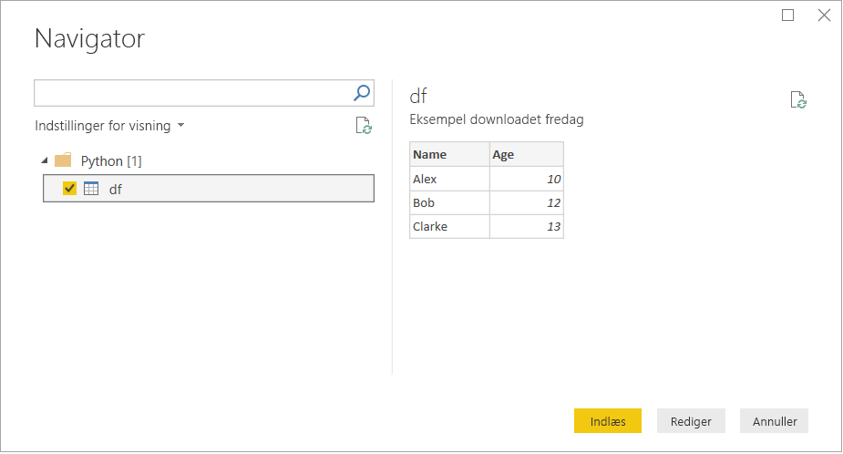

# <a name="run-python-scripts-in-power-bi-desktop"></a>Kør Python-scripts i Power BI Desktop

Du kan køre Python-scripts direkte i Power BI Desktop og importere de resulterende datasæt i en datamodel i Power BI Desktop.

## <a name="install-python"></a>Installér Python

Hvis du vil køre Python-scripts i Power BI Desktop, skal du installere Python på din lokale maskine. Du kan downloade Python fra [Python-webstedet](https://www.python.org/). Den aktuelle Python-scripting-version understøtter Unicode-tegn og mellemrum i installationsstien.

### <a name="install-required-python-packages"></a>Installér de påkrævede Python-pakker

Power BI Python-integrationen kræver installation af to Python-pakker:

* [Pandas](https://pandas.pydata.org/). Et softwarebibliotek til manipulation og analyse af data. Det indeholder datastrukturer og handlinger til manipulation af numeriske tabeller og tidsserier. Dine importerede data skal være i en [Pandas-dataramme](https://www.tutorialspoint.com/python_pandas/python_pandas_dataframe.htm). En dataramme er en todimensional datastruktur. Dataene justeres f.eks. i rækker og kolonner som i en tabel.
* [Matplotlib](https://matplotlib.org/). Et afbildningsbibliotek til Python og dets numeriske matematiske udvidelse [NumPy](https://www.numpy.org/). Det indeholder en objektorienteret API til integrering af afbildninger i programmer ved hjælp af de generelle grafiske værktøjssæt til GUI (f.eks. Tkinter, wxPython, QT eller GTK +).

Brug kommandolinjeværktøjet [pip](https://pip.pypa.io/en/stable/) i en konsol eller skal for at installere de to pakker. Pip-værktøjet leveres sammen med nyere Python-versioner.

```CMD
pip install pandas
pip install matplotlib
```

## <a name="enable-python-scripting"></a>Aktivér Python-scripting

Aktivering af Python-scripting:

1. Vælg **Filer** > **Indstillinger** > **Indstillinger** > **Python-scripting** i Power BI Desktop. Siden med **indstillinger for Python-scripts** vises.

   

1. Hvis det er nødvendigt, skal du angive din lokale Python-installationssti i den **registrerede Python-startmappe**.

   I ovenstående billede er den lokale sti til Python-installationen *C:\Python*. Sørg for, at det er den rigtige sti til den lokale Python-installation, som skal bruges af Power BI Desktop.

1. Vælg **OK**.

Når du har angivet din Python-installation, er du klar til at begynde at køre Python-scripts i Power BI Desktop.

## <a name="run-python-scripts"></a>Kør Python-scripts

Ved hjælp af nogle få trin kan du køre Python-scripts og oprette en datamodel. Fra denne model kan du oprette rapporter og dele dem på Power BI-tjenesten.

### <a name="prepare-a-python-script"></a>Klargør et Python-script

Først skal du oprette et script i dit lokale Python-udviklingsmiljø og sørge for, at det kører korrekt. Det kan f.eks. være et simpelt Python-script, der importerer Pandas og bruger en dataramme:

```python
import pandas as pd
data = [['Alex',10],['Bob',12],['Clarke',13]]
df = pd.DataFrame(data,columns=['Name','Age'],dtype=float)
print (df)
```

Når det køres, returneres dette script:

```python
     Name   Age
0    Alex  10.0
1     Bob  12.0
2  Clarke  13.0
```

Når du forbereder og kører et Python-script i Power BI Desktop, er der et par begrænsninger:

* Det er kun Pandas-datarammer, der importeres, og derfor skal du sørge for, at de data, du vil importere til Power BI, er repræsenteret i en dataramme
* Der opstår timeout for Python-scripts, som har kørt i mere end 30 minutter
* Interaktive kald i Python-scriptet, f.eks. venten på brugerinput, stopper kørslen af scriptet
* Når arbejdsmappen angives i Python-scriptet, *skal* du definere en fuld sti til arbejdsmappen i stedet for en relativ sti
* Indlejrede tabeller understøttes ikke i øjeblikket

### <a name="run-your-python-script-and-import-data"></a>Kør Python-scriptet, og importér data

Sådan kører du dit Python-script i Power BI Desktop:

1. På båndet Hjem skal du vælge **Hent data** > **Andet**.

1. Vælg **Andet** > **Python-script** som vist på følgende billede:

   

1. Vælg **Opret forbindelse**. Den senest installerede lokale Python-version vælges som dit Python-program. Kopiér scriptet til dialogboksen **Python-script**, der vises. Her angiver vi det simple Python-script, der blev vist før.

   

1. Vælg **OK**. Hvis scriptet kører korrekt, vises **Navigator**, og du kan indlæse dataene og bruge dem. I dette eksempel skal du markere afkrydsningsfeltet **df** som vist på billedet og derefter **Indlæs**.

    

### <a name="troubleshooting"></a>Fejlfinding

Hvis Python ikke er installeret eller identificeret, vises der en advarsel. Du kan også få vist en advarsel, hvis du har flere installationer på den lokale maskine. Vend tilbage, og gennemgå de forrige sektioner Installer Python og Aktivér Python-scripting.


### <a name="refresh"></a>Opdater

Du kan opdatere et Python-script i Power BI Desktop. Hvis du vil opdatere, skal du gå til båndet **Hjem** og vælge **Opdater**. Når du opdaterer et Python-script, køres Python-scriptet i Power BI Desktop igen.

## <a name="next-steps"></a>Næste trin

Du kan finde yderligere oplysninger om Python i Power BI i følgende artikler.

* [Opret Python-visuals i Power BI Desktop](desktop-python-visuals.md)
* [Brug en ekstern Python IDE sammen med Power BI](desktop-python-ide.md)
