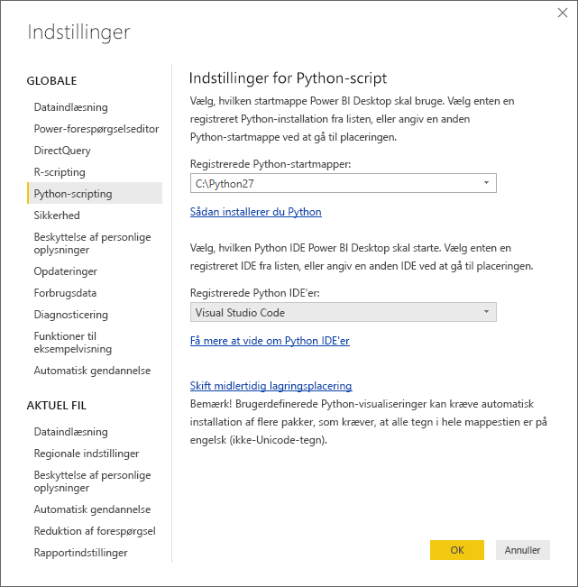
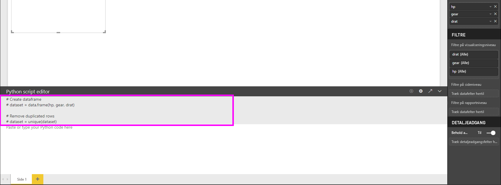
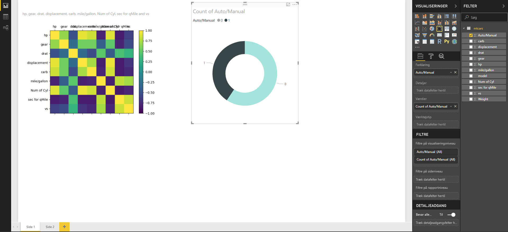
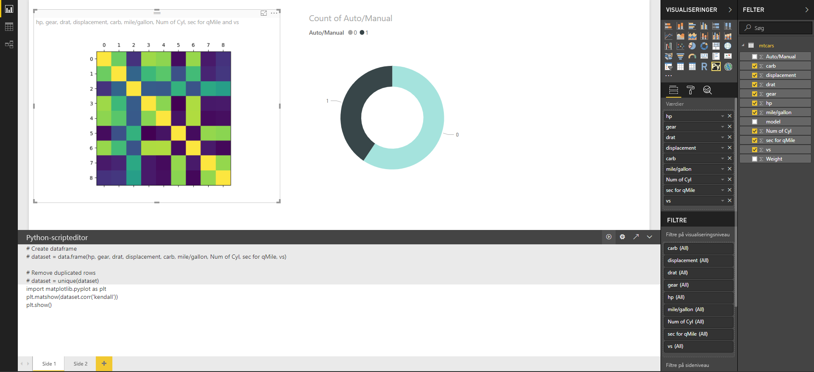
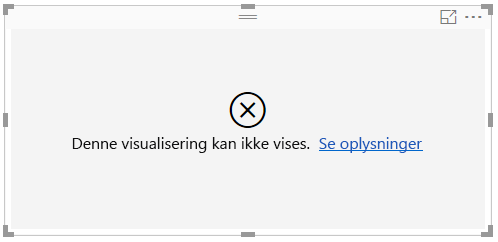

# Opret Power BI-visualiseringer ved hjælp af Python
Med **Power BI Desktop** kan du bruge **Python** til at visualisere dine data.

## Installér Python
**Power BI Desktop** indeholder ikke **Python**-programmet, og det udrulles og installeres ikke i forbindelse med Power BI Desktop. Hvis du vil køre Python-scripts i **Power BI Desktop**, skal du installere **Python** separat på din lokale computer. Du kan downloade og installere **Python** gratis fra mange forskellige steder, herunder den [officielle downloadside for Python](https://www.python.org/) og [Anaconda](https://anaconda.org/anaconda/python/). Den aktuelle version af Python-scriptet i Power BI Desktop understøtter Unicode-tegn og mellemrum (tomme tegn) i installationsstien.

## Aktivér Python-visuals
Du aktiverer Python-visuals ved at vælge **Fil > Indstillinger > Indstillinger**. Kontroller derefter, at din lokale Python-installation er angivet i afsnittet **Python-script** i vinduet **Indstillinger** på siden **Indstillinger** som vist på følgende billede. På følgende billede er installationsstien for Python **C:\Phyton27**, og denne sti er angivet eksplicit i tekstfeltet. Sørg for, at den viste sti afspejler den lokale Python-installation, som skal bruges af **Power BI Desktop**.
   
   

Når du har angivet din Python-installation, er du klar til at begynde at oprette Python-visuals.

## Opret Python-visuals i Power BI Desktop
1. Vælg ikonet **Visuelt Python-element** i ruden **Visualisering**, som vist på følgende billede, for at tilføje et visuelt Python-element.
   
   

   Når du føjer et visuelt Python-element til en rapport, sker der følgende i **Power BI Desktop**:
   
   - Der vises en pladsholder for din Python-visual på rapportlærredet.
   
   - **Python Scripteditor** vises nederst i den midterste rude.
   
   

2. Føj derefter de felter, du vil bruge i Python-scriptet, til afsnittet **Værdier** i området **Felter** på samme måde som med alle andre **Power BI Desktop**-visuals. 
    
    Kun de felter, der er føjet til området **Felter**, er tilgængelige i Python-scriptet. Du kan føje nye felter til eller fjerne unødvendige felter fra området **Felter**, mens du arbejder med Python-scriptet i **Python Scripteditor til Power BI Desktop**. Det registreres automatisk i **Power BI Desktop**, hvilke felter du har tilføjet eller fjernet.
   
   > [!NOTE]
   > Standardsammenlægningstypen for Python-visuals er *Opsummer ikke*.
   > 
   > 
   
3. Du kan nu bruge de valgte data til at oprette en afbildning. 

    I takt med at du vælger felter, opretter **Python Scripteditor** understøttende bindingskode for Python-scriptet baseret på dine valg i det grå afsnit øverst i editorruden. I takt med at du vælger eller fjerner flere felter, genereres eller fjernes der tilsvarende automatisk understøttende kode i Python Scripteditor.
   
   I det viste eksempel på følgende billede er tre felter valgt: hp, gear og drat. Som resultat af disse valg opretter Python Scripteditor følgende bindingskode:
   
   * En dataramme kaldet **dataset** blev oprettet
     * Denne dataramme består af de forskellige felter, brugeren har valgt
   * Standardsammenlægningen er *Opsummer ikke*
   * På samme måde som med tabelvisualiseringer grupperes felter, og duplikerede rækker vises kun én gang
   
   
   
   > [!TIP]
   > I nogle tilfælde ønsker du måske ikke automatisk gruppering, eller du vil måske have alle rækker vist, inklusive dubletter. I disse tilfælde kan du føje et indeksfelt til dit datasæt, hvilket medfører, at alle rækker opfattes som værende entydige, og gruppering derfor forhindres.
   > 
   > 
   
   Den genererede dataramme kaldes et **dataset**, og der kan opnås adgang til udvalgte kolonner ved hjælp af deres respektive navne. Du kan for eksempel få adgang til feltet Gear ved at skrive *dataset$gear* i Python-scriptet.

4. Idet datarammen genereres automatisk ved hjælp af de felter, du har valgt, kan du skrive et Python-script, der resulterer i en afbildning på Python-standardenheden. Når scriptet er fuldført, skal du vælge **Kør** på titellinjen i **Python Scripteditor** (**Kør** findes i højre side af titellinjen).
   
    Når du vælger **Kør**, identificeres afbildningen i **Power BI Desktop**, og den præsenteres på canvasset. Eftersom processen udføres på din lokale Python-installation, skal du kontrollere, at de påkrævede pakker er installeret.
   
   Visualiseringen afbildes igen i **Power BI Desktop**, når en eller flere af følgende hændelser opstår:
   
   * Når du vælger **Kør** på titellinjen i **Python Scripteditor**
   * Når data ændres pga. opdatering, filtrering eller fremhævning af data

    På følgende billede vises et eksempel på den tilsvarende afbildningskode, og korrelationen mellem forskellige biltypers egenskaber afbildes.

    

5. Hvis du vil have en større visning af visualiseringerne, kan du minimere **Python Scripteditor**. Som med alle andre visualiseringer i **Power BI Desktop** kan du filtrere på tværs af afbildningen af korrelationen ved kun at vælge sportsvogne i kransevisualiseringen (den runde visualisering til højre på eksempelbilledet ovenfor).

    

6. Du kan også ændre Python-scriptet for at tilpasse din visual og udnytte effektiviteten i Python ved at føje parametre til afbildningskommandoen.

    Den oprindelige kommando for afbildning var følgende:

    plt.matshow(dataset.corr('pearson'))

    Med nogle få ændringer i Python-scriptet er kommandoen nu følgende:

    plt.matshow(dataset.corr('kendall'))

    Som et resultat heraf afbildes din Python-visual nu ved hjælp af Kendall Tau korrelationskoefficienten som vist på følgende billede.

    

    Ved udførelse af et Python-script, der resulterer i en fejl, afbildes en Python-visual ikke, og der vises en fejlmeddelelse på lærredet. Du kan få flere oplysninger om fejlen ved at vælge **Se detaljer** i fejlmeddelelsen på lærredet i din Python-visual.

    

    > **Sikkerhed i forbindelse med Python-scripts:** Python-visualiseringer oprettes på baggrund af Python-scripts, som kan indeholde kode, der udgør en sikkerhedsrisiko eller en risiko for dine personlige oplysninger. Første gang en bruger forsøger at få vist eller interagere med en Python-visual, vises der en sikkerhedsadvarsel. Du skal kun aktivere Python-visuals, hvis du har tillid til forfatteren og kilden, eller når du har gennemset og forstået Python-scriptet.
    > 
    > 

## Kendte begrænsninger
Python-visuals i **Power BI Desktop** har nogle få begrænsninger:

* Begrænsninger for datastørrelse – Data, der bruges af en Python-visual til afbildning, er begrænset til 150.000 rækker. Hvis der er valgt flere end 150.000 rækker, bruges kun de øverste 150.000 rækker, og der vises en meddelelse på billedet.
* Begrænsning af beregningstid – hvis en beregning af en Python-visual overskrider fem minutter, opstår der timeout for udførelsen, hvilket medfører en fejl.
* Relationer – På samme måde som med andre Power BI Desktop-visualiseringer opstår der en fejl, hvis der vælges datafelter fra forskellige tabeller, hvor der ikke er defineret en relation.
* Python-visuals opdateres, når data opdateres, filtreres eller fremhæves. Selve billedet er dog ikke interaktivt og må ikke være kilden til tværgående filtrering.
* Python-visuals reagerer på fremhævning af andre visuals, men du kan ikke klikke på elementer i en Python-visual for at filtrere på tværs af andre elementer.
* Det er kun afbildninger, der afbildes på den Python-enhed, som bruges til standardvisning, der vises korrekt på lærredet. Undgå at bruge en anden Python-enhed til visning.

## Næste trin
Du kan finde yderligere oplysninger om Python i Power BI i følgende artikler.

* [Kørsel af Python-scripts i Power BI Desktop](desktop-python-scripts.md)
* [Brug en ekstern Python IDE sammen med Power BI](desktop-python-ide.md)

