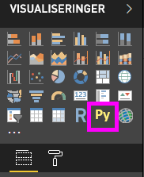
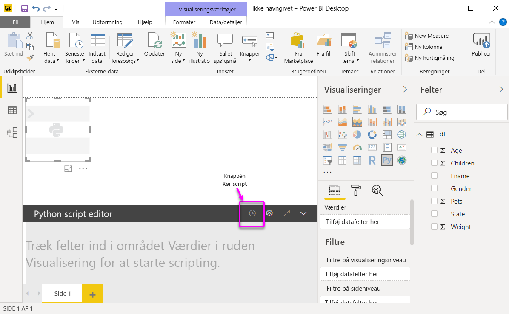
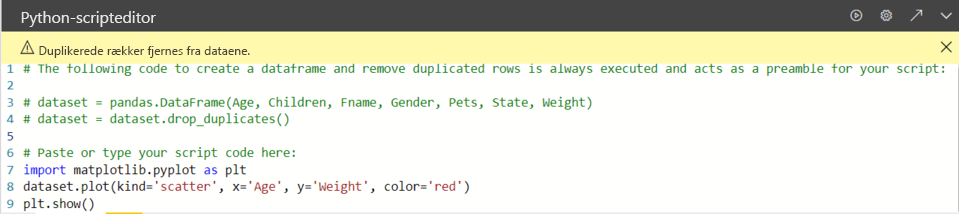

# <a name="create-power-bi-visuals-by-using-python"></a>Opret Power BI-visualiseringer med Python

Med *Power BI Desktop* kan du bruge Python til at visualisere dine data.

## <a name="prerequisites"></a>Forudsætninger

Gennemgå selvstudiet [Kør Python-scripts i Power BI Desktop](desktop-python-scripts.md) ved hjælp af følgende Python-script:

```python
import pandas as pd 
df = pd.DataFrame({ 
    'Fname':['Harry','Sally','Paul','Abe','June','Mike','Tom'], 
    'Age':[21,34,42,18,24,80,22], 
    'Weight': [180, 130, 200, 140, 176, 142, 210], 
    'Gender':['M','F','M','M','F','M','M'], 
    'State':['Washington','Oregon','California','Washington','Nevada','Texas','Nevada'],
    'Children':[4,1,2,3,0,2,0],
    'Pets':[3,2,2,5,0,1,5] 
}) 
print (df) 
```

Artiklen [Kør Python-scripts i Power BI Desktop](desktop-python-scripts.md) viser, hvordan du installerer Python på din lokale maskine og bruger den til Python-scripting i Power BI Desktop. Dette selvstudium anvender data fra ovenstående script til at illustrere oprettelse af Python-visualiseringer.

## <a name="create-python-visuals-in-power-bi-desktop"></a>Opret Python-visuals i Power BI Desktop

1. Vælg ikonet **Python-visual** i ruden **Visualiseringer**.

   

1. I dialogboksen **Aktivér visuelle script-elementer**, der vises, skal du vælge **Aktivér**.

    Når du føjer et visuelt Python-element til en rapport, foretager Power BI Desktop følgende handlinger:

    - Der vises en pladsholder for din Python-visual på rapportlærredet.

    - **Python Scripteditor** vises nederst i den midterste rude.

    

1. Træk derefter felterne **Alder**, **Børn**, **Fnavn**, **Køn**, **Kæledyr**, **Stat** og **Vægt** til afsnittet **Værdier**, hvor der står **Tilføj datafelter her**.

    

   Python-scriptet kan kun bruge felter, der er føjet til afsnittet **Værdier**. Du kan tilføje eller fjerne felter fra afsnittet **Værdier**, mens du arbejder med dit Python-script. Power BI Desktop registrerer automatisk feltændringer.

   > [!NOTE]
   > Standardsammenlægningstypen for Python-visuals er *Opsummer ikke*.
   > 
   > 

1. Du kan nu bruge de valgte data til at oprette en afbildning.

    I takt med at du vælger eller fjerner felter, genereres eller fjernes der automatisk understøttende kode i Python Scripteditor. 

    Som resultat af dine valg opretter Python Scripteditor følgende bindingskode.

    - Editoren opretter en *datasæt*-dataramme med de felter, du har tilføjet.
    - Standardsammenlægningen er: *Opsummer ikke*.
    - På samme måde som med tabelvisualiseringer grupperes felter, og duplikerede rækker vises kun én gang.

    

     > [!TIP]
     > I nogle tilfælde ønsker du måske ikke automatisk gruppering, eller du vil måske have alle rækker vist, inklusive dubletter. I disse tilfælde kan du føje et indeksfelt til dit datasæt, hvilket medfører, at alle rækker opfattes som værende entydige, og gruppering derfor forhindres.

   Du kan få adgang til kolonner i datasættet ved hjælp af deres respektive navne. Du kan f.eks. kode datasættet `dataset["Age"]` i dit Python-script for at få adgang til feltet Alder.

1. Eftersom datarammen genereres automatisk ved hjælp af de felter, du har valgt, kan du skrive et Python-script, der resulterer i en afbildning på Python-standardenheden. Når scriptet er færdigt, vælger du **Kør** på titellinjen i **Python Scripteditor**.

   Visualiseringen afbildes igen i Power BI Desktop, hvis en eller flere af følgende hændelser opstår:

   - Når du vælger **Kør** på titellinjen i **Python Scripteditor**
   - Når data ændres pga. opdatering, filtrering eller fremhævning af data

   Når du kører et Python-script, der resulterer i en fejl, afbildes Python-visualiseringen ikke, og der vises en fejlmeddelelse på lærredet. Du kan finde oplysninger om fejlen ved at vælge **Se oplysninger** i meddelelsen.

   Hvis du vil have en større visning af visualiseringerne, kan du minimere **Python Scripteditor**.

OK, lad os oprette nogle visualiseringer.

## <a name="create-a-scatter-plot"></a>Opret et punktdiagram

Lad os oprette et punktdiagram for at se, om der er korrelation mellem alder og vægt.

1. Indtast følgende kode under **Indsæt eller indtast din scriptkode her**:

   ```python
   import matplotlib.pyplot as plt 
   dataset.plot(kind='scatter', x='Age', y='Weight', color='red')
   plt.show() 
   ```  

   Ruden Python Scripteditor ser nu ud på følgende måde:

   

   **Matplotlib**-biblioteket importeres for at afbilde og oprette vores visualiseringer.

1. Når du vælger scriptknappen **Kør**, genereres følgende punktdiagram i pladsholderen Python visuelt billede.

   

## <a name="create-a-line-plot-with-multiple-columns"></a>Opret et linjeområde med flere kolonner

 Lad os oprette et linjeområde for hver person, der viser antallet af børn og kæledyr. Fjern eller kommenter koden under **Indsæt eller indtast din scriptkode her**, og indtast følgende Python-kode:

 ```python
 import matplotlib.pyplot as plt 
ax = plt.gca() 
dataset.plot(kind='line',x='Fname',y='Children',ax=ax) 
dataset.plot(kind='line',x='Fname',y='Pets', color='red', ax=ax) 
plt.show() 
```

Når du vælger scriptknappen **Kør**, genereres følgende linjeområde med flere kolonner.


## <a name="create-a-bar-plot"></a>Opret et søjlediagram

Lad os oprette et søjlediagram for hver persons alder. Fjern eller kommenter koden under **Indsæt eller indtast din scriptkode her**, og indtast følgende Python-kode:

```python
import matplotlib.pyplot as plt 
dataset.plot(kind='bar',x='Fname',y='Age') 
plt.show() 
```

Når du vælger scriptknappen **Kør**, genereres følgende søjlediagram:

 

## <a name="security"></a>Sikkerhed

> [!IMPORTANT] 
> **Sikkerhed i forbindelse med Python-scripts:** Python-visualiseringer oprettes på baggrund af Python-scripts, som kan indeholde kode, der udgør en sikkerhedsrisiko eller en risiko for dine personlige oplysninger. Første gang en bruger forsøger at få vist eller interagere med en Python-visual, vises der en sikkerhedsadvarsel. Du skal kun aktivere Python-visuals, hvis du har tillid til forfatteren og kilden, eller når du har gennemset og forstået Python-scriptet.
>  

## <a name="more-information-about-plotting-with-matplotlib-pandas-and-python"></a>Flere oplysninger om afbildning med Matprotlib, Pandas og Python

Dette selvstudium er udformet, så du kan komme i gang med at oprette visualiseringer med Python i Power BI Desktop. Det behandler bare nogle få af de mange muligheder og funktioner, der findes til oprettelse af visuelle rapporter ved hjælp af Python, Pandas og Matprotlib-biblioteket. Der er mange flere oplysninger, og her er nogle links, så du kan komme i gang.

- Dokumentation på webstedet [Matplotlib](https://matplotlib.org/). 
- [Matplotlib-selvstudium: En grundlæggende vejledning i brug af Matplotlib med Python](https://www.datasciencelearner.com/matplotlib-tutorial-complete-guide-to-use-matplotlib-with-python/) 
- [Matplotlib-selvstudium – Python Matplotlib-bibliotek med eksempler](https://www.edureka.co/blog/python-matplotlib-tutorial/) 
- [Pandas API-reference](https://pandas.pydata.org/pandas-docs/stable/reference/index.html) 
- [Python-visualiseringer i Power BI Service](https://powerbi.microsoft.com/blog/python-visualizations-in-power-bi-service/) 
- [Brug af Python-visualiseringer i Power BI](https://www.absentdata.com/how-to-user-python-and-power-bi/)

## <a name="known-limitations"></a>Kendte begrænsninger

Python-visualiseringer i Power BI Desktop har nogle få begrænsninger:

- Begrænsninger af datastørrelse. De data, der bruges af Python-visualiseringen til afbildning, er begrænset til 150.000 rækker. Hvis der er valgt flere end 150.000 rækker, bruges kun de øverste 150.000 rækker, og der vises en meddelelse på billedet. Desuden er der en grænse på 250 MB for inputdataene. 
- Opløsning. Alle Python-visualiseringer vises ved 72 DPI.
- Begrænsning af beregningstid. Hvis en beregning af en Python-visual overskrider fem minutter, opstår der timeout for udførelsen, hvilket medfører en fejl.
- Relationer. På samme måde som med andre Power BI Desktop-visualiseringer opstår der en fejl, hvis der vælges datafelter fra forskellige tabeller, hvor der ikke er defineret en relation.
- Python-visuals opdateres, når data opdateres, filtreres eller fremhæves. Selve billedet er dog ikke interaktivt og må ikke være kilden til tværgående filtrering.
- Python-visualiseringer reagerer på fremhævning af andre visualiseringer, men du kan ikke klikke på elementer i en Python-visualisering for at filtrere på tværs af andre elementer.
- Det er kun afbildninger, der afbildes på den Python-enhed, som bruges til standardvisning, der vises korrekt på lærredet. Undgå at bruge en anden Python-enhed til visning.
- Python-visualiseringer understøtter ikke omdøbning af inputkolonner. Der refereres til kolonner fra deres oprindelige navn under udførelsen af scriptet.

## <a name="next-steps"></a>Næste trin

Du kan finde yderligere oplysninger om Python i Power BI i følgende artikler.

- [Kør Python-scripts i Power BI Desktop](desktop-python-scripts.md)
- [Brug en ekstern Python IDE sammen med Power BI](desktop-python-ide.md)

