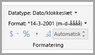
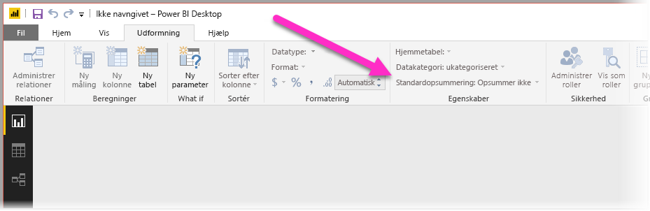
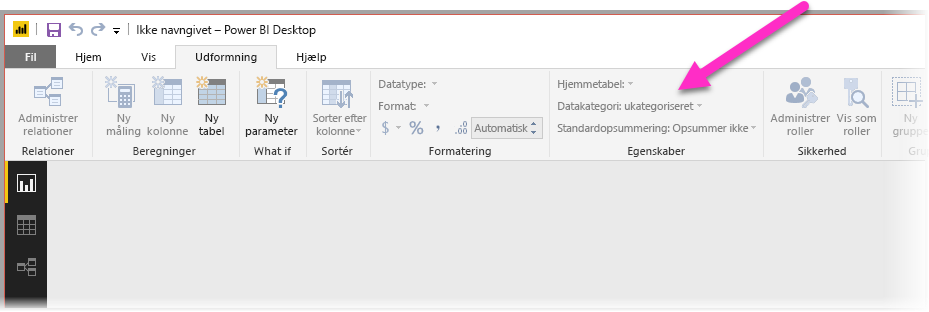
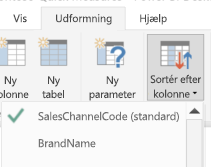
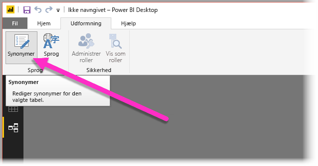
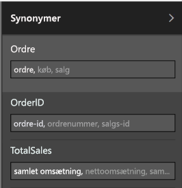

# Brug Spørgsmål og svar i Power BI Desktop til forespørgsler på et naturligt sprog
Det er effektivt, når du bruger almindelige udtryk og naturligt sprog til dataforespørgsler. Endnu mere effektiv er det, når dataene svarer dig, hvilket Spørgsmål og svar i **Power BI Desktop** gør muligt for dig.

For at aktivere Spørgsmål og svar med henblik på at kunne fortolke den store samling af spørgsmål, som funktionen er i stand til at svare på, så skal Spørgsmål og svar opstille forudsætninger for modellen. Hvis strukturen i din model ikke opfylder en eller flere af disse forudsætninger, så er du nødt til at justere din model. De pågældende justeringer for Spørgsmål og svar er de samme bedste praksis-optimeringer for enhver model i Power BI, uanset om du bruger Spørgsmål og svar. 

> [!NOTE]
> Spørgsmål og svar er kun tilgængelig, når du arbejder med en model, der indeholder **importerede** data. Direkte forbindelser til SSAS- og DirectQuery-modeller understøttes ikke.
>
>

I afsnittene nedenfor beskriver vi, hvordan du justerer din model, så den fungerer godt med Spørgsmål og svar i Power BI.

## Tilføj manglende relationer

Hvis der mangler relationer mellem tabeller i modellen, kan hverken Power BI-rapporter eller Spørgsmål og svar fortolke, hvordan disse tabeller skal forbindes, hvis du benytter forespørgsler med dem. Relationerne er hjørnestenen i en god model. Eksempelvis kan du ikke bede om "det samlede salg for kunder i Seattle", hvis relationen mellem tabellen *ordrer* og tabellen *kunder* mangler. Følgende billeder viser eksempler på en model, der skal forbedres, og en model, der er klar til Spørgsmål og svar.

**Skal forbedres**

**Klar til Spørgsmål og svar**

## Omdøb tabeller og kolonner

Valget af tabeller og kolonner er yderst vigtigt for Spørgsmål og svar. Hvis du f.eks. har en tabel ved navn *Kundeoversigt*, der indeholder en liste over dine kunder, så skulle du benytte forespørgsler som f.eks. "Opstil liste over kundeoversigterne i Chicago" i stedet for "Opstil liste over kunderne i Chicago". 

Selvom Spørgsmål og svar kan benytte basal orddeling og registrering af flertalsformer, så forudsætter Spørgsmål og svar, at dine tabel- og kolonnenavne præcist afspejler deres indhold.

Tænk over et andet eksempel. Forestil dig, at du har en tabel med navnet *Personer*, der indeholder for- og efternavne og medarbejdernumre, og en anden tabel med navnet *Medarbejdere*, der indeholder medarbejdernumre, jobnumre og startdatoer. Strukturen giver måske mening for personer, der er bekendt med modellen, men når andre benytter forespørgslen "tæl medarbejdere", så får de vist antallet af rækker fra tabellen "Medarbejdere", hvilket nok ikke er optimalt, idet det er tallet for hver eneste job, som hver medarbejder har haft nogensinde. Det er meget bedre at omdøbe tabellerne, så de afspejler deres sande indhold.

**Skal forbedres**

**Klar til Spørgsmål og svar**

## Ret forkerte datatyper

Importerede data kan have forkerte datatyper. Især vil *dato*- og *tal*-kolonner, der importeres som *strenge*, ikke kunne fortolkes som datoer og tal af Spørgsmål og svar. Du skal sørge for at vælge den korrekte datatype i din Power BI-model.

## Angiv år- og id-kolonner som Opsummer ikke

Power BI aggregerer numeriske kolonner aggressivt som standard, så forespørgsler som "samlede salg pr. år" somme tider kan resultere i et samlet tal for salg sammen med et samlet tal for år. Hvis du har specifikke kolonner, hvor du ikke vil benytte denne funktionsmåde i Power BI, så skal du indstille egenskaben **Opsummer efter** på kolonnen til **Opsummer ikke**. Vær opmærksom på kolonnerne **år**, **måned**, **dag** og **id**, idet disse kolonner hyppigst er problematiske. Andre kolonner, der ikke er praktiske at opsummere, f.eks. *alder*, kan også drage fordel af, at **Opsummer efter** indstilles til **Opsummer ikke** eller til **Gennemsnit**. Du kan finde denne indstilling på fanen **Udformning**.

## Vælg en datakategori for hver dato- og geografikolonne

**Datakategori** giver yderligere semantisk viden om indholdet af en kolonne, der ligger ud over dens datatype. En heltalskolonne kan f.eks. være markeret som et postnummer, en strengkolonne kan være markeret som en by, et land, et område osv. Disse oplysninger bruges af Spørgsmål og svar på to vigtige måder: til visualiseringsmarkering og til sprogforskelle.

For det første bruger Spørgsmål og svar **Datakategori**-oplysninger til at hjælpe med at foretage valg af, hvilken type visuel visning, der skal bruges. Funktionen genkender for eksempel, at kolonner med **Datakategorierne** dato eller klokkeslæt typisk er et godt valg til den vandrette akse i et kurvediagram eller afspilningsaksen i et boblediagram. Og den forudsætter, at resultater med kolonner med geografiske **Datakategorier** kan se flotte ud på et kort.

For det andet kan Spørgsmål og svar give nogle kvalificerede gæt med hensyn til, hvordan brugere sandsynligvis taler om dato- og geografi-kolonner, for at hjælpe funktionen med at forstå visse typer af spørgsmål. For eksempel "hvornår" i "Hvornår blev John Smith ansat?" vil næsten med sikkerhed blive knyttet til en datokolonne, og "Brown" i "Antal kunder i Brown" er sandsynligvis en by og ikke en hårfarve.

## Vælg en "Sortér efter kolonne" for de relevante kolonner

Egenskaben **Sortér efter kolonne** tillader sortering efter én kolonne for automatisk at sortere efter en anden kolonne i stedet. Når du f.eks. benytter forespørgslen "sortér kunder efter skjortestørrelse", vil du sandsynligvis have, at din kolonne med Skjortestørrelser sorterer efter det underliggende størrelsesnummer (XS, S, M, L, XL) i stedet for alfabetisk (L, M, S, XL, XS).

## Normaliser din model

Bare rolig, vi foreslår ikke, at du skal redefinere hele din model. Men der er visse strukturer, som ganske enkelt er så svære, at Spørgsmål og svar ikke vil håndtere dem særlig godt. Hvis du udfører noget grundlæggende normalisering af strukturen af din model, øges Power BI-rapporternes brugbarhed væsentligt, hvilket også gælder Spørgsmål og svar-resultaternes nøjagtighed.

Den generelle regel, du bør følge, er som følger: Hver unikke "ting", som brugeren taler om, bør repræsenteres af nøjagtigt ét modelobjekt (tabel eller kolonne). Så hvis dine brugere taler om kunder, bør der være ét *kunde*-objekt. Og hvis dine brugere taler om salg, bør der være ét *salg*-objekt. Det lyder enkelt, ikke? Det kan det også være, afhængigt af hvilken formatering dataene, du starter med, har. Der er rig mulighed for dataformatering i **Forespørgselseditoren**, hvis du får brug for det, mens mange af de mere enkle transformationer kan udføres ved blot at bruge beregninger i Power BI-modellen.

De følgende sektioner indeholder nogle gængse transformationer, som du kan få brug for at udføre.

### Opret nye tabeller for flerkolonneenheder

Hvis du har flere kolonner, der fungerer som en enkelt særskilt enhed i en større tabel, skal disse kolonner opdeles i deres egen tabel. Hvis du f.eks. har en kolonne med Kontaktnavn, Kontakttitel og Kontakttelefon i tabellen *Firmaer*, så kan det være en fordel at have en særskilt tabel med *Kontakter*, som indeholder Navn, Titel og Telefon og et link tilbage til tabellen *Firmaer*. Det gør det væsentligt lettere at benytte forespørgsler om kontakter uafhængigt af forespørgsler om firmaer, som de fungerer som kontakt for, og forbedrer visningsfleksibiliteten.

**Skal forbedres**

**Klar til Spørgsmål og svar**

### Pivotér for at eliminere egenskabsbeholdere

Hvis du har egenskabsbeholdere i modellen, skal de omstruktureres for at få en enkelt kolonne for hver egenskab. Egenskabsbeholdere kan være praktiske til administrering af et stort antal egenskaber, men har en række indlejrede begrænsninger, som hverken Power BI-rapporter eller Spørgsmål og svar er designet til at kunne omgå.

Lad os f.eks. antage, at vi har tabellen *Kundedemografi* med kolonnerne Kunde-id, Egenskab og Værdi, hvor hver række repræsenterer en særskilt egenskab hos kunden (f.eks. alder, civilstand, by osv.). Ved at overlæsse betydningen af kolonnen Værdi baseret på indholdet i kolonnen Egenskab, så bliver det umuligt for Spørgsmål og svar at fortolke de fleste forespørgsler, der refererer til den. En simpel forespørgsel som f.eks. "vis alderen for en kunde" vil muligvis fungere, siden den kan fortolkes som "vis kunderne og kundedemografier, hvor egenskaben er alder". Dog understøtter strukturen i modellen ikke lidt mere komplekse forespørgsler, som f.eks. "gennemsnitlig alder for kunder i Chicago." Mens brugere, som direkte udvikler Power BI-rapporter, somme tider kan finde smarte måder at hente de ønskede data på, så fungerer Spørgsmål og svar kun, når hver kolonne kun har én enkelt betydning.

**Skal forbedres**

**Klar til Spørgsmål og svar**

### Benyt samling for at fjerne partitionering

Hvis du har partitioneret dine data på tværs af flere tabeller, eller du har pivoteret værdier på tværs af flere kolonner, så bliver det svært eller umuligt for brugere at benytte visse almindelige funktioner. Overvej først en typisk tabelpartitionering: en tabel med *Salg 2000-2010* og en tabel med *Salg 2011-2020*. Hvis alle dine vigtige rapporter er begrænset til et specifikt årti, så kan du nok lade det være på denne måde for Power BI-rapporter. Dog vil fleksibiliteten i Spørgsmål og svar føre til, at brugerne forventer svar på forespørgsler som f.eks. "samlet salg pr. år." Hvis dette skal fungere, så skal du samle dataene i en enkelt Power BI-modeltabel.

Overvej desuden en typisk pivoteret værdikolonne: en tabel over en *Bogturné*, der indeholder kolonnerne Forfatter, Bog, By 1, By 2 og By 3. Denne struktur gør, at selv simple forespørgsler som f.eks. "antal bøger efter by", ikke kan fortolkes korrekt. Dette kan kun fungere ved, at du opretter en særskilt tabel med *BogturnéByer*, som samler byværdierne i en enkelt kolonne.

**Skal forbedres**

**Klar til Spørgsmål og svar**

### Opdel formaterede kolonner

Hvis kilden, hvorfra du importerer dine data, indeholder formaterede kolonner, vil Power BI-rapporter (og Spørgsmål og svar) ikke række ind i kolonnen for at opdele dens indhold. Hvis du derfor eksempelvis har en **Fulde adresse**-kolonne, der indeholder adresse, by og land, så bør du opdele den i kolonnerne Adresse, By og Land, så brugere kan oprette forespørgsler efter dem hver for sig.

**Skal forbedres**

**Klar til Spørgsmål og svar**

Hvis du på samme måde har en "fulde navn"-kolonne for en person, så bør du tilføje kolonnerne **Fornavn** og **Efternavn** i det tilfælde, at nogen vil oprette forespørgsler ved hjælp af delvise navne. 

### Opret nye tabeller for flerværdikolonner

En lignende situation forekommer, hvis kilden, hvorfra du importerer dataene, indeholder flerværdikolonner, så rækker Power BI-rapporter (og Spørgsmål og svar) ikke ind i kolonnen for at opdele dens indhold. Så hvis du f.eks. har en Komponist-kolonne, der indeholder navnene på flere komponister til en sang, bør du opdele den i flere rækker i en særskilt tabel over *Komponister*.

**Skal forbedres**

**Klar til Spørgsmål og svar**

### Benyt denormalisering for at fjerne inaktive relationer

Den eneste undtagelse for reglen "normalisering er bedre" opstår, når der er flere stier til og fra én tabel til en anden. Hvis du f.eks. har en tabel med *Flyafgange* med både KildeById- og DestinationsById-kolonner, som hver er relateret til tabellen *Byer*, så skal én af disse relationer markeres som inaktiv. Idet Spørgsmål og svar kun kan bruge relationer, kan du ikke benytte forespørgsler om enten kilde eller destination, afhængigt af hvilken du vælger. Hvis du i stedet benytter denormalisering af kolonnerne bynavn i tabellen *Flyafgange*, så kan du benytte forespørgsler som f.eks.: "opstil liste over flyafgange i morgen med Seattle som kildeby og San Francisco som destinationsby."

**Skal forbedres**

**Klar til Spørgsmål og svar**

### Føj synonymer til tabeller og kolonner

Dette trin gælder specielt for Spørgsmål og svar (og ikke for Power BI-rapporter generelt). Brugere har ofte en række ord, som de bruger til at henvise til det samme, som f.eks. samlet salg, nettosalg, samlet nettosalg. Power BI-modellen giver mulighed for, at disse synonymer kan føjes til tabeller og kolonner inden for modellen. 

Dette kan være et særdeles vigtigt trin. Selv med helt enkle tabel- og kolonnenavne så benytter brugere af Spørgsmål og svar sig af forespørgsler med nogle ord, der lige falder dem ind, og vælger ikke ordene på en foruddefineret liste over kolonner. Jo mere fornuftige synonymer, du kan tilføje, jo bedre er brugernes oplevelse med din rapport. Hvis du vil tilføje synonymer, skal du vælge knappen Synonymer på båndet i visningen **Relationer**, som vist på følgende billede.

Feltet **Synonymer** vises i højre side af **Power BI Desktop**, hvor du kan tilføje dine synonymer, som vist på følgende billede.

 Vær forsigtig, når du tilføjer synonymer, for hvis du tilføjer det samme synonym til flere end én kolonne eller tabel, så vil det medføre flertydighed. Spørgsmål og svar anvender kontekst, hvor det er muligt at vælge mellem flertydige synonymer, men ikke alle forespørgsler har tilstrækkelig kontekst. Når en bruger f.eks. benytter forespørgslen "tæl kunderne", og du har tre ting med synonymet "kunde" i din model, så får vedkommende nok ikke det ønskede svar. I disse tilfælde skal du sørge for, at det primære synonym er entydigt, for det er det, der bruges i tilpasningen. Det kan gøre brugeren opmærksom på flertydigheden (f.eks. en tilpasning af "vis antallet af arkiverede kundejournaler") og give vedkommende et praj om, at forespørgslen måske bør ændres.

## Næste trin
Du kan finde flere oplysninger om de funktioner, der findes i Power BI Desktop, i følgende artikler:

* [Brug detaljeadgang i Power BI Desktop](desktop-drillthrough.md)
* [Vis et dashboardfelt eller en rapport i fokustilstand](service-focus-mode.md)

