# Oversigt over forespørgsler i Power BI Desktop
Med Power BI Desktop kan du oprette forbindelse til alverdens data, oprette overbevisende og grundlæggende rapporter og dele dit arbejde med andre – der derefter kan bygge videre på dit arbejde og udvide deres business intelligence.

Power BI Desktop har tre visninger:

* Visningen **Rapport** – Her kan du bruge forespørgsler, du opretter, til at oprette overbevisende visualiseringer, der kan arrangeres, som du ønsker det, og med flere sider, som du kan dele med andre
* Visningen **Data** – Her vises dataene i din rapport i datamodelformat, hvor du kan tilføje målinger, oprette nye kolonner og administrere relationer
* Visningen **Relationer** – Her kan du få en grafisk repræsentation af de relationer, som er oprettet i din datamodel, og administrere eller ændre dem efter behov.

Åbn disse visninger ved at vælge et af de tre ikoner i venstre side af Power BI Desktop. På følgende billede er visningen **Rapport** valgt, hvilket kan ses via det gule bånd ud for ikonet.  

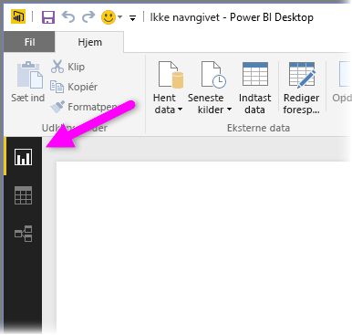

Power BI Desktop leveres også med Power-forespørgselseditor. Brug Power-forespørgselseditor til at oprette forbindelse til en eller flere datakilder, forme og transformere dataene i forhold til dine behov og derefter indlæse den pågældende model i Power BI Desktop.

Dette dokument giver et overblik over, hvordan du arbejder med data i Power-forespørgselseditoren, men du får flere oplysninger. I slutningen af dette dokument kan du finde links til detaljeret vejledning om understøttede datatyper. Du får også vejledning om, hvordan du opretter forbindelse til data, former data, opretter relationer, og hvordan du kommer i gang.

Men lad os først kigge på Power-forespørgselseditoren.

## Power Query-editor
For at få adgang til Power-forespørgselseditor skal du vælge **Rediger forespørgsler** fra fanen **Hjem** i Power BI Desktop.  

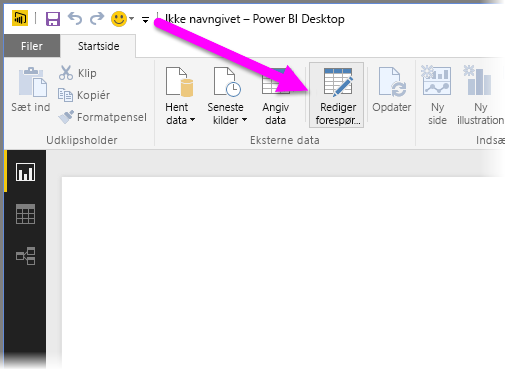

Hvis der ikke er dataforbindelser, vises Power-forespørgselseditoren som en tom rude, der er klar til at modtage data.  

Når der indlæses en forespørgsel, bliver visningen Power-forespørgselseditor mere interessant. Hvis vi opretter forbindelse til følgende webdatakilde, indlæser Power-forespørgselseditoren oplysninger om dataene, som du derefter kan begynde at forme:

[*https://www.bankrate.com/retirement/best-and-worst-states-for-retirement/*](https://www.bankrate.com/retirement/best-and-worst-states-for-retirement/)

Her kan du se, hvordan Power-forespørgselseditoren vises, når der er oprettet en dataforbindelse:

1. På båndet er mange knapper nu aktive, så der kan kommunikeres med dataene i forespørgslen.
2. I venstre rude kan du se forespørgslerne, og her kan de vælges, vises og udformes.
3. I den midterste rude vises data fra den valgte forespørgsel. Disse data kan formes.
4. Ruden **Forespørgselsindstillinger** vises. Den indeholder forespørgslens egenskaber og anvendte trin.  
   
   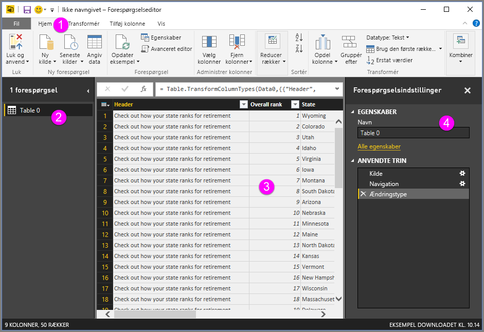

Vi undersøger hvert af disse fire områder: båndet, forespørgselsruden, datavisningen og ruden med indstillinger for forespørgsler.

## Forespørgselsbåndet
Båndet i Power-forespørgselseditor består af fire faner: **Hjem**, **Transformer**, **Tilføj kolonne** og **Vis**.

Fanen **Hjem** indeholder almindelige forespørgselsopgaver.

Hvis du vil oprette forbindelse til data og starte processen til oprettelse af forespørgslen, skal du vælge **Ny kilde**. Der vises en menu med de mest almindelige datakilder.  

Du kan finde flere oplysninger om de tilgængelige datakilder under **Datakilder**. Du kan finde oplysninger om at oprette forbindelse til data, herunder eksempler og trin, under **Opret forbindelse til data**.

Fanen **Transformer** giver adgang til almindelige opgaver til transformation af data, f.eks.:

* Tilføjelse eller fjernelse af kolonner
* Ændring af datatyper 
* Opdeling af kolonner 
* Andre datadrevne opgaver

Du kan finde flere oplysninger om transformering af data, herunder eksempler, under [Selvstudium: Udform og kombiner data i Power BI Desktop](https://docs.microsoft.com/power-bi/desktop-shape-and-combine-data).

Fanen **Tilføj kolonne** indeholder flere opgaver, der er knyttet til tilføjelse af en kolonne, formatering af kolonnedata og tilføjelse af brugerdefinerede kolonner. Du kan se fanen **Tilføj kolonne** på følgende billede.  

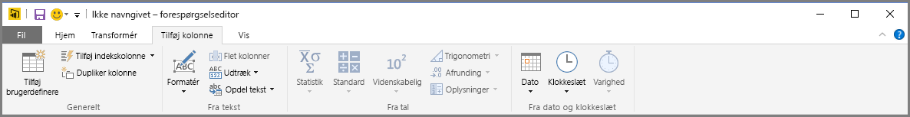

Fanen **Vis** på båndet bruges til at slå visning af visse ruder og vinduer til eller fra. Den bruges også til at få vist den avancerede editor. Du kan se fanen **Vis** på følgende billede.  

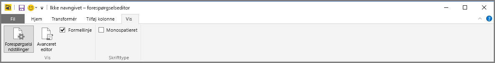

Det er godt at vide, at mange af de opgaver, der er tilgængelige på båndet, også kan åbnes ved at højreklikke på en kolonne eller andre data i midterste rude.

## Ruden til venstre (Forespørgsler)
I venstre rude eller ruden **Forespørgsler** vises antallet af aktive forespørgsler og navnet på forespørgslen. Når du vælger en forespørgsel i venstre rude, vises dataene i midterste rude, hvor du kan forme og transformere dataene efter behov. På følgende billede vises venstre rude med en forespørgsel.  

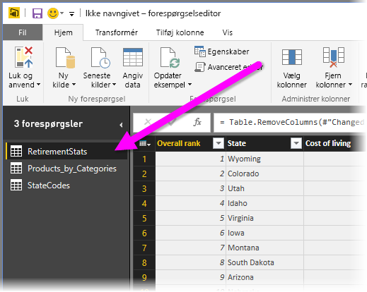

## Midterste rude (Data)
I den midterste rude eller ruden **Data** vises data fra den valgte forespørgsel. Det er i denne rude, at meget af arbejdet fra visningen **Forespørgsel** udføres.

På følgende billede vises den webdataforbindelse, der er oprettet tidligere. Kolonnen **Produkt** er markeret, og der højreklikkes på overskriften for at få vist de tilgængelige menupunkter. Bemærk, at mange af disse menupunkter i genvejsmenuen er de samme som knapperne under fanerne på båndet.  

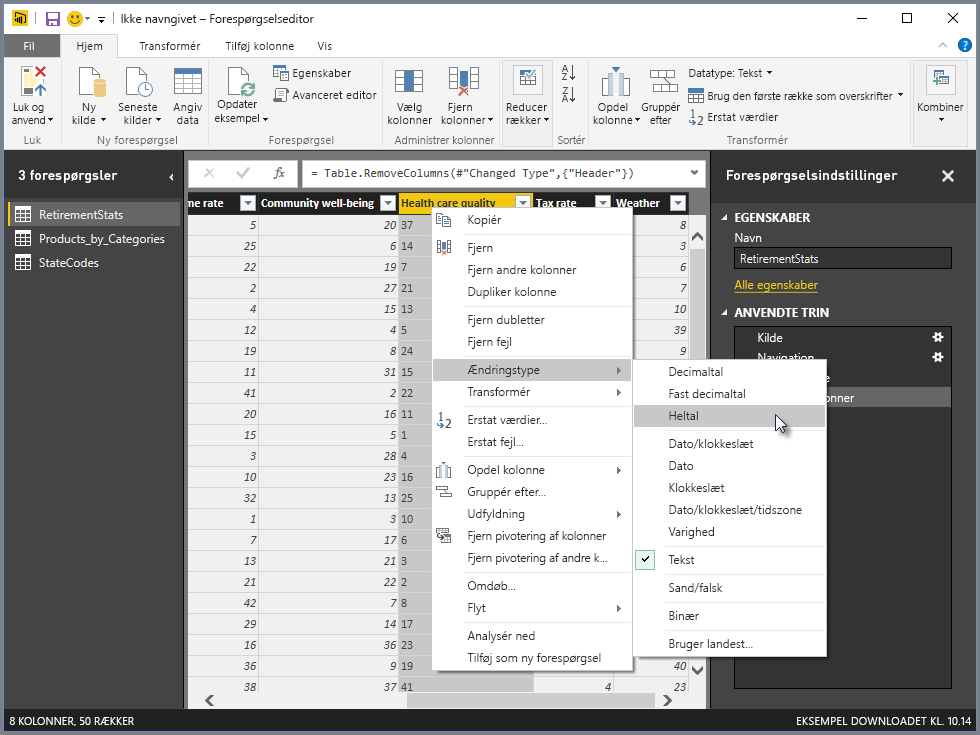

Når du vælger et menupunkt i en genvejsmenu (eller en knap på båndet), anvender forespørgslen trinnet på dataene. Det gemmer også trin som en del af selve forespørgslen. Trinnene registreres i ruden **Indstillinger for forespørgsel** i sekventiel rækkefølge som beskrevet i næste afsnit.  

## Den højre rude (Indstillinger for forespørgsler)
Den højre rude eller ruden **Indstillinger for forespørgsler** er det sted, hvor alle de trin, der er knyttet til en forespørgsel, vises. På følgende billede afspejler sektionen **Anvendte trin** i ruden **Indstillinger for forespørgsler** f.eks., at vi netop har ændret typen af kolonnen **Overall score**.

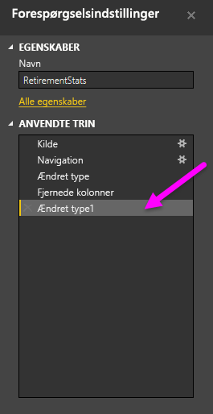

Efterhånden som der anvendes yderligere trin til udformning, hentes de i sektionen **Anvendte trin**.

Det er vigtigt at vide, at de underliggende data *ikke* ændres. I stedet justerer og former Power-forespørgselseditor deres visning af dataene. Den former og justerer også visningen af interaktionen med de underliggende data, der sker på baggrund af Power-forespørgselseditorens formede og ændrede visning af disse data.

I ruden **Indstillinger for forespørgsler** kan du omdøbe trin, slette trin eller ændre rækkefølgen af trinnene efter behov. Det kan du gøre ved at højreklikke på trinnet i sektionen **Anvendte trin** og vælge en indstilling i den menu, der vises. Alle trin i forespørgslen udføres i den rækkefølge, der vises i ruden **Anvendte trin**.

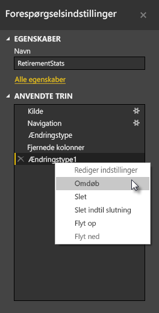

## Avanceret editor
Med **Avanceret editor** kan du se koden, som Power-forespørgselseditor opretter, med hvert trin. Det gør det også muligt for dig at oprette din egen kode til udformning. For at starte den avancerede editor skal du vælge **Vis** på båndet og derefter vælge **Avanceret editor**. Der vises et vindue med den eksisterende forespørgselskode.  
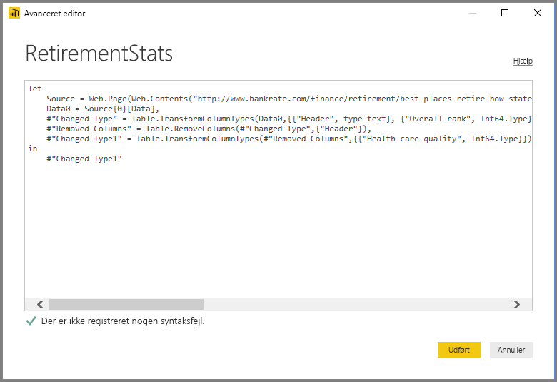

Du kan redigere koden direkte i vinduet **Avanceret editor**. Hvis du vil lukke vinduet, skal du vælge knappen **Udført** eller **Annuller**.  

## Gem dit arbejde
Når din forespørgsel er der, hvor du ønsker det, skal du vælge **Luk og anvend** fra Power-forespørgselseditorens menu **Filer**. Denne handling anvender ændringerne og lukker editoren.  
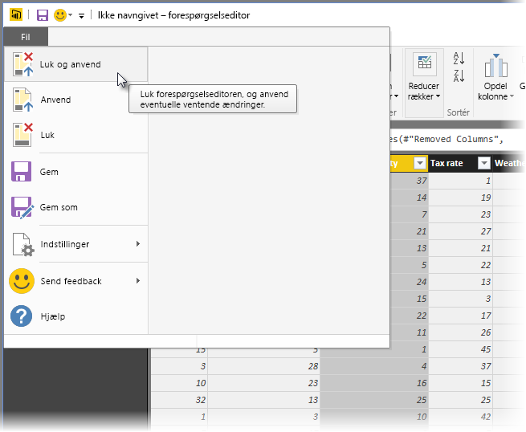

Efterhånden som der sker fremskridt, åbner Power BI Desktop en dialogboks til visning af status.  
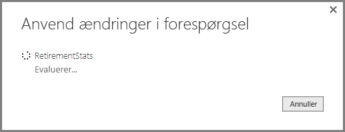

Når du er klar, kan Power BI Desktop gemme dit arbejde i form af en *.pbix*-fil.

Hvis du vil gemme dit arbejde, skal du vælge **Filer** \> **Gem** (elle **Filer** \> **Gem som**), som vist på følgende billede.  
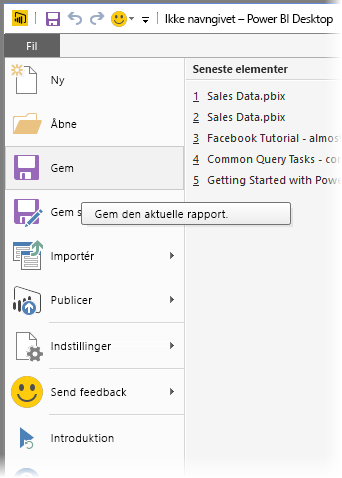

## Næste trin
Du kan gøre mange forskellige ting med Power BI Desktop. Du kan finde flere oplysninger om funktionerne i følgende ressourcer:

* [Hvad er Power BI Desktop?](desktop-what-is-desktop.md)
* [Datakilder i Power BI Desktop](desktop-data-sources.md)
* [Opret forbindelse til data i Power BI Desktop](desktop-connect-to-data.md)
* [Selvstudium: Udform og kombiner data med Power BI Desktop](desktop-shape-and-combine-data.md)
* [Udfør almindelige forespørgselsopgaver i Power BI Desktop](desktop-common-query-tasks.md)   

