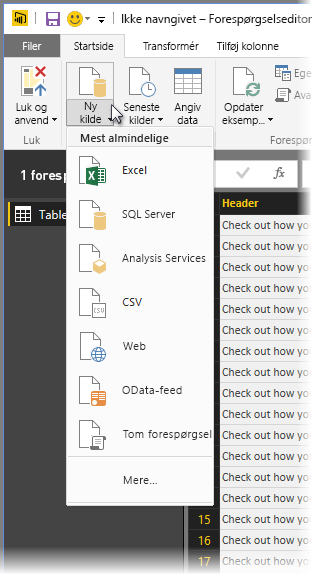

# Oversigt over forespørgsler i Power BI Desktop
Med **Power BI Desktop** kan du oprette forbindelse til alverdens data, oprette overbevisende og grundlæggende rapporter og dele dit arbejde med andre – der derefter kan bygge videre på dit arbejde og udvide deres business intelligence.

Power BI Desktop har tre visninger:

* Visningen **Rapport** – Her kan du bruge forespørgsler, du opretter, til at oprette overbevisende visualiseringer, der kan arrangeres, som du ønsker det, og med flere sider, som du kan dele med andre
* Visningen **Data** – Her vises dataene i din rapport i datamodelformat, hvor du kan tilføje målinger, oprette nye kolonner og administrere relationer
* Visningen **Relationer** – Her kan du få en grafisk repræsentation af de relationer, som er oprettet i din datamodel, og administrere eller ændre dem efter behov.

Du kan åbne disse visninger ved at vælge et af de tre ikoner i venstre side af Power BI Desktop. På følgende billede er rapportvisningen valgt, hvilket kan ses via det gule bånd ud for ikonet.  

Power BI Desktop leveres også med en **forespørgselseditor**, hvor du kan oprette forbindelse til en eller flere datakilder, forme og transformere dataene i forhold til dine behov og derefter indlæse den pågældende model i Power BI Desktop.

Dette dokument giver et overblik over, hvordan du arbejder med data i **forespørgselseditoren**. Der er naturligvis meget mere at lære, så i slutningen af dette dokument kan du finde links til detaljerede retningslinjer om understøttede datatyper, oprettelse af forbindelse til data, udformning data, oprettelse af relationer, og hvordan du kommer i gang.

Men lad os først kigge på **forespørgselseditoren**.

## Forespørgselseditoren
For at få adgang til **forespørgselseditoren** skal du vælge **Rediger forespørgsler** under fanen **Hjem** i Power BI Desktop.  

Hvis der ikke er dataforbindelser, vises **forespørgselseditoren** som en tom rude, der er klar til at modtage data.  

Når der indlæses en forespørgsel, bliver visningen **Forespørgselseditor** mere interessant. Hvis vi opretter forbindelse til følgende webdatakilde, indlæser **forespørgselseditoren** oplysninger om dataene, som du derefter kan begynde at forme.

[*http://www.bankrate.com/finance/retirement/best-places-retire-how-state-ranks.aspx*](http://www.bankrate.com/finance/retirement/best-places-retire-how-state-ranks.aspx)

Her kan du se, hvordan **forespørgselseditoren** vises, når der er oprettet en dataforbindelse:

1. På båndet er mange knapper nu aktive, så der kan kommunikeres med dataene i forespørgslen
2. I venstre rude kan du se forespørgslerne, og her kan de vælges, vises og udformes
3. I den midterste rude vises data fra den valgte forespørgsel. Disse data kan formes
4. Vinduet **Forespørgselsindstillinger** vises. Det indeholder forespørgslens egenskaber og anvendte trin  
   
   

I følgende afsnit vil vi undersøge hvert af disse fire områder – båndet, forespørgselsruden, datavisningen og ruden med indstillinger for forespørgsler.

## Forespørgselsbåndet
Båndet i **forespørgselseditoren** består af fire faner – **Hjem**, **Transformér**, **Tilføj kolonne** og **Vis**.

Fanen **Hjem** indeholder almindelige forespørgselsopgaver, herunder det første trin i en forespørgsel, som er **Hent data.** Du kan se båndet **Hjem** på følgende billede.  

Hvis du vil oprette forbindelse til data og starte processen til oprettelse af forespørgslen, skal du vælge knappen **Hent data**. Der vises en menu med de mest almindelige datakilder.  

Du kan finde flere oplysninger om de tilgængelige datakilder under **Datakilder**. Du kan finde oplysninger om at oprette forbindelse til data, herunder eksempler og trin, under **Opret forbindelse til data**.

Fanen **Transformér** giver adgang til almindelige opgaver til transformering af data, f.eks. tilføjelse eller fjernelse af kolonner, ændring af datatyper, opdeling af kolonner og andre datadrevne opgaver. Du kan se fanen **Transformér** på følgende billede.  

Du kan finde flere oplysninger om transformering af data, herunder eksempler, under **Kombiner og form data**.

Fanen **Tilføj kolonne** indeholder flere opgaver, der er knyttet til tilføjelse af en kolonne, formatering af kolonnedata og tilføjelse af brugerdefinerede kolonner. Du kan se fanen **Tilføj kolonne** på følgende billede.  

Fanen **Vis** på båndet bruges til at slå visning af visse ruder og vinduer til eller fra. Den bruges også til at få vist den avancerede editor. Du kan se fanen **Vis** på følgende billede.  

Det er godt at vide, at mange af de opgaver, der er tilgængelige på båndet, også kan åbnes ved at højreklikke på en kolonne eller andre data i midterste rude.

## Venstre rude
I venstre rude vises antallet af aktive forespørgsler og navnet på forespørgslen. Når du vælger en forespørgsel i venstre rude, vises dataene i midterste rude, hvor du kan forme og transformere dataene efter behov. På følgende billede vises venstre rude med flere forespørgsler.  

## Midterste rude (dataruden)
I den midterste rude, eller dataruden, vises data fra den valgte forespørgsel. Det er her, meget af arbejdet fra forespørgselsvisningen udføres.

På følgende billede vises den webdataforbindelse, der er oprettet tidligere, kolonnen **Samlet resultat** er markeret, og der højreklikkes på sidehovedet for at få vist de tilgængelige menupunkter. Bemærk, at mange af disse menupunkter i genvejsmenuen er de samme som knapperne under fanerne på båndet.  

Når du vælger et menupunkt i en genvejsmenu (eller en knap på båndet), anvender forespørgslen trinnet på dataene og gemmer det som en del af selve forespørgslen. Trinnene registreres i ruden **Indstillinger for forespørgsel** i sekventiel rækkefølge som beskrevet i næste afsnit.  

## Ruden med indstillinger for forespørgsler
Ruden **Indstillinger for forespørgsler** er det sted, hvor alle de trin, der er knyttet til en forespørgsel, vises. På følgende billede afspejler sektionen **Anvendte trin** i ruden **Indstillinger for forespørgsler** f.eks., at vi netop har ændret typen af kolonnen **Overall score**.

Efterhånden som der anvendes yderligere trin til udformning, hentes de i sektionen **Anvendte trin**.

Det er vigtigt at vide, at de underliggende data *ikke* ændres. I stedet justerer og former forespørgselseditoren visningen af dataene, og en eventuel interaktion med de underliggende data sker på baggrund af forespørgselseditorens formede og ændrede visning af de pågældende data.

I ruden **Indstillinger for forespørgsler** kan du omdøbe trin, slette trin eller ændre rækkefølgen af trinnene efter behov. Det kan du gøre ved at højreklikke på trinnet i sektionen **Anvendte trin** og vælge en indstilling i den menu, der vises. Alle trin i forespørgslen udføres i den rækkefølge, der vises i ruden **Anvendte trin**.

## Den avancerede editor
Hvis du vil have vist den kode, som forespørgselseditoren opretter i hvert trin, eller du vil oprette din egen formningskode, kan du bruge den **avancerede editor**. For at starte den avancerede editor skal du vælge **Vis** på båndet og derefter vælge **Avanceret editor**. Der vises et vindue med den eksisterende forespørgselskode.  

Du kan redigere koden direkte i vinduet **Avanceret editor**. Hvis du vil lukke vinduet, skal du vælge knappen **Udført** eller **Annuller**.  

## Gem dit arbejde
Når din forespørgsel er der, hvor du ønsker det, kan du få forespørgselseditoren til at anvende ændringerne af datamodellen i Power BI Desktop og lukke forespørgselseditoren. Det kan du gøre ved at vælge **Luk og anvend** i menuen **Filer** i forespørgselseditoren.  

Efterhånden som der sker fremskridt, åbner Power BI Desktop en dialogboks til visning af status.  

Når du har din forespørgsel der, hvor du ønsker det, eller hvis du bare vil sikre, at dit arbejde er gemt, kan Power BI Desktop gemme dit arbejde i form af en .pbix-fil.

Hvis du vil gemme dit arbejde, skal du vælge **Filer\> Gem** (eller **Filer \> Gem som**), som vist på følgende billede.  

## Næste trin
Du kan gøre mange forskellige ting med Power BI Desktop. Du kan finde flere oplysninger om funktionerne i følgende ressourcer:

* [Kom i gang med Power BI Desktop](desktop-getting-started.md)
* [Datakilder i Power BI Desktop](desktop-data-sources.md)
* [Opret forbindelse til data i Power BI Desktop](desktop-connect-to-data.md)
* [Udform og kombiner data med Power BI Desktop](desktop-shape-and-combine-data.md)
* [Almindelige forespørgselsopgaver i Power BI Desktop](desktop-common-query-tasks.md)   

