# Brug Hurtigmålinger til nemt at udføre almindelige beregninger (funktion til eksempelvisning)
Fra og med udgivelsen af **Power BI Desktop** fra april 2017 kan du bruge **Hurtigmålinger** til hurtigt og nemt at udføre almindelige beregninger. En **Hurtigmåling** kører et sæt DAX-kommandoer i baggrunden (du skal ikke selv skrive DAX-formler – det bliver gjort for dig) baseret på dit input i en dialogboks, hvorefter resultaterne vises i din rapport. Det bedste af det hele er, at du kan se den DAX-formel, der udføres af hurtigmålingen og så enten bruge den eller udvide den med din egen DAX-viden.

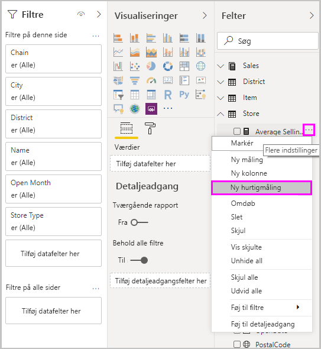

Du kan oprette **hurtigmålinger** ved at højreklikke på et felt under **Felter** og derefter vælge **Ny hurtigmåling**i den viste menu. Du kan også højreklikke på en værdi i ruden **Værdier** for en eksisterende visualisering (for eksempel feltet *Værdier* i visualiseringen *Søjlediagram*). Der er mange kategorier med beregninger, og du kan tilpasse alle beregninger til dine behov.

### Aktivér funktionen Hurtigmåling
Du kan prøve den nye funktion **Hurtigmålinger** fra og med den version af **Power BI Desktop**, der udgives i **april 2017**. Hvis du vil aktivere denne eksempelfunktion, skal du vælge **Fil > Indstillinger > Indstillinger> Funktioner til eksempelvisning** og derefter markere afkrydsningsfeltet ud for **Hurtigmålinger**. Du skal genstarte Power BI Desktop, når du har markeret indstillingen.

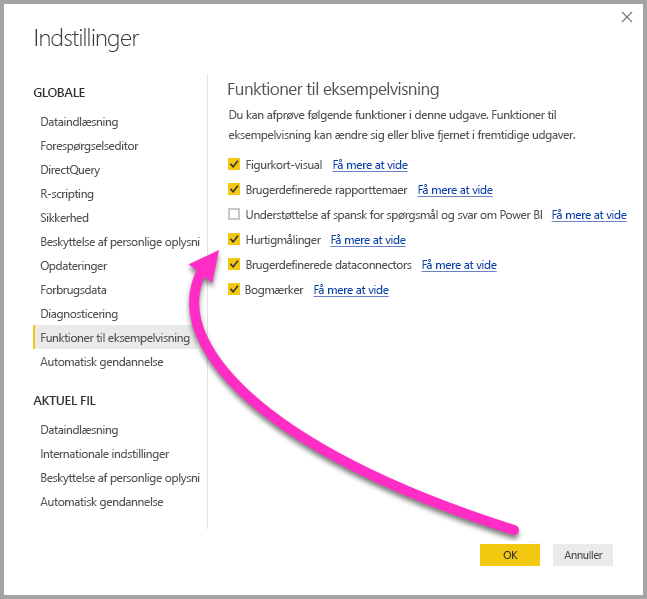

Du skal genstarte **Power BI Desktop**, når du har markeret indstillingen.

## Brug Hurtigmålinger
Du kan oprette en **hurtigmåling** ved at højreklikke på et felt under **Felter** i **Power BI Desktop** og vælge **Ny hurtigmåling** i den viste menu.

**Ny hurtigmåling** vises kun, hvis der er modellering tilgængeligt for det indlæste datasæt. Det betyder, at **Ny hurtigmåling** ikke vises for dynamiske forbindelser, når du højreklikker på listen **Felter**, med undtagelse af dynamiske SSAS-forbindelser. 

Hvis du bruger dynamiske forbindelser med SQL Server Analysis Services (SSAS) vil nogle **hurtigmålinger** være tilgængelige. I **Power BI Desktop** kan du kun se de **hurtigmålinger**, som understøttes for den version af SSAS, der oprettes forbindelse til. Hvis du har oprettet forbindelse til en dynamisk SSAS-datakilde, og nogle **hurtigmålinger** ikke vises på listen, skyldes det, at den version af SSAS, du har oprettet forbindelse til, ikke understøtter den DAX-måling, der bruges til at implementere disse **hurtigmålinger**.

Hvis du vælger **Ny hurtigmåling** ved at dobbeltklikke, åbnes der et vindue, hvor du kan vælge en beregning og de felter, beregningen skal køres for.

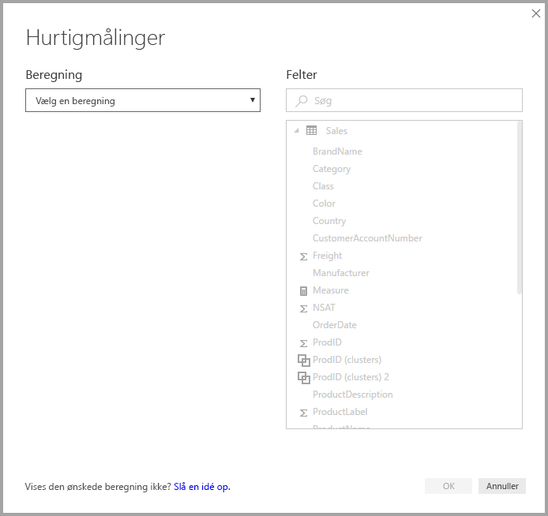

Når du klikker på rullelisten, får du vist en liste med de tilgængelige **hurtigmålinger**.

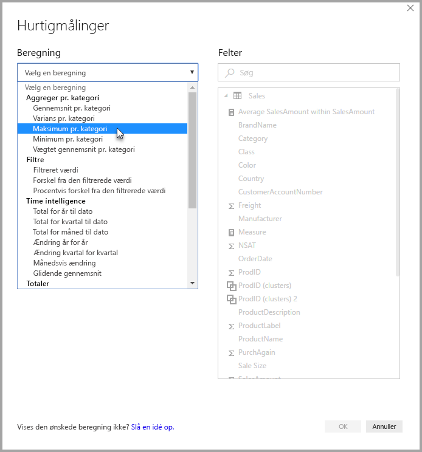

Der er fem særskilte grupper af beregningstyper i hurtigmålinger, som hver indeholder en samling af beregninger. Det er følgende grupper og beregninger:

* **Saml pr. kategori**
  * Gennemsnit pr. kategori
  * Varians pr. kategori
  * Maksimum pr. kategori
  * Minimum pr. kategori
  * Vægtet gennemsnit pr. kategori
* **Filtre**
  * Filtreret måling
  * Forskel fra den filtrerede værdi
  * Procentvis forskel fra den filtrerede værdi
  * Totaler fra nye kategorier
* **Tidsintelligens**
  * Total for år til dato
  * Total for kvartal til dato
  * Total for måned til dato
  * Ændring år for år
  * Ændring kvartal for kvartal
  * Månedsvis ændring
  * Glidende gennemsnit
* **Totaler**
  * Løbende total
  * I alt for kategori (filtre anvendt)
  * I alt for kategori (filtre ikke anvendt)
* **Matematiske funktioner**
  * Tilføjelse
  * Subtraktion
  * Multiplikation
  * Division
  * Procentvis forskel
* **Tekst**
  * Stjerneklassifikation
  * Sammenkædet liste over værdier

Vi forventer at tilføje disse beregninger, og du må meget gerne komme med feedback til, hvilke **hurtigmålinger** du gerne vil se, og hvis du har idéer til **hurtigmålinger** (og underliggende DAX-formler), som du gerne vil indsende til os til overvejelse. Det kan du læse mere om sidst i denne artikel.

## Eksempel på hurtigmålinger
Lad os se på et eksempel med brug af **Hurtigmålinger**.

I denne **Matrix**-visualisering vises der en tabel med salget af forskellige elektronikprodukter. Det er en grundlæggende tabel, der inkluderer totalen for hver kategori.

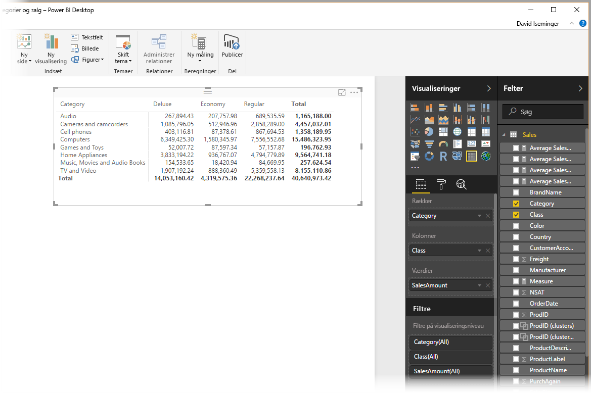

Hvis du højreklikker på feltet **Værdier** og vælger **Ny hurtigmåling**, kan vi vælge *Gennemsnit pr. kategori* som *beregning* og derefter vælge *Sum of SalesAmount* som *basisværdi* og derefter angive *SalesAmount* ved at trække det felt fra *Felter* i højre rude til sektionen *Kategori* til venstre.

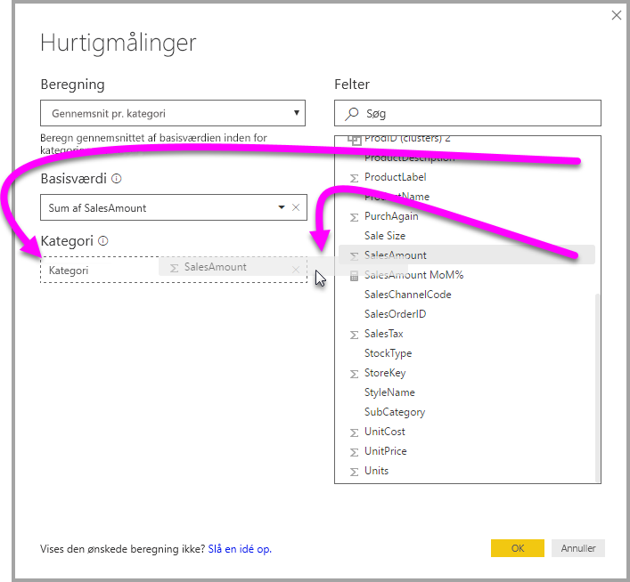

Når du klikker på **OK**, kan du se et par interessante ting som vist i billedet på følgende liste:

1. **Matrix**-visualiseringen indeholder nu en ny kolonne, der viser vores beregning (i dette tilfælde *Average SalesAmount within SalesAmount*).
2. Der er oprettet en ny **måling**, og den findes også under **Felter**, hvor den er fremhævet (Power BI viser en gul ramme om det). Denne måling kan også anvendes i andre visualiseringer i rapporten og ikke kun i den visualisering, hvor den oprindeligt blev oprettet.
3. Den DAX-formel, der blev oprettet for **hurtigmålingen**, vises på formellinjen.

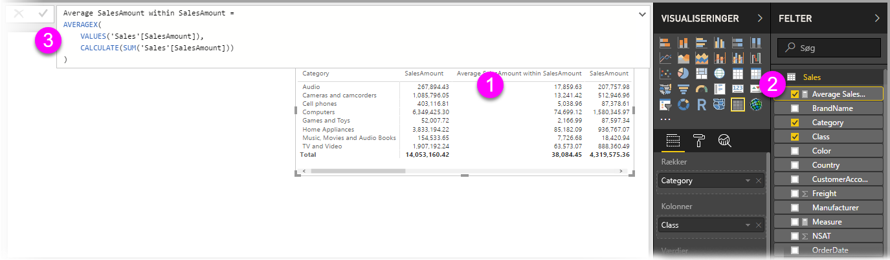

Hvis du vil starte med det første element, skal du bemærke, at **hurtigmålingen** blev anvendt på visualiseringen. Der er en ny kolonne og en associeret værdi. Begge er baseret på den oprettede **hurtigmåling**.

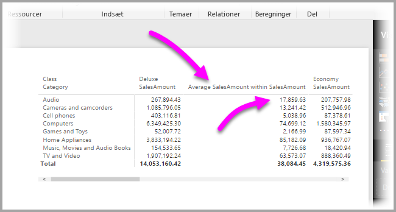

Desuden vises **hurtigmålingen** under **Felter** i datamodellen, og den kan bruges på samme måde som ethvert andet felt i modellen og i enhver anden visualisering. I det følgende billede blev der oprettet en visualisering med et **søjlediagram**  ved hjælp af det nye felt, der blev oprettet med **hurtigmålingen**.

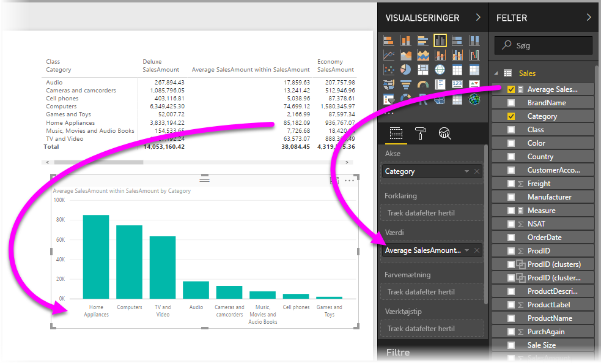

I næste afsnit ser vi nærmere på det tredje element, DAX-formler.

## Lær DAX ved hjælp af hurtigmålinger
En anden stor fordel ved funktionen **Hurtigmålinger** er, at du direkte kan se den DAX-formel, der blev oprettet for at implementere målingen. I det følgende billede har jeg valgt den måling, der blev oprettet af **hurtigmålingen** (den vises nu under **Felter**, så jeg skal blot klikke på den). Når jeg gør det, vises **formellinjen** med den DAX-formel, som Power BI oprettede for at implementere målingen.

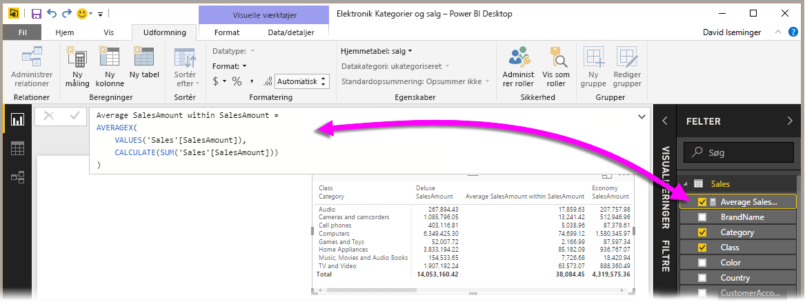

Det er i sig selv praktisk, da det viser den formel, der bruges i målingen. Men det er muligvis endnu mere vigtigt, at du kan bruge **hurtigmålinger** til at se, hvordan de underliggende DAX-formler skal oprettes.

Forestil dig, at du skal udføre en År for år-beregning, men at du ikke er helt sikker på, hvordan du skal strukturere DAX-formlen (eller du måske slet ikke ved, hvor du skal starte). I stedet for at slå hovedet ned i bordet, kan du oprette en **hurtigmåling** ved hjælp af beregningen **Ændring år for år** og se, hvad der sker. Det vil sige, at du kan oprette **hurtigmålingen** og se, hvordan den vises i din visualisering, se, hvordan DAX-formlen virker, og derefter indføre dine ændringer direkte i DAX-formlen eller oprette en anden måling, indtil beregningerne lever op til dine behov eller forventninger.

Det er som at have en lærer, der lynhurtigt svarer på dine Hvad nu hvis-spørgsmål med bare nogle få klik. Du kan til enhver tid slette målingerne fra din model, hvis du ikke synes om dem. Det gør du ved at højreklikke på målingen og vælge **Slet**.

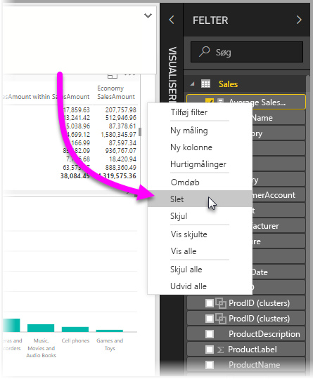

Når du har tilpasset målingen til det ønskede, kan du omdøbe den, som du vil. Det gør du i samme genvejsmenu.

## Begrænsninger og overvejelser
I denne eksempelversion af **Hurtigmålinger** er der nogle få begrænsninger og overvejelser, som du skal huske.

* **Hurtigmålinger** er kun tilgængelige, hvis du kan ændre modellen. Det kan du ikke, hvis du arbejder med DirectQuery eller de fleste typer dynamiske forbindelser (dynamiske SSAS-forbindelser understøttes som beskrevet tidligere).
* Den måling, der blev tilføjet under **Felter**, kan bruges i enhver visualisering i rapporten.
* Du kan til enhver tid se den DAX-formel, der er knyttet til en **hurtigmåling**, ved at vælge den oprettede måling under **Felter** og derefter se formlen på **formellinjen**.

> [!WARNING]
> Hurtigmålinger genererer i øjeblikket *kun* DAX-formler med komma som argumentseparator. Hvis din version af **Power BI Desktop** er oversat til et sprog, hvor der bruges decimalkomma, vil hurtigmålingerne ikke virke korrekt.
> 
> 

### Tidsintelligens og hurtigmålinger
Fra og med den opdatering af **Power BI Desktop**, der udkom i oktober 2017, kan du bruge dine egne brugerdefinerede datotabeller med **hurtigmålinger** under kategorien Tidsintelligens. Hvis din datamodel har en brugerdefineret datotabel, kan du bruge den primære datokolonne i tabellen til hurtigmålinger med tidsintelligens. Du *skal* sikre, at den primære datokolonne i tabellen var markeret som Datotabel, da modellen blev bygget, som det er beskrevet i [denne artikel](https://docs.microsoft.com/sql/analysis-services/tabular-models/specify-mark-as-date-table-for-use-with-time-intelligence-ssas-tabular).

### Yderligere oplysninger og eksempler
Vi forventer at kunne tilbyde eksempler og vejledning til alle beregninger med **hurtigmålinger**, så kom snart tilbage igen for at se mere.

Da denne funktion kun er en **eksempelfunktion**, vil vi sætte stor pris på din feedback og dine idéer.

Har du en idé til en **hurtigmåling**, som der ikke allerede findes? Fantastisk! Gå til [denne side](https://go.microsoft.com/fwlink/?linkid=842906), og indsend dine idéer (og DAX-formler) for den **hurtigmåling**, du gerne vil se i **Power BI Desktop**, så ser vi nærmere på, om den skal med på listen over **hurtigmålinger** i en kommende udgave.

