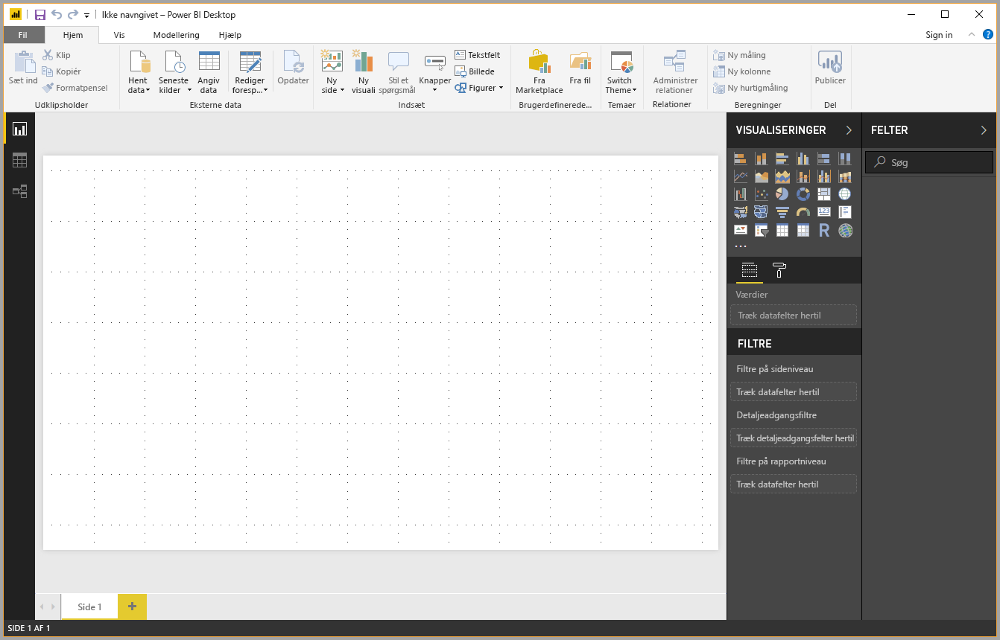
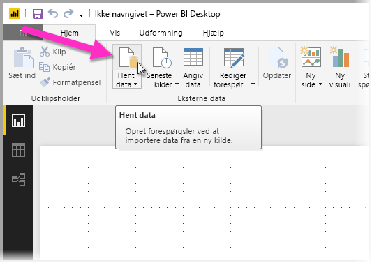
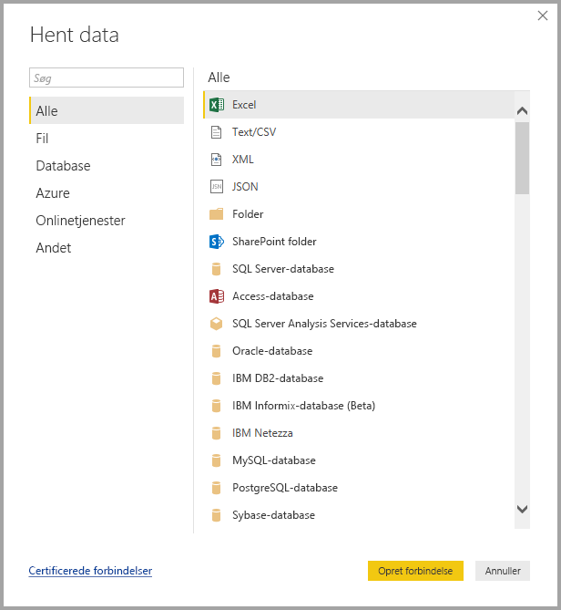
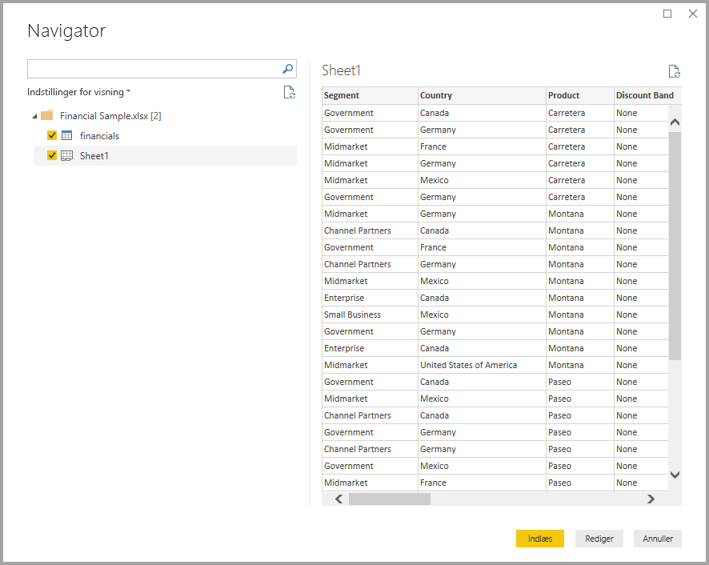
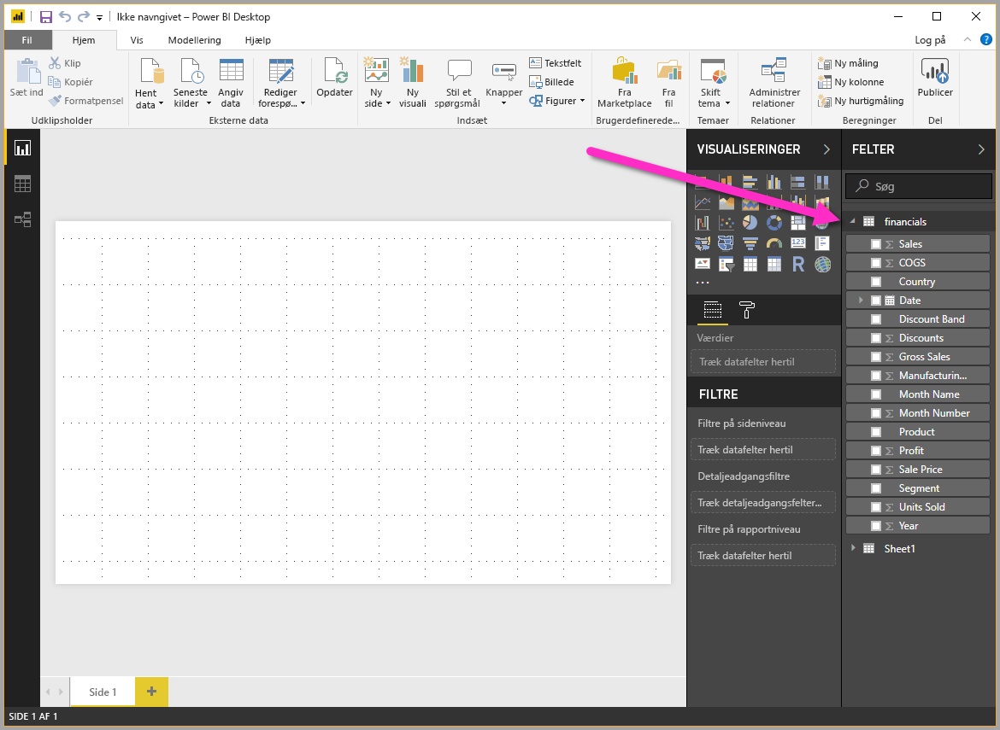

# Hurtig introduktion: Opret forbindelse til data i Power BI Desktop

I denne hurtige introduktion opretter du forbindelse til data ved hjælp af **Power BI Desktop**, som er det første skridt til oprettelse af datamodeller og rapporter.

Hvis du ikke er tilmeldt Power BI, kan du [tilmelde dig en gratis prøveversion](https://app.powerbi.com/signupredirect?pbi_source=web), før du begynder.

## Forudsætninger

Hvis du vil udføre trinnene i denne artikel, skal du gøre følgende:
* Download og installér **Power BI Desktop**, som er et gratis program, der kører på den lokale computer. Du kan [downloade **Power BI Desktop**](https://powerbi.microsoft.com/desktop) direkte, eller du kan hente det i [**Microsoft Store**](http://aka.ms/pbidesktopstore).
* [Download dette eksempel på en Excel-projektmappe](http://go.microsoft.com/fwlink/?LinkID=521962), og opret en mappe med navnet *C:\PBID-qs*, hvor du kan gemme Excel-filen. I efterfølgende trin i denne hurtige introduktion forudsættes det, at dette er filplaceringen for den downloadede Excel-projektmappe.

## Start Power BI Desktop

Når du har installeret **Power BI Desktop**, skal du starte programmet, så det kører på den lokale computer. Du får vist et tomt lærred, hvor du kan oprette visuelle elementer og rapporter ud fra data, du opretter forbindelse til. 

## Opret forbindelse til data

Med **Power BI Desktop** kan du oprette forbindelse til mange forskellige typer data. Du kan oprette forbindelse til grundlæggende datakilder, f.eks. en Microsoft Excel-fil, og du kan oprette forbindelse til onlinetjenester, der indeholder alle mulige forskellige slags data, f.eks. Salesforce, Microsoft Dynamics, Azure Blob Storage og meget mere.

Hvis du vil oprette forbindelse til data, skal du vælge **Hent data** på båndet **Hjem**.

Vinduet **Hent data** vises, og her kan du vælge mellem mange forskellige datakilder, som **Power BI Desktop** kan oprette forbindelse til. I denne hurtige introduktion bruger vi den Excel-projektmappe, som du har downloadet – der er beskrevet i afsnittet *Forudsætninger* i starten af denne artikel.

Da det er en Excel-fil, vælger vi **Excel** i vinduet **Hent data**, og vi vælger derefter knappen **Opret forbindelse**.

Vi bliver bedt om at angive placeringen af den Excel-fil, som vi vil oprette forbindelse til. Den downloadede fil kaldes *Financial Sample* så vi vælger denne fil og vælger derefter **Åbn**.

**Power BI Desktop** indlæser derefter projektmappen og læser indholdet. Derefter får du vist de tilgængelige data i filen ved hjælp af vinduet **Navigator**, hvor du kan vælge, hvilke data der skal indlæses i Power BI Desktop. Du skal vælge tabellerne ved at markere afkrydsningsfeltet ud for de tabeller, du vil importere. I dette tilfælde vil vi importere begge tilgængelige tabeller.

Når du har foretaget dine valg, skal du vælge **Indlæs** for at importere dataene til Power BI Desktop.

## Få vist data i ruden felter

Når du har indlæst tabellerne, vises dataene i ruden **Felter**. Du kan udvide de enkelte tabeller ved at vælge trekanten ud for deres navn. På følgende billede er tabellen *financials* udvidet, så alle felter vises. 

Det var det hele! Du har oprettet forbindelse til data i **Power BI Desktop**, indlæst disse data, og nu kan du se alle de tilgængelige felter i disse tabeller.

## Næste trin

Der er mange forskellige ting, du kan gøre med **Power BI Desktop**, når du har oprettet forbindelse til data, f.eks. oprette visuelle elementer og rapporter. Tag et kig på følgende ressourcer for at komme i gang:

* [Introduktion til Power BI Desktop](desktop-getting-started.md)