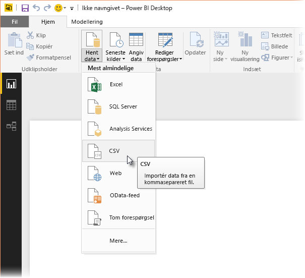
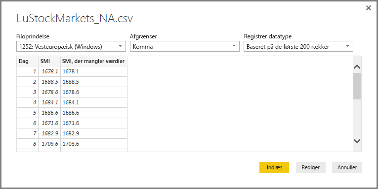
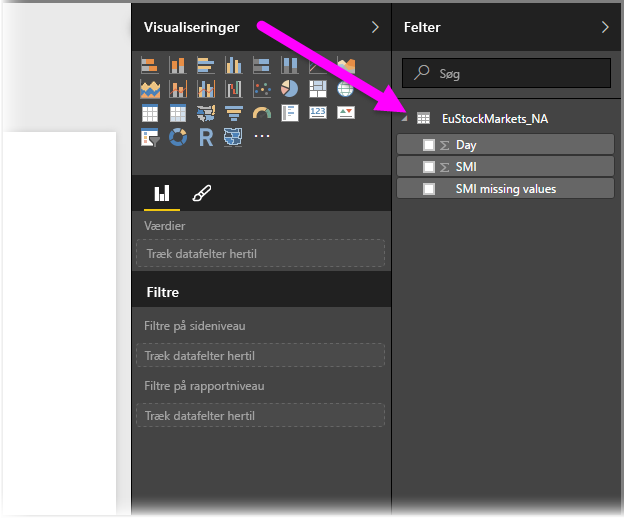
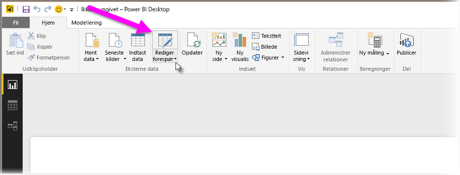
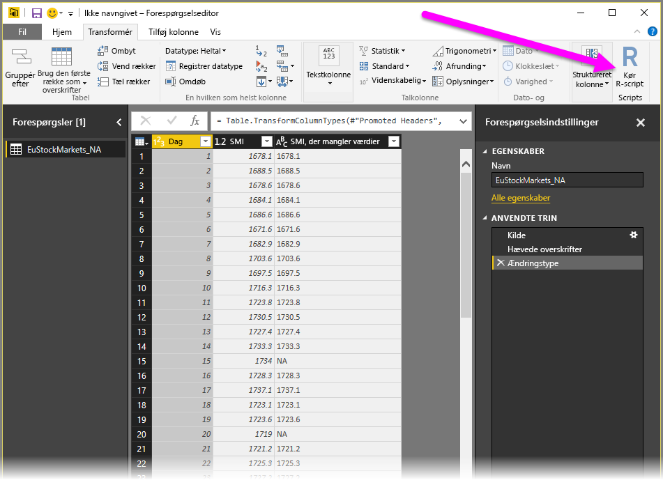
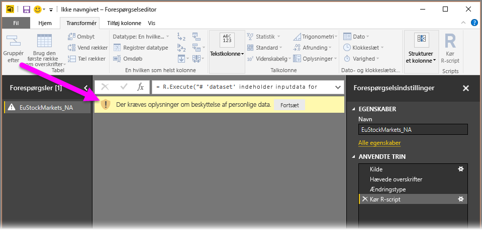
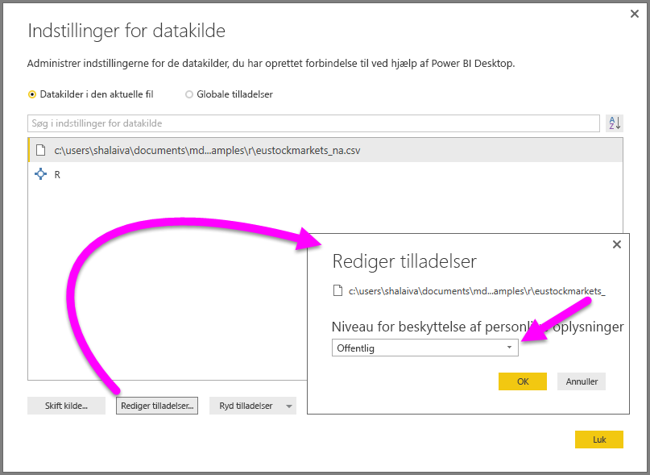

# <a name="use-r-in-query-editor"></a>Brug R i Forespørgselseditor

[**R**](https://mran.microsoft.com/documents/what-is-r) er et effektivt programmeringssprog, som mange statistikere, dataeksperter og dataanalytikere bruger. Du kan bruge **R** i **Forespørgselseditor** i Power BI Desktop til at gøre følgende:

* Forbered datamodeller

* Opret rapporter

* Foretag rensning af data, avanceret dataudformning og analyse af datasæt, hvilket omfatter fuldførelse af manglende data, forudsigelser, klynger og meget mere.  

## <a name="install-r"></a>Installér R

Du kan downloade **R** gratis fra downloadsiden for [Revolution Open](https://mran.revolutionanalytics.com/download/) og [CRAN Repository](https://cran.r-project.org/bin/windows/base/).

### <a name="install-mice"></a>Installér mice

Du skal have installeret [**mice**-biblioteket](https://www.rdocumentation.org/packages/mice/versions/3.5.0/topics/mice) i dit R-miljø. Uden **mice** fungerer eksempelscriptkoden ikke korrekt. Med **mice**-pakken implementeres en metode til at håndtere manglende data.

Sådan installerer du **mice**:

1. Start R.exe-programmet (f.eks. C:\Program Files\Microsoft\R Open\R-3.5.3\bin\R.exe)  

2. Kør installationskommandoen:

   ``` 
   >  install.packages('mice') 
   ```

## <a name="use-r-in-query-editor"></a>Brug R i Forespørgselseditor

For at demonstrere brug af **R** i **Forespørgselseditor** bruger vi et datasæt, der er indeholdt i en .csv-fil, fra aktiemarkedet som eksempel og gennemgår følgende trin:

1. [Download filen **EuStockMarkets_NA.csv**](https://download.microsoft.com/download/F/8/A/F8AA9DC9-8545-4AAE-9305-27AD1D01DC03/EuStockMarkets_NA.csv). Husk, hvor du gemmer den.

1. Indlæs filen i **Power BI Desktop**: På båndet **Start** skal du vælge **Hent data > Tekst/CSV**.

   

1. Vælg filen og derefter **Åbn**. CSV-dataene vises i dialogboksen **Tekst/CSV-fil**.

   

1. Når dataene er indlæst, kan du se dem i ruden **Felter**.

   

1. Hvis du vil åbne **Forespørgselseditor**, skal du på båndet **Start** vælge **Rediger forespørgsler**.

   

1. På båndet **Transformér** skal du vælge **Kør R-script**. Editoren **Kør R-script** vises.  

   Række 15 og 20 mangler data ligesom andre rækker, du ikke kan se på billedet. Fremgangsmåden nedenfor viser, hvordan R udfylder rækkerne for dig.

   

1. I dette eksempel skal du angive følgende scriptkode. Sørg for at erstatte "&lt;Din filsti&gt;" med stien til **EuStockMarkets_NA.csv** på dit lokale filsystem, f.eks. C:/Users/John Doe/Documents/Microsoft/EuStockMarkets_NA.csv

    ```r
       dataset <- read.csv(file="<Your File Path>/EuStockMarkets_NA.csv", header=TRUE, sep=",")
       library(mice)
       tempData <- mice(dataset,m=1,maxit=50,meth='pmm',seed=100)
       completedData <- complete(tempData,1)
       output <- dataset
       output$completedValues <- completedData$"SMI missing values"
    ```

    > [!NOTE]
    > Det kan være nødvendigt at overskrive en variabel kaldet *output* for at oprette det nye datasæt med filtrene anvendt.

7. Når du har trykket på **OK**, vises en advarsel om beskyttelse af personlige data i **Forespørgselseditor**.

   
8. Hvis R-scriptene skal fungere korrekt i Power BI-tjenesten, skal du angive alle datakilder til **offentlige**. Du kan få flere oplysninger om indstillinger for beskyttelse af personlige oplysninger og deres konsekvenser under [Niveauer for beskyttelse af personlige oplysninger](desktop-privacy-levels.md).

   

   Når du har valgt **Gem**, kører scriptet. Bemærk den nye kolonne i ruden **Felter** ved navn **completedValues**. Bemærk, at der mangler et par dataelementer, f.eks. i række 15 og 18. Se, hvordan R håndterer dette, i næste afsnit.

   Med blot fem linjer R-script udfyldte **Forespørgselseditoren** de manglende værdier med en forudsigende model.

## <a name="create-visuals-from-r-script-data"></a>Opret visualiseringer på baggrund af data fra R-scripts

Nu kan vi oprette en visualisering for at se, hvordan R-scriptkoden udfyldte de manglende værdier ved hjælp af biblioteket **mice**, som vist på følgende billede:


Du kan gemme alle fuldførte visualiseringer i én .pbix-fil i **Power BI Desktop** og bruge datamodellen og dens R-scripts i Power BI-tjenesten.

> [!NOTE]
> Du kan [downloade en .pbix-fil](https://download.microsoft.com/download/F/8/A/F8AA9DC9-8545-4AAE-9305-27AD1D01DC03/Complete%20Values%20with%20R%20in%20PQ.pbix) med alle disse trin fuldført.

Når du har uploadet .pbix-filen til Power BI-tjenesten, skal du udføre yderligere trin for at aktivere opdatering af tjenestedata og opdaterede visualiseringer:  

* **Aktivér planlagt opdatering af datasættet** – Hvis du vil aktivere planlagt opdatering af den projektmappe, der indeholder dit datasæt med R-scripts, skal du se [Konfiguration af planlagt opdatering](refresh-scheduled-refresh.md), som også indeholder oplysninger om **Personlig gateway**.

* **Installér den personlige gateway** – Du skal have en **personlig gateway** installeret på den computer, hvor filen og **R** er placeret. Power BI-tjenesten får adgang til den pågældende projektmappe og gengiver alle opdaterede visualiseringer igen. Du kan finde flere oplysninger under [Installér og konfigurerer en personlig gateway](service-gateway-personal-mode.md).

## <a name="limitations"></a>Begrænsninger

Der er nogle begrænsninger til forespørgsler, der indeholder R-scripts, der er oprettet i **Forespørgselseditoren**:

* Alle indstillinger for R-datakilden skal angives til **Offentlige**. Alle andre trin i **Forespørgselseditor** skal også være offentlige. Du henter indstillinger for datakilden ved at vælge **Filer > Indstillinger > Indstillinger for datakilde** i **Power BI Desktop**.

  

  Vælg datakilderne i dialogboksen **Indstillinger for datakilde**, og vælg derefter **Rediger tilladelser...** .  Angiv **Niveau for beskyttelse af personlige oplysninger** til **Offentlig**.

      
* Hvis du vil aktivere en planlagt opdatering af R-visualiseringer eller datasættet, skal du aktivere **Planlagt opdatering** og have en **personlig gateway** installeret på den computer, der indeholder projektmappen og **R**. Du kan få flere oplysninger om begge dele i det forrige afsnit i denne artikel, der indeholder links, så du kan få mere at vide.

Du kan lave alle mulige forskellige ting med R og brugerdefinerede forespørgsler, så udforsk og form dine data, som du gerne vil have, at de skal vises.

## <a name="next-steps"></a>Næste trin

* [Introduktion til R](https://mran.microsoft.com/documents/what-is-r) 

* [Kør R-scripts i Power BI Desktop](desktop-r-scripts.md) 

* [Brug en ekstern R-IDE med Power BI](desktop-r-ide.md) 

* [R-pakker i Power BI-tjenesten](service-r-packages-support.md)
