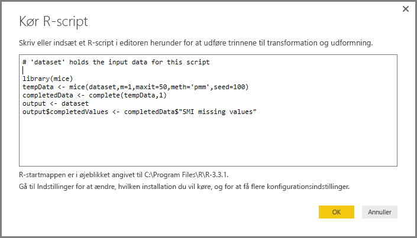

# Brug af R i forespørgselseditoren
Du kan bruge **R**, som er et programmeringssprog, der bruges af statistikere, datavidenskabsfolk og dataanalytikere, i **forespørgselseditoren** i Power BI Desktop. Denne integration af R i **forespørgselseditoren** gør det muligt at udføre datarensning ved hjælp af R og udføre avanceret dataudformning og -analyser i datasæt, herunder fuldførelse af manglende data, forudsigelser og klyngedannelse, blot for at nævne nogle få. **R** er et effektivt sprog og kan bruges i **forespørgselseditoren** til at forberede din datamodel og oprette rapporter.

## Installation af R
Hvis du vil bruge **R** i Power BI Desktops **forespørgselseditor**, skal du installere **R** på din lokale maskine. Du kan downloade og installere **R** gratis fra mange forskellige steder, herunder [downloadsiden for Revolution Open](https://mran.revolutionanalytics.com/download/) og [CRAN Repository](https://cran.r-project.org/bin/windows/base/).

## Brug af R i forespørgselseditoren
Vi viser, hvordan du bruger **R** i **forespørgselseditoren** ved at bruge et eksempel fra et aktiemarkeddatasæt, der er baseret på en CSV-fil, som du kan [hente herfra](http://download.microsoft.com/download/F/8/A/F8AA9DC9-8545-4AAE-9305-27AD1D01DC03/EuStockMarkets_NA.csv) og efterfølgende benytte. Fremgangsmåden i dette eksempel er følgende:

1. Først skal du indlæse data i **Power BI Desktop**. I dette eksempel skal filen *EuStockMarkets_NA.csv* indlæses. Vælg **Hent data > CSV** på båndet **Hjem** i **Power BI Desktop**.
   
   
2. Vælg filen, og vælg **Åbn**, hvorefter CSV-filen vises i dialogboksen **CSV-fil**.
   
   
3. Når dataene er indlæst, vises de i ruden **Felter** i Power BI Desktop.
   
   
4. Åbn **Forespørgselseditor** ved at vælge **Rediger forespørgsler** på fanen **Hjem** i **Power BI Desktop**.
   
   
5. På fanen **Transformér** skal du vælge **Kør R-script**, hvorefter editoren **Kør R-script** vises (vises i næste trin). Bemærk, at der mangler data i række 15 og 20 på samme måde som i andre rækker, som du ikke kan se på det følgende billede. Fremgangsmåden nedenfor viser, hvordan R kan udfylde rækkerne for dig.
   
   
6. I dette eksempel skal du indtaste følgende scriptkode:
   
       library(mice)
       tempData <- mice(dataset,m=1,maxit=50,meth='pmm',seed=100)
       completedData <- complete(tempData,1)
       output <- dataset
       output$completedValues <- completedData$"SMI missing values"
   
   > [!NOTE]
   > Biblioteket *mice* skal være installeret i R-miljøet, hvis den forrige scriptkode skal fungere korrekt. Du installerer mice ved at køre følgende i R-installationen: |      > install.packages('mice')
   > 
   > 
   
   Når koden indsættes i dialogboksen **Kør R-script**, ser den ud på følgende måde:
   
   
7. Når vi vælger **OK**, vises en advarsel om beskyttelse af personlige data i **Forespørgselseditoren**.
   
   
8. Hvis R-scriptene skal fungere korrekt i Power BI-tjenesten, skal alle datakilder være angivet til *offentlige*. Du kan få flere oplysninger om indstillinger for beskyttelse af personlige oplysninger og deres konsekvenser under [Niveauer for beskyttelse af personlige oplysninger](desktop-privacy-levels.md).
   
   
   
   Når du har gjort det, kan du se en ny kolonne i **Felter** ved navn *completedValues*. Bemærk, at der mangler et par dataelementer, f.eks. i række 15 og 18. Vi kan se, hvordan R håndterer dette, i næste afsnit.
   

Med blot fem linjer R-script udfyldte **Forespørgselseditoren** de manglende værdier med en forudsigende model.

## Oprettelse af visuelle elementer fra R-scriptdata
Nu kan vi oprette et visuelt element for at se, hvordan R-scriptkoden udfyldte de manglende værdier ved hjælp af biblioteket *mice*, som vist på følgende billede.

Når dette visuelle element er fuldført på samme måde som andre visuelle elementer, som vi muligvis vil oprette med **Power BI Desktop**, kan du gemme **Power BI Desktop**-filen (som gemmes som en PBIX-fil) og derefter bruge datamodellen, herunder de R-scripts, der er en del af modellen, i Power BI-tjenesten.

> [!NOTE]
> Vil du gerne se, hvordan en udført PBIX-fil ser ud, når disse trin er fuldført? Det er ikke noget problem – du kan hente den fuldførte **Power BI Desktop**-fil, der bruges i eksemplerne, [lige her](http://download.microsoft.com/download/F/8/A/F8AA9DC9-8545-4AAE-9305-27AD1D01DC03/Complete Values with R in PQ.pbix).
> 
> 

Når du har overført PBIX-filen til Power BI-tjenesten, er der et par trin mere, der er nødvendige for at aktivere opdatering af data (i tjenesten) og aktivere, at visuelle elementer opdateres i tjenesten (dataene skal have adgang til R, for at de visuelle elementer kan blive opdateret). De ekstra trin er følgende:

* **Aktivér planlagt opdatering af datasættet** – hvis du vil aktivere planlagt opdatering af den projektmappe, der indeholder dit datasæt med R-scripts, skal du se [Konfiguration af planlagt opdatering](refresh-scheduled-refresh.md), som også indeholder oplysninger om **Personlig gateway**.
* **Installér den personlige Gateway** – du skal installere en **personlig gateway** på maskinen dér, hvor filen er placeret, og hvor R er installeret. Power BI-tjenesten skal kunne få adgang til denne projektmappe og gengive de visuelle elementer, der måtte være blevet opdateret. Du kan få flere oplysninger om, hvordan du [installerer og konfigurerer en personlig gateway](personal-gateway.md).

## Begrænsninger
Der er nogle begrænsninger til forespørgsler, der indeholder R-scripts, der er oprettet i **Forespørgselseditoren**:

* Alle R-indstillinger for datakilde for skal være angivet til *offentlige*, og alle andre trin i en forespørgsel, der er oprettet i **Forespørgselseditoren**, skal også være offentlige. Du henter indstillinger for datakilde ved at vælge **Fil > Indstillinger og Indstillinger > Indstillinger for datakilde** i **Power BI Desktop**.
  
  
  
  I dialogboksen **Indstillinger for datakilde** skal du markere datakilden/-kilderne, og derefter vælge **Rediger tilladelser...**  og sørge for, at **Niveauet for beskyttelse af personlige oplysninger** er angivet til *Offentlig*.
  
      
* Hvis du vil aktivere planlagt opdatering af dine visuelle R-elementer eller datasættet, skal du aktivere **Planlagt opdatering** og have en **personlig gateway** installeret på den computer, der indeholder projektmappen og R-installationen. Du kan få flere oplysninger om begge dele i det forrige afsnit i denne artikel, der indeholder links, så du kan få mere at vide.

Du kan lave alle mulige forskellige ting med R og brugerdefinerede forespørgsler, så udforsk og form dine data, som du gerne vil have, at de skal vises.

