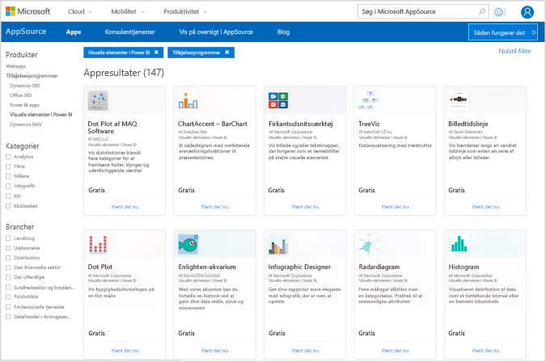
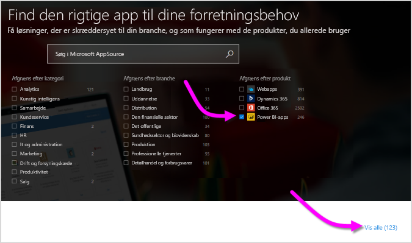
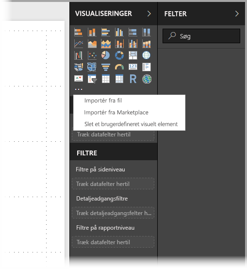
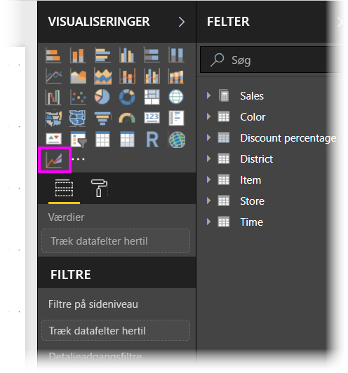
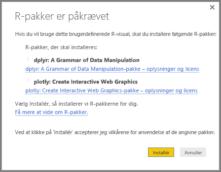
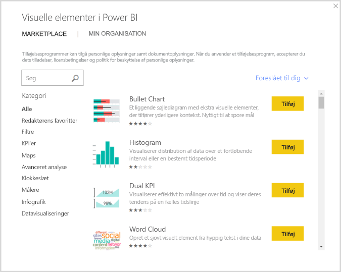

# Brug R-drevne brugerdefinerede visuelle elementer i Power BI
I **Power BI Desktop** og **Power BI-tjenesten** kan du bruge R-drevne brugerdefinerede visuals uden at have kendskab til R og uden et R-script. Det giver dig mulighed for at udnytte den analytiske og visuelle kraft i visuelle R-elementer og R-scripts uden at skulle lære R eller programmere.

Hvis du vil bruge R-drevne, brugerdefinerede, visuelle elementer, vælger og downloader du først det brugerdefinerede, visuelle R-element, som du ønsker at bruge, fra galleriet [ **AppSource** ](https://appsource.microsoft.com/marketplace/apps?product=power-bi-visuals&page=1) med **brugerdefinerede visuelle elementer** til Power BI.

I de følgende afsnit beskrives det, hvordan du vælger, indlæser og bruger R-drevne visuelle elementer i **Power BI Desktop**.

## Brug brugerdefinerede, visuelle R-elementer
Hvis du vil bruge brugerdefinerede R-drevne visuals, skal du downloade hver enkelte visual fra biblioteket med **brugerdefinerede visuals** og derefter bruge det pågældende visual som enhver anden type visual i **Power BI Desktop**. Der er to måder, hvorpå du kan få brugerdefinerede visuals – du kan downloade dem fra webstedet **AppSource**, eller du kan søge i og få dem inde fra **Power BI Desktop**. 

### Hent brugerdefinerede visuelle elementer fra AppSource

Her er den fremgangsmåde, du skal benytte for at gennemse og vælge visuals på webstedet **AppSource**:

1. Gå til biblioteket med visuals i Power BI, som du finder på [https://appsource.microsoft.com](https://appsource.microsoft.com/). Markér afkrydsningsfeltet *Power BI apps* under *Afgræns efter produkt*, og vælg derefter linket **Se alle**.
   
   

2. Vælg [Brugerdefinerede visuals i Power BI](https://appsource.microsoft.com/marketplace/apps?product=power-bi-visuals&page=1) på bibliotekssiden **Brugerdefinerede visuals i Power BI** på listen over tilføjelsesprogrammer i venstre rude.

   

3. Vælg det **visuelle element**, som du er interesseret i at bruge, fra galleriet. Derefter sendes du videre til en side, som beskriver det visuelle element. Tryk på knappen **Hent det nu** for at downloade.
   
   > [!NOTE]
    > For at kunne redigere i **Power BI Desktop** skal du have R installeret på din lokale computer. Men når brugere vil have vist et R-drevet visual i **Power BI-tjenesten**, behøver de ikke at have R installeret lokalt.
   > 
   > 
   
   
   
   Du behøver ikke at installere R for at bruge R-drevne, brugerdefinerede, visuelle elementer i **Power BI-tjenesten**, men hvis du vil bruge R-drevne, brugerdefinerede, visuelle elementer i **Power BI Desktop**, *skal* du installere R på den lokale computer. Du kan downloade R fra følgende steder:
   
   * [CRAN](https://cran.r-project.org/)
   * [MRO](https://mran.microsoft.com/)

4. Når det pågældende visual er downloadet (hvilket svarer til at downloade enhver anden fil via din browser), skal du gå til **Power BI Desktop** og klikke på ellipsen (...) i ruden **Visualiseringer** og vælge **Importér fra fil**.
   
   
5. Du bliver advaret om at importere et brugerdefineret visuelt element som vist på følgende billede:
   
   
6. Gå til den placering, hvor visualiseringsfilen blev gemt, og vælg derefter filen. Brugerdefinerede **Power BI Desktop**-visualiseringer har filtypenavnet .pbiviz.
   
   
7. Når du går tilbage til Power BI Desktop, kan du se den nye visualiseringstype i ruden **Visualiseringer**.
   
   
8. Når du importerer det nye visuelle element (eller åbner en rapport, der indeholder et R-drevet brugerdefineret visuelt element), installerer **Power BI Desktop** de påkrævede R-pakker.
   
   

9. Herfra kan du tilføje data til det visuelle element på samme måde som med andre visuelle **Power BI Desktop**-elementer. Når du er færdig, kan du se dine afsluttede visuelle elementer på lærredet. I det følgende visuelle element blev det R-drevne visuelle element **Prognose** brugt sammen med Forenede Nationers (FN) forudsigelser af fødselshyppighed (det visuelle element til venstre).

    

    Som ethvert andet visuelt **Power BI Desktop**-element kan du udgive denne rapport med dens R-drevne visuelle elementer til **Power BI-tjenesten** og dele den med andre.

    Besøg biblioteket ofte - der tilføjes nye visuelle elementer hele tiden.

### Importér brugerdefinerede visuelle elementer fra **Power BI Desktop**

1. Du kan også importere brugerdefinerede visuelle elementer fra **Power BI Desktop**. I **Power BI Desktop** skal du klikke på ellipsen (...) i ruden **Visualiseringer** og vælge **Importér fra Marketplace**.
   
   

2. Når du gør det, åbnes dialogboksen **Brugerdefinerede visuals i Power BI**, hvor du kan rulle gennem de brugerdefinerede visuals, som er til rådighed, og vælge det, du kan lide. Du kan søge efter navn, vælge en kategori eller blot rulle gennem de tilgængelige visuelle elementer. Når du er klar, skal du blot vælge **Tilføj** for at føje det brugerdefinerede, visuelle element til **Power BI Desktop**.

   

## Bidrag med R-drevne brugerdefinerede visuelle elementer
Hvis du opretter dine egne visuelle R-elementer i dine rapporter, kan du dele dem globalt ved at bidrage med dine brugerdefinerede, visuelle elementer til **galleriet med brugerdefinerede visuelle elementer**. Bidrag er oprettet via GitHub, og processen er beskrevet på følgende placering:

* [Bidrag til galleriet med R-drevne, brugerdefinerede, visuelle elementer](https://github.com/Microsoft/PowerBI-visuals#building-r-powered-custom-visual-corrplot)

## Fejlfinding i R-drevne, brugerdefinerede visuelle elementer
R-drevne, brugerdefinerede, visuelle elementer har visse afhængigheder, der skal opfyldes, før de visuelle elementer fungerer korrekt. Når R-drevne, brugerdefinerede, visuelle elementer ikke kører eller indlæses korrekt, er problemet normalt et af følgende:

* Programmet R mangler
* Fejl i R-scriptet, som det visuelle element er baseret på
* R-pakker mangler eller er forældede

I følgende afsnit beskrives de fejlfindingstrin, som du kan gennemgå for at afhjælpe de problemer, der måtte opstå.

### Manglende eller forældede R-pakker
Når du forsøger at installere et R-drevet visuelt element, kan der opstå fejl, når der findes manglende eller forældede R-pakker. Årsagen er normalt en af følgende:

* R-installationen er ikke kompatibel med R-pakken
* Firewallen, antivirussoftwaren eller proxyindstillingerne forhindrer R i at oprette forbindelse til internettet
* Internetforbindelsen er langsom, eller der er et problem med internetforbindelsen

Power BI-teamet arbejder aktivt på at mindske disse problemer, før de opstår hos dig, og den næste Power BI Desktop omfatter opdateringer, der har til formål at løse disse problemer. Indtil da kan du prøve en af de følgende løsninger for at afhjælpe problemerne:

1. Fjern det brugerdefinerede visuelle element, og installer det derefter igen. Dette starter en ny installation af R-pakkerne.
2. Hvis din installation af R ikke er aktuel, skal du opgradere din R-installation og derefter fjerne/geninstallere det brugerdefinerede visual som beskrevet i det forrige trin.
   
   Understøttede R-versioner er angivet i beskrivelsen af hvert R-drevne brugerdefinerede visuelle element, som vist på følgende billede.
   
     
     > [!NOTE]
    > Du kan beholde den oprindelige R-installation og kun knytte Power BI Desktop til den aktuelle version, som du installerer. Gå til **Fil > Indstillinger > Indstillinger > R scripting**.
    >
    >
3. Installer R-pakker manuelt vha. en R-konsol. Fremgangsmåden er følgende:
   
   a.  Download installationsscriptet for det R-drevne visual, og gem filen på et lokalt drev.
   
   b.  Fra R-konsollen skal du køre følgende:
   
       > source(“C:/Users/david/Downloads/ScriptInstallPackagesForForecastWithWorkarounds.R”)    
   
   Typiske standardinstallationsplaceringer er følgende:
   
       c:\Program Files\R\R-3.3.x\bin\x64\Rterm.exe (for CRAN-R)
       c:\Program Files\R\R-3.3.x\bin\x64\Rgui.exe (for CRAN-R)
       c:\Program Files\R\R-3.3.x\bin\R.exe (for CRAN-R)
       c:\Program Files\Microsoft\MRO-3.3.x\bin\R.exe (for MRO)
       c:\Program Files\Microsoft\MRO-3.3.x\bin\x64\Rgui.exe (for MRO)
       c:\Program Files\RStudio\bin\rstudio.exe (for RStudio)
4. Hvis de foregående trin ikke fungerer, kan du prøve følgende:
   
   a. Brug **R Studio**, og følg de trin, der er beskrevet i 3.b. ovenfor (kør scriptlinjen fra R-konsollen).
   
   b. Hvis det forrige trin ikke virker, kan du ændre **Værktøjer > Globale indstillinger > Pakker** i **R Studio**, markere afkrydsningsfeltet for **Brug Internet Explorer bibliotek/proxy for HTTP** og derefter gentage trin 3.b. fra trinnene ovenfor.

## De næste trin
Du kan finde yderligere oplysninger om R i Power BI i følgende artikler.

* [Galleri med brugerdefinerede, visuelle Power BI-elementer](https://app.powerbi.com/visuals/)
* [Kørsel af R-scripts i Power BI Desktop](desktop-r-scripts.md)
* [Opret visuelle R-elementer i Power BI Desktop](desktop-r-visuals.md)
* [Brug en ekstern R-IDE med Power BI](desktop-r-ide.md)

