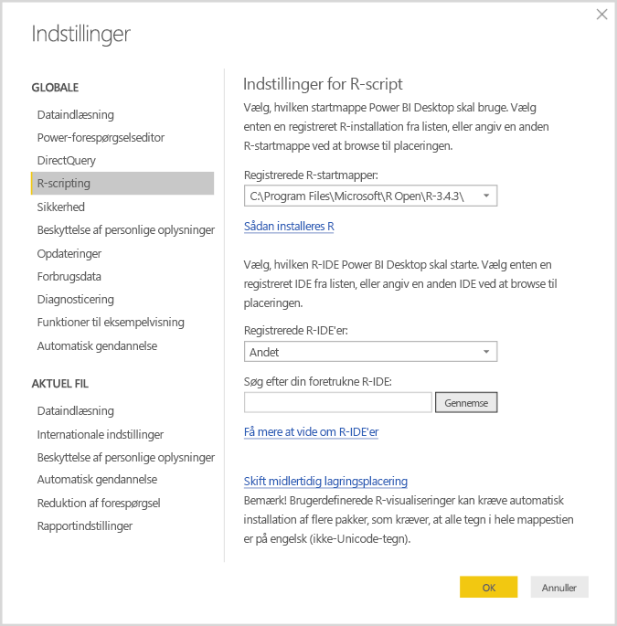
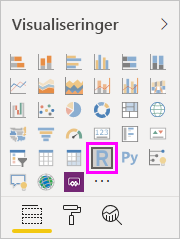
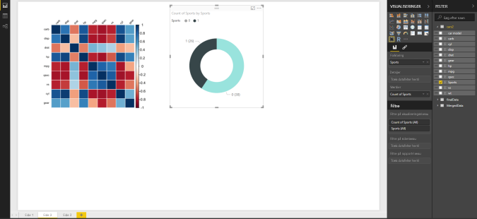
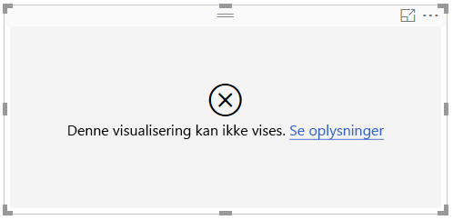

# Opret Power BI-visualiseringer ved hjælp af R
Med **Power BI Desktop** kan du bruge **R** til at visualisere dine data.

## Installér R
**Power BI Desktop** indeholder ikke **R**-programmet, og det udrulles og installeres ikke i forbindelse med Power BI Desktop. Hvis du vil køre R-scripts i **Power BI Desktop**, skal du installere **R** separat på din lokale computer. Du kan downloade og installere **R** gratis fra mange forskellige steder, herunder [downloadsiden for Revolution Open](https://mran.revolutionanalytics.com/download/) og [CRAN Repository](https://cran.r-project.org/bin/windows/base/). Den aktuelle version af R-script i **Power BI Desktop** understøtter Unicode-tegn og mellemrum (tomme tegn) i installationsstien.

## Aktivér visualiseringer med R
Du aktiverer R-visualiseringer ved at vælge **Fil > Indstillinger > Indstillinger**, og på den viste side **Indstillinger** skal du sørge for, at din lokale R-installation er angivet i sektionen **R-script** i vinduet **Indstillinger**, som vist på følgende billede. På følgende billede er installationsstien for R **C:\Program Files\R\R-3.2.0**, og denne sti angives eksplicit i tekstfeltet. Sørg for, at den viste sti korrekt afspejler den lokale R-installation, som skal bruges af **Power BI Desktop**.
   
   

Når du har angivet R-installationen, er du klar til at oprette R-visualiseringer.

## Opret R-visualiseringer i Power BI Desktop
1. Vælg ikonet **R-visualisering** i ruden **Visualisering**, som vist på følgende billede, for at tilføje en R-visualisering.
   
   

   Når du føjer en R-visualisering til en rapport, sker der følgende i **Power BI Desktop**:
   
   - Der vises en pladsholder for R-visualiseringen på rapportcanvasset.
   
   - **R-scripteditoren** vises nederst i den midterste rude.
   
   

2. Føj derefter de felter, du vil bruge i R-scriptet, til sektionen **Værdier** i brønden **Felter** på samme måde som med alle andre **Power BI Desktop**-visualiseringer. 
    
    Kun de felter, der er føjet til området **Felter**, er tilgængelige i R-scriptet. Du kan tilføje nye felter eller fjerne unødvendige felter i området **Felter**, mens du arbejder med R-scriptet i **R-scripteditoren til Power BI Desktop**. Det registreres automatisk i **Power BI Desktop**, hvilke felter du har tilføjet eller fjernet.
   
   > [!NOTE]
   > Standardsammenlægningstypen for R-visualiseringer er *Opsummer ikke*.
   > 
   > 
   
3. Du kan nu bruge de valgte data til at oprette en afbildning. 

    I takt med at du vælger felter, genererer **R-scripteditoren** understøttende bindingskode for R-scriptet baseret på dine valg i den grå sektion øverst i editorruden. I takt med at du vælger eller fjerner flere felter, genereres eller fjernes der tilsvarende automatisk understøttende kode i R-scripteditoren.
   
   I det viste eksempel på følgende billede er tre felter valgt: hp, gear og drat. Som resultat af disse valg genererer R-scripteditoren følgende bindingskode:
   
   * En dataramme kaldet **dataset** blev oprettet
     * Denne dataramme består af de forskellige felter, brugeren har valgt
   * Standardsammenlægningen er *Opsummer ikke*
   * På samme måde som med tabelvisualiseringer grupperes felter, og duplikerede rækker vises kun én gang
   
   
   
   > [!TIP]
   > I nogle tilfælde ønsker du måske ikke automatisk gruppering, eller du vil måske have alle rækker vist, inklusive dubletter. I disse tilfælde kan du føje et indeksfelt til dit datasæt, hvilket medfører, at alle rækker opfattes som værende entydige, og gruppering derfor forhindres.
   > 
   > 
   
   Den genererede dataramme kaldes et **dataset**, og der kan opnås adgang til udvalgte kolonner ved hjælp af deres respektive navne. Du kan for eksempel få adgang til feltet gear ved at skrive *dataset$gear* i R-scriptet. Brug enkelt anførselstegn i forbindelse med felter, der indeholder mellemrum eller specialtegn.

4. Idet datarammen genereres automatisk ved hjælp af de felter, du har valgt, kan du skrive et R-script, der resulterer i afbildning på R-standardenheden. Når scriptet er fuldført, skal du vælge **Kør** på titellinjen i **R-scripteditoren** (**Kør** er i højre side af titellinjen).
   
    Når du vælger **Kør**, identificeres afbildningen i **Power BI Desktop**, og den præsenteres på canvasset. Eftersom processen udføres på din lokale R-installation, skal du kontrollere, at alle påkrævede pakker er installeret.
   
   Visualiseringen afbildes igen i **Power BI Desktop**, når en eller flere af følgende hændelser opstår:
   
   * Når du vælger **Kør** på titellinjen i **R-scripteditoren**
   * Når data ændres pga. opdatering, filtrering eller fremhævning af data

    På følgende billede vises et eksempel på den tilsvarende afbildningskode, og korrelationen mellem forskellige biltypers egenskaber afbildes.

    

5. Hvis du vil have en større visning af visualiseringerne, kan du minimere **R-scripteditoren**. Som med alle andre visualiseringer i **Power BI Desktop** kan du filtrere på tværs af afbildningen af korrelationen ved kun at vælge sportsvogne i kransevisualiseringen (den runde visualisering til højre på eksempelbilledet ovenfor).

    

6. Du kan også ændre R-scriptet for at tilpasse visualiseringen og benytte dig af effektiviteten i R ved at føje parametre til kommandoen for afbildningen.

    Den oprindelige kommando for afbildning var følgende:

    corrplot(M, method = "color",  tl.cex=0.6, tl.srt = 45, tl.col = "black")

    Med nogle få ændringer i R-scriptet er kommandoen nu følgende:

    corrplot(M, method = "circle", tl.cex=0.6, tl.srt = 45, tl.col = "black", type= "upper", order="hclust")

    Som et resultat heraf afbildes der nu cirkler i R-visualiseringen, det er kun den øverste halvdel, der er inkluderet, og matrixen til klyngeopdeling af egenskaberne omarrangeres, som vist på følgende billede.

    

    Ved udførelse af et R-script, der resulterer i en fejl, afbildes R-visualiseringen ikke, og der vises en fejlmeddelelse på canvasset. Du kan få flere oplysninger om fejlen ved at vælge **Se detaljer** i fejlmeddelelsen på canvasset i R-visualiseringen.

    

    > **Sikkerhed i forbindelse med R-scripts:** R-visualiseringer oprettes på baggrund af R-scripts, som kan indeholde kode, der udgør en sikkerhedsrisiko eller en risiko for dine personlige oplysninger. Første gang en bruger forsøger at få vist eller interagere med en R-visualisering, vises en sikkerhedsadvarsel. Du skal kun aktivere R-visualiseringer, hvis du har tillid til forfatteren og kilden, eller når du har gennemset og forstået R-scriptet.
    > 
    > 

## Kendte begrænsninger
Der er nogle få begrænsninger for R-visualiseringer i **Power BI Desktop**:

* Begrænsninger for datastørrelse – Data, der bruges af R-visualiseringen til afbildning, er begrænset til 150.000 rækker. Hvis der er valgt flere end 150.000 rækker, bruges kun de øverste 150.000 rækker, og der vises en meddelelse på billedet.
* Begrænsning af beregningstid – hvis en beregning af en R-visualisering overskrider fem minutter, opstår der timeout for udførelsen, hvilket medfører en fejl.
* Relationer – På samme måde som med andre Power BI Desktop-visualiseringer opstår der en fejl, hvis der vælges datafelter fra forskellige tabeller, hvor der ikke er defineret en relation.
* R-visualiseringer opdateres, når data opdateres, filtreres eller fremhæves. Selve billedet er dog ikke interaktivt og må ikke være kilden til tværgående filtrering.
* R-visualiseringer reagerer på fremhævning af andre visualiseringer, men du kan ikke klikke på elementer i R-visualiseringen for at filtrere på tværs af andre elementer.
* Det er kun afbildninger, der afbildes på den R-enhed, som bruges til standardvisning, der vises korrekt på canvasset. Undgå at bruge en anden R-enhed til visning.
* I denne udgivelse identificeres RRO-installationer ikke automatisk i 32-bit versionen af Power BI Desktop, så du skal manuelt angive stien til R-installationsmappen under **Indstillinger > Indstillinger > R-script**.

## Næste trin
Du kan finde yderligere oplysninger om R i Power BI i følgende artikler.

* [Kørsel af R-scripts i Power BI Desktop](desktop-r-scripts.md)
* [Brug en ekstern R IDE med Power BI](desktop-r-ide.md)

