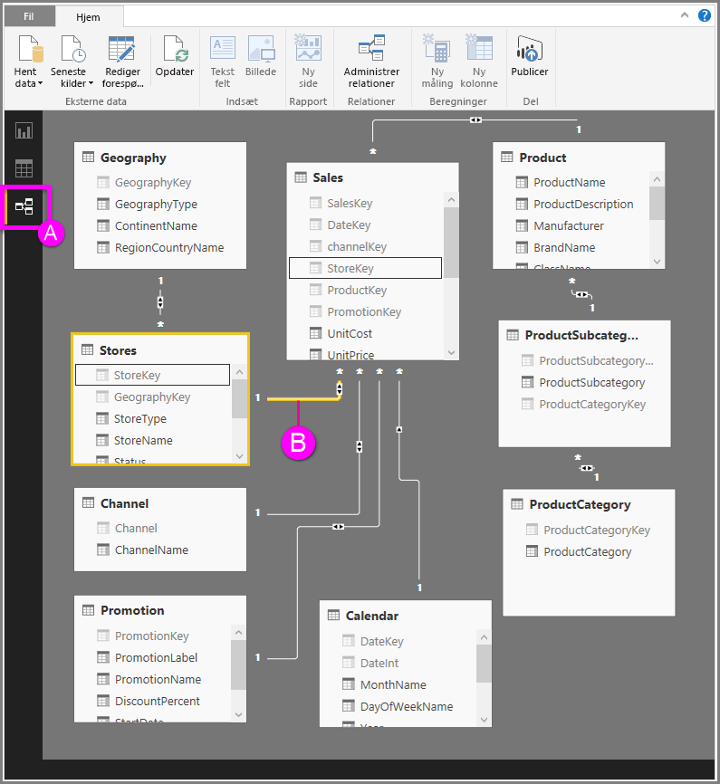

# Relationsvisning i Power BI Desktop
Med **Relationsvisning** vises alle tabeller, kolonner og relationer i din model. Det kan være særligt nyttigt, når din model indeholder komplekse relationer mellem mange tabeller.

Lad os se nærmere på det.

**A.**  Ikonet Relationsvisning – Klik her for at få vist din model i Relationsvisning

**B.** Relation – Du kan holde markøren over en relation for at få vist de kolonner, der er bruges. Dobbeltklik på en relation for at åbne den i dialogboksen **Rediger relationer**. 

I figuren ovenfor kan du se, at tabellen *Stores* har en *StoreKey*-kolonne, der er relateret til tabellen *Salg*, som også har en *StoreKey*-kolonne. Vi kan se, at det er en relation af typen *Mange til én* (\*: 1), og ikonet midt på linjen viser, at den tværgående filterretning er angivet til *Begge*. Pilen på ikonet viser retningen af kontekstflowet for filteret.

Du kan finde flere oplysninger om relationer under [Opret og administrer relationer i Power BI Desktop](desktop-create-and-manage-relationships.md).

