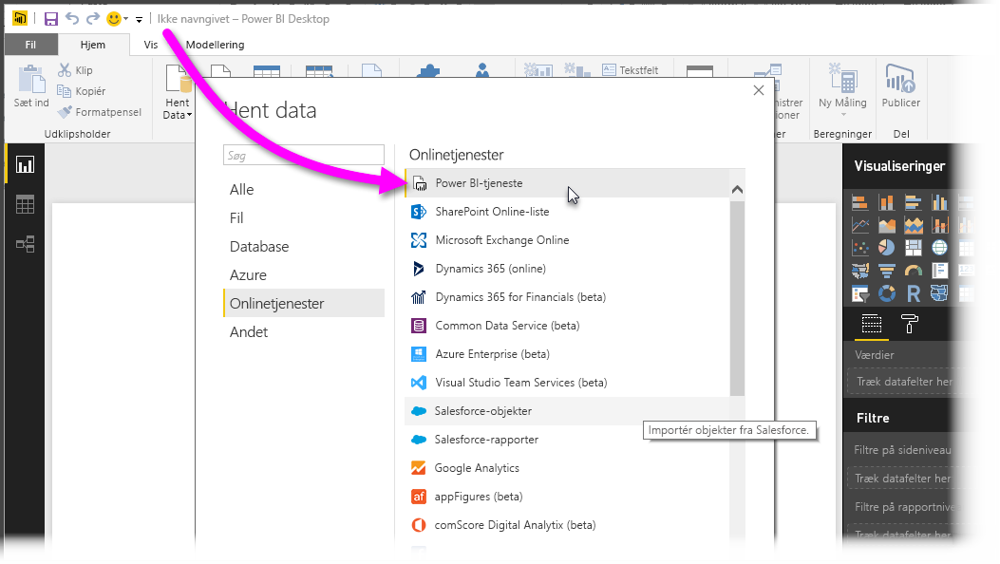
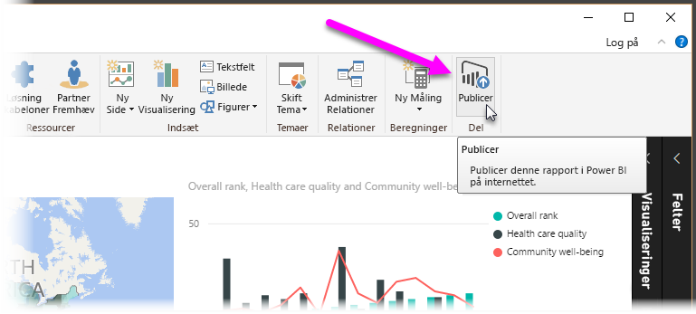
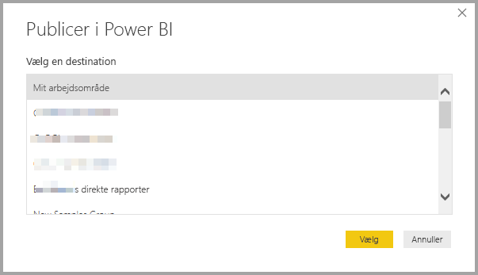
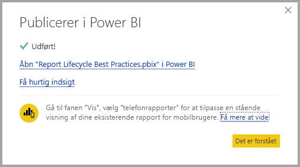
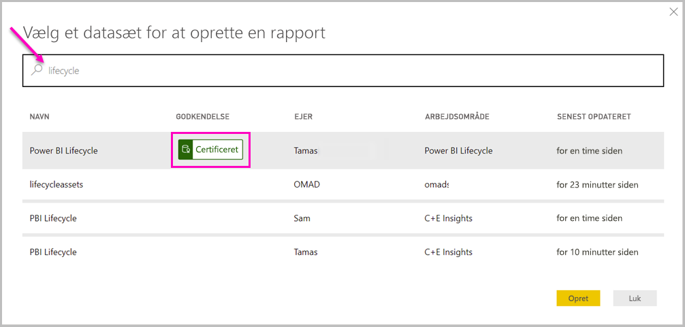
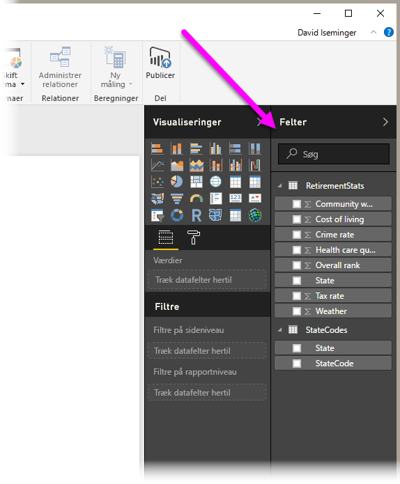

# Opret forbindelse til datasæt i Power BI-tjenesten fra Power BI Desktop

Du kan oprette en direkte forbindelse til et delt datasæt i *Power Bi-tjenesten* og oprette mange forskellige rapporter fra det samme datasæt. Du kan oprette en perfekt datamodel i Power BI Desktop og publicere den i Power BI-tjenesten. Derefter kan du og andre oprette flere forskellige rapporter (i separate *PBIX-filer*) ud fra den samme almindelige datamodel og gemme dem i forskellige arbejdsområder. Denne funktion kaldes *Direkte forbindelse til Power BI-tjenesten*.

Der er mange forskellige fordele ved denne funktion, herunder bedste fremgangsmåder, som vi vil komme ind på i denne artikel. Vi anbefaler, at du gennemgår [overvejelserne og begrænsningerne](#limitations-and-considerations) i forbindelse med denne funktion.

## Brug af en direkte forbindelse til Power BI-tjenesten til administration af rapportlevetid

En udfordring med Power BIs popularitet er det stadig større antal rapporter, dashboards og deres underliggende data. Det er nemt at oprette overbevisende rapporter i Power BI Desktop for derefter at [udgive](desktop-upload-desktop-files.md) disse rapporter i Power BI-tjenesten og oprette gode dashboards fra disse datasæt. Da så mange personer gør det og ofte ved hjælp af de samme (eller næsten de samme) datasæt, er det en udfordring at vide, hvilken rapport der er baseret på hvilket datasæt, og hvor hvert nyt datasæt er. Funktionen Direkte forbindelse til Power BI-tjenesten tager hånd om denne udfordring og gør det nemmere og mere ensartet at oprette, dele og udvide fælles datasætrapporter og dashboards.

### Opret et datasæt, alle kan bruge, og del det derefter

Lad os sige, at Anna er forretningsanalytiker i dit team. Anna er dygtig til at oprette gode datamodeller, der ofte kaldes datasæt. Anna kan oprette et datasæt og en rapport og derefter dele rapporten i Power BI-tjenesten.

Alle er vilde med Annas rapport og datasæt. Det er her, der kan opstå problemer. Alle på Annas team forsøger at oprette *deres egen version* af datasættet og derefter dele deres egne rapporter med teamet. Lige pludselig er der mange forskellige rapporter (fra forskellige datasæt) i dit teams arbejdsområde i Power BI-tjenesten. Hvilket var det seneste? Var datasættene de samme, eller kun næsten? Hvor var forskellene? Med funktionen Direkte forbindelse til Power BI-tjenesten kan alt dette ændres til det bedre. I næste afsnit kigger vi på, hvordan andre kan bruge Annas publicerede datasæt til deres egne rapporter og i deres egne arbejdsområder samt give alle mulighed for at bruge det samme solide, afprøvede og publicerede datasæt til at udarbejde deres unikke rapporter.

### Opret forbindelse til et Power BI-datasæt ved brug af en direkte forbindelse

Anna opretter en rapport og opretter det datasæt, rapporten er baseret på. Anna udgiver derefter rapporten i Power BI-tjenesten. Rapporten vises i teamets arbejdsområde i Power BI-tjenesten. Hvis Anna gemmer den i et *arbejdsområde med den nye oplevelse*, kan hun derefter angive *tilladelsen Opret* for at gøre den tilgængelig for alle, der kommer og går i hendes arbejdsområde, så de kan se rapporten og bruge den.

Hvis du vil vide mere om arbejdsområder med den nye oplevelse, skal du se [arbejdsområder](service-new-workspaces.md).

Andre medlemmer af Annas arbejdsområde kan nu oprette en direkte forbindelse til hendes delte datamodel ved at bruge funktionen Direkte forbindelse til Power BI-tjenesten. De kan oprette deres egne unikke rapporter fra *deres oprindelige datasæt* i *deres egne arbejdsområder med den nye oplevelse*.

På følgende billede kan du se, hvordan Anna opretter en Power BI Desktop-rapport og udgiver den (inklusive dens datamodel) til Power BI-tjenesten. Andre kan derefter oprette forbindelse til Annas datamodel ved hjælp af funktionen Direkte forbindelse til Power BI-tjenesten og oprette deres egne unikke rapporter i deres egne arbejdsområder på baggrund af hendes datasæt.

> [!NOTE]
> Hvis du gemmer dit datasæt i et [klassisk delt arbejdsområde](service-create-workspaces.md), er det kun medlemmer af det arbejdsområde, der kan udarbejde rapporter på baggrund af dit datasæt. Hvis du vil oprette en direkte forbindelse til en Power BI-tjeneste, skal det datasæt, som du opretter forbindelse til, være på et delt arbejdsområde, som du er medlem af.
> 
> 

## Trinvis vejledning til at bruge Direkte forbindelse til Power BI-tjenesten

Nu, hvor vi ved, hvor nyttig Direkte forbindelse til Power BI-tjenesten er, og hvordan du kan bruge funktionen som bedste praksis til at administrere rapportlevetiden, er det tid til at gennemgå trinnene, der får os fra Annas fantastiske rapport (og datasæt) til et delt datasæt, som andre i hendes Power BI-team kan bruge.

### Udgiv en Power BI-rapport og et Power BI-datasæt

Det første trin til at administrere rapportlevetiden ved brug af en Direkte forbindelse til Power BI-tjenesten er at have en rapport (og et datasæt), som teammedlemmerne vil bruge. Så Anna skal først *publicere* rapporten fra Power BI Desktop. Vælg **Publicer** på båndet **Hjem** i Power BI Desktop.

Hvis Anna ikke er logget på kontoen til Power BI-tjenesten, bliver hun bedt om at gøre det.

Derfra kan Anna vælge destinationen i arbejdsområdet, hvor rapporten og datasættet skal publiceres. Husk på, at hvis Anna gemmer det i et arbejdsområde med den nye oplevelse, så har alle med tilladelsen Opret adgang til det pågældende datasæt. Tilladelsen Opret er angivet i Power BI-tjenesten, når du har publiceret. Hvis arbejdet gemmes i et klassisk arbejdsområde, er det kun de medlemmer, som har adgang til arbejdsområdet, hvor en rapport er publiceret, der kan tilgå datasættet ved hjælp af en direkte forbindelse til Power BI-tjenesten.

Publiceringsprocessen begynder, og Power BI Desktop viser statussen.

Når publiceringen er udført, viser Power BI Desktop dig, at publiceringen er udført og giver dig et par links, så du kan komme til selve rapporten i Power BI-tjenesten og et link til at få hurtig indsigt i rapporten.

Nu, hvor din rapport med tilhørende datasæt befinder sig i Power BI-tjenesten, kan du også *fremhæve* den. Når du fremhæver den, attesterer du rapportens kvalitet og pålidelighed. Du kan tilmed anmode om, at det bliver *certificeret* af en central myndighed i din Power BI-lejer. Med begge disse godkendelser vil dit datasæt blive vist på listen over emner, når folk søger efter datasæt. Du kan finde flere oplysninger under [Fremhæv din model](service-datasets-promote.md).

Det sidste trin er at angive tilladelsen Opret for det datasæt, som rapporten er baseret på. Tilladelsen Opret bestemmer, hvem der kan se og bruge dit datasæt. Du kan konfigurere den i selve arbejdsområdet, eller når du deler et program fra arbejdsområdet. Du kan finde flere oplysninger under [Opret tilladelse til delte datasæt](service-datasets-build-permissions.md).

Lad os nu se, hvordan andre teammedlemmer, der har adgang til arbejdsområdet, hvor rapporten (og datasættet) blev publiceret, kan oprette forbindelse til datasættet og lave deres egne rapporter.

### Opret en direkte forbindelse til en Power BI-tjeneste til det udgivne datasæt

Vælg **Hent data** på båndet **Hjem** i Power BI Desktop, vælg **Power Platform** i ruden til venstre, og vælg derefter **Power BI-datasæt** for at etablere en forbindelse til den publicerede rapport og oprette din egen rapport på baggrund af det publicerede datasæt.

Hvis du ikke er logget på Power BI, bliver du bedt om at logge på. Når du er logget på, viser Power BI, hvilke arbejdsområder du er medlem af. Du kan vælge, hvilket arbejdsområde der indeholder det datasæt, du vil oprette en direkte forbindelse til Power BI-tjenesten i.

Datasættene på listen er alle de delte datasæt, du har tilladelsen Opret til, i et hvilket som helst arbejdsområde. Du kan søge efter et bestemt datasæt og se dets navn, ejer og arbejdsområdet, hvor det befinder sig, samt hvornår det senest blev opdateret. Øverst på listen kan du også se de **godkendte** datasæt, uanset om de er certificerede eller fremhævede.

Når du vælger **Opret**, opretter du en direkte forbindelse til det valgte datasæt. Power BI Desktop indlæser felterne og deres værdier, som du kan se i Power BI Desktop i realtid.

Nu kan du (og andre) oprette og dele brugerdefinerede rapporter fra det samme datasæt. Denne fremgangsmåde er en fantastisk måde at få én person til at oprette et godt udformet datasæt på, f.eks. lige som Anna. Mange teammedlemmer kan bruge dette delte datasæt til at oprette deres egne rapporter.

## Begrænsninger og overvejelser

Når du bruger funktionen Direkte forbindelse til Power BI-tjenesten, er der et par begrænsninger og overvejelser, du skal huske.

* Det er kun brugere med tilladelsen Opret for et datasæt, der kan oprette forbindelse til et publiceret datasæt ved hjælp af den direkte forbindelse til Power BI-tjenesten.
* Gratis brugere kan kun se datasæt i deres **Mit arbejdsområde** og i Premium-baserede arbejdsområder.
* Da denne forbindelse er en direkte forbindelse, deaktiveres navigationen til venstre og modellering. Du kan kun oprette forbindelse til ét datasæt i hver rapport. Denne funktionsmåde svarer til samme funktionsmåde, når der oprettes forbindelse til *SQL Server Analysis Services*.
* Eftersom denne forbindelse er en direkte forbindelse, gennemtvinges sikkerhed på rækkeniveau (RLS) og andre forbindelsesfunktioner. Det er det samme, som når du har oprettet forbindelse til SQL Server Analysis Services.
* Hvis ejeren ændrer den originale delte *PBIX-fil*, overskrives datasættet og rapporten, der er delt i Power BI-tjenesten. Rapporter baseret på dette datasæt overskrives ikke, men alle ændringer af datasættet afspejles i rapporten.
* Medlemmer af et arbejdsområde kan ikke erstatte den oprindeligt delte rapport. Forsøg på at gøre dette resulterer i en advarsel, der beder dig om at omdøbe filen og udgive den.
* Hvis du sletter det delte datasæt i Power BI-tjenesten, så vil andre rapporter, der er baseret på dette datasæt ikke længere fungere korrekt eller vise deres visualiseringer.
* Hvad angår indholdspakker, skal du først oprette en kopi af en indholdspakke, inden den bruges som basis for at dele en *PBIX*-rapport eller et PBIX-datasæt til Power BI-tjenesten.
* Hvad angår indholdspakker fra *Min organisation*, kan du, når de er kopieret, ikke erstatte rapporten, der er oprettet på tjenesten, og/eller en rapport, der er oprettet som en del af kopiering af en indholdspakke med en direkte forbindelse. Forsøg på at gøre dette resulterer i en advarsel, der beder dig om at omdøbe filen og udgive den. I denne situation kan du kun erstatte udgivne rapporter, der er direkte forbundne.
* Sletning af et delt datasæt i Power BI-tjenesten betyder, at ingen længere kan få adgang til det pågældende datasæt fra Power BI Desktop.
* Rapporter, der deler et datasæt i Power BI-tjenesten, understøtter ikke automatiserede udrulninger ved hjælp af Power BI REST API'en.
