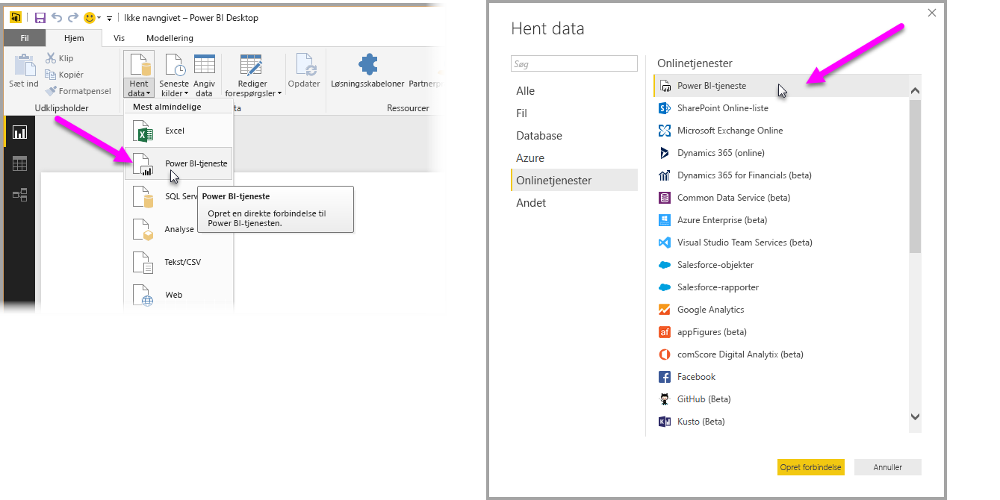
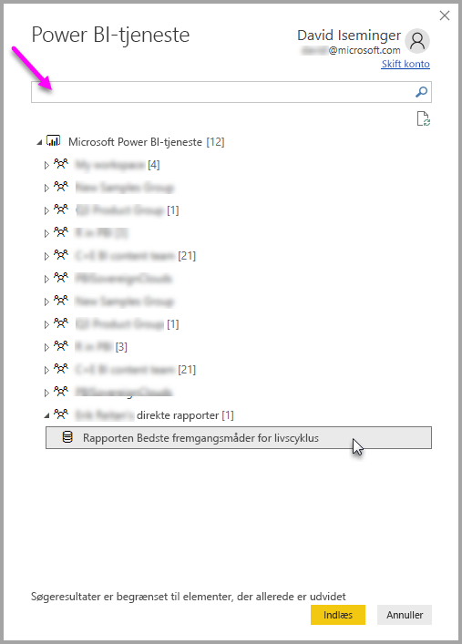

# Opret forbindelse til datasæt i Power BI-tjenesten fra Power BI Desktop
Du kan oprette en direkte forbindelse til et delt datasæt i Power Bi-tjenesten og oprette mange forskellige rapporter fra det samme datasæt. Dette betyder, at du kan forfine din datamodel i Power Bi Desktop, udgive den til Power BI-tjenesten, hvorefter du og andre kan oprette mange forskellige rapporter (i separate .pbix-filer) fra den samme fælles datamodel. Denne funktion kaldes **Direkte forbindelse til Power BI-tjeneste**.

Der er mange forskellige fordele ved denne funktion, herunder bedste fremgangsmåder, som vi vil komme ind på i denne artikel. Der er også et par overvejelser og begrænsninger, så sørg for, at du læser disse. Du kan finde dem til sidst i artiklen.

## Brug af en direkte forbindelse til Power BI-tjenesten til administration af rapportlevetid
En udfordring med Power BIs popularitet er det stadig større antal rapporter, dashboards og deres underliggende data. Her er hvorfor: Det er nemt at oprette overbevisende rapporter i **Power BI Desktop** for derefter at dele ([udgive](desktop-upload-desktop-files.md)) disse rapporter i **Power BI-tjenesten** og oprette gode dashboards fra disse datasæt. Da så mange personer gør det og ofte ved hjælp af de samme (eller næste de same) datasæt, er det en udfordring at vide, hvilken rapport, der er baseret på hvilket datasæt, og hvor hvert nyt datasæt er. Funktionen **Direkte forbindelse til Power BI-tjeneste** tager hånd om denne udfordring og gør det nemmere og mere ensartet at oprette, dele og udvide fælles datasætrapporter og dashboards.

### Opret et datasæt, alle kan bruge, og del det derefter
Lad os antage, at Anna (en virksomhedsanalytiker) er på dit team, og hun er rigtig god til at oprette gode datamodeller (ofte kaldet datasæt). Med Annas ekspertise kan hun oprette et datasæt og en rapport, og derefter dele rapporten i **Power BI-tjenesten**.

Alle er vilde med hendes rapport og datasæt, og det er her, problemerne begynder – alle på hendes team forsøger at oprette *deres egen version* af datasættet og derefter dele deres egne rapporter med teamet. Lige pludselig er der mange forskellige rapporter (fra forskellige datasæt) på dit teams arbejdsområde i **Power BI-tjenesten**. Hvilket var det seneste? Var datasættene de samme, eller kun næsten? Hvor var forskellene? Med funktionen **Direkte forbindelse til Power BI-tjeneste** kan alt dette ændres til det bedre. I det næste afsnit vil vi se på, hvordan andre kan bruge Annas udgivne datasæt til deres egne rapporter og give alle mulighed for at bruge det samme solide, afprøvede og udgivne datasæt til at bygge deres unikke rapporter.

### Opret forbindelse til et Power BI-datasæt ved brug af en direkte forbindelse
Når Anna har oprettet sin rapport (og oprettet datasættet, som den er baseret på), udgiver hun den til **Power BI-tjenesten**, og den vises på hendes teams arbejdsområde i Power BI-tjenesten. Nu kan alle på hendes arbejdsområde se og bruge rapporten.

Andre medlemmer af Annas arbejdsområde kan nu oprette en direkte forbindelse til hendes delte datamodel (ved at bruge funktionen **Direkte forbindelse til Power BI-tjeneste**) og oprette deres egne unikke rapporter fra *hendes originale datasæt*.

På følgende billede kan du se, hvordan Anna opretter en **Power Bi Desktop**-rapport og udgiver den (inklusive dens datamodel) til **Power BI-tjenesten**. Andre på hendes arbejdsområde kan derefter oprette forbindelse til hendes datamodel ved at bruge **Direkte forbindelse til Power BI-tjeneste** og oprette deres egne unikke rapporter baseret på hendes datasæt.

> [!NOTE]
> Datasæt deles kun på ét arbejdsområde. Hvis du vil oprette en direkte forbindelse til en Power BI-tjeneste, skal det datasæt, som du opretter forbindelse til, være på et delt arbejdsområde, som du er medlem af.
> 
> 

## Trinvis vejledning til at bruge Direkte forbindelse til Power BI-tjeneste
Nu ved vi, hvor nyttig **Direkte forbindelse til Power BI-tjeneste** er, og hvordan du kan bruge funktionen som en bedste fremgangsmåde til administration af rapportlevetid, så det er tid til at gennemgå trinnene, der får os fra Annas gode rapport (og datasæt) til et delt datasæt, som andre på hendes team i Power BI-arbejdsområdet kan bruge.

### Udgiv en Power BI-rapport og et Power BI-datasæt
Det første trin til at administrere rapportlevetiden ved brug af en **Direkte forbindelse til Power BI-tjeneste** er at have en rapport (og et datasæt), som teammedlemmerne vil bruge. Så Anna skal først **udgive** sin rapport fra **Power BI Desktop**. Det gør hun ved at vælge **Udgiv** på båndet **Hjem** i Power BI Desktop.

Hvis hun ikke er logget på sin Power BI-tjenestekonto, bliver hun bedt om at gøre det.

Hun kan derfra vælge destinationen i arbejdsområdet, hvor rapporten og datasættet skal udgives til. Husk, at kun medlemmer, der har adgang til arbejdsområdet, hvor en rapport er udgivet, kan få adgang til dens datasæt ved brug af **Direkte forbindelse til Power BI-tjeneste**.

Udgivelsesprocessen begynder, og **Power BI Desktop** viser statussen.

Når den er færdig, viser **Power BI Desktop** dig, at udgivelsen er udført og giver dig et par links, så du selv kan komme til selve rapporten i **Power BI-tjenesten** og et link til at få **Hurtig indsigt** i rapporten.

Lad os nu se, hvordan andre teammedlemmer, der har adgang til arbejdsområdet, hvor rapporten (og datasættet) blev udgivet, kan oprette forbindelse til datasættet og lave deres egne rapporter.

### Opret en direkte forbindelse til en Power BI-tjeneste til det udgivne datasæt
Vælg **Hent data** på båndet **Hjem** i **Power BI Desktop**, og vælg **Power BI-tjeneste** for at oprette en forbindelse til den udgivne rapport og oprette din egen rapport baseret på det udgivne datasæt. Du kan også vælge det fra **Hent data > Onlinetjenester > Power BI-tjeneste**.

Hvis du ikke allerede er logget på Power BI, bliver du bedt om at gøre det. Når du er logget på, får du vist et vindue, der viser, hvilke arbejdsområder du er medlem af, og du kan vælge, hvilket arbejdsområde der indeholder datasættet, som du vil oprette en **Direkte forbindelse til Power Bi-tjeneste** til.

Tallet i parentes ved siden af arbejdsområdet viser, hvor mange delte datasæt, der er tilgængelige i den pågældende arbejdsgruppe, og ved at vælge trekanten til venstre udvides arbejdsområdet, så du kan vælge det delte datasæt.

Der er et par ting at bemærke fra det tidligere vindue til at oprette direkte forbindelse til **Power BI-tjenesten**:

* Du kan søge efter et delt datasæt, men søgeresultaterne er begrænset til de udvidede elementer og inkluderer ikke arbejdsområder, som du ikke har udvidet.
* Du kan udvide mere end ét arbejdsområde for at udvide din søgning.

Når du vælger **Indlæs** fra vinduet, opretter du en direkte forbindelse til det valgte datasæt, hvilket betyder, at de data, du ser (felterne og deres værdier), indlæses i **Power Bi Desktop** i realtid.

Nu kan du (og andre) oprette og dele brugerdefinerede rapporter fra det samme datasæt. Det er en god måde til at have en kyndig person, som opretter et veludformet datasæt (lige som Anna gør) og tillader mange teammedlemmer at bruge det delte datasæt til at oprette deres egne rapporter.

> [!NOTE]
> Når du opretter rapporter baseret på datasæt ved brug af en direkte forbindelse til **Power BI-tjenesten**, kan du kun udgive den rapport til det samme arbejdsområde i Power BI-tjenesten, som indeholder det anvendte datasæt.
> 
> 

## Begrænsninger og overvejelser
Når du bruger **Direkte forbindelse til Power BI-tjeneste**, er der et par begrænsninger og overvejelser, du skal huske.

* Medlemmer af et arbejdsområde, der kun har læserettigheder, kan ikke oprette forbindelse til datasæt fra **Power BI Desktop**.
* Kun brugere, der er en del af det samme arbejdsområde i **Power BI-tjenesten**, kan oprette forbindelse til et udgivet datasæt ved at bruge **Direkte forbindelse til Power BI-tjeneste**. Bruger kan tilhøre mere end et arbejdsområde (og gør det ofte).
* Da det er en direkte forbindelse, er venstrenavigation og modeller deaktiveret, ligesom funktionsmåden når der er oprettet forbindelse til **SQL Server Analysis Services**.
* Da det er en direkte forbindelse er RLS (sikkerhed på række- og rolleniveau), OneDrive for Business og andre lignende forbindelsesfunktionsmåder tvunget, ligesom de er det, når der er oprettet forbindelse til **SQL Server Analysis Services**.
* Når du vælger, hvilket datasæt der skal oprettes forbindelse til i **Power BI-tjenesten**, anvendes søgefeltet kun for arbejdsområder, der er udvidet.
* Hvis du ændrer den originale delte -pbix-fil, overskrives datasættet og rapporten, der er delt i **Power BI-tjenesten**.
* Du kan ikke erstatte den oprindeligt delte rapport. Forsøg på at gøre dette resulterer i en advarsel, der beder dig om at omdøbe filen og udgive den.
* Hvis du sletter det delte datasæt i **Power BI-tjenesten**, så vil andre **Power BI Desktop** (.pbix-filer) ikke længere fungere korrekt eller vise deres værdier.
* Hvad angår indholdspakker skal du først oprette en kopi af en indholdspakke, inden den bruges som basis for at dele en .pbix-rapport eller et .pbix-datasæt til **Power BI-tjenesten**.
* Hvad angår indholdspakker fra *Min organisation* kan du, når de er kopieret, ikke erstatte rapporten, der er oprettet på tjenesten, og/eller en rapport, der er oprettet som en del af kopiering af en indholdspakke med en direkte forbindelse. Forsøg på at gøre dette resulterer i en advarsel, der beder dig om at omdøbe filen og udgive den. I denne situation kan du kun erstatte udgivne rapporter, der er direkte forbundne.
* Når du opretter en rapport baseret på datasæt ved brug af en direkte forbindelse til **Power BI-tjenesten**, kan du kun udgive den rapport til det samme arbejdsområde i Power BI-tjenesten, som indeholder det anvendte datasæt.
* Sletning af et delt datasæt i **Power BI-tjenesten** betyder, at du ikke længere har adgang til det datasæt fra **Power BI Desktop**.

