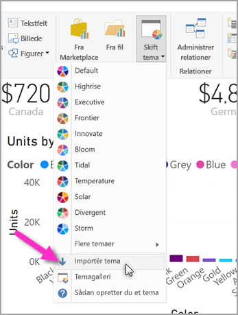
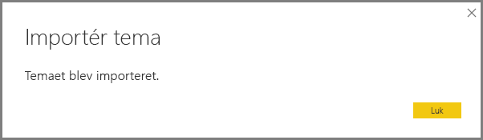
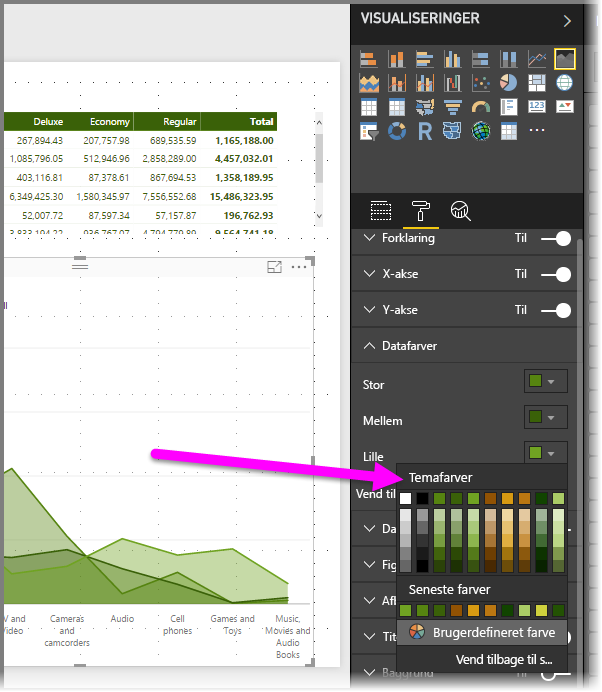

# <a name="use-report-themes-in-power-bi-desktop"></a>Brug af rapporttemaer i Power BI Desktop

Med *rapporttemaer* i Power BI Desktop kan du anvende designændringer på hele rapporten, f.eks. bruge virksomhedsfarver, ændre ikonsæt eller anvende ny standardformatering for visualiseringer. Når du anvender et rapporttema, anvendes farver og formatering fra det valgte tema som standard på alle visuals i rapporten. Der gælder nogle få undtagelser, som er beskrevet senere i denne artikel.


Der findes to typer rapporttemaer, indbyggede rapporttemaer og brugerdefinerede rapporttemafiler:

- Indbyggede rapporttemaer indeholder forskellige typer foruddefinerede farveskemaer, der installeres sammen med Power BI Desktop. Du vælger indbyggede rapporttemaer direkte fra menuen Power BI Desktop.

- Brugerdefinerede rapporttemafiler er rapporttemaer, der er oprettet i JSON-filer, som definerer deres grundlæggende struktur. Hvis du vil anvende et brugerdefineret rapporttema, skal du importere den tilhørende JSON-fil i Power BI Desktop og anvende den til din rapport.

  Du kan også tilpasse et eksisterende rapporttema fra Power BI Desktop ved hjælp af dialogboksen [**Tilpas tema**](#create-and-customize-a-theme-in-power-bi-desktop-preview).

Du kan også tilpasse og standardisere næsten alle elementer, der vises, i afsnittet **Formatering** i ruden **Visualiseringer** enten via tilpasninger, der foretages direkte i Power BI Desktop eller via JSON-temafilen. Målet er at give dig fuld kontrol over, hvordan din standardrapport ser ud på et detaljeret niveau.

## <a name="how-report-themes-work"></a>Sådan fungerer rapporttemaer

Hvis du vil anvende et rapporttema på en rapport i Power BI Desktop, kan du vælge mellem de [tilgængelige indbyggede rapporttemaer](#built-in-report-themes), du kan [importere en JSON-fil med et brugerdefineret tema](#import-custom-report-theme-files), eller du kan [bruge dialogboksen **Tilpas tema**](#create-and-customize-a-theme-in-power-bi-desktop-preview).

Du kan finde flere oplysninger om, hvilke standarder der kan tilpasses, i afsnittet med [rapporttemaets JSON-format](#report-theme-json-file-format) nedenfor.

### <a name="built-in-report-themes"></a>Indbyggede rapporttemaer

Sådan vælger du blandt de tilgængelige indbyggede rapporttemaer:

1. Vælg **Skift tema** på båndet **Hjem**.

   

2. Vælg et af de inkluderede temaer i rullemenuen.

   Rapporttemaet anvendes nu på rapporten.

I følgende tabel vises de tilgængelige indbyggede rapporttemaer.

| Indbygget rapporttema | Standardfarvesekvens |
|------ |---------- |
| Standard | |
| Highrise | |
| Leder | |
| Grænse| |
| Forny | |
| Blomstring | |
| Tidevand| |
| Temperatur | |
| Sol| |
| Divergerende | |
| Storm | |
| Klassisk | |
| Bypark | |
| Klasselokale | |
| Sikker for farveblinde | |
| Elektrisk | |
| Høj kontrast | |
| Solnedgang | |
| Tusmørke | |

## <a name="customize-report-themes"></a>Tilpas rapporttemaer

Fra og med december 2019-versionen af Power BI Desktop kan du tilpasse et rapporttema på to måder:

- [Opret og tilpas et tema i Power BI Desktop (prøveversion)](#create-and-customize-a-theme-in-power-bi-desktop-preview)
- [Opret og tilpas en JSON-fil med et brugerdefineret rapporttema](#introduction-to-report-theme-json-files)

### <a name="create-and-customize-a-theme-in-power-bi-desktop-preview"></a>Opret og tilpas et tema i Power BI Desktop (prøveversion)

Fra og med Power BI Desktop i december 2019 er muligheden for at tilpasse et tema direkte i Power BI Desktop nu tilgængelig som prøveversion.

Sådan tilpasser du et tema direkte i Power BI Desktop:

1. Vælg **Fil** > **Indstillinger** > **Indstillinger**.

2. I afsnittet **Funktioner i prøveversionen** skal du vælge **Tilpas det aktuelle tema**og derefter vælge **OK**.

   

   Du bliver muligvis bedt om at genstarte Power BI Desktop, før prøveversionsfunktionen aktiveres. Når du har genstartet, kan du begynde at tilpasse det tema, der er anvendt i øjeblikket.

3. På båndet **Hjem** skal du vælge **Skift tema** > **Tilpas det aktuelle tema**.

   Der åbnes en dialogboks, som viser, hvordan du kan tilpasse det rapporttema, der i øjeblikket anvendes på rapporten.

   

4. Hvis du synes om et eksisterende tema og ønsker at foretage et par justeringer, skal du markere (eller importere) temaet og derefter vælge **Tilpas det aktuelle tema**.

   

Temaindstillinger, der kan tilpasses, findes i følgende kategorier, som afspejles i dialogboksen **Tilpas tema**:

- **Navn og farver**: Temanavn og farveindstillinger omfatter [temafarver](#how-report-theme-colors-stick-with-your-reports), synspunktsfarver, divergerende farver og [strukturelle farver (avanceret)](#setting-structural-colors).
- **Tekst**: Tekstindstillinger omfatter skrifttypefamilie, størrelse og farve, der angiver [standarderne for den primære tekstklasse](#setting-formatted-text-defaults) for etiketter, titler, kort og KPI'er samt faneoverskrifter.
- **Visualiseringer**: Indstillinger for visualiseringer, f.eks. baggrund, kant, overskrift og værktøjstip.
- **Side**: Indstillinger for sideelementer omfatter tapet og baggrund.
- **Filterrude**: Indstillinger for filterrude omfatter baggrundsfarve, gennemsigtighed, skrifttype og ikonfarve, størrelse og filterkort.

Når du har foretaget dine ændringer, skal du vælge **Anvend og Gem** for at gemme dit tema. Dit tema kan nu bruges i den aktuelle rapport og eksporteres.

Hvis du tilpasser det aktuelle tema på denne måde, kan du hurtigt og nemt tilpasse temaer. Du kan dog foretage finere justeringer af temaer, som kræver, at temaets [JSON-fil](#report-theme-json-file-format) redigeres.

> [!TIP]
> Du kan tilpasse de mest almindelige indstillinger for rapporttemaer ved hjælp af kontrolelementerne i dialogboksen **Tilpas tema**. Du kan tilpasse dem endnu mere ved at eksportere temaets JSON-fil og foretage finjusteringer manuelt ved at ændre indstillingerne i denne fil. Du kan omdøbe den finjusterede JSON-fil og senere importere den.

### <a name="import-custom-report-theme-files"></a>Importér brugerdefinerede rapporttemafiler

Sådan importerer du en brugerdefineret rapporttemafil:

1. Vælg **Skift tema** på båndet **Hjem**, og vælg derefter **Importér tema** på rullelisten.

   

   Der vises et vindue, hvorfra du kan søge efter placeringen af JSON-temafilen.

2. På følgende billede er en række filer i ferietema tilgængelige. Vi vælger et ferietema for marts *St Patricks Day.json*.

   

   Når temafilen er blevet indlæst, får du besked i Power BI Desktop.

   

## <a name="introduction-to-report-theme-json-files"></a>Introduktion til JSON-filer til rapporttemaer

 Når du åbner den grundlæggende JSON-fil, der er nævnt i det forrige afsnit (St Patricks Day.json), ser den ud på følgende måde:

 ```json
    {
        "name": "St Patrick's Day",
        "dataColors": ["#568410", "#3A6108", "#70A322", "#915203", "#D79A12", "#bb7711", "#114400", "#aacc66"],
        "background":"#FFFFFF",
        "foreground": "#3A6108",
        "tableAccent": "#568410"
    }
```

Denne JSON-fil til rapporttemaer indeholder følgende linjer:

- **name**: Navnet på rapporttemaet. Dette felt er det eneste påkrævede felt.
- **dataColors**: Listen over hexadecimale farvekoder til brug sammen med data i visualiseringer i Power BI Desktop. Listen kan indeholde et vilkårligt antal farver.
- **background**, **firstLevelElements** og **tableAccent** (osv.): Farveklasser. Med farveklasser kan du angive mange strukturelle farver i din rapport på én gang.

Du kan bruge denne JSON-fil som udgangspunkt til at oprette din egen brugerdefinerede rapporttemafil, som du vil importere. Hvis du kun vil justere rapportens grundfarver, skal du ændre navnet og hexadecimalkoderne i filen.

I en JSON-fil til et rapporttema skal du kun definere den formatering, du vil ændre. Det, du ikke angiver i JSON-filen, vender tilbage til standardindstillingerne i Power BI Desktop.

Der er mange fordele ved at oprette en JSON-fil. Du kan f.eks. angive, at alle diagrammer bruger en skriftstørrelse på 12, eller at visse visualiseringer bruger en bestemt skrifttypefamilie, eller at datamærkater for bestemte diagramtyper deaktiveres. Når du bruger en JSON-fil, kan du oprette en temafil, der standardiserer dine diagrammer og rapporter, hvilket gør det nemt at gøre dine organisationsrapporter konsistente.

Du kan finde flere oplysninger om formatet af JSON-filen i [JSON-filformat for rapporttema](#report-theme-json-file-format).

> [!NOTE]
> Det er sikkert at ændre et brugerdefineret tema i en JSON-rapport i dialogboksen [**Tilpas tema**](#create-and-customize-a-theme-in-power-bi-desktop-preview).  Dialogboksen ændrer ikke temaindstillinger, som den ikke har kontrol over, og de ændringer, der foretages af rapporttemaet, opdateres på stedet.

## <a name="how-report-theme-colors-stick-with-your-reports"></a>Sådan fastgøres rapporttemafarver til dine rapporter

Når du publicerer rapporten til Power BI-tjenesten, bliver rapporttemafarverne ved med at være de samme. Rapporttemaet vises i sektionen **Datafarver** i panelet **Format**.

Sådan får du vist de tilgængelige farver i et rapporttema:

1. Vælg en visualisering.

2. I afsnittet **Format** i ruden **Visualisering** skal du vælge **Datafarver**.

3. Vælg rullelisten for et element for at få vist oplysninger om **temafarver** i rapporttemaet.

   

Når vi f.eks. har anvendt de mange grønne og brune farver fra Skt. Patricks dag-temaet, skal vi vælge en visualisering. Se alle de grønne farver? Det skyldes, at disse farver var en del af det rapporttema, som vi importerede og anvendte.

Farverne i farvepaletten er også relative i forhold til det aktuelle tema. Lad os f.eks. antage, at du vælger den tredje farve i den øverste række for et datapunkt. Hvis du på et senere tidspunkt skifter til et andet tema, opdateres datapunktets farve automatisk til den tredje farve i den øverste række i det nye tema, på samme måde som når du ændrer temaer i Microsoft Office.

### <a name="situations-when-report-theme-colors-wont-stick-to-your-reports"></a>Situationer, hvor rapporttemafarver ikke bliver i rapporterne

Lad os sige, at du anvender et brugerdefineret farvesæt (eller en individuel farve) til et bestemt datapunkt i en visualisering ved hjælp af indstillingen **Brugerdefineret farve** i farvevælgeren. Når du anvender et rapporttema, tilsidesætter det *ikke* den brugerdefinerede farve for datapunktet.

Det er også muligt at angive farven på et datapunkt manuelt ved hjælp af afsnittet **Temafarver**. Farverne opdateres *ikke*, når du anvender et nyt rapporttema. Hvis du vil have standardfarverne tilbage, så de opdateres, når du anvender et nyt rapporttema, skal du vælge **Vend tilbage til standard** i paletten med **temafarver** i farvevælgeren.


Desuden kan mange Power BI-visuals ikke anvendes på rapporttemaer.

## <a name="custom-report-theme-files-you-can-use-right-now"></a>Brugerdefinerede rapporttemafiler, som kan bruges i øjeblikket

Vil du gerne i gang med rapporttemaer? Se de brugerdefinerede rapporttemaer i galleriet med [temaer](https://community.powerbi.com/t5/Themes-Gallery/bd-p/ThemesGallery), eller prøv følgende foruddefinerede JSON-filer til rapporttemaer, som du kan downloade og importere i din Power BI Desktop-rapport:

- [Temaet Waveform](https://community.powerbi.com/t5/Themes-Gallery/Waveform/m-p/140536). Dette rapporttema blev introduceret i det [blogindlæg](https://powerbi.microsoft.com/blog/power-bi-desktop-march-feature-summary/), hvor den første udgivelse af rapporttemaer blev annonceret. [Download Waveform.JSON](https://go.microsoft.com/fwlink/?linkid=843924).

  

- [Brugervenligt tema til farveblinde](https://community.powerbi.com/t5/Themes-Gallery/Color-Blind-Friendly/m-p/140597).
Dette rapporttema er nemmere at læse for synshæmmede. [Download ColorblindSafe-Longer.json](https://go.microsoft.com/fwlink/?linkid=843923).

  .

- Power-visningstemaer med Apothecary.json. [Download Powervisningstemaer i en ZIP-fil](https://go.microsoft.com/fwlink/?linkid=843925).

  

- Temaet Valentinsdag.

  

  Her er koden til JSON-filen for valentinsdag:

   ```json
       {
           "name": "Valentine's Day",
           "dataColors": ["#990011", "#cc1144", "#ee7799", "#eebbcc", "#cc4477", "#cc5555", "#882222", "#A30E33"],
           "background":"#FFFFFF",
           "foreground": "#ee7799",
           "tableAccent": "#990011"
       }
   ```

Her er nogle flere rapporttemaer, som du kan bruge som udgangspunkt:

- [Sunflower-twilight](https://community.powerbi.com/t5/Themes-Gallery/Sunflower-Twilight/m-p/140749)
- [Plum](https://community.powerbi.com/t5/Themes-Gallery/Plum/m-p/140711)
- [Autumn](https://community.powerbi.com/t5/Themes-Gallery/Autumn/m-p/140746)
- [High contrast](https://community.powerbi.com/t5/Themes-Gallery/Color-Blind-Friendly/m-p/140597)

Rapporttemaer kan gøre dine Power BI Desktop-rapporter til en farverig afspejlning af dig, din organisation eller også den aktuelle sæson eller helligdag.

## <a name="export-report-themes-preview"></a>Eksportér rapporttemaer (prøveversion)

Fra og med udgivelsen af Power BI Desktop i december 2019 kan du nu vælge at eksportere det aktuelt anvendte rapporttema direkte fra Power BI Desktop til en JSON-fil. Når du har eksporteret et rapporttema, kan du bruge det igen i andre rapporter. Med denne indstilling kan du eksportere JSON-filen til de fleste af de indbyggede temaer. De eneste undtagelser er de grundlæggende temaer, Classic og Standard, som andre temaer bygger på, når de importeres.

Sådan eksporterer du det tema, der aktuelt anvendes, fra Power BI Desktop:

1. Vælg **Fil** > **Indstillinger** > **Indstillinger**.

2. I afsnittet **Funktioner i prøveversionen** skal du vælge **Tilpas det aktuelle tema**og derefter vælge **OK**.

   Du bliver muligvis bedt om at genstarte Power BI Desktop, før prøveversionsfunktionen aktiveres. Når du har genstartet, kan du begynde at eksportere det tema, der er anvendt i øjeblikket.

3. På båndet **Hjem** skal du vælge **Skift tema** > **Eksportér det aktuelle tema**.

4. Brug dialogboksen **Gem som** til at gå til en mappe, hvor JSON-filen skal gemmes, og vælg derefter **Gem**.

## <a name="report-theme-json-file-format"></a>JSON-filformat for rapporttema

På det mest grundlæggende niveau har JSON-temafilen kun én linje, der er påkrævet: **name**.

```json
{
    "name": "Custom Theme"
}
```

Alt andet ud over **name** er valgfrit, hvilket betyder, at du kan tilføje de relevante egenskaber, du vil bruge til at formatere temafilen, og fortsætte med at bruge Power BI's standarder til resten.

### <a name="setting-theme-colors"></a>Indstilling af temafarver

Under **name** kan du tilføje nogle grundlæggende farverelaterede egenskaber:

- **dataColors**: Listen over hexadecimale farvekoder til brug sammen med farvefigurer, der repræsenterer data i visualiseringer i Power BI Desktop. Listen kan indeholde et vilkårligt antal farver. Når alle farver fra denne liste er blevet brugt, og hvis visual'et stadig har brug for flere farver, vender det tilbage til at bruge Power BI's standardfarvepalet.
- **good**, **neutral**, **bad**: Disse egenskaber angiver de statusfarver, der bruges af vandfaldsdiagrammet og det visuelle element KPI.
- **maximum**, **center**, **minimum**, **null**: Disse farver angiver de forskellige gradueringsfarver i dialogboksen med betinget formatering.

Et grundlæggende tema, der definerer disse farver, kan se ud på følgende måde:

```json
{
    "name": "Custom Theme",
    "dataColors": [
        "#118DFF",
        "#12239E",
        "#E66C37",
        "#6B007B",
        "#E044A7",
        "#744EC2",
        "#D9B300",
        "#D64550",
        "#197278",
        "#1AAB40"
    ],
    "good": "#1AAB40",
    "neutral": "#D9B300",
    "bad": "#D64554",
    "maximum": "#118DFF",
    "center": "#D9B300",
    "minimum": "#DEEFFF",
    "null": "#FF7F48"
}
```

### <a name="setting-structural-colors"></a>Indstilling af strukturelle farver

Derefter kan du tilføje forskellige farveklasser, f.eks. **background** og **firstLevelElements**. Disse farveklasser angiver de strukturelle farver for elementer i rapporten, f.eks. aksegitterlinjer, fremhævningsfarver og baggrundsfarver for visuelle elementer.

Du kan se de seks farveklasser, som du kan formatere, i følgende tabel.  Navnene i **Farveklasse** stemmer overens med navnene i undersektionen "Avanceret" i sektionen "Navn og farver" i dialogboksen [**Tilpas tema**](#create-and-customize-a-theme-in-power-bi-desktop-preview).

|Farveklasse  |Dette formateres  |
|---------|---------|
| **firstLevelElements** <br> **foreground**    (frarådes) | Angiver baggrundsfarve (uden for datapunkter) <br> Tendenslinjens farve <br>  Standardfarven på tekstfelt <br> Skriftfarven for tabel-og matrixværdier og totaler samt farve på akser på datalinje <br> Kortdatamærkater <br> Farven på billedforklaringsværdi for måler <br> Farven på KPI-mål <br>  KPI-tekstfarve <br> Farven på udsnit (i fokustilstand)  <br> Skriftfarven for rulleelement i udsnit <br> Skriftfarven for numerisk input i udsnit <br> Skriftfarven for udsnitsoverskrift <br> Farven på forholdslinje i punktdiagram <br> Farven på prognoselinje i kurvediagram <br> Farven på navnelinje på kort <br> Tekstfarven for filterrude og kort|
| **secondLevelElements** <br> **foregroundNeutralSecondary** (frarådes) | "lette" [sekundære tekstklasser](#setting-formatted-text-defaults) <br> Mærkatfarver  <br> Farven på forklaring <br> Farven på aksemærkat <br> Skriftfarve for tabel-og matrixheadere <br> Stregfarve for målerens mål og målets navnelinje <br>  Farven på KPI-tendensakse <br> Farven på skyder i udsnit <br> Skriftfarve for udsnitselement <br> Farven på kontur i udsnit <br> Farven, når der peges, i et kurvediagram <br> Farven på korttitel på flere rækker <br> Stregfarve for bånddiagram <br> Kantfarve for figurkort <br> Skriftfarve for knaptekst <br> Linjefarve for knapikon <br> Farve for knapkontur |
| **thirdLevelElements** <br >**backgroundLight** (frarådes) | Gitterlinjefarve for akse <br> Gitterfarven på tabel og matrix <br> Baggrundsfarve for udsnitsheader (i fokustilstand)  <br> Konturfarve for kort med flere rækker  <br> Udfyldningsfarve <br> Baggrundsfarve for målerbue <br> Anvendt baggrundsfarve for filterkort <br> Når baggrund = FFFFFF: <br> Udfyldningsfarve til deaktiveret knap <br> Konturfarve til deaktiveret knap <br> |
| **fourthLevelElements** <br> **foregroundNeutralTertiary** (frarådes) | nedtonet farve på forklaring <br> Farven på kortkategorimærkat <br> Farven på kortkategorimærkat for flere rækker <br> Linjefarven på kort med flere rækker <br> Stregfarve for konverteringsrate i tragtformet diagram <br> Skriftfarve til tekst til deaktiveret knap <br> Stregfarve til ikon for deaktiveret knap <br> |
| **background** | Baggrundsfarve på mærkat (inde i datapunkter) <br> Baggrundsfarve for rulleelementer i udsnit  <br> Stregfarve for kransediagram <br> Stregfarve for træstruktur <br> Baggrundsfarve for kombinationsdiagram <br> Udfyldningsfarve til knap <br> Baggrundsfarve for filterrude og tilgængeligt filterkort |
| **secondaryBackground** <br> **backgroundNeutral** (frarådes) | Konturfarven på tabel- og matrixgitter <br> Standardfarve for figurkort <br> Båndets fyldfarve for bånddiagram (når indstillingen tilpas til seriens farve er slået fra) <br> Når baggrund != FFFFFF: <br> Udfyldningsfarve til deaktiveret knap <br> Konturfarve til deaktiveret knap <br> |
| **tableAccent** | Tilsidesætter konturfarve for tabel-og matrixgitter, når den findes |

Her er et eksempel på et tema, der angiver farveklasserne:

```json
{
    "name": "Custom Theme",
    "firstLevelElements": "#252423",
    "secondLevelElements": "#605E5C",
    "thirdLevelElements": "#F3F2F1",
    "fourthLevelElements": "#B3B0AD",
    "background": "#FFFFFF",
    "secondaryBackground": "#C8C6C4",
    "tableAccent": "#118DFF"
}
```

> [!TIP]
> Hvis du opretter et "mørkt tema" eller et andet farverigt tema, der afviger fra den typiske "sorte" **firstLevelElements** på "hvid" **background**-typografi, skal du også angive værdierne for andre strukturelle farver og [farverne for de primære tekstfarver](#setting-formatted-text-defaults).  Derved sikres, at f.eks. datanavne for diagrammer med en etiketbaggrund stemmer overens med det forventede format, at de kan læses, og samtidig sikres, at aksegitterlinjer er synlige.

### <a name="setting-formatted-text-defaults"></a>Indstilling af formaterede tekststandarder

Derefter kan du føje tekstklasser til din JSON-fil. Tekstklasser ligner farveklasser, men er designet for at give dig mulighed for at opdatere skriftstørrelsen, farven og familien for grupper af tekst på tværs af rapporten.

Der er 12 tekstklasser, men du skal faktisk kun angive fire klasser, de såkaldte *primære klasser*, for at ændre al tekstformatering i din rapport.  Disse fire primære klasser kan angives i dialogboksen [**Tilpas tema**](#create-and-customize-a-theme-in-power-bi-desktop-preview) i sektionen "Tekst": "Generelt" svarer til **etiket**, "Titel" til **titel**, "Kort og KPI'er" til **forklaring** og "Faneoverskrifter" til **overskrift**.

Andre tekstklasser, der betragtes som *sekundære klasser*, får automatisk deres egenskaber fra deres tilknyttede primære klasser. Ofte vælger en sekundær klasse en lysere tekstfarve eller en vis procentdel større eller mindre tekststørrelse sammenlignet med den primære klasse.

Tag klassen **label** som et eksempel. Standardformateringen for **label** class er Segoe UI, #252423 (en mørkegrå farve) og 12 pkt. Denne klasse bruges til at formatere værdierne i tabellen og matrixen. Totalerne i en tabel eller matrix vil typisk have samme formatering, men er med fed, så de er tydeligere, og de bruger derfor en **label class for fed**. Du behøver dog ikke angive den pågældende klasse i temaet JSON. Power BI gør dette automatisk. Hvis du på et senere tidspunkt beslutter at angive labels med en skrifttype på 14 pkt. i dit tema, behøver du ikke også at opdatere den pågældende **label class for fed**, fordi den nedarver tekstformatering fra **label class**.

De følgende oplysninger vises i følgende tabel:

- Hver af de fire primære tekstklasser, hvad den enkelte tekstklasse formaterer og de tilhørende standardindstillinger.
- Hver sekundær klasse, hvad den enkelte klasse formaterer og de tilhørende standardindstillinger, der er entydige sammenlignet med den primære klasse.

|Primær klasse  |Sekundær klasse  |JSON-klassenavn  | Standardindstillinger  |Tilknyttede visuelle objekter  |
|---------|---------|---------|---------|---------|
| Billedforklaring | I/T | callout | DIN <br> #252423 <br> 45pt |Kortdatamærkater <br> KPI-indikatorer|
|Sidehoved|I/T|header|Segoe UI Semibold <br> #252423 <br> 12pt |Headere for nøglefaktorer |
| Titel || titel |DIN <br> #252423 <br> 12pt |Kategoriaksetitel <br> Værdiaksetitel <br> Korttitel på flere rækker* <br> Udsnitsheader|
|-| Stor titel | largeTitle |14pt |Titel på visualisering |
|Navn ||label |Segoe UI<br>#252423<br>10pt |Kolonneoverskrifter i tabeller og matrixer <br> Rækkeoverskrifter i matrixer<br>Tabel- og matrixgitter<br>Tabel- og matrixværdier |
|-|Halvfed |semiboldLabel| Segoe UI Semibold | Profiltekst for nøglefaktorer
|-|Stor |largeLabel |12pt | Datanavne for kort med flere rækker |
|-|Lille |smallLabel |9pt |Referencelinjemærkater* <br>Mærkater for datoområde i udsnit<br> Teksttype for numerisk input i udsnit<br>Søgefelt i udsnit<br>Tekst for nøglefaktor|
|-|Lys |lightLabel |#605E5C |Forklarende tekst<br>Knaptekst<br>Kategoriaksemærkater<br>Datamærkater i tragtformet diagram<br>Mærkater for konverteringsrater i tragtformet diagram<br>Mål i måler<br>Kategorimærkat for punktdiagram<br>Elementer i udsnit|
|-|Fed |boldLabel |Segoe UI Bold |Subtotaler i matrixer<br>Hovedtotaler i matrixer<br>Totaler i tabeller |
|-|Stor og let |largeLightLabel |#605E5C<br>12pt |Kortkategorimærkater<br>Målermærkater<br>Kategorimærkater for kort med flere rækker |
|-|Lille og let |smallLightLabel |#605E5C<br>9pt |Datamærkater<br>Værdiaksemærkater|

*\* Elementer markeret med stjerne farves også ud fra første datafarve i rapporttemaet.*

> [!TIP]
> De *lyse* variationer af tekstklasser kan hente deres lyse farve fra de [strukturelle farver](#setting-structural-colors) som defineret ovenfor.  Hvis du opretter et "mørkt tema", skal du også sørge for at angive farverne "firstLevelElements" (der svarer til den primære tekstfarve), "secondLevelElements" (der svarer til den forventede "lyse" tekstfarve) og "background" (med tilstrækkelig kontrast til elementfarver på både første og andet niveau).

Her er et eksempel på et tema, der kun angiver primære tekstklasser:

```json
{
    "name": "Custom Theme",
    "textClasses": {
        "callout": {
            "fontSize": 45,
            "fontFace": "DIN",
            "color": "#252423"
        },
        "title": {
            "fontSize": 12,
            "fontFace": "DIN",
            "color": "#252423"
        },
        "header": {
            "fontSize": 12,
            "fontFace": "Segoe UI Semibold",
            "color": "#252423"
        },
        "label": {
            "fontSize": 10,
            "fontFace": "Segoe UI",
            "color": "#252423"
        }
    }
}
```

Da sekundære klasser arver fra de primære klasser, behøver du ikke at angive dem i temafilen. Du kan dog eksplicit formatere de sekundære klasser i temafilen, hvis du ikke bryder dig om arvereglerne (hvis du f.eks. ikke ønsker, at totalerne skal være med fed i en tabel), på samme måde som du kan formatere de primære klasser.

### <a name="setting-visual-property-defaults-visualstyles"></a>Indstilling af standarder for visuelle egenskaber (`visualStyles`)

Hvis du vil oprette et udvidet JSON-filformat med mere detaljeret kontrol over den visuelle formatering i en rapport, skal du også føje et afsnit af typen **visualStyles** til JSON-filen for at indlejre detaljer om formateringen. Her er et skabeloneksempel på afsnittet **visualStyles**:

```json
    "visualStyles": {
        "<visualName>": {
            "<styleName>": {
                "<cardName>": [{
                    "<propertyName>": <propertyValue>
                }]
            }
        }
    }
```

Du skal bruge en bestemt visual og et kortnavn til afsnittene **visualName** og **cardName**. **styleName** er i øjeblikket altid en stjerne (*), men i en kommende version kan du oprette forskellige formater til dine visuelle elementer og give dem navne (svarer til typografifunktionen for tabeller og matrixer). **propertyName** er navnet på den specifikke formateringsindstilling og **propertyValue** er værdien for formateringsindstillingen.

Brug en stjerne i anførselstegn for **visualName** og **cardName**, hvis du vil have, at den pågældende indstilling gælder for alle visualiseringer eller kort med en egenskab. Hvis du bruger en stjerne for både visualiseringen og kortnavnet, anvender du en indstilling globalt i rapporten på effektiv vis, f.eks. skrifttypestørrelse eller en bestemt skrifttypefamilie for al tekst på tværs af alle visuelle elementer.

Her er et eksempel, der angiver nogle få egenskaber gennem typografier for visuals:

```json
{
   "name":"Custom Theme",
   "visualStyles":{
      "*": {
         "*": {
            "*": [{
                "wordWrap": true
            }],
            "categoryAxis": [{
                "gridlineStyle": "dotted"
            }],
            "filterCard": [
              {
                "$id": "Applied",
                "foregroundColor": {"solid": {"color": "#252423" } }
              },
              {
                "$id":"Available",
                "border": true
              }
            ]
         }
      },
      "scatterChart": {
         "*": {
            "bubbles": [{
                  "bubbleSize": -10
            }]
         }
      }
   }
}
```

I dette eksempel angives følgende indstillinger:

- Aktiverer tekstombrydning overalt.
- Angiver gitterlinjetype til punkteret for alle visuelle elementer med en kategoriakse.
- Angiver formatering for de tilgængelige og anvendte filterkort (bemærk formatet, der bruger "$id" til at angive de forskellige versioner af filterkortene)
- Angiver boblestørrelsen for punktdiagrammer til -10.

> [!NOTE]
> Du skal kun angive de formateringselementer, som skal justeres. De formateringselementer, der ikke er omfattet af JSON-filen, vender blot tilbage til deres standardværdier og -indstillinger.

### <a name="visualstyles-definition-list"></a>`visualStyles` definitionsliste

Tabellerne i dette afsnit definerer navne til visuals (**visualName**), kortnavne (**cardName**), egenskabsnavne (**propertyName**) og de optællinger, der er nødvendige for at oprette din JSON-fil.

| visualName-værdier |
| --- |
| areaChart |
| barChart |
| basicShape |
| card |
| clusteredBarChart |
| clusteredColumnChart |
| columnChart |
| comboChart |
| donutChart |
| filledMap |
| funnel |
| gauge |
| hundredPercentStackedBarChart |
| hundredPercentStackedColumnChart |
| image |
| kpi |
| lineChart |
| lineClusteredColumnComboChart |
| lineStackedColumnComboChart |
| map |
| multiRowCard |
| pieChart |
| pivotTable |
| ribbonChart |
| scatterChart |
| shapeMap |
| slicer |
| stackedAreaChart |
| tableEx |
| treemap |
| waterfallChart |

I følgende tabel defineres værdier for **cardName**. Den første værdi i hver celle er JSON-filbetingelsen. Den anden værdi er navnet på kortet, som det ses på brugergrænsefladen i Power BI Desktop.

| cardName-værdier |
| --- |
| axis: Målerakse |
| breakdown: Udspecificering |
| bubbles: Bobler |
| calloutValue: Billedforklaringsværdi |
| card: Kort |
| cardTitle: Korttitel |
| categoryAxis: X-akse |
| categoryLabels: Kategorietiketter |
| columnFormatting: Feltformatering |
| columnHeaders: Kolonneoverskrifter |
| dataLabels: Datamærkater |
| fill: Udfyldning |
| fillPoint: Udfyldningspunkt |
| forecast: Prognose |
| general: Generelt |
| goals: Mål |
| grid: Gitter |
| header: Sidehoved |
| imageScaling: Skalering |
| indicator: Indikator |
| items: Elementer |
| labels: Datamærkater |
| legend: Forklaring |
| lineStyles: Figurer |
| mapControls: Kontrolelementer til kort |
| mapStyles: Korttypografier |
| numericInputStyle: Numerisk input |
| percentBarLabel: Etiket for gennemførelsesfrekvens |
| plotArea: Afbildningsområde |
| plotAreaShading: Symmetriskygge |
| ratioLine: Forholdslinje |
| referenceLine: Konstantlinje |
| ribbonChart: Bånd |
| rotation: Rotation |
| rowHeaders: Rækkeoverskrifter |
| selection: Kontrolelementer til markering |
| sentimentColors: Farver for synspunkt |
| shape: Form |
| slider: Skyder |
| status: Farvekodning |
| subTotals: Subtotaler |
| target: Mål |
| total: Samlet total |
| trend: Tendenslinje |
| trendline: Tendensakse |
| valueAxis: Y-akse |
| values: Værdier |
| wordWrap: Tekstombrydning |
| xAxisReferenceLine: Konstantlinje for X-akse |
| y1AxisReferenceLine: Konstantlinje |
| zoom: Zoom |

### <a name="properties-within-each-card"></a>Egenskaber i hvert kort

I følgende afsnit defineres egenskaberne i hvert kort. Kortnavnet efterfølges af hvert egenskabsnavn. For hver egenskab vises et navn, hvis formateringsruden vises, med en beskrivelse af, hvad formateringsindstillingen gør, og typen af formateringsindstilling. På den måde kan du se, hvilken type værdier du kan bruge i temafilen.

Når du bruger **dateTime**, skal datoen være en ISO-dato i enkelte anførselstegn med dato/klokkeslæt i begyndelsen. Se følgende eksempel:

  "datetime'2011-10-05T14:48:00.000Z'"

Booleske værdier er enten true eller false. Strenge skal være i dobbelte anførselstegn, som i "dette er en streng". Tal er blot selve værdien, ikke i anførselstegn.

Farver skal bruge følgende format, hvor den brugerdefinerede hexadecimale kode erstatter "FFFFFF" i det følgende eksempel:

    { "solid": { "color": "#FFFFFF" } }

En optælling, der oftest bruges til indstillinger for formatering af rullemenuer, og som betyder, at den kan indstilles til en hvilken som helst af de indstillinger, der vises i ruden, f.eks. "RightCenter" for placering af forklaring eller "Data value, percent of total" for datamærkat for cirkeldiagram. Optællingsindstillingerne vises under egenskabslisten.

```json
{
      "general":{
        "responsive": {
          "type": [
            "bool"
          ],
          "displayName": [
            "(Preview) Responsive"
          ],
          "description": [
            "The visual will adapt to size changes"
          ]
        },
        "legend": {
        "show": {
          "type": [
            "bool"
          ],
          "displayName": [
            "Show"
          ]
        },
        "position": {
          "type": [
            "enumeration"
          ],
          "displayName": [
            "Position"
          ],
          "description": [
            "Select the location for the legend"
          ]
        },
        "showTitle": {
          "type": [
            "bool"
          ],
          "displayName": [
            "Title"
          ],
          "description": [
            "Display a title for legend symbols"
          ]
        },
        "labelColor": {
          "type": [
            "fill"
          ],
          "displayName": [
            "Color"
          ]
        },
        "fontFamily": {
          "type": [
            "formatting"
          ],
          "displayName": [
            "Font family"
          ]
        },
        "fontSize": {
          "type": [
            "formatting"
          ],
          "displayName": [
            "Text Size"
          ]
        }
      },
      "categoryAxis": {
        "show": {
          "type": [
            "bool"
          ],
          "displayName": [
            "Show"
          ]
        },
        "axisScale": {
          "type": [
            "enumeration"
          ],
          "displayName": [
            "Scale type"
          ]
        },
        "start": {
          "type": [
            "numeric",
            "dateTime"
          ],
          "displayName": [
            "Start"
          ],
          "description": [
            "Enter a starting value (optional)"
          ]
        },
        "end": {
          "type": [
            "numeric",
            "dateTime"
          ],
          "displayName": [
            "End"
          ],
          "description": [
            "Enter an ending value (optional)"
          ]
        },
        "axisType": {
          "type": [
            "enumeration"
          ],
          "displayName": [
            "Type"
          ]
        },
        "showAxisTitle": {
          "type": [
            "bool"
          ],
          "displayName": [
            "Title"
          ],
          "description": [
            "Title for the X-axis",
            "Title for the Y-axis"
          ]
        },
        "axisStyle": {
          "type": [
            "enumeration"
          ],
          "displayName": [
            "Style"
          ]
        },
        "labelColor": {
          "type": [
            "fill"
          ],
          "displayName": [
            "Color"
          ]
        },
        "fontFamily": {
          "type": [
            "formatting"
          ],
          "displayName": [
            "Font family"
          ]
        },
        "fontSize": {
          "type": [
            "formatting"
          ],
          "displayName": [
            "Text Size"
          ]
        },
        "labelDisplayUnits": {
          "type": [
            "formatting"
          ],
          "displayName": [
            "Display units"
          ],
          "description": [
            "Select the units (millions, billions, etc.)"
          ]
        },
        "labelPrecision": {
          "type": [
            "numeric"
          ],
          "displayName": [
            "Value decimal places"
          ],
          "description": [
            "Select the number of decimal places to display for the values"
          ]
        },
        "concatenateLabels": {
          "type": [
            "bool"
          ],
          "displayName": [
            "Concatenate labels"
          ],
          "description": [
            "Always concatenate levels of the hierarchy instead of drawing the hierarchy."
          ]
        },
        "preferredCategoryWidth": {
          "type": [
            "numeric"
          ],
          "displayName": [
            "Minimum category width"
          ]
        },
        "titleColor": {
          "type": [
            "fill"
          ],
          "displayName": [
            "Title color"
          ]
        },
        "titleFontFamily": {
          "type": [
            "formatting"
          ],
          "displayName": [
            "Font family"
          ]
        },
        "titleFontSize": {
          "type": [
            "formatting"
          ],
          "displayName": [
            "Title text size"
          ]
        },
        "position": {
          "type": [
            "enumeration"
          ],
          "displayName": [
            "Position"
          ],
          "description": [
            "Select left or right"
          ]
        },
        "color": {
          "type": [
            "fill"
          ],
          "displayName": [
            "Color"
          ],
          "description": [
            "Select color for data labels"
          ]
        },
        "duration": {
          "type": [
            "numeric"
          ]
        }
      },
      "valueAxis": {
        "show": {
          "type": [
            "bool"
          ],
          "displayName": [
            "Show"
          ]
        },
        "position": {
          "type": [
            "enumeration"
          ],
          "displayName": [
            "Position"
          ],
          "description": [
            "Select left or right"
          ]
        },
        "axisScale": {
          "type": [
            "enumeration"
          ],
          "displayName": [
            "Scale type"
          ]
        },
        "start": {
          "type": [
            "numeric",
            "dateTime"
          ],
          "displayName": [
            "Start"
          ],
          "description": [
            "Enter a starting value (optional)"
          ]
        },
        "end": {
          "type": [
            "numeric",
            "dateTime"
          ],
          "displayName": [
            "End"
          ],
          "description": [
            "Enter an ending value (optional)"
          ]
        },
        "showAxisTitle": {
          "type": [
            "bool"
          ],
          "displayName": [
            "Title"
          ],
          "description": [
            "Title for the Y-axis",
            "Title for the X-axis"
          ]
        },
        "axisStyle": {
          "type": [
            "enumeration"
          ],
          "displayName": [
            "Style"
          ]
        },
        "labelColor": {
          "type": [
            "fill"
          ],
          "displayName": [
            "Color"
          ]
        },
        "fontFamily": {
          "type": [
            "formatting"
          ],
          "displayName": [
            "Font family"
          ]
        },
        "fontSize": {
          "type": [
            "formatting"
          ],
          "displayName": [
            "Text Size"
          ]
        },
        "labelDisplayUnits": {
          "type": [
            "formatting"
          ],
          "displayName": [
            "Display units"
          ],
          "description": [
            "Select the units (millions, billions, etc.)"
          ]
        },
        "labelPrecision": {
          "type": [
            "numeric"
          ],
          "displayName": [
            "Value decimal places"
          ],
          "description": [
            "Select the number of decimal places to display for the values"
          ]
        },
        "titleColor": {
          "type": [
            "fill"
          ],
          "displayName": [
            "Title color"
          ]
        },
        "titleFontFamily": {
          "type": [
            "formatting"
          ],
          "displayName": [
            "Font family"
          ]
        },
        "titleFontSize": {
          "type": [
            "formatting"
          ],
          "displayName": [
            "Title text size"
          ]
        },
        "axisLabel": {
          "type": [
            "none"
          ],
          "displayName": [
            "Y-Axis (Column)"
          ]
        },
        "secShow": {
          "type": [
            "bool"
          ],
          "displayName": [
            "Show secondary"
          ]
        },
        "alignZeros": {
          "type": [
            "bool"
          ],
          "displayName": [
            "Align zeros"
          ],
          "description": [
            "Align the zero tick marks for both value axes"
          ]
        },
        "secAxisLabel": {
          "type": [
            "none"
          ],
          "displayName": [
            "Y-Axis (Line)"
          ]
        },
        "secPosition": {
          "type": [
            "enumeration"
          ],
          "displayName": [
            "Position"
          ],
          "description": [
            "Select left or right"
          ]
        },
        "secAxisScale": {
          "type": [
            "enumeration"
          ],
          "displayName": [
            "Scale type"
          ]
        },
        "secStart": {
          "type": [
            "numeric"
          ],
          "displayName": [
            "Start"
          ],
          "description": [
            "Enter a starting value (optional)"
          ]
        },
        "secEnd": {
          "type": [
            "numeric"
          ],
          "displayName": [
            "End"
          ],
          "description": [
            "Enter an ending value (optional)"
          ]
        },
        "secShowAxisTitle": {
          "type": [
            "bool"
          ],
          "displayName": [
            "Title"
          ],
          "description": [
            "Title for the Y-axis"
          ]
        },
        "secAxisStyle": {
          "type": [
            "enumeration"
          ],
          "displayName": [
            "Style"
          ]
        },
        "secLabelColor": {
          "type": [
            "fill"
          ],
          "displayName": [
            "Color"
          ]
        },
        "secFontFamily": {
          "type": [
            "formatting"
          ],
          "displayName": [
            "Font family"
          ]
        },
        "secFontSize": {
          "type": [
            "formatting"
          ],
          "displayName": [
            "Text Size"
          ]
        },
        "secLabelDisplayUnits": {
          "type": [
            "formatting"
          ],
          "displayName": [
            "Display units"
          ],
          "description": [
            "Select the units (millions, billions, etc.)"
          ]
        },
        "secLabelPrecision": {
          "type": [
            "numeric"
          ],
          "displayName": [
            "Value decimal places"
          ],
          "description": [
            "Select the number of decimal places to display for the values"
          ]
        },
        "secTitleColor": {
          "type": [
            "fill"
          ],
          "displayName": [
            "Title color"
          ]
        },
        "secTitleFontFamily": {
          "type": [
            "formatting"
          ],
          "displayName": [
            "Font family"
          ]
        },
        "secTitleFontSize": {
          "type": [
            "formatting"
          ],
          "displayName": [
            "Title text size"
          ]
        }
      },
      "dataPoint": {
        "defaultColor": {
          "type": [
            "fill"
          ],
          "displayName": [
            "Default color",
            "Default Column Color"
          ]
        },
        "fill": {
          "type": [
            "fill"
          ],
          "displayName": [
            "Fill"
          ]
        },
        "defaultCategoryColor": {
          "type": [
            "fill"
          ],
          "displayName": [
            "Default color",
            "Default Column Color"
          ]
        },
        "showAllDataPoints": {
          "type": [
            "bool"
          ],
          "displayName": [
            "Show all"
          ]
        }
      },
      "labels": {
        "show": {
          "type": [
            "bool"
          ],
          "displayName": [
            "Show"
          ]
        },
        "showSeries": {
          "type": [
            "bool"
          ],
          "displayName": [
            "Show"
          ]
        },
        "color": {
          "type": [
            "fill"
          ],
          "displayName": [
            "Color"
          ],
          "description": [
            "Select color for data labels"
          ]
        },
        "labelDisplayUnits": {
          "type": [
            "formatting"
          ],
          "displayName": [
            "Display units"
          ],
          "description": [
            "Select the units (millions, billions, etc.)"
          ]
        },
        "labelPrecision": {
          "type": [
            "numeric"
          ],
          "displayName": [
            "Value decimal places"
          ],
          "description": [
            "Select the number of decimal places to display for the values"
          ]
        },
        "showAll": {
          "type": [
            "bool"
          ],
          "displayName": [
            "Customize series"
          ]
        },
        "fontSize": {
          "type": [
            "formatting"
          ],
          "displayName": [
            "Text Size"
          ]
        },
        "fontFamily": {
          "type": [
            "formatting"
          ],
          "displayName": [
            "Font family"
          ]
        },
        "labelDensity": {
          "type": [
            "formatting"
          ],
          "displayName": [
            "Label density"
          ]
        },
        "labelOrientation": {
          "type": [
            "enumeration"
          ],
          "displayName": [
            "Orientation"
          ]
        },
        "labelPosition": {
          "type": [
            "enumeration"
          ],
          "displayName": [
            "Position"
          ]
        },
        "percentageLabelPrecision": {
          "type": [
            "numeric"
          ],
          "displayName": [
            "% decimal places"
          ],
          "description": [
            "Select the number of decimal places to display for the percentages"
          ]
        },
        "labelStyle": {
          "type": [
            "enumeration"
          ],
          "displayName": [
            "Label style"
          ]
        }
      },
      "lineStyles": {
        "strokeWidth": {
          "type": [
            "numeric"
          ],
          "displayName": [
            "Stroke width"
          ]
        },
        "strokeLineJoin": {
          "type": [
            "enumeration"
          ],
          "displayName": [
            "Join type"
          ]
        },
        "lineStyle": {
          "type": [
            "enumeration"
          ],
          "displayName": [
            "Line style"
          ]
        },
        "showMarker": {
          "type": [
            "bool"
          ],
          "displayName": [
            "Show marker"
          ]
        },
        "markerShape": {
          "type": [
            "enumeration"
          ],
          "displayName": [
            "Marker shape"
          ]
        },
        "markerSize": {
          "type": [
            "numeric"
          ],
          "displayName": [
            "Marker size"
          ]
        },
        "markerColor": {
          "type": [
            "fill"
          ],
          "displayName": [
            "Marker color"
          ]
        },
        "showSeries": {
          "type": [
            "bool"
          ],
          "displayName": [
            "Customize series",
            "Show"
          ]
        },
        "shadeArea": {
          "type": [
            "bool"
          ],
          "displayName": [
            "Shade area"
          ]
        }
      },
      "plotArea": {
        "transparency": {
          "type": [
            "numeric"
          ],
          "displayName": [
            "Transparency"
          ],
          "description": [
            "Set transparency for background color"
          ]
        }
      },
      "trend": {
        "show": {
          "type": [
            "bool"
          ],
          "displayName": [
            "Show"
          ]
        },
        "displayName": {
          "type": [
            "text"
          ],
          "displayName": [
            "Name"
          ],
          "description": [
            "Set trend line name"
          ]
        },
        "lineColor": {
          "type": [
            "fill"
          ],
          "displayName": [
            "Color"
          ],
          "description": [
            "Set trend line color"
          ]
        },
        "transparency": {
          "type": [
            "numeric"
          ],
          "displayName": [
            "Transparency"
          ],
          "description": [
            "Set transparency for trend line color"
          ]
        },
        "style": {
          "type": [
            "enumeration"
          ],
          "displayName": [
            "Style"
          ],
          "description": [
            "Set trend line style"
          ]
        },
        "combineSeries": {
          "type": [
            "bool"
          ],
          "displayName": [
            "Combine Series"
          ],
          "description": [
            "Show one trend line per series or combine"
          ]
        }
      },
      "y1AxisReferenceLine": {
        "show": {
          "type": [
            "bool"
          ],
          "displayName": [
            "Show"
          ]
        },
        "value": {
          "type": [
            "numeric"
          ],
          "displayName": [
            "Value"
          ],
          "description": [
            "Set reference line numeric value"
          ]
        },
        "lineColor": {
          "type": [
            "fill"
          ],
          "displayName": [
            "Color"
          ],
          "description": [
            "Set reference line color"
          ]
        },
        "transparency": {
          "type": [
            "numeric"
          ],
          "displayName": [
            "Transparency"
          ],
          "description": [
            "Set transparency for reference line color"
          ]
        },
        "style": {
          "type": [
            "enumeration"
          ],
          "displayName": [
            "Line style"
          ]
        },
        "position": {
          "type": [
            "enumeration"
          ],
          "displayName": [
            "Position"
          ],
          "description": [
            "Arrange relative to chart data points"
          ]
        },
        "dataLabelShow": {
          "type": [
            "bool"
          ],
          "displayName": [
            "Data label"
          ],
          "description": [
            "Display a data label for the reference line"
          ]
        },
        "dataLabelColor": {
          "type": [
            "fill"
          ],
          "displayName": [
            "Color"
          ],
          "description": [
            "Set the reference line data label color"
          ]
        },
        "dataLabelDecimalPoints": {
          "type": [
            "numeric"
          ],
          "displayName": [
            "Decimal Places"
          ]
        },
        "dataLabelHorizontalPosition": {
          "type": [
            "enumeration"
          ],
          "displayName": [
            "Horizontal Position"
          ],
          "description": [
            "Set the horizontal position for the reference line data label"
          ]
        },
        "dataLabelVerticalPosition": {
          "type": [
            "enumeration"
          ],
          "displayName": [
            "Vertical Position"
          ],
          "description": [
            "Set the vertical position for the reference line data label"
          ]
        },
        "dataLabelDisplayUnits": {
          "type": [
            "formatting"
          ],
          "displayName": [
            "Display units"
          ],
          "description": [
            "Select the units (millions, billions, etc.)"
          ]
        }
      },
      "referenceLine": {
        "show": {
          "type": [
            "bool"
          ],
          "displayName": [
            "Show"
          ]
        },
        "displayName": {
          "type": [
            "text"
          ],
          "displayName": [
            "Name"
          ],
          "description": [
            "Set reference line name"
          ]
        },
        "value": {
          "type": [
            "numeric"
          ],
          "displayName": [
            "Value"
          ],
          "description": [
            "Set reference line numeric value"
          ]
        },
        "lineColor": {
          "type": [
            "fill"
          ],
          "displayName": [
            "Color"
          ],
          "description": [
            "Set reference line color"
          ]
        },
        "transparency": {
          "type": [
            "numeric"
          ],
          "displayName": [
            "Transparency"
          ],
          "description": [
            "Set transparency for reference line color"
          ]
        },
        "style": {
          "type": [
            "enumeration"
          ],
          "displayName": [
            "Line style"
          ]
        },
        "position": {
          "type": [
            "enumeration"
          ],
          "displayName": [
            "Position"
          ],
          "description": [
            "Arrange relative to chart data points"
          ]
        },
        "dataLabelShow": {
          "type": [
            "bool"
          ],
          "displayName": [
            "Data label"
          ],
          "description": [
            "Display a data label for the reference line"
          ]
        },
        "dataLabelColor": {
          "type": [
            "fill"
          ],
          "displayName": [
            "Color"
          ],
          "description": [
            "Set the reference line data label color"
          ]
        },
        "dataLabelDecimalPoints": {
          "type": [
            "numeric"
          ],
          "displayName": [
            "Decimal Places"
          ]
        },
        "dataLabelHorizontalPosition": {
          "type": [
            "enumeration"
          ],
          "displayName": [
            "Horizontal Position"
          ],
          "description": [
            "Set the horizontal position for the reference line data label"
          ]
        },
        "dataLabelVerticalPosition": {
          "type": [
            "enumeration"
          ],
          "displayName": [
            "Vertical Position"
          ],
          "description": [
            "Set the vertical position for the reference line data label"
          ]
        },
        "dataLabelDisplayUnits": {
          "type": [
            "formatting"
          ],
          "displayName": [
            "Display units"
          ],
          "description": [
            "Select the units (millions, billions, etc.)"
          ]
        }
      },
      "line": {
        "lineColor": {
          "type": [
            "fill"
          ],
          "displayName": [
            "Line color"
          ]
        },
        "transparency": {
          "type": [
            "numeric"
          ],
          "displayName": [
            "Transparency"
          ],
          "description": [
            "Set transparency for background color"
          ]
        },
        "weight": {
          "type": [
            "numeric"
          ],
          "displayName": [
            "Weight"
          ]
        },
        "roundEdge": {
          "type": [
            "numeric"
          ],
          "displayName": [
            "Round edges"
          ]
        }
      },
      "fill": {
        "show": {
          "type": [
            "bool"
          ],
          "displayName": [
            "Show"
          ]
        },
        "fillColor": {
          "type": [
            "fill"
          ],
          "displayName": [
            "Fill color"
          ]
        },
        "transparency": {
          "type": [
            "numeric"
          ],
          "displayName": [
            "Transparency"
          ],
          "description": [
            "Set transparency for background color"
          ]
        }
      },
      "rotation": {
        "angle": {
          "type": [
            "numeric"
          ],
          "displayName": [
            "Rotation"
          ]
        }
      },
      "categoryLabels": {
        "show": {
          "type": [
            "bool"
          ],
          "displayName": [
            "Show"
          ]
        },
        "color": {
          "type": [
            "fill"
          ],
          "displayName": [
            "Color"
          ],
          "description": [
            "Select color for data labels"
          ]
        },
        "fontSize": {
          "type": [
            "formatting"
          ],
          "displayName": [
            "Text Size"
          ]
        },
        "fontFamily": {
          "type": [
            "formatting"
          ],
          "displayName": [
            "Font family"
          ]
        }
      },
      "wordWrap": {
        "show": {
          "type": [
            "bool"
          ],
          "displayName": [
            "Show"
          ]
        }
      },
      "dataLabels": {
        "color": {
          "type": [
            "fill"
          ],
          "displayName": [
            "Color"
          ],
          "description": [
            "Select color for data labels"
          ]
        },
        "fontSize": {
          "type": [
            "formatting"
          ],
          "displayName": [
            "Text Size"
          ]
        },
        "fontFamily": {
          "type": [
            "formatting"
          ],
          "displayName": [
            "Font family"
          ]
        }
      },
      "cardTitle": {
        "color": {
          "type": [
            "fill"
          ],
          "displayName": [
            "Color"
          ],
          "description": [
            "Select color for data labels"
          ]
        },
        "fontSize": {
          "type": [
            "formatting"
          ],
          "displayName": [
            "Text Size"
          ]
        },
        "fontFamily": {
          "type": [
            "formatting"
          ],
          "displayName": [
            "Font family"
          ]
        }
      },
      "card": {
        "outline": {
          "type": [
            "enumeration"
          ],
          "displayName": [
            "Outline"
          ]
        },
        "outlineColor": {
          "type": [
            "fill"
          ],
          "displayName": [
            "Outline color"
          ],
          "description": [
            "Color of the outline"
          ]
        },
        "outlineWeight": {
          "type": [
            "numeric"
          ],
          "displayName": [
            "Outline weight"
          ],
          "description": [
            "Thickness of the outline in pixels"
          ]
        },
        "barShow": {
          "type": [
            "bool"
          ],
          "displayName": [
            "Show bar"
          ],
          "description": [
            "Display a bar to the left side of the card as an accent"
          ]
        },
        "barColor": {
          "type": [
            "fill"
          ],
          "displayName": [
            "Bar color"
          ]
        },
        "barWeight": {
          "type": [
            "numeric"
          ],
          "displayName": [
            "Bar thickness"
          ],
          "description": [
            "Thickness of the bar in pixels"
          ]
        },
        "cardPadding": {
          "type": [
            "numeric"
          ],
          "displayName": [
            "Padding"
          ],
          "description": [
            "Background"
          ]
        },
        "cardBackground": {
          "type": [
            "fill"
          ],
          "displayName": [
            "Background"
          ]
        }
      },
      "percentBarLabel": {
        "show": {
          "type": [
            "bool"
          ],
          "displayName": [
            "Show"
          ]
        },
        "color": {
          "type": [
            "fill"
          ],
          "displayName": [
            "Color"
          ],
          "description": [
            "Select color for data labels"
          ]
        },
        "fontSize": {
          "type": [
            "formatting"
          ],
          "displayName": [
            "Text Size"
          ]
        },
        "fontFamily": {
          "type": [
            "formatting"
          ],
          "displayName": [
            "Font family"
          ]
        }
      },
      "axis": {
        "min": {
          "type": [
            "numeric"
          ],
          "displayName": [
            "Min"
          ]
        },
        "max": {
          "type": [
            "numeric"
          ],
          "displayName": [
            "Max"
          ]
        },
        "target": {
          "type": [
            "numeric"
          ],
          "displayName": [
            "Target"
          ]
        }
      },
      "target": {
        "show": {
          "type": [
            "bool"
          ],
          "displayName": [
            "Show"
          ]
        },
        "color": {
          "type": [
            "fill"
          ],
          "displayName": [
            "Color"
          ],
          "description": [
            "Select color for data labels"
          ]
        },
        "labelDisplayUnits": {
          "type": [
            "formatting"
          ],
          "displayName": [
            "Display units"
          ],
          "description": [
            "Select the units (millions, billions, etc.)"
          ]
        },
        "labelPrecision": {
          "type": [
            "numeric"
          ],
          "displayName": [
            "Value decimal places"
          ],
          "description": [
            "Select the number of decimal places to display for the values"
          ]
        },
        "fontSize": {
          "type": [
            "formatting"
          ],
          "displayName": [
            "Text Size"
          ]
        },
        "fontFamily": {
          "type": [
            "formatting"
          ],
          "displayName": [
            "Font family"
          ]
        }
      },
      "calloutValue": {
        "show": {
          "type": [
            "bool"
          ],
          "displayName": [
            "Show"
          ]
        },
        "color": {
          "type": [
            "fill"
          ],
          "displayName": [
            "Color"
          ],
          "description": [
            "Select color for data labels"
          ]
        },
        "labelDisplayUnits": {
          "type": [
            "formatting"
          ],
          "displayName": [
            "Display units"
          ],
          "description": [
            "Select the units (millions, billions, etc.)"
          ]
        },
        "labelPrecision": {
          "type": [
            "numeric"
          ],
          "displayName": [
            "Value decimal places"
          ],
          "description": [
            "Select the number of decimal places to display for the values"
          ]
        }
      },
      "forecast": {
        "show": {
          "type": [
            "bool"
          ],
          "displayName": [
            "Show"
          ]
        },
        "displayName": {
          "type": [
            "text"
          ],
          "displayName": [
            "Name"
          ],
          "description": [
            "Set forecast name"
          ]
        },
        "confidenceBandStyle": {
          "type": [
            "enumeration"
          ],
          "displayName": [
            "Confidence band style"
          ],
          "description": [
            "Set forecast confidence band style"
          ]
        },
        "lineColor": {
          "type": [
            "fill"
          ],
          "displayName": [
            "Color"
          ],
          "description": [
            "Set forecast line color"
          ]
        },
        "transparency": {
          "type": [
            "numeric"
          ],
          "displayName": [
            "Transparency"
          ],
          "description": [
            "Set transparency for background color"
          ]
        },
        "style": {
          "type": [
            "enumeration"
          ],
          "displayName": [
            "Line style"
          ]
        },
        "transform": {
          "type": [
            "queryTransform"
          ]
        }
      },
      "bubbles": {
        "bubbleSize": {
          "type": [
            "formatting"
          ],
          "displayName": [
            "Size"
          ]
        }
      },
      "mapControls": {
        "autoZoom": {
          "type": [
            "bool"
          ],
          "displayName": [
            "Auto zoom"
          ]
        },
        "zoomLevel": {
          "type": [
            "numeric"
          ]
        },
        "centerLatitude": {
          "type": [
            "numeric"
          ]
        },
        "centerLongitude": {
          "type": [
            "numeric"
          ]
        }
      },
      "mapStyles": {
        "mapTheme": {
          "type": [
            "enumeration"
          ],
          "displayName": [
            "Theme"
          ]
        }
      },
      "shape": {
        "map": {
          "type": [
            "geoJson"
          ]
        },
        "projectionEnum": {
          "type": [
            "enumeration"
          ],
          "displayName": [
            "Projection"
          ],
          "description": [
            "Projection"
          ]
        }
      },
      "zoom": {
        "autoZoom": {
          "type": [
            "bool"
          ],
          "displayName": [
            "Auto zoom"
          ],
          "description": [
            "Zoom in on shapes with available data"
          ]
        },
        "selectionZoom": {
          "type": [
            "bool"
          ],
          "displayName": [
            "Selection zoom"
          ],
          "description": [
            "Zoom in on selected shapes"
          ]
        },
        "manualZoom": {
          "type": [
            "bool"
          ],
          "displayName": [
            "Manual zoom"
          ],
          "description": [
            "Allow user to zoom and pan"
          ]
        }
      },
      "xAxisReferenceLine": {
        "show": {
          "type": [
            "bool"
          ],
          "displayName": [
            "Show"
          ]
        },
        "value": {
          "type": [
            "numeric"
          ],
          "displayName": [
            "Value"
          ],
          "description": [
            "Set reference line numeric value"
          ]
        },
        "lineColor": {
          "type": [
            "fill"
          ],
          "displayName": [
            "Color"
          ],
          "description": [
            "Set reference line color"
          ]
        },
        "transparency": {
          "type": [
            "numeric"
          ],
          "displayName": [
            "Transparency"
          ],
          "description": [
            "Set transparency for reference line color"
          ]
        },
        "style": {
          "type": [
            "enumeration"
          ],
          "displayName": [
            "Line style"
          ]
        },
        "position": {
          "type": [
            "enumeration"
          ],
          "displayName": [
            "Position"
          ],
          "description": [
            "Arrange relative to chart data points"
          ]
        },
        "dataLabelShow": {
          "type": [
            "bool"
          ],
          "displayName": [
            "Data label"
          ],
          "description": [
            "Display a data label for the reference line"
          ]
        },
        "dataLabelColor": {
          "type": [
            "fill"
          ],
          "displayName": [
            "Color"
          ],
          "description": [
            "Set the reference line data label color"
          ]
        },
        "dataLabelDecimalPoints": {
          "type": [
            "numeric"
          ],
          "displayName": [
            "Decimal Places"
          ]
        },
        "dataLabelHorizontalPosition": {
          "type": [
            "enumeration"
          ],
          "displayName": [
            "Horizontal Position"
          ],
          "description": [
            "Set the horizontal position for the reference line data label"
          ]
        },
        "dataLabelVerticalPosition": {
          "type": [
            "enumeration"
          ],
          "displayName": [
            "Vertical Position"
          ],
          "description": [
            "Set the vertical position for the reference line data label"
          ]
        },
        "dataLabelDisplayUnits": {
          "type": [
            "formatting"
          ],
          "displayName": [
            "Display units"
          ],
          "description": [
            "Select the units (millions, billions, etc.)"
          ]
        }
      },
      "fillPoint": {
        "show": {
          "type": [
            "bool"
          ],
          "displayName": [
            "Show"
          ]
        }
      },
      "colorByCategory": {
        "show": {
          "type": [
            "bool"
          ],
          "displayName": [
            "Show"
          ]
        }
      },
      "plotAreaShading": {
        "show": {
          "type": [
            "bool"
          ],
          "displayName": [
            "Show"
          ]
        },
        "upperShadingColor": {
          "type": [
            "fill"
          ],
          "displayName": [
            "Upper shading"
          ],
          "description": [
            "Shading color of the upper region"
          ]
        },
        "lowerShadingColor": {
          "type": [
            "fill"
          ],
          "displayName": [
            "Lower shading"
          ],
          "description": [
            "Shading color of the lower region"
          ]
        },
        "transparency": {
          "type": [
            "numeric"
          ],
          "displayName": [
            "Transparency"
          ],
          "description": [
            "Set transparency for background color"
          ]
        }
      },
      "ratioLine": {
        "show": {
          "type": [
            "bool"
          ],
          "displayName": [
            "Show"
          ]
        },
        "lineColor": {
          "type": [
            "fill"
          ],
          "displayName": [
            "Color"
          ],
          "description": [
            "Set reference line color"
          ]
        },
        "transparency": {
          "type": [
            "numeric"
          ],
          "displayName": [
            "Transparency"
          ],
          "description": [
            "Set transparency for line color"
          ]
        },
        "style": {
          "type": [
            "enumeration"
          ],
          "displayName": [
            "Line style"
          ]
        }
      },
      "grid": {
        "outlineColor": {
          "type": [
            "fill"
          ],
          "displayName": [
            "Outline color"
          ],
          "description": [
            "Color of the outline"
          ]
        },
        "outlineWeight": {
          "type": [
            "numeric"
          ],
          "displayName": [
            "Outline weight"
          ],
          "description": [
            "Thickness of the outline in pixels"
          ]
        },
        "gridVertical": {
          "type": [
            "bool"
          ],
          "displayName": [
            "Vert grid"
          ],
          "description": [
            "Show/Hide the vertical gridlines"
          ]
        },
        "gridVerticalColor": {
          "type": [
            "fill"
          ],
          "displayName": [
            "Vert grid color"
          ],
          "description": [
            "Color for the vertical gridlines"
          ]
        },
        "gridVerticalWeight": {
          "type": [
            "numeric"
          ],
          "displayName": [
            "Vert grid thickness"
          ],
          "description": [
            "Thickness of the vertical gridlines in pixels"
          ]
        },
        "gridHorizontal": {
          "type": [
            "bool"
          ],
          "displayName": [
            "Horiz grid"
          ],
          "description": [
            "Show/Hide the horizontal gridlines"
          ]
        },
        "gridHorizontalColor": {
          "type": [
            "fill"
          ],
          "displayName": [
            "Horiz grid color"
          ],
          "description": [
            "Color for the horizontal gridlines"
          ]
        },
        "gridHorizontalWeight": {
          "type": [
            "numeric"
          ],
          "displayName": [
            "Horiz grid thickness"
          ],
          "description": [
            "Thickness of the horizontal gridlines in pixels"
          ]
        },
        "rowPadding": {
          "type": [
            "numeric"
          ],
          "displayName": [
            "Row padding"
          ],
          "description": [
            "Padding in pixels applied to top and bottom of every row"
          ]
        },
        "imageHeight": {
          "type": [
            "numeric"
          ],
          "displayName": [
            "Image height"
          ],
          "description": [
            "The height of images in pixels"
          ]
        },
        "textSize": {
          "type": [
            "numeric"
          ],
          "displayName": [
            "Text Size"
          ]
        }
      },
      "columnHeaders": {
        "outline": {
          "type": [
            "enumeration"
          ],
          "displayName": [
            "Outline"
          ]
        },
        "fontColor": {
          "type": [
            "fill"
          ],
          "displayName": [
            "Font color"
          ],
          "description": [
            "Font color of the cells"
          ]
        },
        "backColor": {
          "type": [
            "fill"
          ],
          "displayName": [
            "Background color"
          ],
          "description": [
            "Background color of the cells"
          ]
        },
        "wordWrap": {
          "type": [
            "bool"
          ],
          "displayName": [
            "Word wrap"
          ]
        },
        "fontFamily": {
          "type": [
            "formatting"
          ],
          "displayName": [
            "Font family"
          ]
        },
        "fontSize": {
          "type": [
            "formatting"
          ],
          "displayName": [
            "Text Size"
          ]
        },
        "autoSizeColumnWidth": {
          "type": [
            "bool"
          ],
          "displayName": [
            "Auto-size column width"
          ]
        },
        "urlIcon": {
          "type": [
            "bool"
          ],
          "displayName": [
            "URL icon"
          ],
          "description": [
            "Show an icon instead of the full URL"
          ]
        }
      },
      "values": {
        "outline": {
          "type": [
            "enumeration"
          ],
          "displayName": [
            "Outline"
          ]
        },
        "backColor": {
          "type": [
            "fill"
          ],
          "displayName": [
            "Color scales"
          ]
        },
        "fontColorPrimary": {
          "type": [
            "fill"
          ],
          "displayName": [
            "Font color"
          ],
          "description": [
            "Font color of the odd rows"
          ]
        },
        "backColorPrimary": {
          "type": [
            "fill"
          ],
          "displayName": [
            "Background color"
          ],
          "description": [
            "Background color of the odd rows"
          ]
        },
        "fontColorSecondary": {
          "type": [
            "fill"
          ],
          "displayName": [
            "Alternate font color"
          ],
          "description": [
            "Font color of the even rows"
          ]
        },
        "backColorSecondary": {
          "type": [
            "fill"
          ],
          "displayName": [
            "Alternate background color"
          ],
          "description": [
            "Background color of the even rows"
          ]
        },
        "urlIcon": {
          "type": [
            "bool"
          ],
          "displayName": [
            "URL icon"
          ],
          "description": [
            "Show an icon instead of the full URL"
          ]
        },
        "fontFamily": {
          "type": [
            "formatting"
          ],
          "displayName": [
            "Font family"
          ]
        },
        "fontSize": {
          "type": [
            "formatting"
          ],
          "displayName": [
            "Text Size"
          ]
        },
        "wordWrap": {
          "type": [
            "bool"
          ],
          "displayName": [
            "Word wrap"
          ]
        },
        "bandedRowHeaders": {
          "type": [
            "bool"
          ],
          "displayName": [
            "Banded row style"
          ],
          "description": [
            "Apply banded row style to the last level of the row group headers, using the colors of the values."
          ]
        },
        "valuesOnRow": {
          "type": [
            "bool"
          ],
          "displayName": [
            "Show on rows"
          ],
          "description": [
            "Show values in row groups rather than columns"
          ]
        }
      },
      "total": {
        "outline": {
          "type": [
            "enumeration"
          ],
          "displayName": [
            "Outline"
          ]
        },
        "fontColor": {
          "type": [
            "fill"
          ],
          "displayName": [
            "Font color"
          ],
          "description": [
            "Font color of the cells"
          ]
        },
        "backColor": {
          "type": [
            "fill"
          ],
          "displayName": [
            "Background color"
          ],
          "description": [
            "Background color of the cells"
          ]
        },
        "applyToHeaders": {
          "type": [
            "bool"
          ],
          "displayName": [
            "Apply to labels"
          ]
        },
        "totals": {
          "type": [
            "bool"
          ],
          "displayName": [
            "Totals"
          ]
        },
        "fontFamily": {
          "type": [
            "formatting"
          ],
          "displayName": [
            "Font family"
          ]
        },
        "fontSize": {
          "type": [
            "formatting"
          ],
          "displayName": [
            "Text Size"
          ]
        }
      },
      "columnFormatting": {
        "fontColor": {
          "type": [
            "fill"
          ],
          "displayName": [
            "Font color"
          ],
          "description": [
            "Font color of the cells"
          ]
        },
        "backColor": {
          "type": [
            "fill"
          ],
          "displayName": [
            "Background color"
          ],
          "description": [
            "Background color of the cells"
          ]
        },
        "styleHeader": {
          "type": [
            "bool"
          ],
          "displayName": [
            "Color header"
          ]
        },
        "styleValues": {
          "type": [
            "bool"
          ],
          "displayName": [
            "Color values"
          ]
        },
        "styleTotal": {
          "type": [
            "bool"
          ],
          "displayName": [
            "Color total"
          ]
        },
        "styleSubtotals": {
          "type": [
            "bool"
          ],
          "displayName": [
            "Color subtotals"
          ]
        }
      },
      "rowHeaders": {
        "outline": {
          "type": [
            "enumeration"
          ],
          "displayName": [
            "Outline"
          ]
        },
        "fontColor": {
          "type": [
            "fill"
          ],
          "displayName": [
            "Font color"
          ],
          "description": [
            "Font color of the cells"
          ]
        },
        "backColor": {
          "type": [
            "fill"
          ],
          "displayName": [
            "Background color"
          ],
          "description": [
            "Background color of the cells"
          ]
        },
        "wordWrap": {
          "type": [
            "bool"
          ],
          "displayName": [
            "Word wrap"
          ]
        },
        "fontFamily": {
          "type": [
            "formatting"
          ],
          "displayName": [
            "Font family"
          ]
        },
        "fontSize": {
          "type": [
            "formatting"
          ],
          "displayName": [
            "Text Size"
          ]
        },
        "stepped": {
          "type": [
            "bool"
          ],
          "displayName": [
            "Stepped layout"
          ],
          "description": [
            "Render row headers with stepped layout"
          ]
        },
        "steppedLayoutIndentation": {
          "type": [
            "numeric"
          ],
          "displayName": [
            "Stepped layout indentation"
          ],
          "description": [
            "Set the indentation, in pixels, applied to row headers"
          ]
        },
        "urlIcon": {
          "type": [
            "bool"
          ],
          "displayName": [
            "URL icon"
          ],
          "description": [
            "Show an icon instead of the full URL"
          ]
        }
      },
      "subTotals": {
        "outline": {
          "type": [
            "enumeration"
          ],
          "displayName": [
            "Outline"
          ]
        },
        "fontColor": {
          "type": [
            "fill"
          ],
          "displayName": [
            "Font color"
          ],
          "description": [
            "Font color of the cells"
          ]
        },
        "backColor": {
          "type": [
            "fill"
          ],
          "displayName": [
            "Background color"
          ],
          "description": [
            "Background color of the cells"
          ]
        },
        "fontFamily": {
          "type": [
            "formatting"
          ],
          "displayName": [
            "Font family"
          ]
        },
        "fontSize": {
          "type": [
            "formatting"
          ],
          "displayName": [
            "Text Size"
          ]
        },
        "rowSubtotals": {
          "type": [
            "bool"
          ],
          "displayName": [
            "Total row"
          ]
        },
        "columnSubtotals": {
          "type": [
            "bool"
          ],
          "displayName": [
            "Total column"
          ]
        },
        "applyToHeaders": {
          "type": [
            "bool"
          ],
          "displayName": [
            "Apply to labels"
          ]
        }
      },
      "selection": {
        "selectAllCheckboxEnabled": {
          "type": [
            "bool"
          ],
          "displayName": [
            "Select All"
          ]
        },
        "singleSelect": {
          "type": [
            "bool"
          ],
          "displayName": [
            "Single Select"
          ]
        }
      },
      "header": {
        "show": {
          "type": [
            "bool"
          ],
          "displayName": [
            "Show"
          ]
        },
        "fontColor": {
          "type": [
            "fill"
          ],
          "displayName": [
            "Font color"
          ],
          "description": [
            "Font color of the cells"
          ]
        },
        "background": {
          "type": [
            "fill"
          ],
          "displayName": [
            "Background"
          ]
        },
        "outline": {
          "type": [
            "enumeration"
          ],
          "displayName": [
            "Outline"
          ]
        },
        "textSize": {
          "type": [
            "numeric"
          ],
          "displayName": [
            "Text Size"
          ]
        },
        "fontFamily": {
          "type": [
            "formatting"
          ],
          "displayName": [
            "Font family"
          ]
        }
      },
      "items": {
        "fontColor": {
          "type": [
            "fill"
          ],
          "displayName": [
            "Font color"
          ],
          "description": [
            "Font color of the cells"
          ]
        },
        "background": {
          "type": [
            "fill"
          ],
          "displayName": [
            "Background"
          ]
        },
        "outline": {
          "type": [
            "enumeration"
          ],
          "displayName": [
            "Outline"
          ]
        },
        "textSize": {
          "type": [
            "numeric"
          ],
          "displayName": [
            "Text Size"
          ]
        },
        "fontFamily": {
          "type": [
            "formatting"
          ],
          "displayName": [
            "Font family"
          ]
        }
      },
      "numericInputStyle": {
        "fontColor": {
          "type": [
            "fill"
          ],
          "displayName": [
            "Font color"
          ],
          "description": [
            "Font color of the cells"
          ]
        },
        "textSize": {
          "type": [
            "numeric"
          ],
          "displayName": [
            "Text Size"
          ]
        },
        "fontFamily": {
          "type": [
            "formatting"
          ],
          "displayName": [
            "Font family"
          ]
        },
        "background": {
          "type": [
            "fill"
          ],
          "displayName": [
            "Background"
          ]
        }
      },
      "slider": {
        "show": {
          "type": [
            "bool"
          ],
          "displayName": [
            "Show"
          ]
        },
        "color": {
          "type": [
            "fill"
          ],
          "displayName": [
            "Color"
          ]
        }
      },
      "dateRange": {
        "includeToday": {
          "type": [
            "bool"
          ],
          "displayName": [
            "Include today"
          ]
        }
      },
      "sentimentColors": {
        "increaseFill": {
          "type": [
            "fill"
          ],
          "displayName": [
            "Increase"
          ]
        },
        "decreaseFill": {
          "type": [
            "fill"
          ],
          "displayName": [
            "Decrease"
          ]
        },
        "totalFill": {
          "type": [
            "fill"
          ],
          "displayName": [
            "Total"
          ]
        },
        "otherFill": {
          "type": [
            "fill"
          ],
          "displayName": [
            "Other"
          ]
        }
      },
      "breakdown": {
        "maxBreakdowns": {
          "type": [
            "integer"
          ],
          "displayName": [
            "Max breakdowns"
          ],
          "description": [
            "The number of individual breakdowns to show (rest grouped into Other)"
          ]
        }
      },
      "indicator": {
        "indicatorDisplayUnits": {
          "type": [
            "formatting"
          ],
          "displayName": [
            "Display units"
          ],
          "description": [
            "Select the units (millions, billions, etc.)"
          ]
        },
        "indicatorPrecision": {
          "type": [
            "numeric"
          ],
          "displayName": [
            "Value decimal places"
          ],
          "description": [
            "Select the number of decimal places to display for the values"
          ]
        },
        "kpiFormat": {
          "type": [
            "text"
          ],
          "displayName": [
            "Format"
          ]
        }
      },
      "trendline": {
        "show": {
          "type": [
            "bool"
          ],
          "displayName": [
            "Show"
          ]
        }
      },
      "goals": {
        "showGoal": {
          "type": [
            "bool"
          ],
          "displayName": [
            "Goal"
          ]
        },
        "showDistance": {
          "type": [
            "bool"
          ],
          "displayName": [
            "Distance"
          ]
        }
      },
      "status": {
        "direction": {
          "type": [
            "enumeration"
          ],
          "displayName": [
            "Direction"
          ]
        },
        "goodColor": {
          "type": [
            "fill"
          ],
          "displayName": [
            "Good Color"
          ]
        },
        "neutralColor": {
          "type": [
            "fill"
          ],
          "displayName": [
            "Neutral Color"
          ]
        },
        "badColor": {
          "type": [
            "fill"
          ],
          "displayName": [
            "Bad Color"
          ]
        }
      }
```


### <a name="enumerations-in-the-json-file"></a>Optællingerne i JSON-filen
I følgende afsnit defineres de optællinger, som du kan bruge i JSON-filen.

```json
    {
        "legend": {
            "position": [
                {
                    "value": "Top",
                    "displayName": "Top"
                },
                {
                    "value": "Bottom",
                    "displayName": "Bottom"
                },
                {
                    "value": "Left",
                    "displayName": "Left"
                },
                {
                    "value": "Right",
                    "displayName": "Right"
                },
                {
                    "value": "TopCenter",
                    "displayName": "Top Center"
                },
                {
                    "value": "BottomCenter",
                    "displayName": "Bottom Center"
                },
                {
                    "value": "LeftCenter",
                    "displayName": "Left Center"
                },
                {
                    "value": "RightCenter",
                    "displayName": "Right center"
                }
            ],
            "legendMarkerRendering": [
                {
                    "value": "markerOnly",
                    "displayName": "Markers only"
                },
                {
                    "value": "lineAndMarker",
                    "displayName": "Line and markers"
                },
                {
                    "value": "lineOnly",
                    "displayName": "Line only"
                }
            ]
        },
        "categoryAxis": {
            "axisScale": [
                {
                    "value": "linear",
                    "displayName": "Linear"
                },
                {
                    "value": "log",
                    "displayName": "Log"
                }
            ],
            "axisType": [
                {
                    "value": "Scalar",
                    "displayName": "Continuous"
                },
                {
                    "value": "Categorical",
                    "displayName": "Categorical"
                }
            ],
            "axisStyle": [
                {
                    "value": "showTitleOnly",
                    "displayName": "Show title only"
                },
                {
                    "value": "showUnitOnly",
                    "displayName": "Show unit only"
                },
                {
                    "value": "showBoth",
                    "displayName": "Show both"
                }
            ],
            "gridlineStyle": [
                {
                    "value": "dashed",
                    "displayName": "Dashed"
                },
                {
                    "value": "solid",
                    "displayName": "Solid"
                },
                {
                    "value": "dotted",
                    "displayName": "Dotted"
                }
            ],
            "position": [
                {
                    "value": "Left",
                    "displayName": "Left"
                },
                {
                    "value": "Right",
                    "displayName": "Right"
                }
            ]
        },
        "valueAxis": {
            "position": [
                {
                    "value": "Left",
                    "displayName": "Left"
                },
                {
                    "value": "Right",
                    "displayName": "Right"
                }
            ],
            "axisScale": [
                {
                    "value": "linear",
                    "displayName": "Linear"
                },
                {
                    "value": "log",
                    "displayName": "Log"
                }
            ],
            "axisStyle": [
                {
                    "value": "showTitleOnly",
                    "displayName": "Show title only"
                },
                {
                    "value": "showUnitOnly",
                    "displayName": "Show unit only"
                },
                {
                    "value": "showBoth",
                    "displayName": "Show both"
                }
            ],
            "gridlineStyle": [
                {
                    "value": "dashed",
                    "displayName": "Dashed"
                },
                {
                    "value": "solid",
                    "displayName": "Solid"
                },
                {
                    "value": "dotted",
                    "displayName": "Dotted"
                }
            ],
            "secPosition": [
                {
                    "value": "Left",
                    "displayName": "Left"
                },
                {
                    "value": "Right",
                    "displayName": "Right"
                }
            ],
            "secAxisScale": [
                {
                    "value": "linear",
                    "displayName": "Linear"
                },
                {
                    "value": "log",
                    "displayName": "Log"
                }
            ],
            "secAxisStyle": [
                {
                    "value": "showTitleOnly",
                    "displayName": "Show title only"
                },
                {
                    "value": "showUnitOnly",
                    "displayName": "Show unit only"
                },
                {
                    "value": "showBoth",
                    "displayName": "Show both"
                }
            ]
        },
        "lineStyles": {
            "strokeLineJoin": [
                {
                    "value": "miter",
                    "displayName": "Miter"
                },
                {
                    "value": "round",
                    "displayName": "Round"
                },
                {
                    "value": "bevel",
                    "displayName": "Bevel"
                }
            ],
            "lineStyle": [
                {
                    "value": "dashed",
                    "displayName": "Dashed"
                },
                {
                    "value": "solid",
                    "displayName": "Solid"
                },
                {
                    "value": "dotted",
                    "displayName": "Dotted"
                }
            ],
            "markerShape": [
                {
                    "value": "circle",
                    "displayName": "●"
                },
                {
                    "value": "square",
                    "displayName": "■"
                },
                {
                    "value": "diamond",
                    "displayName": "◆"
                },
                {
                    "value": "triangle",
                    "displayName": "▲"
                },
                {
                    "value": "x",
                    "displayName": "☓"
                },
                {
                    "value": "shortDash",
                    "displayName": " -"
                },
                {
                    "value": "longDash",
                    "displayName": "—"
                },
                {
                    "value": "plus",
                    "displayName": "+"
                }
            ]
        },
        "trend": {
            "style": [
                {
                    "value": "dashed",
                    "displayName": "Dashed"
                },
                {
                    "value": "solid",
                    "displayName": "Solid"
                },
                {
                    "value": "dotted",
                    "displayName": "Dotted"
            }
        ]
    },
    "y1AxisReferenceLine": {
        "style": [
            {
                "value": "dashed",
                "displayName": "Dashed"
            },
            {
                "value": "solid",
                "displayName": "Solid"
            },
            {
                "value": "dotted",
                "displayName": "Dotted"
            }
        ],
        "position": [
            {
                "value": "back",
                "displayName": "Behind"
            },
            {
                "value": "front",
                "displayName": "In Front"
            }
        ],
        "dataLabelText": [
            {
                "value": "Value",
                "displayName": "Value"
            },
            {
                "value": "Name",
                "displayName": "Name"
            },
            {
                "value": "ValueAndName",
                "displayName": "Name and Value"
            }
        ],
        "dataLabelHorizontalPosition": [
            {
                "value": "left",
                "displayName": "Left"
            },
            {
                "value": "right",
                "displayName": "Right"
            }
        ],
        "dataLabelVerticalPosition": [
            {
                "value": "above",
                "displayName": "Above"
            },
            {
                "value": "under",
                "displayName": "Under"
            }
        ]
    },
    "referenceLine": {
        "style": [
            {
                "value": "dashed",
                "displayName": "Dashed"
            },
            {
                "value": "solid",
                "displayName": "Solid"
            },
            {
                "value": "dotted",
                "displayName": "Dotted"
            }
        ],
        "position": [
            {
                "value": "back",
                "displayName": "Behind"
            },
            {
                "value": "front",
                "displayName": "In Front"
            }
        ],
        "dataLabelText": [
      {
        "value": "Value",
        "displayName": "Value"
      },
      {
        "value": "Name",
        "displayName": "Name"
      },
      {
        "value": "ValueAndName",
        "displayName": "Name and Value"
      }
    ],
    "dataLabelHorizontalPosition": [
      {
        "value": "left",
        "displayName": "Left"
      },
      {
        "value": "right",
        "displayName": "Right"
      }
    ],
    "dataLabelVerticalPosition": [
      {
        "value": "above",
        "displayName": "Above"
      },
      {
        "value": "under",
        "displayName": "Under"
      }
    ]
    },
    "labels": {
    "labelOrientation": [
      {
        "value": "vertical",
        "displayName": "Vertical"
      },
      {
        "value": "horizontal",
        "displayName": "Horizontal"
      }
    ],
    "labelPosition": [
      {
        "value": "Auto",
        "displayName": "Auto"
      },
      {
        "value": "InsideEnd",
        "displayName": "Inside End"
      },
      {
        "value": "OutsideEnd",
        "displayName": "Outside End"
      },
      {
        "value": "InsideCenter",
        "displayName": "Inside Center"
      },
      {
        "value": "InsideBase",
        "displayName": "Inside Base"
      }
    ],
    "labelStyle": [
      {
        "value": "Category",
        "displayName": "Category"
      },
      {
        "value": "Data",
        "displayName": "Data value"
      },
      {
        "value": "Percent of total",
        "displayName": "Percent of total"
      },
      {
        "value": "Both",
        "displayName": "Category, data value"
      },
      {
        "value": "Category, percent of total",
        "displayName": "Category, percent of total"
      },
      {
        "value": "Data value, percent of total",
        "displayName": "Data value, percent of total"
      },
      {
        "value": "Category, data value, percent of total",
        "displayName": "All detail labels"
      }
     ]
    },
    "card": {
        "outline": [
          {
            "value": "None",
            "displayName": "None"
          },
          {
            "value": "BottomOnly",
            "displayName": "Bottom only"
          },
          {
            "value": "TopOnly",
            "displayName": "Top only"
          },
          {
            "value": "LeftOnly",
            "displayName": "Left only"
          },
          {
            "value": "RightOnly",
            "displayName": "Right only"
          },
          {
            "value": "TopBottom",
            "displayName": "Top + bottom"
          },
          {
            "value": "LeftRight",
            "displayName": "Left + right"
          },
          {
            "value": "Frame",
            "displayName": "Frame"
          }
         ]
    },
    "imageScaling": {
        "imageScalingType": [
          {
            "value": "Normal",
            "displayName": "Normal"
          },
          {
            "value": "Fit",
            "displayName": "Fit"
          },
          {
            "value": "Fill",
            "displayName": "Fill"
          }
        ]
    },
    "forecast": {
        "confidenceBandStyle": [
          {
            "value": "fill",
            "displayName": "Fill"
          },
          {
            "value": "line",
            "displayName": "Line"
          },
          {
            "value": "none",
            "displayName": "None"
          }
        ],
        "style": [
          {
            "value": "dashed",
            "displayName": "Dashed"
          },
          {
            "value": "solid",
            "displayName": "Solid"
          },
          {
            "value": "dotted",
            "displayName": "Dotted"
          }
        ]
        },
        "mapStyles": {
        "mapTheme": [
          {
            "value": "aerial",
            "displayName": "Aerial"
          },
          {
            "value": "canvasDark",
            "displayName": "Dark"
          },
          {
            "value": "canvasLight",
            "displayName": "Light"
          },
          {
            "value": "grayscale",
            "displayName": "Grayscale"
          },
          {
            "value": "road",
            "displayName": "Road"
          }
        ]
    },
    "shape": {
        "projectionEnum": [
          {
            "value": "albersUsa",
            "displayName": "Albers USA"
          },
          {
            "value": "equirectangular",
            "displayName": "Equirectangular"
          },
          {
            "value": "mercator",
            "displayName": "Mercator"
          },
          {
            "value": "orthographic",
            "displayName": "Orthographic"
          }
        ]
        },
        "xAxisReferenceLine": {
        "style": [
          {
            "value": "dashed",
            "displayName": "Dashed"
          },
          {
            "value": "solid",
            "displayName": "Solid"
          },
          {
            "value": "dotted",
            "displayName": "Dotted"
          }
        ],
        "position": [
          {
            "value": "back",
            "displayName": "Behind"
          },
          {
            "value": "front",
            "displayName": "In Front"
          }
        ],
        "dataLabelText": [
          {
            "value": "Value",
            "displayName": "Value"
          },
          {
            "value": "Name",
            "displayName": "Name"
          },
          {
            "value": "ValueAndName",
            "displayName": "Name and Value"
          }
        ],
        "dataLabelHorizontalPosition": [
          {
            "value": "left",
            "displayName": "Left"
          },
          {
            "value": "right",
            "displayName": "Right"
          }
        ],
        "dataLabelVerticalPosition": [
          {
            "value": "above",
            "displayName": "Above"
          },
          {
            "value": "under",
            "displayName": "Under"
          }
        ]
        },
        "ratioLine": {
        "style": [
          {
            "value": "dashed",
            "displayName": "Dashed"
          },
          {
            "value": "solid",
            "displayName": "Solid"
          },
          {
            "value": "dotted",
            "displayName": "Dotted"
          }
        ]
        },
        "columnHeaders": {
        "outline": [
          {
            "value": "None",
            "displayName": "None"
          },
          {
            "value": "BottomOnly",
            "displayName": "Bottom only"
          },
          {
            "value": "TopOnly",
            "displayName": "Top only"
          },
          {
            "value": "LeftOnly",
            "displayName": "Left only"
          },
          {
            "value": "RightOnly",
            "displayName": "Right only"
          },
          {
            "value": "TopBottom",
            "displayName": "Top + bottom"
          },
          {
            "value": "LeftRight",
            "displayName": "Left + right"
          },
          {
            "value": "Frame",
            "displayName": "Frame"
          }
        ]
        },
        "values": {
        "outline": [
          {
            "value": "None",
            "displayName": "None"
          },
          {
            "value": "BottomOnly",
            "displayName": "Bottom only"
          },
          {
            "value": "TopOnly",
            "displayName": "Top only"
          },
          {
            "value": "LeftOnly",
            "displayName": "Left only"
          },
          {
            "value": "RightOnly",
            "displayName": "Right only"
          },
          {
            "value": "TopBottom",
            "displayName": "Top + bottom"
          },
          {
            "value": "LeftRight",
            "displayName": "Left + right"
          },
          {
            "value": "Frame",
            "displayName": "Frame"
          }
        ]
        },
        "total": {
        "outline": [
          {
            "value": "None",
            "displayName": "None"
          },
          {
            "value": "BottomOnly",
            "displayName": "Bottom only"
          },
          {
            "value": "TopOnly",
            "displayName": "Top only"
          },
          {
            "value": "LeftOnly",
            "displayName": "Left only"
          },
          {
            "value": "RightOnly",
            "displayName": "Right only"
          },
          {
            "value": "TopBottom",
            "displayName": "Top + bottom"
          },
          {
            "value": "LeftRight",
            "displayName": "Left + right"
          },
          {
            "value": "Frame",
            "displayName": "Frame"
          }
        ]
        },
        "rowHeaders": {
        "outline": [
          {
            "value": "None",
            "displayName": "None"
          },
          {
            "value": "BottomOnly",
            "displayName": "Bottom only"
          },
          {
            "value": "TopOnly",
            "displayName": "Top only"
          },
          {
            "value": "LeftOnly",
            "displayName": "Left only"
          },
          {
            "value": "RightOnly",
            "displayName": "Right only"
          },
          {
            "value": "TopBottom",
            "displayName": "Top + bottom"
          },
          {
            "value": "LeftRight",
            "displayName": "Left + right"
          },
          {
            "value": "Frame",
            "displayName": "Frame"
          }
        ]
        },
        "subTotals": {
        "outline": [
          {
            "value": "None",
            "displayName": "None"
          },
          {
            "value": "BottomOnly",
            "displayName": "Bottom only"
          },
          {
            "value": "TopOnly",
            "displayName": "Top only"
          },
          {
            "value": "LeftOnly",
            "displayName": "Left only"
          },
          {
            "value": "RightOnly",
            "displayName": "Right only"
          },
          {
            "value": "TopBottom",
            "displayName": "Top + bottom"
          },
          {
            "value": "LeftRight",
            "displayName": "Left + right"
          },
          {
            "value": "Frame",
            "displayName": "Frame"
          }
        ],
        "rowSubtotalsPosition": [
          {
            "value": "Top",
            "displayName": "Top"
          },
          {
            "value": "Bottom",
            "displayName": "Bottom"
          }
        ]
        },
        "general": {
        "orientation": [
          {
            "value": "vertical",
            "displayName": "Vertical"
          },
          {
            "value": "horizontal",
            "displayName": "Horizontal"
          }
        ]
        },
        "data": {
        "relativeRange": [
          {
            "value": "Last",
            "displayName": "Last"
          },
          {
            "value": "Next",
            "displayName": "Next"
          },
          {
            "value": "This",
            "displayName": "This"
          }
        ],
        "relativePeriod": [
          {
            "value": "None",
            "displayName": "Select"
          },
          {
            "value": "Days",
            "displayName": "Days"
          },
          {
            "value": "Weeks",
            "displayName": "Weeks"
          },
          {
            "value": "Calendar Weeks",
            "displayName": "Weeks (Calendar)"
          },
          {
            "value": "Months",
            "displayName": "Months"
          },
          {
            "value": "Calendar Months",
            "displayName": "Months (Calendar)"
          },
          {
            "value": "Years",
            "displayName": "Years"
          },
          {
            "value": "Calendar Years",
            "displayName": "Years (Calendar)"
          }
        ],
        "mode": [
          {
            "value": "Between",
            "displayName": "Between"
          },
          {
            "value": "Before",
            "displayName": "Before"
          },
          {
            "value": "After",
            "displayName": "After"
          },
          {
            "value": "Basic",
            "displayName": "List"
          },
          {
            "value": "Dropdown",
            "displayName": "Dropdown"
          },
          {
            "value": "Relative",
            "displayName": "Relative"
          },
          {
            "value": "Single",
            "displayName": "Single Value"
          }
        ]
        },
        "header": {
        "outline": [
          {
            "value": "None",
            "displayName": "None"
          },
          {
            "value": "BottomOnly",
            "displayName": "Bottom only"
          },
          {
            "value": "TopOnly",
            "displayName": "Top only"
          },
          {
            "value": "LeftOnly",
            "displayName": "Left only"
          },
          {
            "value": "RightOnly",
            "displayName": "Right only"
          },
          {
            "value": "TopBottom",
            "displayName": "Top + bottom"
          },
          {
            "value": "LeftRight",
            "displayName": "Left + right"
          },
          {
            "value": "Frame",
            "displayName": "Frame"
          }
        ]
        },
        "items": {
        "outline": [
          {
            "value": "None",
            "displayName": "None"
          },
          {
            "value": "BottomOnly",
            "displayName": "Bottom only"
          },
          {
            "value": "TopOnly",
            "displayName": "Top only"
          },
          {
            "value": "LeftOnly",
            "displayName": "Left only"
          },
          {
            "value": "RightOnly",
            "displayName": "Right only"
          },
          {
            "value": "TopBottom",
            "displayName": "Top + bottom"
          },
          {
            "value": "LeftRight",
            "displayName": "Left + right"
          },
          {
            "value": "Frame",
            "displayName": "Frame"
          }
        ]
        },
        "status": {
        "direction": [
          {
            "value": "Positive",
            "displayName": "High is good"
          },
          {
            "value": "Negative",
            "displayName": "Low is good"
          }
         ]
       }
    }
  }
}
```

## <a name="limitations-and-considerations"></a>Begrænsninger og overvejelser

Hvis du bruger et af vores oprindelige temaer, temaet "Classic" eller et brugerdefineret tema, som du har importeret oven på et af disse, er tekstsektionen i temadialogboksen ikke tilgængelig til konfiguration.

Indbyggede temaer, der påvirkes af denne begrænsning, omfatter følgende temaer:
* Klassisk
* Bypark
* Klasselokale
* Sikker for farveblinde
* Elektrisk
* Høj kontrast
* Solnedgang
* Tusmørke

Hvis du bruger et af de berørte temaer, og du ikke behøver at ændre tekstindstillingerne, kan du trygt bruge de øvrige faner i dialogboksen uden problemer. Men hvis du vil bruge tekstklasser med et af de berørte temaer, har du et par muligheder:

- Den hurtigste og nemmeste måde at aktivere tekstklasser på er ved at vælge indstillingerne for standardtemaet.
- Hvis du vil beholde det aktuelle brugerdefinerede tema, skal du aktivere tekstfanen:
  1. Eksportér dit aktuelle tema.
  1. Vælg standardtemaet.
  1. Importér det brugerdefinerede tema, du importerede i første trin.

Teksten i din rapport ser anderledes ud, men du kan få adgang til tekstfanen i temadialogboksen.


