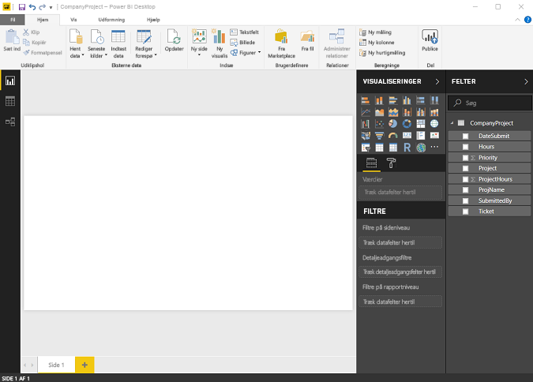
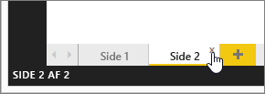

# Rapportvisning i Power BI Desktop
Hvis du har arbejdet med Power BI, ved du, hvor let det er at oprette rapporter med dynamiske perspektiver, og som giver indsigt i dine data. Power BI har også mere avancerede funktioner i Power BI Desktop. Med Power BI Desktop kan du oprette avancerede forespørgsler, mikse data fra flere kilder, oprette relationer mellem tabeller med mere.

Power BI Desktop indeholder **Rapportvisning**, hvor du kan oprette et vilkårligt antal rapportsider med visualiseringer. Rapportvisning giver dig stort set samme designoplevelse som Redigeringsvisning i en rapport i Power BI-tjenesten. Du kan f.eks. flytte visualiseringer rundt og kopiere, indsætte og flette dem.

Forskellen mellem dem er, at når du bruger Power BI Desktop, kan du arbejde med dine forespørgsler og modellere dine data for at sikre, at dataene giver den bedste indsigt i dine rapporter. Du kan derefter gemme din Power BI Desktop-fil et sted efter eget valg, uanset om det er på dit lokale drev eller i cloudmiljøet.

## Lad os se!
Når du indlæser data i Power BI Desktop for første gang, får du vist **Rapportvisning** med et tomt canvas.

Du kan skifte mellem **Rapportvisning**, **Datavisning** og **Relationsvisning** ved at vælge ikonerne på navigationslinjen til venstre:

Når du har tilføjet nogle data, kan du føje felter til en ny visualisering på canvasset.

Hvis du vil ændre visualiseringstypen, kan du vælge den i gruppen **Visualisering** på båndet, eller du kan højreklikke og vælge en anden type vha. ikonet **Skift visualiseringstype**.

> [!TIP]
> Sørg for at eksperimentere med forskellige visualiseringstyper. Det er vigtigt, at din visualisering formidler oplysningerne i dine data klart.
> 
> 

En rapport har mindst én tom side til at starte med. Sider vises i navigationsruden lige til venstre for canvasset. Du kan føje alle mulige visualiseringer til en side, men det er vigtigt ikke at overdrive. Hvis du har for mange visualiseringer på en side, ser det rodet ud, og det kan være svært at finde de relevante oplysninger. Du kan tilføje nye sider i din rapport. Du skal blot klikke på **Ny side** på båndet.

Hvis du vil slette en side, skal du klikke på **X** på fanen for siden nederst i Rapportvisningen.

> [!NOTE]
> Rapporter og visualiseringer kan ikke fastgøres til et dashboard i Power BI Desktop. Hvis du vil gøre dette, skal du [udgive fra Power BI Desktop](desktop-upload-desktop-files.md) på dit Power BI-websted.

## Skjul rapportsider

Når du opretter en rapport, kan du også skjule sider i rapporten. Det kan være nyttigt, hvis du har brug for at oprette underliggende data eller visualiseringer i rapporten, men ikke ønsker, at disse sider skal være synlige for andre, f.eks. når du opretter tabeller eller understøttende visualiseringer, som bruges på andre rapportsider. Der kan være mange andre kreative årsager til, at du vil oprette en rapportside og derefter skjule den i en rapport, du vil publicere. 

Det er nemt at skjule en rapportside. Du skal blot højreklikke på rapportsidens fane og vælge **Skjul** i den menu, der vises.

Du skal dog gøre nogle få overvejelser, når du skjuler en rapportside:

* Du kan stadig se en skjult rapportvisning i **Power BI Desktop**, selvom sidens titel er nedtonet. På følgende billede er side 4 skjult.

    

* Du *kan ikke* se en skjult rapportside, når du får vist rapporten i **Power BI-tjenesten**.

* Det er *ikke* en sikkerhedsforanstaltning at skjule en rapportside. Brugerne kan stadig tilgå siden, og sidens indhold er stadig tilgængelig vha. detaljeadgang og andre metoder.

* Når en side er skjult, vises der ingen navigationspile i Visningstilstand.

