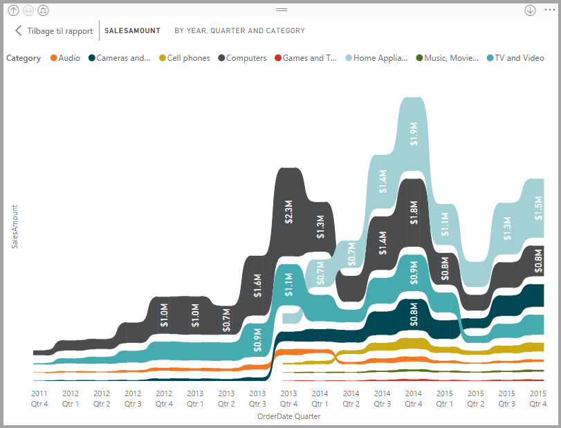
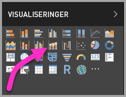
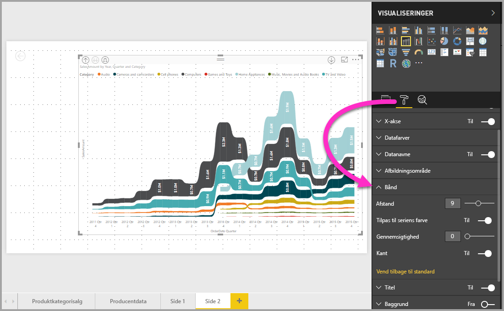

# Brug bånddiagrammer i Power BI
Du kan bruge bånddiagrammer i **Power BI** til at visualisere data og hurtigt finde ud af, hvilken kategori af data der har den højeste placering (største værdi). Bånddiagrammer er effektive til at vise ændringer af placeringer, hvor den højeste placering (værdi) altid vises øverst for hver tidsperiode. Bånddiagrammer er tilgængelige i **Power BI Desktop** fra og med udgivelsen i september 2017 og i efterfølgende opdateringer til **Power BI-tjenesten**.

## Opret et bånddiagram
Du opretter et bånddiagram ved at vælge **bånddiagram** på panelet **Visualiseringer**.

Med bånddiagrammer tilknyttes en kategori af data for den visualiserede tidsperiode ved hjælp af bånd, hvilket gør det muligt at se, hvordan en bestemt kategori placeres over hele diagrammets x-akse (normalt tidslinjen).

## Formatér et bånddiagram
Når du opretter et bånddiagram, er der formateringsindstillinger tilgængelige under afsnittet **Format** i ruden **Visualiseringer**. Formateringsindstillingerne for bånddiagrammer ligner indstillingerne for et stablet søjlediagram, men byder på yderligere formateringsindstillinger, som er specifikke for båndene.

Ved hjælp af disse formateringsindstillinger for bånddiagrammer kan du justere følgende:

* **Afstand** gør det muligt at justere, hvor meget plads der vises mellem båndene. Tallet er procentdelen af kolonnens maksimumhøjde.
* **Match seriens farve** gør det muligt at matche farven på båndene med seriens farve. Når den er slået fra, er båndene grå.
* **Gennemsigtighed** angiver, hvor gennemsigtige båndene er. Standardværdien er angivet til 30.
* **Kant** gør det muligt at placere en mørk kant øverst og nederst på båndene. Kanter er som standard slået fra.

## Næste trin
Du kan finde flere oplysninger om **Power BI Desktop**, og hvordan du kommer i gang, i følgende artikler.

* [Kom i gang med Power BI Desktop](desktop-getting-started.md)
* [Oversigt over forespørgsler i Power BI Desktop](desktop-query-overview.md)
* [Datakilder i Power BI Desktop](desktop-data-sources.md)
* [Opret forbindelse til data i Power BI Desktop](desktop-connect-to-data.md)
* [Udform og kombiner data med Power BI Desktop](desktop-shape-and-combine-data.md)
* [Almindelige forespørgselsopgaver i Power BI Desktop](desktop-common-query-tasks.md)   

