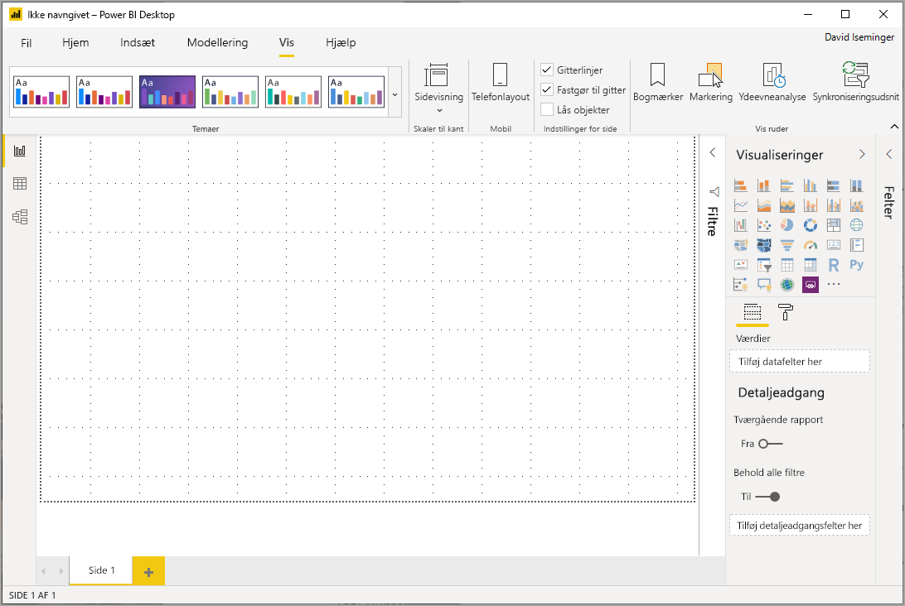
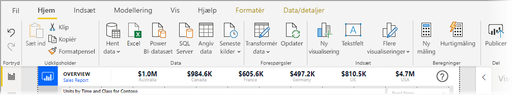
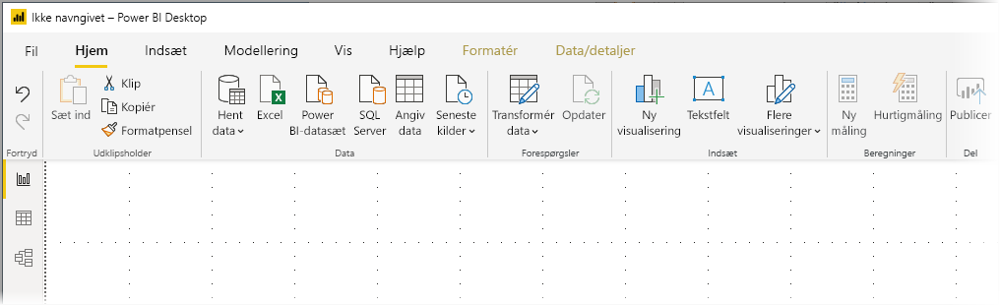
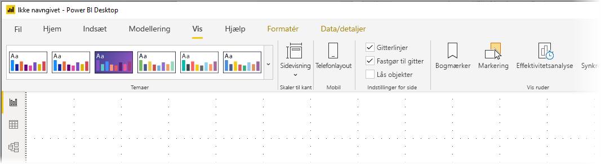
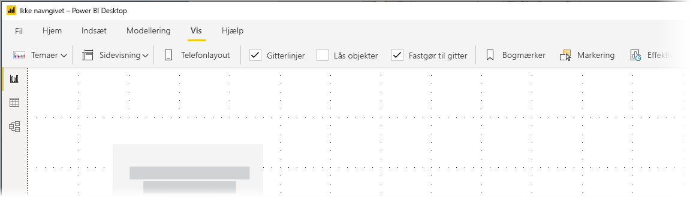

# Brug det opdaterede bånd i Power BI Desktop (eksempelvisning)

Fra og med den opdateringen fra november 2019 tilpasser Power BI Desktop sit bånd, så det matcher udseendet og oplevelsen i andre Microsoft-produkter, f. eks. Microsoft Office.

Det opdaterede bånd findes som prøveversion, så vi kan indsamle feedback fra brugere og kunder og sikre, at oplevelsen er fremragende. Vi forventer nogle få måneders prøveversion, feedback og forbedringer, før det opdaterede Power BI Desktop-bånd bliver offentligt tilgængeligt. 

## Sådan aktiverer du det opdaterede bånd

Det opdaterede bånd i Power BI er en prøveversionsfunktion, som skal aktiveres. Du aktiverer den ved at vælge **Fil > Indstillinger > Indstillinger** og derefter vælge **Funktioner i prøveversionen** i venstre kolonne. I højre rude findes valget **Opdateret bånd**. Markér afkrydsningsfeltet ud for **Opdateret bånd** for at aktivere prøveversionsfunktionen. Du skal genstarte Power BI Desktop, før prøveversionsfunktionen kan træde i kraft.

## Funktioner i det nye bånd

Opdateringen af vores bånd har til hensigt at gøre oplevelsen på tværs af Power BI Desktop samt i andre Microsoft-produkter nem og velkendt. 

Fordelene kan grupperes i følgende kategorier:

* **Forbedret udseende, funktionalitet og organisation** – ikonerne og funktionalitetet på det opdaterede Power BI Desktop bånd er tilpasset udseendet og organiseringen i de båndelementer, der findes i Office-programmerne.

    

* **Et galleri med intuitive temaer** – galleriet med temaer, der findes på båndet **Vis**, har det velkendte udseende og den funktionalitet, der kendes fra PowerPoint-temagalleriet. Således viser billederne på båndet, hvordan temaændringerne ser ud, hvis de anvendes på din rapport, f. eks. farvekombinationer og skrifttyper. 

    

* **Dynamisk indhold på båndet baseret på din visning** – på det eksisterende bånd for Power BI Desktop, var ikke-tilgængelige ikoner eller kommandoer blot nedtonede, hvilket gav en ikke-optimal oplevelse. På det opdaterede bånd vises og arrangeres ikonerne dynamisk, så du altid ved, hvilke muligheder der er tilgængelige for dig i den pågældende kontekst.

* **Et bånd med en enkelt linje, som er pladsbesparende, når den er skjult** – en anden fordel ved det opdaterede bånd er muligheden for at skjule selve båndet i en enkelt linje og dynamisk vise elementer på båndet på basis af konteksten. 

    

Ud over disse synlige ændringer giver et opdateret bånd også mulighed for, at vi kan foretage fremtidige opdateringer af Power BI Desktop og dets bånd, f. eks. følgende:

* Opret mere fleksible og intuitive kontrolelementer på båndet, f. eks. galleriet med visuals
* Føj de *sorte* og *mørkegrå* Office-temaer til Power BI Desktop
* Gør tilgængeligheden bedre

## Næste trin
Du kan oprette forbindelse til mange forskellige typer data ved hjælp af Power BI Desktop. Du kan finde flere oplysninger om datakilder i følgende ressourcer:

* [Hvad er Power BI Desktop?](desktop-what-is-desktop.md)
* [Datakilder i Power BI Desktop](desktop-data-sources.md)
* [Udform og kombiner data med Power BI Desktop](desktop-shape-and-combine-data.md)
* [Opret forbindelse til Excel-projektmapper i Power BI Desktop](desktop-connect-excel.md)   
* [Angiv data direkte i Power BI Desktop](desktop-enter-data-directly-into-desktop.md)   

