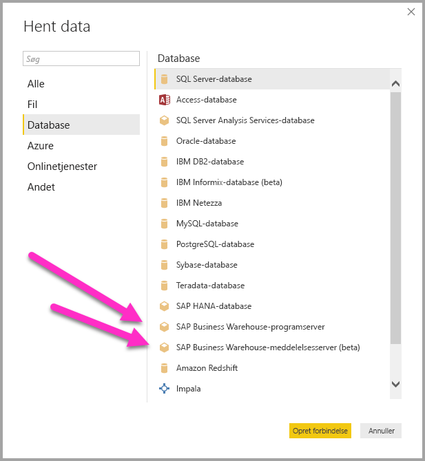
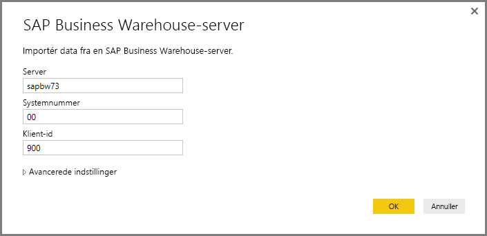
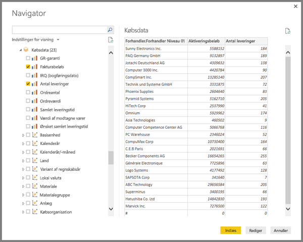
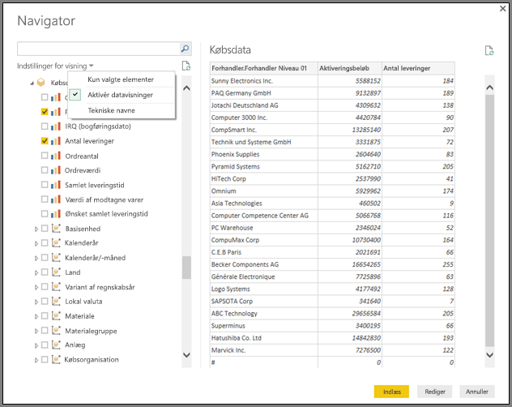
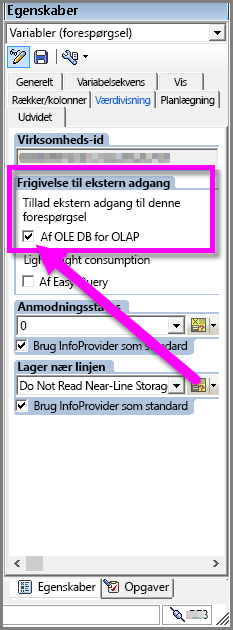

# Brug af SAP BW Connector i Power BI Desktop
Med Power BI Desktop har du adgang til data i **SAP Business Warehouse (BW)**.

Du kan få oplysninger om, hvordan SAP-kunder kan integrere Power BI i deres eksisterende SAP Business Warehouse (BW)-systemer i [Hvidbog til Power BI og SAP BW](https://aka.ms/powerbiandsapbw). Du kan få flere oplysninger om brug af DirectQuery med SAP BW i artiklen [DirectQuery og SAP Business Warehouse (BW)](desktop-directquery-sap-bw.md).

Fra og med udgivelsen af **Power BI Desktop** fra juni 2018 (og den offentligt tilgængelige udgivelse fra oktober 2018) kan du bruge SAP BW-connectoren med en implementering, der indeholder markante forbedringer af ydeevnen og egenskaberne. Denne opdaterede version af SAP BW-connectoren er udviklet af Microsoft og kaldes **Implementation 2.0**. Du kan vælge enten version 1 (v1) af **SAP BW Connector** eller **Implementation 2.0 SAP Connector**. I de følgende afsnit beskrives installationen af hver version. Du kan vælge den ene eller den anden connector, når du opretter forbindelse til SAP BW fra Power BI Desktop.

Vi foreslår, at du bruger **Implementation 2.0 SAP Connector**, når det er muligt.

## Installation af version 1 af SAP BW-connectoren
Vi anbefaler, at du bruger Implementation 2.0 SAP Connector, når det er muligt (se instruktionerne i følgende afsnit). I dette afsnit beskrives installationen af version 1 af **SAP BW Connector**, som du kan installere ved at følgende installationstrinnene:

1. Installér biblioteket **SAP NetWeaver** på din lokale computer. Du kan hente biblioteket **SAP Netweaver** fra SAP-administratoren eller direkte fra [SAP Software Download Center](https://support.sap.com/swdc). Da strukturen i **SAP Software Download Center** ofte ændres, kan vi ikke give en mere specifik vejledning til, hvordan du henter programmet. **SAP NetWeaver**-biblioteket er som regel medtaget i installationen af SAP-klientværktøjer.
   
   Du kan eventuelt søge efter *SAP-bemærkning nr. 1025361* for at få oplyst downloadplaceringen af den seneste version. Kontrollér, at arkitekturen i **SAP NetWeaver**-biblioteket (32-bit eller 64-bit) svarer til din **Power BI Desktop**-installation, og installér derefter alle filer, der er medtaget i **SAP NetWeaver RFC SDK** , i henhold til SAP-bemærkningen.
2. Dialogboksen **Hent data** indeholder en post for **SAP Business Warehouse Application Server** og **SAP Business Warehouse Message Server** i kategorien **Database**.
   
   

## Installation af Implementation 2.0 SAP Connector

**Implementation 2.0** af SAP-connectoren kræver SAP .NET Connector 3.0. Du kan [downloade SAP .NET Connector 3.0](https://support.sap.com/en/product/connectors/msnet.html) fra SAPs websted ved at bruge dette link:

* [SAP .NET Connector 3.0](https://support.sap.com/en/product/connectors/msnet.html)

Adgang til download kræver en gyldig S-bruger. Kunderne opfordres til at kontakte deres SAP Basis-team for at få SAP .NET Connector 3.0. 

Connectoren kommer i 32-bit- og 64-bit-versioner, og brugerne *skal* vælge den version, der matcher deres Power BI Desktop-installation. Når dette skrives, findes der to versioner på webstedet (til .NET 4.0-framework):

* SAP Connector til Microsoft .NET 3.0.20.0 til Windows 32-bit (x86) som ZIP-fil (6.896 KB), 16. januar 2018
* SAP Connector til Microsoft .NET 3.0.20.0 til Windows 64-bit (x64) som ZIP-fil (7.180 KB), 16. januar 2018

Når du installerer, skal du vælge **Install assemblies to GAC** i vinduet *Optional setup steps* som vist vises i følgende billede.

> [!NOTE]
> Den første version af SAP BW-standardimplementeringer kræver Netweaver DLL-filer. Hvis du bruger Implementation 2.0 af SAP-connectoren, og du ikke bruger den første version, er Netweaver DLL-filerne ikke påkrævet.

## Funktioner i version 1 af SAP BW Connector
Med version 1 af **SAP BW Connector** i Power BI Desktop kan du importere data fra dine **SAP Business Warehouse Server**-kuber eller bruge DirectQuery. 

Du kan finde flere oplysninger om **SAP BW Connector**, og hvordan du bruger den med DirectQuery, i artiklen [DirectQuery og SAP Business Warehouse (BW)](desktop-directquery-sap-bw.md).

Når du opretter forbindelse, skal du angive en *server*, et *systemnummer* og et *klient-id* for at oprette forbindelsen.

Du kan også angive to ekstra **avancerede indstillinger**: sprogkode og en brugerdefineret MDX-sætning, der skal køre mod den angivne server.

Hvis der ikke er angivet en MDX-sætning, får du vist vinduet **Navigator**, som viser listen over de kuber, der er tilgængelige på serveren, og du får mulighed for at foretage detailudledning og vælge elementer fra de tilgængelige kuber, herunder dimensioner og målinger. Power BI viser forespørgsler og kuber, der er vist af [BW Open Analysis Interface OLAP BAPI'er](https://help.sap.com/saphelp_nw70/helpdata/en/d9/ed8c3c59021315e10000000a114084/content.htm).

Når du vælger ét eller flere elementer fra serveren, oprettes der et eksempel på outputtabellen baseret på valget.

Vinduet **Navigator** indeholder også et par **visningsindstillinger**, der giver dig mulighed at gøre følgende:

* **Vis *Kun markerede elementer* over for *Alle elementer* (standardvisning):** Denne indstilling er nyttig, når det sidste sæt elementer, der er valgt, skal bekræftes. En alternativ metode til at få vist dette er at vælge *Kolonnenavne* i området *Eksempel*.
* **Aktivér datavisninger (standard):** Du kan også styre, om dataeksempler skal vises i denne dialogboks. Deaktivering af dataeksempler reducerer antallet af kald til serveren, fordi der ikke længere anmodes om data til eksempelvisningerne.
* **Tekniske navne:** SAP BW understøtter *tekniske navne* for objekter i en kube. Tekniske navne giver ejeren af en kube mulighed for at vise *brugervenlige* navne for kubeobjekter i modsætning til kun at vise de *fysiske navne* for disse objekter i kuben.

Når du har valgt alle nødvendige objekter i **Navigator**, kan du bestemme, hvad du derefter vil foretage dig, ved at vælge en af følgende knapper nederst i **Navigator**-vinduet:

* Vælger du **Indlæs**, starter dette indlæsning af hele rækkesæt til outputtabellen til Power BI Desktop-datamodellen, og derefter kommer du til visningen **Rapport**, hvor du kan begynde at visualisere dataene eller foretage yderligere ændringer ved hjælp af visningerne **Data** eller **Relationer**.
* Hvis du vælger **Rediger**, vises **Forespørgselseditor**, hvor du kan udføre yderligere datatransformation og filtrere trin, før hele sættet af rækker overføres til Power BI Desktop-datamodellen.

Ud over at importere data fra **SAP BW**-kuber, skal du huske på, at du også kan importere data fra en lang række andre datakilder i Power BI Desktop og derefter samle dem til en enkelt rapport. Dette giver mange typer interessante scenarier til rapportering og analyser ud fra **SAP BW**-data.

## Brug af Implementation 2.0 SAP BW Connector

Du skal oprette en ny forbindelse for at bruge Implementation 2.0 af SAP BW-connectoren. Følg disse trin for at oprette en ny forbindelse.

1. I vinduet **Hent data** skal du vælge enten **SAP Business Warehouse Application Server** eller **SAP Business Warehouse Message Server**.

2. Du får vist dialogboksen Ny forbindelse, hvor du kan vælge implementeringen. Hvis du vælger **Implementation 2.0** som i det følgende billede, bliver indstillingerne Eksekveringstilstand, Batchstørrelse og Aktivér karakteristiske strukturer aktiveret.

    

3. Vælg **OK**. Derefter er **Navigator** den samme som beskrevet i det tidligere afsnit for version 1 af SAP BW-connectoren. 

### Nye indstillinger for Implementation 2.0 

Implementation 2.0 understøtter følgende indstillinger:

1. **ExecutionMode** – angiver den MDX-grænseflade, der bruges til at udføre forespørgsler på serveren. Der er følgende gyldige indstillinger:

        a. SapBusinessWarehouseExecutionMode.BasXml
        b. SapBusinessWarehouseExecutionMode.BasXmlGzip
        c. SapBusinessWarehouseExecutionMode.DataStream

    Standardværdien for denne indstilling er SapBusinessWarehouseExecutionMode.BasXmlGzip.

    Hvis du bruger *SapBusinessWarehouseExecutionMode.BasXmlGzip*, kan det forbedre ydeevnen, hvis der er høje ventetider for store datasæt.

2. **BatchSize** – angiver det maksimale antal rækker, der hentes ad gangen, når der udføres en MDX-sætning. Et lille antal rækker bliver vil medføre flere kald til serveren, når der hentes store datasæt. Et stort antal rækker kan forbedre ydeevnen, men det kan medføre hukommelsesproblemer på SAP BW-serveren. Standardværdien er 50.000 rækker.

3. **EnableStructures** – en logisk værdi, der indikerer, om der genkendes karakteristiske strukturer. Standardværdien for denne indstilling er falsk. Påvirker listen over de objekter, der kan vælges. Dette understøttes ikke med oprindelige forespørgsler.

Indstillingen **ScaleMeasures** frarådes i denne implementering. Funktionen er nu den samme som indstillingen *ScaleMeasures = false*, som altid viser ikke-skalerede værdier.

### Yderligere forbedringer for Implementation 2.0 

I følgende opstilling beskrives nogle yderligere forbedringer i den nye implementering:

* Bedre ydeevne
* Mulighed for at hente flere millioner rækker af data og at finjustere ved hjælp af parameteren for batchstørrelsen.
* Muligheden for at skifte kørselstilstand.
* Understøttelse af komprimeret tilstand. Dette er især praktisk for forbindelse med høje ventetider eller store datasæt.
* Forbedret registrering af datovariabler
* [Eksperimentel] Vis dimensionerne Dato (ABAP-typen DATS) og Klokkeslæt (ABAP-typen TIMS) som datoer og klokkeslæt i stedet for som tekstværdier.
* Bedre håndtering af undtagelser. De fejl, der opstår i BAPI-kald, bliver nu vist.
* Kolonnefoldning i tilstandene BasXml og BasXmlGzip. Hvis den genererede MDX-forespørgsel for eksempel henter 40 kolonner, men det aktuelle valg kun skal bruge 10, vil denne anmodning blive overført til serveren for at hente et mindre datasæt.

### Ændrer eksisterende rapporter til at bruge Implementation 2.0 

Det er kun muligt at ændre eksisterende rapporter til at bruge **Implementation 2.0** i importtilstand, og det kræver følgende manuelle trin.

1. Åbn en eksisterende rapport, vælg **Rediger forespørgsler** på båndet, og vælg derefter den SAP Business Warehouse-forespørgsel, du vil opdatere.

2. Højreklik på forespørgslen, og vælg **Avanceret editor**.

3. I **Avanceret editor** skal du ændre kaldet til SapBusinessWarehouse.Cubes på følgende måde: 

    a. Find ud af, om forespørgslen allerede indeholder en post med indstillinger som i eksemplet nedenfor:

    

    b. Hvis det er tilfældet, skal du tilføje indstillingen Implementation 2.0 og fjerne indstillingen ScaleMeasures, hvis den findes, som vist her:

    

    c. Hvis forespørgslen ikke allerede indeholder en post med indstillinger, skal du tilføje den. Hvis den f.eks. har følgende:

    

    d. Skal du ændre den til:

    

4. Vi har gjort alt for at gøre Implementation 2.0 af SAP BW-connectoren kompatibel med version 1 af SAP BW-connectoren. Der kan dog være nogle forskelle på grund af de forskellige SAP BW MDX-udførelsestilstande. Du kan forsøge at løse eventuelle uoverensstemmelser ved at skifte til en anden udførelsestilstand.

## Fejlfinding
Dette afsnit indeholder fejlfindingssituationer (og løsninger) til arbejdet med **SAP BW**-connectoren.

1. Numeriske data fra **SAP BW** returnerer decimaltegn i stedet for kommaer. 1,000,000 returneres f.eks. som 1.000.000.
   
   **SAP BW** returnerer decimaldata med enten et *,* (komma) eller et *.* (punktum) som decimalseparator. Når det skal angives, hvilken af dem **SAP BW** skal bruge som decimalseparator, foretager driveren, der bruges af **Power BI Desktop**, et kald til *BAPI_USER_GET_DETAIL*. Dette kald returnerer en struktur kaldet **DEFAULTS** (Standarder), som indeholder feltet *DCPFM*, hvor *decimalformatets notation* er gemt. Det kan have en af følgende tre værdier:
   
       ‘ ‘ (space) = Decimal point is comma: N.NNN,NN
       'X' = Decimal point is period: N,NNN.NN
       'Y' = Decimal point is N NNN NNN,NN
   
   Kunder, der har rapporteret dette problem, har registreret, at kaldet til *BAPI_USER_GET_DETAIL* mislykkes for en bestemt bruger (den bruger, der vises de forkerte data), med en fejlmeddelelse, der er meget lig følgende:
   
       You are not authorized to display users in group TI:
           <item>
               <TYPE>E</TYPE>
               <ID>01</ID>
               <NUMBER>512</NUMBER>
               <MESSAGE>You are not authorized to display users in group TI</MESSAGE>
               <LOG_NO/>
               <LOG_MSG_NO>000000</LOG_MSG_NO>
               <MESSAGE_V1>TI</MESSAGE_V1>
               <MESSAGE_V2/>
               <MESSAGE_V3/>
               <MESSAGE_V4/>
               <PARAMETER/>
               <ROW>0</ROW>
               <FIELD>BNAME</FIELD>
               <SYSTEM>CLNTPW1400</SYSTEM>
           </item>
   
   For at løse problemet skal brugere bede deres SAP-administrator om at give den SAPBW-bruger, der anvendes i Power BI, ret til at udføre *BAPI_USER_GET_DETAIL*. Det er også en god ide at bekræfte, at brugeren har den krævede *DCPFM*-værdi som beskrevet tidligere i denne fejlfindingsløsning.
   
2. **Forbindelse til SAP BEx-forespørgsler**
   
   Du kan udføre **BEx**-forespørgsler i Power BI Desktop ved at aktivere en bestemt egenskab som vist i følgende billede:
   
   
   
3. Der vises ikke et eksempel på data i vinduet **Navigator**, men i stedet vises fejlmeddelelsen *Objektreferencen er ikke indstillet til en forekomst af et objekt*.
   
   SAP-brugere skal have adgang til bestemte BAPI-funktionsmoduler for at få metadata og hente data fra SAP BW's InfoProviders. Disse omfatter:
   * BAPI_MDPROVIDER_GET_CATALOGS
   * BAPI_MDPROVIDER_GET_CUBES
   * BAPI_MDPROVIDER_GET_DIMENSIONS
   * BAPI_MDPROVIDER_GET_HIERARCHYS
   * BAPI_MDPROVIDER_GET_LEVELS
   * BAPI_MDPROVIDER_GET_MEASURES
   * BAPI_MDPROVIDER_GET_MEMBERS
   * BAPI_MDPROVIDER_GET_VARIABLES
   * BAPI_IOBJ_GETDETAIL

   Du løser dette problem ved at bekræfte, at brugeren har adgang til de forskellige *MDPROVIDER*-moduler samt *BAPI_IOBJ_GETDETAIL*. Hvis du har brug for at foretage yderligere fejlfinding af dette eller lignende problemer, skal du vælge *Aktivér sporing* i vinduet *Diagnosticering* under *Indstillinger* i Power BI Desktop. Prøv at hente data fra SAP BW, mens sporing er aktiv, og kig i sporingsfilen for at få flere detaljer.

## Næste trin
Du kan finde flere oplysninger om SAP og DirectQuery i følgende ressourcer:

* [DirectQuery og SAP HANA](desktop-directquery-sap-hana.md)
* [DirectQuery og SAP Business Warehouse (BW)](desktop-directquery-sap-bw.md)
* [DirectQuery i Power BI](desktop-directquery-about.md)
* [Datakilder, der understøttes af DirectQuery](desktop-directquery-data-sources.md)
* [Hvidbog til Power BI og SAP BW](https://aka.ms/powerbiandsapbw)
