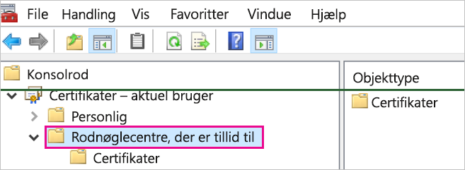
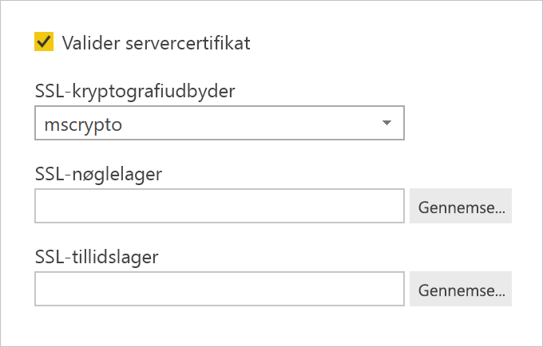

# <a name="enable-encryption-for-sap-hana"></a>Aktivér kryptering for SAP HANA

Vi anbefaler, at du krypterer forbindelser til en SAP HANA-server fra Power BI Desktop og Power BI-tjenesten. Du kan aktivere HANA-kryptering ved hjælp af både OpenSSL og SAP's beskyttede bibliotek CommonCryptoLib (tidligere kaldet sapcrypto). SAP anbefaler brug af CommonCryptoLib, men de grundlæggende krypteringsfunktioner er tilgængelige, uanset hvilket at disse biblioteker der bruges.

I denne artikel får du en oversigt over, hvordan du aktiverer kryptering ved hjælp af OpenSSL, og henvisninger til specifikke områder i SAP-dokumentationen. Vi opdaterer indhold og links med jævne mellemrum, men du kan altid finde detaljeret vejledning og support i den officielle SAP-dokumentation. Hvis du vil konfigurere kryptering ved hjælp af CommonCryptoLib i stedet for OpenSSL, kan du få mere at vide under [Sådan konfigurerer du TLS/SSL i SAP HANA 2.0](https://blogs.sap.com/2018/11/13/how-to-configure-tlsssl-in-sap-hana-2.0/). Hvis du vil have en trinvis vejledning til at migrere fra OpenSSL til CommonCryptoLib, kan du få mere at vide i [SAP note 2093286](https://launchpad.support.sap.com/#/notes/2093286) ( s-bruger er påkrævet).

> [!NOTE]
> De installationstrin til kryptering, der er beskrevet i denne artikel, overlapper trinnene til installation og konfiguration af SAML-enkeltlogon. Uanset om du vælger OpenSSL eller CommonCryptoLib som din HANA-servers kryptografiudbyder, skal du sørge for, at dit valg er konsekvent på tværs af SAML- og krypteringskonfigurationerne.

Der er fire faser i aktiveringen af kryptering til SAP HANA ved hjælp af OpenSSL. Vi beskriver disse faser herunder.  Du kan finde flere oplysninger i artiklen om [sikring af kommunikationen mellem SAP HANA Studio og SAP HANA-server via SSL](https://blogs.sap.com/2015/09/28/securing-the-communication-between-sap-hana-studio-and-sap-hana-server-through-ssl/).

## <a name="use-openssl"></a>Brug af OpenSSL

Sørg for, at din HANA-server er konfigureret til at bruge OpenSSL som kryptografiudbyder. Erstat de manglende stioplysninger nedenfor med server-id'et (SID) for din HANA-server.


## <a name="create-a-certificate-signing-request"></a>Oprettelse af en anmodning om certifikatsignering

Opret en anmodning om signering af et X509-certifikat for HANA-serveren.

1. Brug SSH til at oprette forbindelse til den Linux-maskine, hvorpå HANA-serveren kører som \<sid\>-administrator.

1. Gå til startmappen _/__usr/sap/\<sid\>/home_.

1. Opret en skjult mappe med navnet _. __ssl_, hvis der ikke allerede findes en.

1. Kør følgende kommando:

    ```
    openssl req -newkey rsa:2048 -days 365 -sha256 -keyout Server\_Key.pem -out Server\_Req.pem -nodes
    ```

Denne kommando opretter en anmodning om certifikatsignering og en privat nøgle. Når certifikatet er signeret, gælder det i et år (se parameteren -days). Når du bliver bedt om at angive det almindelige navn (CN), skal du angive det fuldt kvalificerede domænenavn (FQDN) for den computer, hvorpå HANA-serveren er installeret.

## <a name="get-the-certificate-signed"></a>Hentning af det signerede certifikatet

Hent certifikatet, der er signeret af et nøglecenter (CA), som de klienter, der skal bruges til at oprette forbindelse til HANA-serveren, har tillid til.

1. Hvis du allerede har et virksomhedsnøglecenter, der er tillid til (angivet som CA\_Cert.pem og CA\_Key.pem i følgende eksempel), skal du signere certifikatanmodningen ved at køre følgende kommando:

    ```
    openssl x509 -req -days 365 -in Server\_Req.pem -sha256 -extfile /etc/ssl/openssl.cnf -extensions usr\_cert -CA CA\_Cert.pem -CAkey CA\_Key.pem -CAcreateserial -out Server\_Cert.pem
    ```

    Hvis du ikke allerede har et nøglecenter, du kan bruge, kan du selv oprette et rodnøglecenter ved at følge trinene i bloggen om [sikring af kommunikationen mellem SAP HANA Studio og SAP HANA Server via SSL](https://blogs.sap.com/2015/09/28/securing-the-communication-between-sap-hana-studio-and-sap-hana-server-through-ssl/).

1. Opret certifikatkæden for HANA-serveren ved at kombinere servercertifikatet, nøglen og nøglecenterets certifikat (navnet key.pem er konventionen for SAP HANA):

    ```
    cat Server\_Cert.pem Server\_Key.pem CA\_Cert.pem \> key.pem
    ```

1. Opret en kopi af CA\_Cert.pem med navnet trust.pem (navnet trust.pem er konventionen for SAP HANA):

    ```
    cp CA\_Cert.pem trust.pem
    ```

1. Genstart HANA-serveren.

1. Kontrollér tillidsforholdet mellem en klient og det nøglecenter, du brugte til at signere SAP HANA-serverens certifikat.

    Klienten skal have tillid til det nøglecenter, der bruges til at signere HANA-serverens X509-certifikat, før der kan etableres en krypteret forbindelse til HANA-serveren fra klientens maskine.

    Der findes forskellige metoder til at sikre, at denne tillidsrelation eksisterer, ved hjælp af Microsoft Management Console (MMC) eller kommandolinjen. Du kan importere nøglecentrets X509-certifikat (trust.pem) til mappen **Rodnøglecentre, der er tillid til**, for den bruger, der skal etablere forbindelsen, eller til den samme mappe for selve klientmaskinen, hvis dette ønskes.

    

    Du skal først konvertere trust.pem til en .crt-fil, før du kan importere certifikatet til mappen Rodnøglecentre, der er tillid til, f.eks. ved at køre følgende OpenSSL-kommando:

    ```
    openssl x509 -outform der -in your-cert.pem -out your-cert.crt
    ```
    
    Du kan finde oplysninger om, hvordan du bruger OpenSSL til konverteringen, i [dokumentationen til OpenSSL](https://www.openssl.org/docs/manmaster/man1/x509.html).

## <a name="test-the-connection"></a>Test af forbindelsen

Test forbindelsen i Power BI Desktop eller Power BI-tjenesten.

1. I Power BI Desktop eller på siden **Administrer gateways** i Power BI-tjenesten skal du kontrollere, at **Valider servercertifikat** er aktiveret, før du forsøger at oprette forbindelse til din SAP HANA-server. Som **SSL-kryptografiudbyder** skal du vælge mscrypto, hvis du har fulgt installationstrinnene for OpenSSL, og commoncrypto, hvis du har konfigureret dette bibliotek som din kryptografiudbyder. Sørg for, at felterne SSL-nøglelager og SSL-tillidslager er tomme.

    - Power BI Desktop

        

    - Power BI-tjeneste

        

1. Kontrollér, at du kan oprette en krypteret forbindelse til serveren med indstillingen **Valider servercertifikat** aktiveret, ved at indlæse data i Power BI Desktop eller ved at opdatere en publiceret rapport i Power BI-tjenesten.
