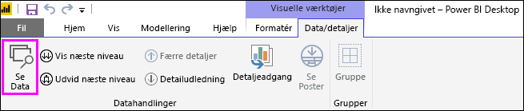
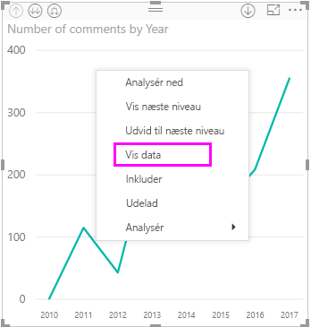
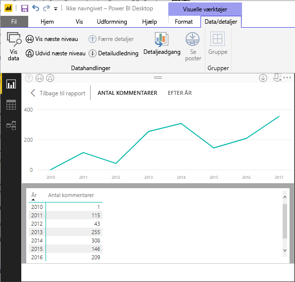
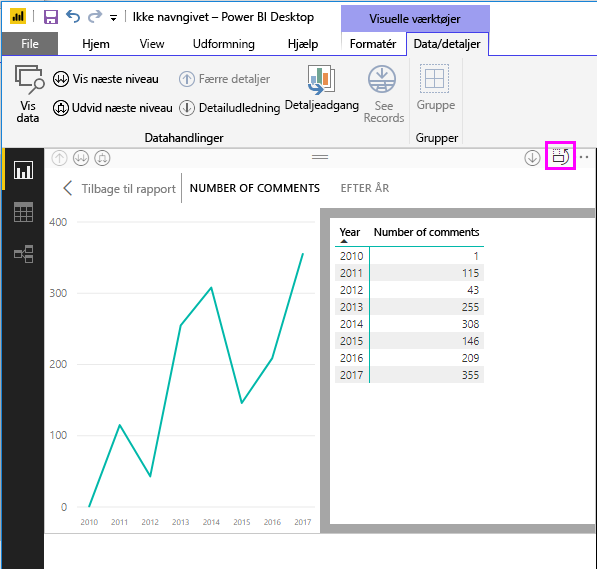
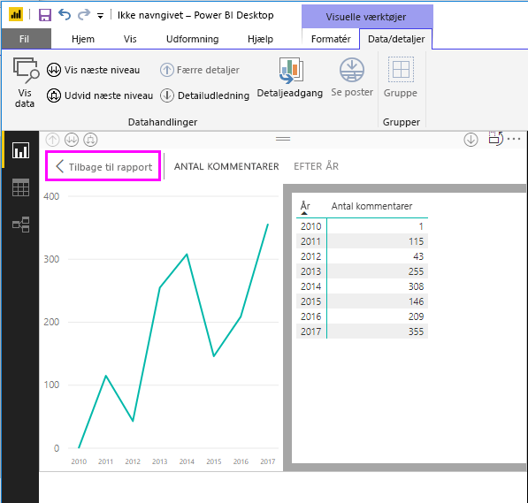
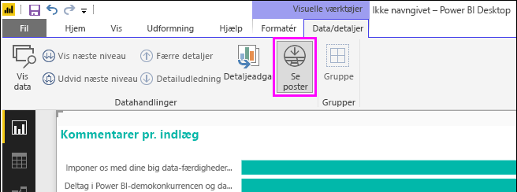
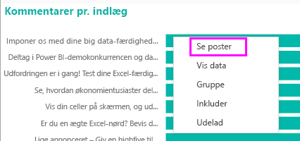
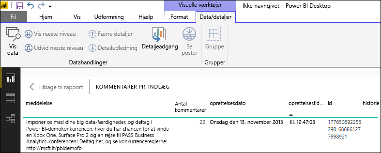
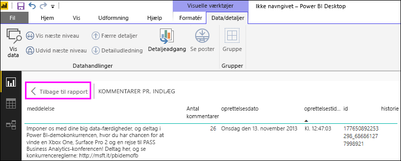

# Brug Vis data og Vis poster i visualiseringer i Power BI Desktop
I **Power BI Desktop** kan du analysere alle visualiseringers detaljer og få vist en tekstrepræsentation af de underliggende data eller enkelte dataposter for den valgte visual. Disse funktioner kaldes nogle gange for *klikfrekvens*, *detaljeadgang* eller *detaljeadgang til oplysninger*.

Du kan bruge **Vis data** til at få vist en tekstversion af de værdier, der bruges af den valgte visualisering, eller bruge **Vis poster** til at få vist alle dataene for en valgt post eller et valgt datapunkt. 

>[!IMPORTANT]
>**Vis Data** og **Vis poster** understøtter kun følgende visualiseringstyper:
>  - Liggende søjlediagram
>  - Søjlediagram
>  - Kransediagram
>  - Kartogram
>  - Tragt
>  - Kort
>  - Cirkeldiagram
>  - Treemap

## Brug af Vis data i Power BI Desktop

**Vis Data** viser de data, der ligger under en visualisering. **Vis data** er placeret på fanen **Data/Analysér** i sektionen **Visual Tools** på båndet, når en visualisering vælges.

Du kan også se dataene ved at højreklikke på en visualisering og derefter vælge **Vis Data** i den menu, der vises, eller ved at vælge **Flere indstillinger** (...) i øverste højre hjørne af en visualisering og derefter vælge **Vis Data**.

&nbsp;&nbsp;

> [!NOTE]
> Du skal pege på et datapunkt i den pågældende visual, før højrekliksmenuen er tilgængelig.

Når du vælger **Vis data** eller **Få vist Data**, vises den pågældende visual og tekstrepræsentationen af dataene på canvasset i Power BI Desktop. I den *vandrette visning* vises den pågældende visual på den øverste halvdel af canvasset, og dataene vises på den nederste halvdel. 

Du kan skifte mellem den vandrette visning og en *lodret visning* ved at vælge ikonet i øverste højre hjørne på canvasset.

Du vender tilbage til rapporten ved at vælge **< Tilbage til rapport** i øverste venstre hjørne på canvasset.

## Brug af Vis poster i Power BI Desktop

Du kan også fokusere på ét dataelement i en visualisering og analysere de underliggende data. Du bruger **Vis poster** ved at vælge en visualisering, derefter vælge **Vis poster** på fanen **Data/Analysér** i afsnittet **Visual Tools** på båndet og derefter vælge et datapunkt eller en datarække på visualiseringen. 

> [!NOTE]
> Hvis knappen **Vis poster** på båndet er deaktiveret og nedtonet, betyder det, at den valgte visualisering ikke understøtter **Vis poster**.

Du kan også højreklikke på et dataelement og vælge **Vis poster** i den menu, der vises.

Når du vælger **Vis poster** for et dataelement, vises alle de data, der er tilknyttet det valgte element, på canvasset i Power BI Desktop. 

Du vender tilbage til rapporten ved at vælge **< Tilbage til rapport** i øverste venstre hjørne på canvasset.

> [!NOTE]
>**Vis poster** har følgende begrænsninger:
> - Du kan ikke ændre dataene i visningen **Vis poster** og gemme dem i rapporten.
> - Du kan ikke bruge **Vis poster**, når der benyttes en beregnet måling i den pågældende visual.
> - Du kan ikke bruge **Vis poster**, når du har forbindelse til en live flerdimensionel model.

## De næste trin
**Power BI Desktop** indeholder mange forskellige funktioner til formatering af rapporter og dataadministration. I følgende ressourcer kan du se nogle eksempler:

* [Brug gruppering og gruppering i beholder i Power BI Desktop](desktop-grouping-and-binning.md)
* [Brug gitterlinjer, fastgørelse til gitter, z-rækkefølge, justering og fordeling i Power BI Desktop-rapporter](desktop-gridlines-snap-to-grid.md)

