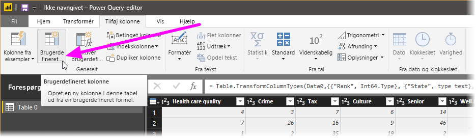
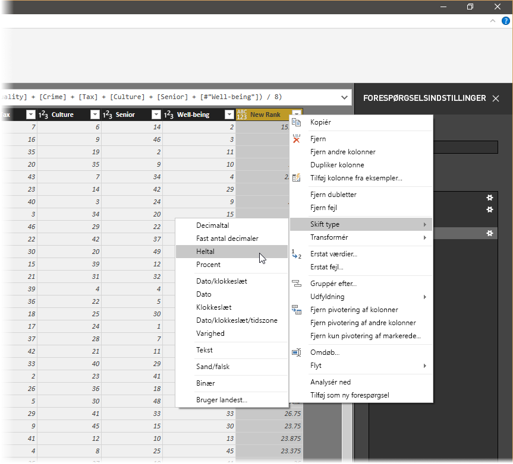
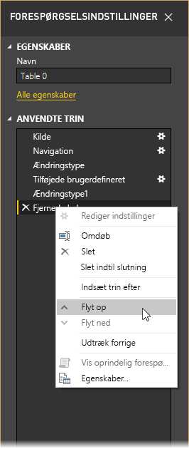
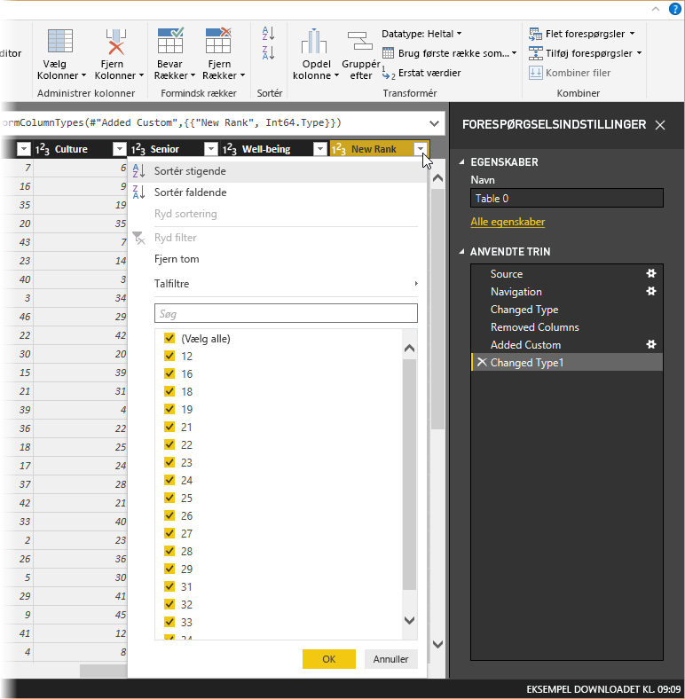
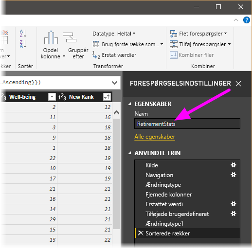
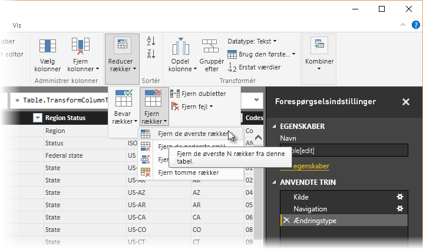
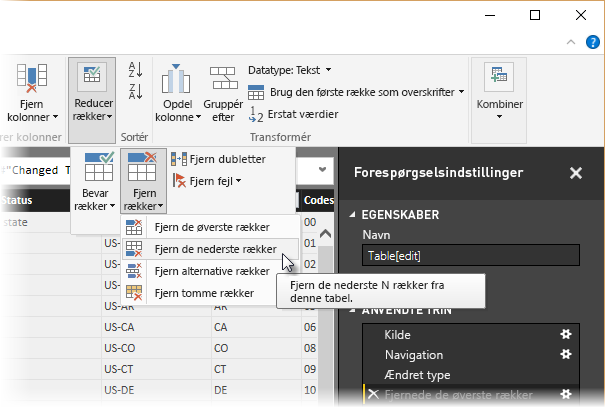
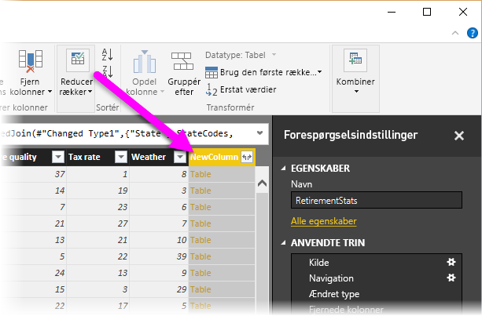

# Selvstudium: Form og kombiner data i Power BI Desktop

I **Power BI Desktop** kan du oprette forbindelse til mange forskellige typer datakilder og derefter forme dataene til dine behov, så du kan oprette visuelle rapporter, som du kan dele med andre. At *forme* data betyder, at dataene skal transformeres – for eksempel omdøbning af kolonner eller tabeller, ændring af tekst til tal, fjernelse af rækker, angivelse af den første række som overskrifter osv. At *kombinere* data betyder, at der oprettes forbindelse til to eller flere datakilde, dataene formes efter behov, og de konsolideres derefter i én forespørgsel.

I dette selvstudium lærer du, hvordan du kan:

* Forme data ved hjælp af **forespørgselseditoren**
* Oprette forbindelse til en datakilde
* Oprette forbindelse til en anden datakilde
* Kombinere datakilderne og oprette en datamodel, der skal bruges i rapporter

I dette selvstudium vises, hvordan en forespørgsel formes ved hjælp af Power BI Desktop, og nogle af de mest almindelige opgaver fremhæves. Den forespørgsel, der bruges her, er beskrevet mere detaljeret under [Introduktion til Power BI Desktop](desktop-getting-started.md), hvor du også kan se, hvordan de opretter forespørgslen fra bunden.

Det er praktisk at vide, at du kan bruge genvejsmenuer og båndet i **Forespørgselseditor** i Power BI Desktop. Det meste af det, du kan vælge på båndet **Transformér**, er også tilgængeligt, hvis du højreklikker på et element (f.eks. en kolonne) og vælger i den viste menu.

## Form data
Når du former data i Forespørgselseditor, angiver du en trinvis vejledning (som Forespørgselseditor udfører for dig) for at justere datamængden, efterhånden som Forespørgselseditor indlæser og præsenterer dem. Den oprindelige datakilde påvirkes ikke. Det er kun denne bestemte visning af dataene, der justeres eller *formes*.

De angivne trin (f.eks. omdøbning af en tabel, transformation af en datatype eller sletning af kolonner) registreres af Forespørgselseditor, og hver gang denne forespørgsel opretter forbindelse til datakilden, udføres disse trin, så dataene er altid er formet på den måde, du angiver. Denne proces foregår, når du bruger Forespørgselseditor i Power BI Desktop, eller hvis andre bruger din delte forespørgsel, for eksempel i **Power BI**-tjenesten. Disse trin er hentet, i rækkefølge, i ruden **Forespørgselsindstillinger** under **Anvendte trin**.

På følgende billede vises ruden **Forespørgselsindstillinger** for en forespørgsel, som er formet – vi gennemgår hvert enkelt trin i de næste afsnit.

Hvis vi bruger de data fra [Introduktion til Power BI Desktop](desktop-getting-started.md), som blev hentet ved at oprette forbindelse til en Web-datakilde, kan vi forme dataene til vores behov.

Lad os starte med at tilføje en brugerdefineret kolonne til at beregne rangering, baseret på at alle data er ligeværdige faktorer, og sammenligne dette med _Rangering_ i den eksisterende kolonne.  Her er båndet **Tilføj kolonne** med en pil, der peger mod knappen **Brugerdefineret kolonne**, som du kan bruge til at tilføje en brugerdefineret kolonne.

I dialogboksen **Brugerdefineret kolonne** under **Nyt kolonnenavn** skal du angive _Ny rangering_, og under **Formel for brugerdefineret kolonne** skal du angive følgende:

    ([Cost of living] + [Weather] + [Health care quality] + [Crime] + [Tax] + [Culture] + [Senior] + [#"Well-being"]) / 8

Kontrollér, at der i statusmeddelelsen står _"Der er ikke registreret nogen syntaksfejl."_ Klik på **OK**.

For at sikre, at kolonnedataene er ensartet, skal vi transformere de nye kolonneværdier til heltal. Du skal blot højreklikke på kolonneoverskriften og vælge **Skift type \> Heltal** for at ændre dem. 

Hvis du har brug for at markere mere end én kolonne, skal du først markere en kolonne og derefter holde **Skift** nede, vælge yderligere tilstødende kolonner og derefter højreklikke på en kolonneoverskrift for at ændre alle de valgte kolonner. Du kan også holde **Ctrl** nede for at vælge kolonner, der ikke støder op til hinanden.

Du kan også *transformere* kolonnedatatyper via båndet **Transformér**. Her er båndet **Transformér** med en pil, der peger på knappen **Datatype**, som gør det muligt at transformere den aktuelle datatype til en anden.

Bemærk, at i ruden **Forespørgselsindstillinger** vil **Anvendte trin** afspejle de trin til formning, der er anvendt på dataene. Hvis jeg vil fjerne et trin fra formningsprocessen, skal jeg blot vælge **X** til venstre for trinnet. I det følgende billede afspejler **Anvendte trin** de trin, der er udført indtil videre: der er oprettet forbindelse til webstedet (**Kilde**), jeg har valgt tabellen (**Navigation**), og da tabellen blev indlæst, ændrede Forespørgselseditor automatisk tekstbaserede talkolonner fra *Tekst* til *Heltal* (**Ændret type**). De sidste to trin viser vores forrige handlinger med **Tilføjet brugerdefineret** og **Ændret type1**. 

Inden vi kan arbejde med forespørgslen, skal vi foretage nogle ændringer for at kunne arbejde med dataene, som vi gerne vil:

* *Juster rangering ved at fjerne en kolonne* – Vi har besluttet, at **Cost of living** ikke er en faktor i vores resultater. Når vi har fjernet denne kolonne, er der et problem med, at dataene er uforandret. Det er dog nemt at løse ved hjælp af Power BI Desktop, og når vi gør det, kan vi samtidigt se en fed funktion i **Anvendte trin** i Forespørgsel.
* *Løs nogle få fejl* – Da vi har fjernet en kolonne, har vi brug for at justere vores beregninger i kolonnen **Ny rangering**. Dette omfatter ændring af en formel.
* *Sortér data* – På baggrund af kolonnerne **Ny rangering** og **Rangering**. 
* *Erstat data* – Vi fremhæver, hvordan man erstatter en bestemt værdi og behovet for at indsætte et **Anvendt trin**.
* *Skift tabelnavnet* – **Tabel 0** er ikke en nyttig beskrivelse, men det er let at ændre navnet.

Du fjerner kolonnen **Cost of living** ved blot at markere kolonnen, vælge fanen **Hjem** på båndet og derefter trykke på **Fjern kolonner**, som vist på følgende figur.

Bemærk, at værdierne i _Ny rangering_ ikke er blevet ændret. Dette skyldes rækkefølgen af trinnene. Da Forespørgselseditor optager trinnene sekventielt, men stadig uafhængigt af hinanden, kan du flytte hvert trin under **Anvendte trin** op eller ned i sekvensen. Højreklik på et trin, hvorefter Forespørgselseditor viser en menu med følgende muligheder: **Omdøb**, **Slet**, **Slet** **indtil slutning** (fjern det aktuelle trin og alle efterfølgende trin), **Flyt op** eller **Flyt ned**. Flyt blot det sidste trin _Fjernede kolonner_ op for at justere over trinnet _Tilføjet brugerdefineret_.

Vælg derefter trinnet _Tilføjet brugerdefineret_. Bemærk, at dataene nu viser _Fejl_, hvilket vi skal håndtere. 

Der findes et par metoder til at få vist flere oplysninger om hver enkelt fejl. Du kan markere cellen (uden at klikke på ordet **Fejl**), eller du kan klikke direkte på ordet **Fejl**. Hvis du markerer cellen *uden* at klikke direkte på ordet **Fejl**, vises fejloplysningerne nederst i vinduet Forespørgselseditor.

Hvis du klikker direkte på ordet *Fejl*, vil Forespørgselseditor oprette et trin under **Anvendte trin** i ruden **Forespørgselsindstillinger** og vise oplysninger om fejlen. Vi vil ikke gå den vej, så vælg **Annuller**.

For at løse fejlene skal du vælge kolonnen _Ny rangering_ og derefter få vist kolonnens dataformel ved at åbne båndet **Vis** og markere afkrydsningsfeltet **Formellinje**. 

Du kan nu fjerne parameteren _Cost of living_ og formindske divisoren ved at ændre formlen til følgende: 

    Table.AddColumn(#"Removed Columns", "New Rank", each ([Weather] + [Health care quality] + [Crime] + [Tax] + [Culture] + [Senior] + [#"Well-being"]) / 7)

Vælg det grønne flueben til venstre for formelfeltet, eller tryk på **Enter**, så bør dataene blive erstattet med reviderede værdier, og trinnet **Tilføjet brugerdefineret** bør nu kunne fuldføres *uden fejl*.

> [!NOTE]
> Du kan også bruge **Fjern fejl** (på båndet eller i genvejsmenuen), som fjerner alle de rækker, som indeholder fejl. Dette ville fjerne alle rækker fra vores data, og det var ikke dét, vi ville gøre – vi vil have alle data med i tabellen.

Nu skal vi sortere dataene baseret på kolonnen **Ny rangering**. Vælg først det sidste anvendte trin, **Ændret type1** for at få de nyeste data. Vælg derefter rullemenuen ved siden af overskriften på kolonnen **Ny rangering**, og vælg **Sortér stigende**.

Bemærk, at dataene nu er sorteret i henhold til **Ny rangering**.  Men hvis du kigger i kolonnen **Rangering**, kan du se, at dataene ikke er sorteret korrekt i de tilfælde, hvor værdien **Ny rangering** er lig med Rangering. Du løser dette ved at vælge kolonne **Ny rangering** og ændre formlen i **Formellinjen** til følgende:

    = Table.Sort(#"Changed Type1",{{"New Rank", Order.Ascending},{"Rank", Order.Ascending}})

Vælg det grønne flueben til venstre for formelfeltet, eller tryk på **Enter**, så bør rækkerne blive sorteret i henhold til både _Ny rangering_ og _Rangering_.

Du kan desuden vælge et vilkårligt trin på listen **Anvendte trin** og fortsætte med at forme dataene på det trin i sekvensen. Forespørgselseditor vil automatisk indsætte et nyt trin direkte efter det aktuelt valgte trin under **Anvendte trin**. Lad os prøve.

Vælg først det **Anvendte trin**, før du tilføjer den brugerdefinerede kolonne. Dette er trinnet _Fjernede kolonner_. Her vil vi erstatte værdien af rangeringen af _Weather_ i Arizona. Højreklik på den relevante celle, der indeholder rangeringen af Arizonas _Weather_, og vælg *Erstat værdier...* i den viste menu. Læg mærke til, hvilket **Anvendt trin** der er valgt i øjeblikket (trinnet før _Tilføjet brugerdefineret_).

Da vi indsætter et trin, vises der en advarsel om dette, da efterfølgende trin kan medføre, at forespørgslen ikke fungerer som ventet. Det gælder om at være påpasselig og tænke sig om. Da dette er et selvstudium, vil jeg gerne fremhæve en virkelig sej funktion i Forespørgselseditor, så du kan se, hvordan du kan oprette, slette, indsætte og ændre rækkefølgen af trin. Her vil jeg beskrive funktionen **Indsæt**.

Ret værdien til _51_, så erstattes dataene for Arizona. Når der oprettes et nyt trin under Anvendte trin i Forespørgselseditor, navngives det baseret på handlingen, som i dette tilfælde er **Erstattet værdi**. Når du har mere end ét trin med samme navn i din forespørgsel, vil Forespørgselseditor tilføje et tal (i stigende rækkefølge) til hvert efterfølgende trin under **Anvendte trin** for at skelne mellem dem.

Vælg nu det sidste **Anvendte trin**, _Sorterede rækker_, og bemærk, at dataene har ændret sig i forhold til Arizonas nye rangering.  Dette skyldes, at vi indsatte trinnet _Erstattet værdi_ det rigtige sted, før trinnet _Tilføjet brugerdefineret_.

Det er blot et eksempel på, hvor effektiv og alsidig Forespørgselseditor kan være.

Til sidst vil jeg ændre navnet på tabellen til noget mere beskrivende. Når der skal oprettes rapporter, er det især praktisk at have beskrivende tabelnavne, hvis der oprettes forbindelse til flere datakilder, og de vises alle i ruden **Felter** i visningen **Rapport**.

Det er nemt at ændre tabelnavnet. Du skal blot skrive det nye navn under **Egenskaber** i ruden **Forespørgselsindstillinger** og trykke på **Enter**. Jeg kalder tabellen *RetirementStats*.

Nu er dataene blevet formet til det, vi skal bruge. Lad os derefter oprette forbindelse til en anden datakilde og kombinere dataene.

## Kombiner data
Dataene omkring de forskellige stater er interessante og kan bruges til at skabe yderligere analyser og forespørgsler. Men der er et problem: De fleste data anvender forkortelser på to bogstaver for statskoder og ikke statens fulde navn. Vi skal bruge en måde at knytte forkortelserne for staterne til deres navne på.

Vi er heldige. Der er en anden offentlig datakilde, som gør lige præcis dette, men den skal formes en del, før vi kan knytte den til vores pensioneringstabel. Her er webressourcen med forkortelser for stater:

<http://en.wikipedia.org/wiki/List_of_U.S._state_abbreviations>

På båndet **Hjem** i Forespørgselseditor skal du vælge **Ny kilde\> Web** og skrive adressen. Vælg **Opret forbindelse**, så vises resultaterne fra den pågældende webside i Navigator.

 

Vælg **Koder og forkortelser...** , da det omfatter de ønskede data, men det kræver lidt mere formning af dataene.

> [!TIP]
> Er der en hurtigere eller nemmere måde at udføre disse trin på? Ja, vi kunne oprette en *relation* mellem de to tabeller og forme dataene baseret på relationen. Det er stadig en god idé at følge trinnene herunder, da det er en god måde at lære at arbejde med tabeller på. Du skal bare også vide, at du kan bruge relationer til hurtigt at bruge data fra flere tabeller.
> 
> 

Du skal udføre følgende trin for at forme dataene:

* Fjern den øverste række – den er resultatet af den måde, websidens tabel blev oprettet på, og den har vi ikke brug for. Vælg **Formindsk rækker \> Fjern rækker \> Fjern de øverste rækker** under fanen **Home** .

Vinduet **Fjern de øverste rækker** åbnes, og du kan angive, hvor mange rækker du vil fjerne.

>[!NOTE]
>Hvis Power BI tilfældigvis importerer tabeloverskrifterne som en række i din datatabel, kan du vælge **Brug første række som overskrift** på båndet **Hjem** eller på fanen **Transformér** på båndet for at løse problemet i tabellen.

* Fjern de nederste 26 rækker – de indeholder alle territorierne, som vi ikke behøver at inkludere. Vælg **Formindsk rækker \> Fjern rækker \> Fjern de nederste rækker** under fanen **Hjem** .

* Da tabellen RetirementStats ikke indeholder oplysninger for Washington DC, skal vi filtrere dem fra listen. Vælg rullepilen ud for kolonnen Region Status, og fjern markeringen i afkrydsningsfeltet ud for **Federal district**.

* Fjern et par unødvendige kolonner – vi behøver kun tilknytningen af staten til den officielle forkortelse på to bogstaver, så vi kan fjerne følgende kolonner: **Column1**, **Column3**, **Column4** og derefter **Column6** til og med **Column11**. Start med at markere **Column1**, hold derefter tasten **Ctrl** nede, og markér de øvrige kolonner, der skal fjernes (du kan dermed markere flere rækker, der ikke støder op til hinanden). Vælg **Fjern kolonner \> Fjern kolonner** under fanen Hjem.

>[!NOTE]
>Dette er et godt tidspunkt at påpege, at *rækkefølgen* af de anvendte trin i Forespørgselseditor er vigtig, og den kan påvirke, hvordan datatypen formes. Det er også vigtigt at overveje, hvordan ét trin kan påvirke efterfølgende trin. Hvis du fjerner et trin fra Anvendte trin, fungerer de efterfølgende trin muligvis ikke som oprindeligt tiltænkt, på grund af effekten af rækkefølgen af trin i forespørgslen.

>[!NOTE]
>Hvis du gør vinduet med Forespørgselseditor smallere, vil nogle af elementerne på båndet bliver gjort mindre, så den synlige plads kan udnyttes bedre. Hvis du gør vinduet med Forespørgselseditor bredere, udvides elementerne på båndet, så det større område udnyttes bedst muligt.

* Omdøb kolonnerne og selve tabellen – som sædvanligt kan du omdøbe en kolonne på flere måder. Start med at markere kolonnen, og vælg enten **Omdøb** under **Transformér** på båndet, eller højreklik, og vælg **Omdøb** i menuen. I det følgende billede vises pile til begge muligheder. Du skal kun vælge den ene mulighed.

Jeg vælger at omdøbe dem til *State Name* og *State Code*. Hvis du vil omdøbe tabellen, skal du blot skrive et nyt navn i feltet **Navn** i ruden **Forespørgselsindstillinger**. Lad os kalde tabellen *StateCodes*.

Nu da tabellen StateCodes er formet til formålet, kan vi kombinere disse to tabeller eller forespørgsler i én. Da de tabeller, vi har nu, er et resultat af de forespørgsler, vi anvendte på dataene, refereres der ofte til dem som *forespørgsler*.

Der er to primære måder at kombinere forespørgsler på – *fletning* og *tilføjelse*.

Når du har en eller flere kolonner, som du vil føje til en anden forespørgsel, skal du **flette** forespørgslerne. Når du har flere rækker med data, som du vil føje til en eksisterende forespørgsel, skal du **tilføje** forespørgslen.

I dette tilfælde vil vi flette forespørgsler. Start med at vælge den forespørgsel i Forespørgselseditor, som den anden forespørgsel skal flettes *ind i*, hvilket i dette tilfælde er *RetirementStats*. Vælg derefter **Kombiner \> Flet forespørgsler** under fanen **Hjem** på båndet.

Du kan blive bedt om at angive beskyttelsesniveauer for at sikre, at dataene kombineres uden at medtage eller overføre data, du ikke ville overføre.

Vinduet **Flet** åbnes, og vi bliver bedt om at vælge, hvilken tabel vi vil flette med den valgte tabel, og derefter de tilsvarende kolonner, der skal bruges til fletningen. Vælg State i tabellen *RetirementStats* (forespørgsel), og vælg derefter forespørgslen *StateCodes* (let i dette tilfælde, da der kun er én anden forespørgsel – når du opretter forbindelse til mange forskellige datakilder, er der mange forespørgsler at vælge imellem). Når vi vælger de korrekte matchende kolonner – **State** fra *RetirementStats* og **State Name** fra *StateCodes* – ser vinduet **Flet** ud som følger, og knappen **OK** er aktiveret.

Den nye kolonne **NewColumn** oprettes i slutningen af forespørgslen, som er indholdet af tabellen (forespørgsel), der blev flettet med den eksisterende forespørgsel. Alle kolonner fra den flettede forespørgsel samles i **NewColumn**, men du kan vælge at **udvide** tabellen og inkludere de ønskede kolonner.

Hvis du vil udvide den flettede tabel og vælge, hvilke kolonner der skal inkluderes, skal du vælge udvidelsesikonet (). Vinduet **Udvid** vises.

I dette tilfælde vil vi kun have kolonnen **State Code**, så vi vælger kun den pågældende kolonne og vælger derefter **OK**. Jeg fjerner markeringen i afkrydsningsfeltet fra Brug det oprindelige kolonnenavn som præfiks, da vi ikke skal bruge det. Hvis vi bevarer markeringen, vil den flettede kolonne blive navngivet **NewColumn.State Code** (det oprindelige kolonnenavn, eller **NewColumn** efterfulgt af et punktum, hvorefter kolonnenavnet føres ind i forespørgslen).

>[!NOTE]
>Vil du prøve at importere tabellen **NewColumn**? Du kan eksperimentere lidt, og hvis du ikke kan lide resultatet, skal du bare slette dette trin på listen **Anvendte trin** i ruden **Forespørgselsindstillinger**. Din forespørgsel vender tilbage til tilstanden før trinnet **Udvid** blev anvendt. Du har mulighed for at prøve det af, så mange gange du har lyst, indtil udvidelsesprocessen ser ud, som den skal.

Vi har nu en enkelt forespørgsel (tabel), der kombinerer to datakilder, som er blevet formet efter vores behov. Denne forespørgsel kan fungere som udgangspunkt for mange ekstra, interessante dataforbindelser – f.eks. boligomkostningsstatistikker, demografi eller jobmuligheder i en vilkårlig stat.

Vælg **Luk og anvend** under fanen **Hjem** for at anvende ændringerne og lukke Forespørgselseditor. Det transformerede datasæt vises i Power BI Desktop, hvor du nu kan bruge det til at oprette rapporter.

## Næste trin
Du kan gøre mange forskellige ting med Power BI Desktop. Du kan finde flere oplysninger om funktionerne i følgende ressourcer:

* [Hvad er Power BI Desktop?](desktop-what-is-desktop.md)
* [Oversigt over forespørgsler i Power BI Desktop](desktop-query-overview.md)
* [Datakilder i Power BI Desktop](desktop-data-sources.md)
* [Opret forbindelse til data i Power BI Desktop](desktop-connect-to-data.md)
* [Almindelige forespørgselsopgaver i Power BI Desktop](desktop-common-query-tasks.md)   

