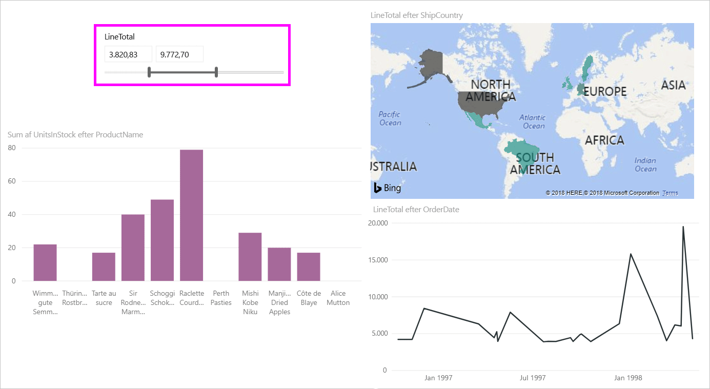
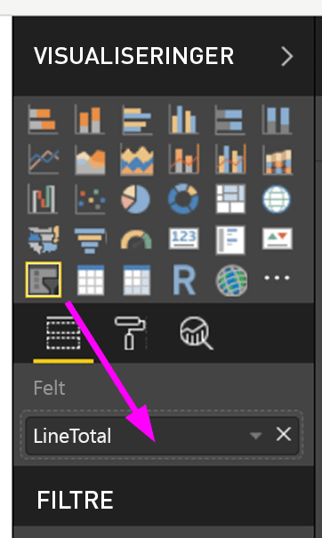
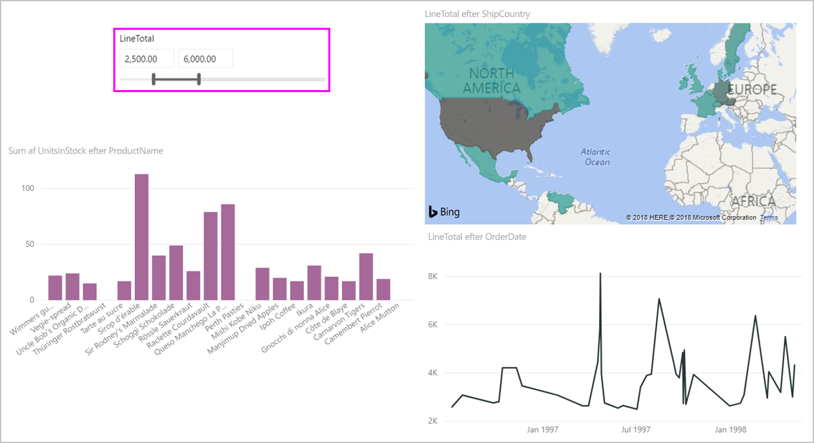
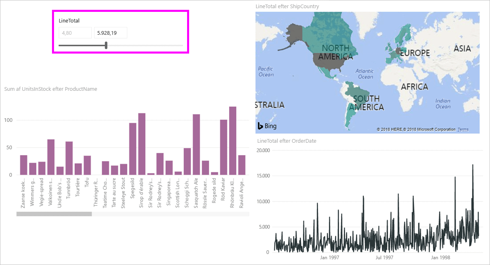
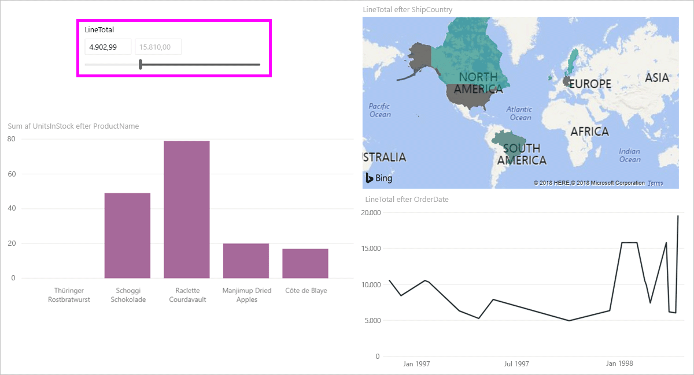

# Brug udsnitsværktøjet til numerisk område i Power BI Desktop
Med **udsnitsværktøjet til numerisk område** kan du anvende alle former for filtre på alle numeriske kolonner i din datamodel. Du kan vælge at filtrere **mellem** tal, **mindre end eller lig med** et tal eller **større end eller lig med** et tal. Det lyder måske meget enkelt, men det er en effektiv måde at filtrere dine data på.

## Brug udsnitsværktøjet til numerisk område
Du kan bruge udsnitsværktøjet til numerisk område på samme måde som alle andre udsnitsværktøjer. Du skal bare oprette et **udsnitsværktøj**, der er synligt for din rapport, og derefter vælge en numerisk værdi for **Felt**-værdien. På følgende billede er feltet *LineTotal* markeret.

Hvis du vælger linket pil ned i øverste højre hjørne af **udsnitsværktøjet til numerisk område**, vises der en menu.

I forbindelse med det numeriske område kan du vælge mellem følgende tre muligheder:

* Mellem
* Mindre end eller lig med
* Større end eller lig med

Når du vælger **Mellem** i menuen, vises der en skyder, og du kan filtrere efter numeriske værdier, der ligger mellem tallene. Udover at bruge selve skyderen kan du også klikke i felterne og skrive værdierne. Det er praktisk, når du vil opdele specifikke tal, men kornetheden ved at flytte skyderen gør det vanskeligt at lande nøjagtigt på tallet.

På følgende billede er rapportsiden filtreret for *LineTotal*-værdier mellem 2500.00 og 6000.00.

Når vi vælger **Mindre end eller lig med**, forsvinder venstre håndtag (den laveste værdi) for skyderen, og vi kan kun justere den øvre grænse for skyderen. På følgende billede angiver vi skyderen til maksimalt 5928.19.

Og endelig, hvis vi vælger **Større end eller lig med** forsvinder højre håndtag til skyderen (den højeste værdi), og vi kan justere den laveste værdi, som vist på følgende billede. Nu vises der kun elementer, der har en *LineTotal*, som er større end eller lig med 4902.99, i de visuelle elementer på rapportsiden.

## Fastgør til hele tal ved hjælp af udsnitsværktøj til numerisk område

Et udsnitsværktøj til et numerisk område fastgøres til heltal, hvis datatypen for det underliggende felt er **Heltal**. Dermed kan udsnitsværktøjet nemt afstemme to hele tal. Felter af typen **Decimaltal** kan indtastes eller vælges som brøkdele af et tal. Den formatering, der anvendes i tekstfeltet, matcher den formatering, der er anvendt i feltet, selvom du kan indtaste eller vælge mere præcise tal.

## Vis formatering med udsnitsværktøjet til datoområder

Når du bruger et udsnitsværktøj til at få vist eller angive en række datoer, vises formatet af datoen altid ved hjælp af det **korte datoformat**, der er baseret på landestandarden for brugerens browser eller operativsystem. Dette er visningsformatet, uanset hvilke indstillinger der er for datatyperne for den underliggende data eller model. 

Du kan f.eks. have et langt datoformat for den underliggende datatype (f.eks *dddd, MMMM d, åååå*, som formaterer en dato i andre visuelle elementer eller omstændigheder som *onsdag den 14. marts 2001*), men i udsnitsværktøjet til datoområder vises denne dato som *03/14/2001*.

Visning af det **korte datoformat** i udsnitsværktøjet sikrer, at længden af strengen forbliver konsistent og kompakt i udsnitsværktøjet. 

## Begrænsninger og overvejelser
Følgende begrænsninger og overvejelser, der aktuelt gælder for **udsnitsværktøjet til numerisk område**:

* **Udsnitsværktøjet til numerisk område** filtrerer i øjeblikket alle underliggende rækker i dataene, ingen aggregerede værdier. Hvis f.eks. feltet *Sales Amount* bruges, filtreres der efter alle transaktioner, der er baseret på *Sales Amount*, ikke summen af *Sales Amount* for hvert datapunkt i et visuelt element.
* Den fungerer i øjeblikket ikke sammen med målinger.
* Du kan skrive et vilkårligt tal i tekstfelterne i et numerisk udsnitsværktøj, selvom det er uden for området af værdier i den underliggende kolonne. Her kan du konfigurere filtre, hvis du ved, at dataene kan blive ændret i fremtiden.
