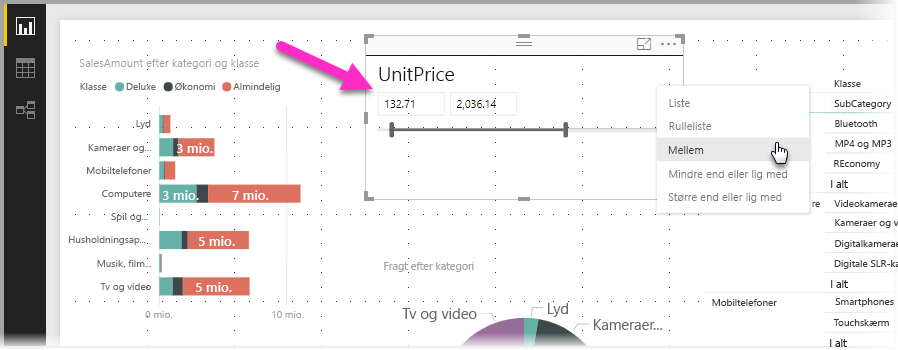
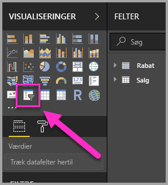
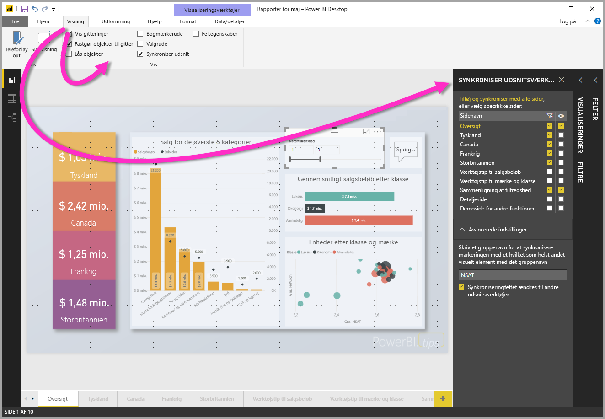
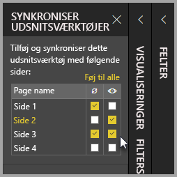

# Brug af udsnitsværktøjer i Power BI Desktop

Du kan bruge et **udsnitsværktøj** i **Power BI Desktop** til at filtrere resultaterne i en visualisering på din rapportside. Med udsnitsværktøjer kan du nemt justere det filter, der er anvendt, ved at interagere med selve udsnitsværktøjet. Du kan også angive indstillinger for, hvordan udsnitsværktøjet vises, og hvordan du interagerer med det. På følgende billede vises et udsnitsværktøj med rullelisten *type* synlig. 

Du kan få vist et udsnitsværktøj fra en af følgende typer:

* Liste
* Rulleliste
* Mellem
* Mindre end eller lig med
* Større end eller lig med

Du kan føje et udsnitsværktøj til en rapport ved at klikke på visualiseringen **udsnitsværktøj** i ruden **Visualiseringer**.

Udsnitsværktøjer fungerer på samme måde i både **Power BI Desktop** og **Power BI-tjenesten**. I [udsnitsværktøjer i Power BI-tjenesten (selvstudium)](power-bi-visualization-slicers.md) kan du se et selvstudium om, hvordan du bruger udsnitsværktøjer.

## Synkroniser udsnitsværktøjer på tværs af rapportsider

I **Power BI Desktop** kan du synkronisere udsnitsværktøjer på tværs af flere rapportsider. I ruden **Visning** på båndet skal du vælge **Synkroniser udsnitsværktøjer** for at synkronisere udsnitsværktøjer. Når du synkroniserer udsnitsværktøjer, vises ruden **Synkroniser udsnitsværktøjer**, som vist på følgende billede.

I ruden **Synkroniser udsnitsværktøjer** kan du angive, hvordan udsnitsværktøjet skal synkroniseres på tværs af rapportsider. Du kan angive, om hvert udsnitsværktøj skal **anvendes** på hver enkelt rapportside, og om udsnitsværktøjet skal være **synligt** på hver enkelt rapportside.

Du kan f.eks. placere et udsnitsværktøj på **side 2** i rapporten, som vist på følgende billede. Du kan derefter vælge, om dette udsnitsværktøj skal *anvendes* på hver valgt side, og om dette udsnitsværktøj skal være *synligt* på hver valgt side i rapporten. Du kan anvende en hvilken som helst kombination af disse for hvert udsnitsværktøj. 

Hvis du bruger linket **Føj til alle** i ruden, anvendes det valgte udsnitsværktøj på alle sider i rapporten.

Bemærk, at de valg, der vises i ruden **Synkroniser udsnitsværktøjer**, kun anvendes for det *valgte udsnitsværktøj*. Du kan anvende flere udsnitsværktøjer på forskellige sider og bruge ruden til at definere, hvordan hvert udsnitsværktøj anvendes på tværs af forskellige sider i rapporten. 

Når du synkroniserer dine valgte udsnitsværktøjer, synkroniseres andre valg såsom formatering, redigering og sletning *ikke*. 

## Næste trin

Du vil måske også være interesseret i følgende artikler:

* [Udsnitsværktøjer i Power BI-tjenesten (selvstudium)](power-bi-visualization-slicers.md)
* [Brug udsnitsværktøjet til numerisk område i Power BI Desktop](desktop-slicer-numeric-range.md)
* [Brug et udsnitsværktøj og filter til relativ dato i Power BI Desktop](desktop-slicer-filter-date-range.md)

