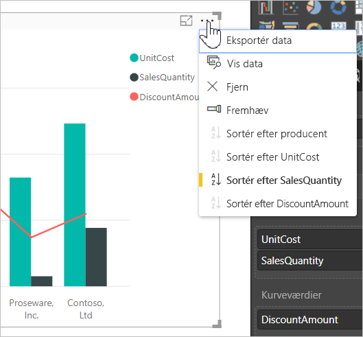
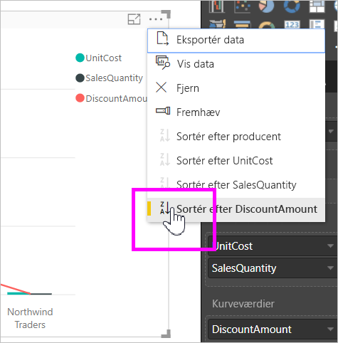
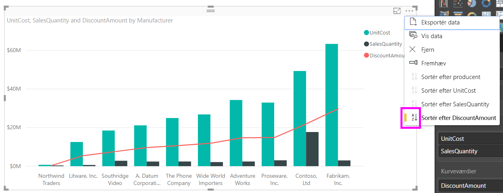
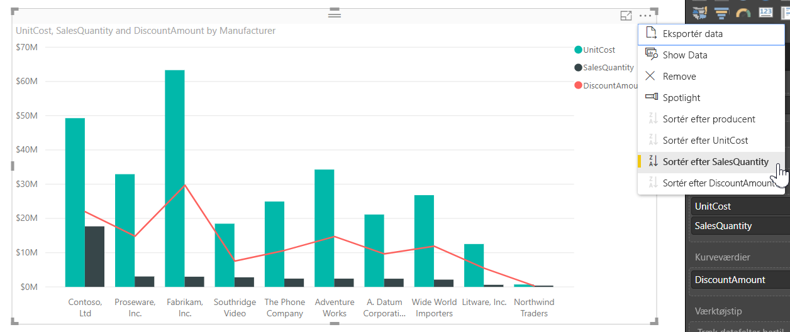
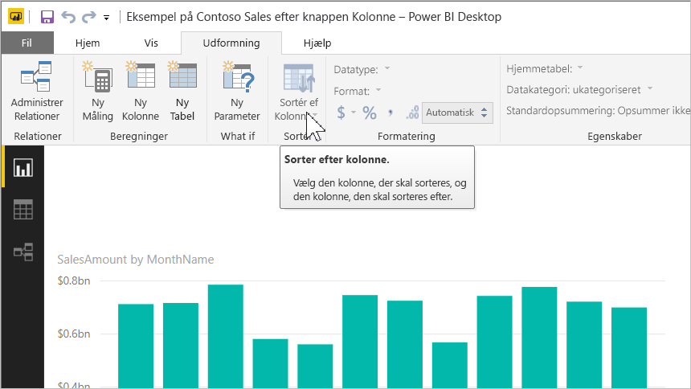
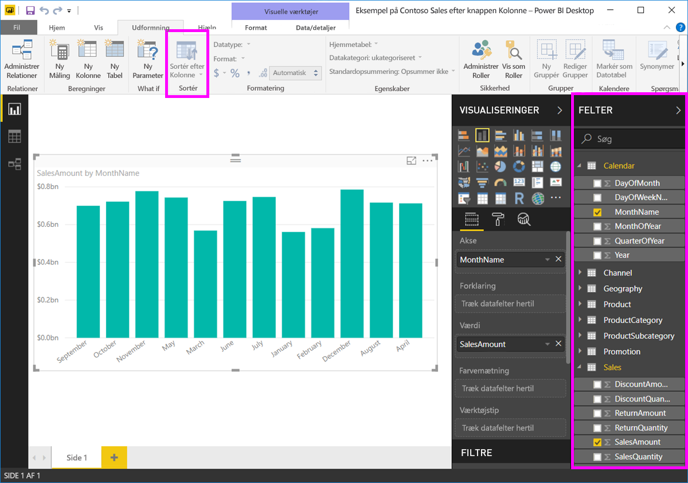
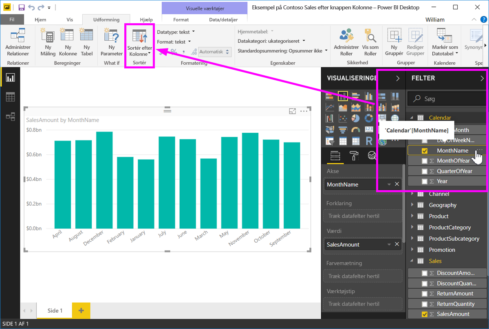
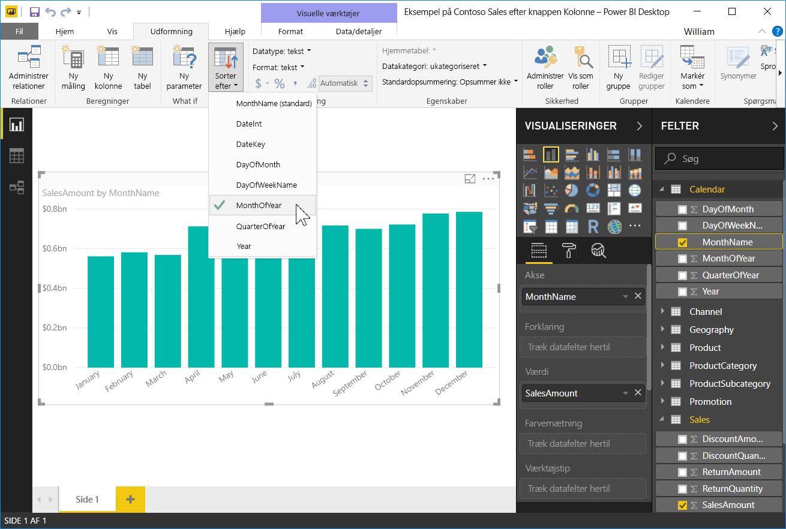
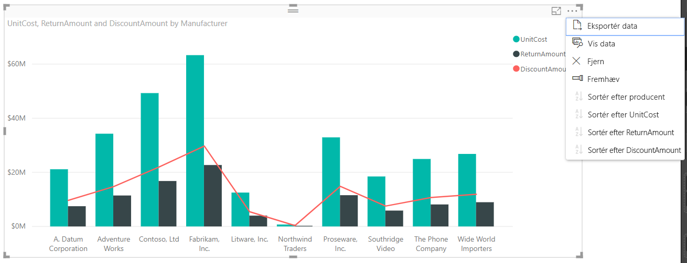

# Sortér efter kolonne i Power BI Desktop
I **Power BI Desktop** og **Power BI-tjenesten** kan du ændre, hvordan en visuel gengivelse ser ud, ved at sortere den efter forskellige datafelter. Hvis du ændrer, hvordan du sorterer en visualisering, kan du fremhæve de oplysninger, du vil formidle, og sikre, at visualiseringen afspejler eller fremhæver den tendens.

Uanset om du bruger numeriske data, f.eks. salgstal, eller tekstdata, f.eks. navne på byer, kan du sortere visualiseringerne, som du vil, for at få dem til at se ud, som du vil.  **Power BI** indeholder mange sorteringsmuligheder og genvejsmenuer, som du kan bruge. Vælg menuen med de tre prikker (...) i en visualisering, og vælg derefter det felt, du vil sortere efter, som vist på følgende billede.

## Mere dybde og et eksempel
Lad os tage et eksempel med mere dybde og se, hvordan det fungerer i **Power BI Desktop**.

I den følgende visualisering kan du se omkostninger, antal og beløb efter producentnavn. Sådan ser visualiseringen ud, før der sorteres.

Visualiseringen er i øjeblikket sorteret efter **SalesQuantity**. Det kan vi se ved at sammenligne farven på de faldende søjler med forklaringen, men der er en bedre måde at finde frem til den aktuelle sorteringskolonne: menuen med de tre prikker (...) i øverste højre hjørne af visualiseringen. Når du klikker på menuen, får du vist følgende:

* Der sorteres aktuelt efter feltet **SalesQuantity**, hvilket kan ses ud fra, at **Sortér efter SalesQuantity** vises med fed og har en gul linje. 

* Den aktuelle sorteringsretning er mindste til største, som vist med det lille ikon **A/Z** (A over Z) og en pil ned.

I de næste to afsnit ser vi nærmere på sorteringsfelt og -retning.

## Valg af kolonne, der skal sorteres efter
Den gule linje ud for **Sortér efter SalesQuantity** i menuen **Flere indstillinger** angiver, at visualiseringen er sorteret efter kolonnen **SalesQuantity**. Det er nemt at sortere efter en anden kolonne. Du skal blot vælge menuen med de tre prikker og derefter vælge en anden kolonne.

I følgende billede har vi valgt at sortere efter kolonnen *DiscountAmount*. Den kolonne er rent faktisk en af kurverne på den visuelle gengivelse i stedet for en af søjlerne. Sådan ser det ud, efter at vi har valgt **DiscountAmount**.

Læg mærke til, hvordan den visuelle gengivelse er blevet ændret. Værdierne er nu sorteret fra den højeste DiscountAmount-værdi, som i denne visualisering er Fabrikam Inc., og ned til Northwind Traders, som har den laveste værdi. 

Men hvad nu, hvis vi vil sortere stigende i stedet for faldende? I næste afsnit kan du se, hvor nemt du kan gøre det.

## Valg af sorteringsrækkefølgen – mindste til største, største til mindste
Hvis vi ser nærmere på menuen **Indstillinger** i det foregående billede, kan det ses, at ikonet ud for **Sortér efter DiscountAmount** viser **Z/A** (Z over A). Se her:

Når **Z/A** vises, betyder det, at den visuelle gengivelse sorteres efter den valgte kolonne fra den største værdi til den mindste værdi. Vil du ændre det? Det kan du nemt gøre ved at trykke eller klikke på ikonet **Z/A**. Det ændrer sorteringsrækkefølgen til **A/Z**, og den visuelle gengivelse (baseret på den valgte kolonne) sorteres fra mindste til største værdi.

Her er den samme visualisering, men denne gang er der blevet trykket på ikonet **Z/A** på kommandoen **Sortér efter DiscountAmount** for at ændre rækkefølgen. Bemærk, at Northwind Traders nu vises som den første producent, mens Fabrikam Inc. vises sidst. Sorteringen er nu modsat end før.

Du kan sortere enhver kolonne i visualiseringen. Det er nemt at vælge at sortere efter kolonnen SalesQuantity med **Sortér efter SalesQuantity**. Det vil vise producenterne med det største salg først, mens de øvrige kolonner i visualiseringen vises på den måde, de relaterer til producenten. Her kan du se den visuelle gengivelse med disse indstillinger.

## Sortering med knappen Sortér efter kolonne
Du kan også sortere dine data ved at bruge knappen **Sortér efter kolonne** på båndet **Udformning**.

Denne fremgangsmåde kræver, at du vælger en kolonne i ruden **Felter** og derefter vælger knappen **Sortér efter kolonne** for at vælge, hvordan (efter hvilken kolonne) du vil sortere den visuelle gengivelse. Du skal vælge den kolonne (det felt), som du vil sortere efter, i ruden **Felter** for at aktivere knappen **Sortér efter kolonne**. Ellers er knappen inaktiv.

Lad os se på et almindeligt eksempel: Du har data fra hver måned på året, og du vil sortere dataene i kronologisk rækkefølge. Nedenfor kan du se, hvordan du skal gøre.

1. Læg først mærke til, at når den visuelle gengivelse er valgt, men ingen kolonne er valgt i ruden **Felter**, er knappen **Sortér efter kolonne** inaktiv (nedtonet).
   
   

2. Når vi vælge den kolonne, der skal sorteres efter, bliver knappen **Sortér efter kolonne** i ruden **Felter** aktiv.
   
   
3. Når visualiseringen er valgt, kan vi vælge *MonthOfYear* i stedet for standarden *MonthName*, og visualiseringen sorteres nu i den ønskede rækkefølge: efter årets måneder.
   
   

Det var det hele. Husk, at du skal vælge en kolonne i ruden **Felter**, før knappen **Sortér efter kolonne** bliver aktiv.

## Sortering efter standardkolonnen igen
Du kan sortere efter en hvilken som helst kolonne, men der kan være tilfælde, hvor du vil nulstille den visuelle gengivelse, så den sorteres efter standardkolonnen igen. Det er ikke noget problem. Hvis du har en visualisering med en valgt sorteringskolonne (en valgt sorteringskolonne vises med en gul linje ud for den), skal du blot åbne menuen **Flere indstillinger** og vælge kolonnen igen. Så sorteres visualiseringen igen efter standardkolonnen.

Her er f.eks. vores tidligere diagram:

Når vi går tilbage til menuen og vælger **SalesQuantity** igen, bliver visualiseringen sorteret alfabetisk efter **Manufacturer**, som vist i følgende billede.

Med så mange muligheder for sortering af dine visuelle gengivelser bliver det nemt for dig at oprette lige netop det diagram eller billede, du har brug for.

