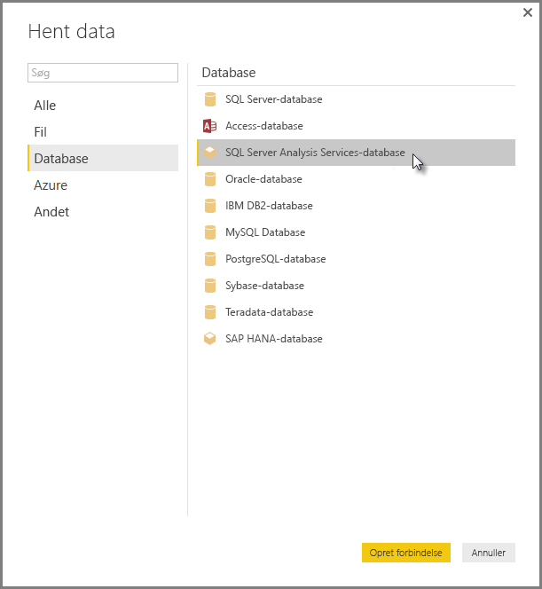

# Opret forbindelse til SSAS flerdimensionelle modeller i Power BI Desktop
Med Power BI Desktop har du adgang til **SSAS flerdimensionelle modeller**, der ofte refereres til som **SSAS MD**.

Hvis du vil oprette forbindelse til en **SSAS MD**-database, skal du vælge **Hent data &gt; Database &gt; SQL Server Analysis Services Database**  som vist på følgende billede:

**SSAS flerdimensionelle modeller** i liveforbindelsestilstand understøttes i både Power BI-tjenesten og i Power BI Desktop. Du kan også udgive og overføre rapporter, der bruger **SSAS flerdimensionelle modeller**, i dynamisk tilstand til Power BI-tjenesten.

## Egenskaber og funktioner i SSAS MD
I følgende afsnit beskrives egenskaber og funktioner i Power BI- og SSAS MD-forbindelser.

### Metadata for tabeller i flerdimensionelle modeller
I følgende tabel vises overensstemmelsen mellem flerdimensionelle objekter og metadata for tabeller, der returneres til Power BI Desktop. Når du opretter en visualisering, f.eks en tabel, en matrix, et diagram eller et udsnit, forespørger Power BI modellen efter metadata for tabeller og kører relevante DAX-forespørgsler i Analysis Services baseret på de returnerede metadata.

| BISM-flerdimensionelt objekt | Metadata for tabeller |
| --- | --- |
| Kube |Model |
| Kubedimension |Tabel |
| Dimensionsattributter (nøgler), navn |Kolonner |
| Målegruppe |Tabel |
| Måling |Måling |
| Målinger uden tilknyttet målegruppe |I tabellen, der kaldes *Målinger* |
| Målegruppe -> Kubedimensionsrelation |Relation |
| Perspektiv |Perspektiv |
| KPI |KPI |
| Bruger/overordnede/underordnede hierarkier |Hierarkier |

### Målinger, målegrupper og KPI'er
Målegrupper i en flerdimensionel kube vises i Power BI som tabeller med ∑ fortegn ud for dem i ruden **Felter**. Beregnede målinger, der ikke har en tilknyttet målegruppe, er grupperet under en særlig tabel, der kaldes *Målinger*, i metadata for tabeller.

I en flerdimensionel model kan du definere et sæt af målinger eller KPI'er i en kube, som skal være placeret i en *visningsmappe*, hvilket kan hjælpe med at forenkle komplekse modeller. Power BI genkender visningsmapper i metadata for tabeller og viser målinger og KPI'er i visningsmapperne. KPI'er i flerdimensionelle databaser understøtter *Værdi*, *Mål*, *Statusgrafik* og *Tendensgrafik*.

### Dimensionsattributtyper
Flerdimensionelle modeller understøtter også tilknytning af dimensionsattributter med specifikke dimensionsattributtyper. Der vises f.eks. en **Geografi**-dimension, hvor dimensionsattributterne *By*, *Stat/provins*, *Land/område* og *Postnummer* har relevante geografityper tilknyttet, i metadata for tabeller. Power BI genkender metadataene, hvilket giver dig mulighed for at oprette kortvisualiseringer. Du kan genkende disse tilknytninger vha. *kort*-ikonet ud for elementet i ruden **Felt** i Power BI.

Power BI kan også gengive billeder, når du angiver et felt, der indeholder URL-adresser (Uniform Resource Locator) for billederne. Du kan angive disse felter som typen *ImageURL* i SQL Server Data Tools (eller senere i Power BI), og deres typeoplysninger oplyses til Power BI i metadata for tabeller. Power BI kan derefter hente disse billeder fra URL-adressen, og vise dem i visuelle elementer.

### Overordnede/underordnede hierarkier
Flerdimensionelle modeller understøtter overordnede/underordnede hierarkier, som er angivet som et *hierarki* i metadata for tabeller. Hvert niveau i det overordnede/underordnede hierarki vises som en skjult kolonne i metadata for tabeller. Nøgleattributten for den overordnede/underordnede dimension vises ikke i metadata for tabeller.

### Dimensionsberegnede medlemmer
Flerdimensionelle modeller understøtter oprettelse af forskellige typer af *beregnede medlemmer*. De to mest almindelige typer beregnede medlemmer er følgende:

* Beregnede medlemmer på attributhierarkier og ikke sidestillede til *Alle*
* Beregnede medlemmer på brugerhierarkier

I flerdimensionelle modeller vises *beregnede medlemmer på attributhierarkier* som værdier i en kolonne. Der er nogle få ekstra indstillinger og begrænsninger ved visning af denne type beregnet medlem:

* Dimensionsattributten kan have et valgfrit *UnknownMember*
* En attribut, der indeholder beregnede medlemmer, må ikke være nøgleattribut for dimensionen, medmindre den er den eneste attribut for dimensionen
* En attribut, der indeholder beregnede medlemmer, må ikke være en overordnet/underordnet attribut

De beregnede medlemmer af brugerhierarkier vises ikke i Power BI. I stedet kan du oprette forbindelse til en kube, der indeholder beregnede medlemmer fra brugerhierarkier, men du vil ikke kunne se beregnede medlemmer, hvis de ikke opfylder de begrænsninger, der er nævnt i den forrige punktopstilling.

### Sikkerhed
Flerdimensionelle modeller understøtter dimensions- og cellesikkerhed vha. *Roller*. Når du opretter forbindelse til en kube med Power BI, godkendes og vurderes du for de nødvendige tilladelser. Når en bruger anvender *dimensionssikkerhed*, ses de forskellige dimensionsmedlemer ikke af brugeren i Power BI. Men hvis en bruger har en defineret *cellesikkerheds*-tilladelse, hvor visse celler er begrænset, kan denne bruger ikke oprette forbindelse til kuben vha. Power BI.

## Begrænsninger for SSAS flerdimensionelle modeller i Power BI Desktop
Der er visse begrænsninger for brug af **SSAS MD**:

* Serverne skal køre SQL Server 2012 SP1 CU4 eller nyere versioner af Analysis Services, for at Power BI Desktop SSAS MD-forbindelsen fungerer korrekt
* *Handlinger* og *navngivne sæt* er ikke synlige for Power BI, men du kan stadig oprette forbindelse til kuber, der også indeholder *handlinger* eller *navngivne sæt*, og oprette visuelle elementer og rapporter.

## Understøttede funktioner i SSAS MD i Power BI Desktop
Følgende SSAS MD-funktioner understøttes i Power BI Desktop:

* Forbrug af følgende elementer, der understøttes i denne version af **SSAS MD** (du kan få [yderligere oplysninger](https://msdn.microsoft.com/library/jj969574.aspx) om disse funktioner):
  * Få vist mapper
  * KPI-tendenser
  * Standardmedlemmer
  * Dimensionsattributter
  * Dimensionsberegnede medlemmer (skal være et enkelt ægte medlem, når dimensionen har mere end én attribut, den kan ikke være nøgleattributten for dimensionen, medmindre den er den eneste attribut, og den må ikke være en overordnet/underordnet attribut)
  * Dimensionsattributtyper
  * Hierarkier
  * Målinger (med eller uden målegrupper)
  * Målinger som variant
  * KPI'er
  * ImageUrl'er
  * Dimensionssikkerhed

## Fejlfinding 
På følgende liste beskrives alle kendte problemer, når der oprettes forbindelse til SQL Server Analysis Services (SSAS). 

* **Fejl: Modelskemaet blev ikke indlæst** – denne fejl opstår sædvanligvis, når den bruger, der opretter forbindelse til Analysis Services, ikke har adgang til databasen/kuben.
