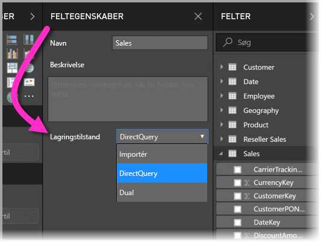
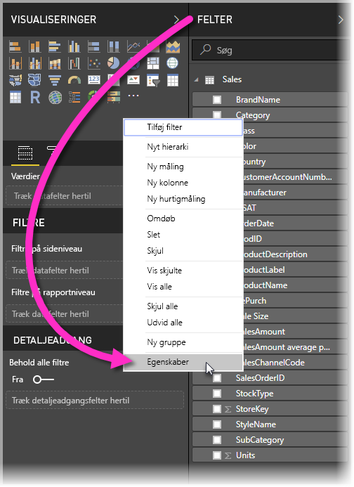
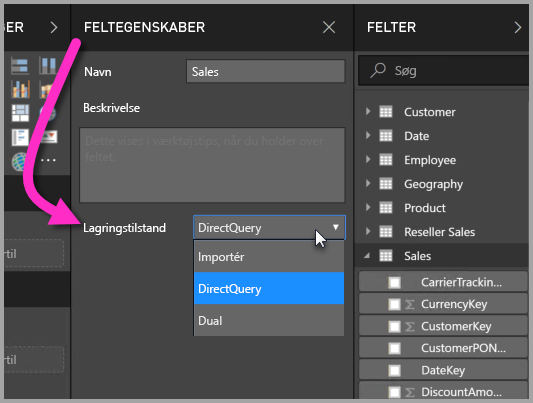
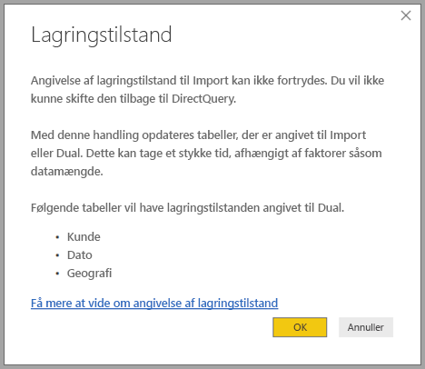

# Lagringstilstand i Power BI Desktop

I Microsoft Power BI Desktop kan du angive *lagringstilstanden* for tabeller. Du kan bruge *lagringstilstanden* til at kontrollere, om Power BI Desktop cachelagrer tabeldata i hukommelsen for rapporter. 

Angivelse af lagringstilstanden giver mange fordele. Du kan angive lagringstilstanden for hver enkelt tabel i din model. Denne handling gør det muligt at have et enkelt datasæt, hvilket giver følgende fordele:

* **Forespørgselsydeevne**: Når brugere interagerer med visuelle elementer i Power BI-rapporter, sendes der DAX-forespørgsler (Data Analysis Expressions) til datasættet. Hvis du cachelagrer data i hukommelsen med en korrekt angivelse af lagringstilstand, kan det øge forespørgslens kvalitet og dine rapporters interaktivitet.

* **Store datasæt**: Tabeller, der ikke cachelagres, forbruger ikke hukommelse beregnet til cachelagring. Du kan aktivere interaktive analyser over store datasæt, der er for store eller dyre til helt at cachelagre i hukommelsen. Du kan vælge, hvilke tabeller der er værd at cachelagre, og hvilke der ikke er.

* **Optimering af dataopdatering**: Tabeller, der ikke er cachelagret, skal ikke opdateres. Du kan reducere opdateringstider ved kun at cachelagre de data, der er nødvendige for at opfylde dine serviceniveauaftaler og virksomhedens behov.

* **Tidskrav i nærheden af realtid**: Det kan være en fordel at cachelagre tabeller med tidskrav i nærheden af realtid for at mindske dataventetiden.

* **Tilbageførsel**: Tilbageførsel gør det muligt for virksomheder at udforske mulige scenarier ved at ændre celleværdier. Brugerdefinerede programmer kan foretage ændringer af datakilden. Tabeller, der ikke er cachelagret, kan straks vise ændringer, og konsekvenserne kan dermed analyseres med det samme.

Indstillingen af lagringstilstand i Power BI Desktop er en af tre relaterede funktioner:

* **Sammensatte modeller**: Gør det muligt for en rapport at have to eller flere dataforbindelser, herunder DirectQuery-forbindelser eller Import, i en hvilken som helst kombination. Du kan finde flere oplysninger under [Sammensatte modeller i Power BI Desktop](desktop-composite-models.md).

* **Mange til mange-relationer**: Via *sammensatte modeller* kan du oprette *mange til mange-relationer* mellem tabeller. *Mange til mange-relationer* fjerner kravene for entydige værdier i tabeller. Det fjerner også tidligere løsninger, f.eks. introduktion af nye tabeller, kun for at oprette relationer. Du kan finde flere oplysninger under [Mange til mange-relationer i Power BI Desktop](desktop-many-to-many-relationships.md).

* **Lagringstilstand**: Du kan nu angive, hvilke visualiseringer der kræver en forespørgsel til back end-datakilder. Visuelle elementer, der ikke kræver en forespørgsel, importeres, også selvom de er baseret på DirectQuery. Denne funktion hjælper med at forbedre ydeevnen og reducere belastningen af back-end. Tidligere ville selv enkle visuelle elementer, f.eks. udsnit, starte forespørgsler, der blev sendt til back end-kilderne. Lagringstilstand er beskrevet nærmere i denne artikel.

## Brug lagringstilstand korrekt

Lagringstilstand er en egenskab, du kan angive for hver enkelt tabel i din model. Hvis du vil angive lagringstilstanden, skal du gå til ruden **Felter**, højreklikke på den tabel, hvis egenskaber du vil angive, og derefter vælge **Egenskaber**.

Den aktuelle egenskab vises på rullelisten **Lagringstilstand** i ruden **Feltegenskaber** for tabellen. Du kan få vist den aktuelle lagringstilstand eller ændre den der.

Der er tre værdier for lagringstilstand:

* **Import**: Når værdien er angivet til **Import**, cachelagres importerede tabeller. Forespørgsler sendt til Power BI-datasættet, der returnerer data fra importtabeller, kan kun opfyldes fra cachelagrede data.

* **DirectQuery**: Med denne indstilling cachelagres DirectQuery-tabeller ikke. Forespørgsler, du sender til Power BI-datasættet – f.eks. DAX-forespørgsler (Data Analysis Expressions) – og som returnerer data fra DirectQuery-tabeller, kan kun opfyldes, hvis du kører forespørgsler efter behov til datakilden. Forespørgsler, du sender til datakilden, bruger forespørgselssproget for den pågældende datakilde, f.eks. SQL.

* **Dual**: Dual-tabeller kan enten fungere som cachelagrede eller ikke-cachelagrede, afhængigt af konteksten for den forespørgsel, der er sendt til Power BI-datasættet. I nogle tilfælde kan du opfylde forespørgsler fra cachelagrede data. I andre tilfælde kan du opfylde forespørgsler ved at køre en forespørgsel efter behov til datakilden.

Hvis du ændrer en tabel til **Import**, kan du *ikke fortryde* handlingen. Denne egenskab kan ikke ændres tilbage til enten DirectQuery eller Dual.

## Begrænsninger af DirectQuery- og Dual-tabeller

Dual-tabeller har de samme funktionelle begrænsninger som DirectQuery-tabeller. Disse begrænsninger omfatter begrænsede M-transformationer og begrænsede DAX-funktioner i beregnede kolonner. Du kan finde flere oplysninger under [Konsekvenser ved brugen af DirectQuery](desktop-directquery-about.md#implications-of-using-directquery).

## Overførsel af Dual
Se den følgende simple model, hvor alle tabellerne er fra en enkelt kilde, der understøtter Import og DirectQuery.

Lad os sige, at alle tabeller i denne model er DirectQuery til at starte med. Hvis vi derefter ændrer **lagringstilstanden** for tabellen *SurveyResponse* til Import, vises nedenstående advarsel:

Dimensionstabellerne (*Kunde*, *Geografi* og *Dato*) kan indstilles til **Dual** for at reducere antallet af svage relationer i datasættet og forbedre ydeevnen. Svage relationer involverer normalt mindst én DirectQuery-tabel, hvor joinforbindelse af logik ikke kan sendes til kildesystemerne. Det, at **Dual**-tabeller kan fungere både som DirectQuery og Import, hjælper med at undgå dette.

Overførselslogikken er designet til at hjælpe med modeller, der indeholder mange tabeller. Lad os antage, at du har en model med 50 tabeller, og kun visse faktatabeller (transaktionstabeller) skal cachelagres. Logikken i Power BI Desktop beregner sættet af dimensionstabeller, der som minimum skal angives til **Dual**, så det behøver du ikke at gøre.

Overførselslogikken gennemgår kun den ene side af **1-til-mange**-relationer.

## Eksempel på brugen af lagringstilstand
Lad os fortsætte med eksemplet fra det forrige afsnit og antage, at vi anvender de følgende indstillinger for egenskaben for lagringstilstand:

| Tabel                   | Lagertilstand         |
| ----------------------- |----------------------| 
| *Salg*                 | DirectQuery          | 
| *SurveyResponse*        | Importér               | 
| *Dato*                  | Dual                 | 
| *Kunde*              | Dual                 | 
| *Geografi*             | Dual                 | 

Når du angiver disse egenskaber for lagringstilstand, sker der følgende, under forudsætning af at tabellen *Sales* har en stor datamængde.
* Power BI Desktop cachelagrer dimensionstabeller – *Date*, *Customer* og *Geography* – så indlæsningstiden for de første rapporter er kort, når de henter udsnitsværdier, der skal vises.
* Hvis tabellen *Sales* ikke cachelagres, viser Power BI Desktop følgende resultater:
    * Tiderne for dataopdatering forkortes, og hukommelsesforbruget mindskes.
    * Rapportforespørgsler, der er baseret på tabellen *Sales*, kører i DirectQuery-tilstand. Det kan tage længere tid at køre disse forespørgsler, men de er tættere på realtid, fordi der ikke er ventetid for cachelagring.

* Rapportforespørgsler, der er baseret på tabellen *SurveyResponse*, returneres fra cachen i hukommelsen og kører derfor relativt hurtigt.

## Forespørgsler, der findes eller ikke findes i cachen

Ved at forbinde **SQL Profiler** til diagnosticeringsporten for Power BI Desktop kan du se, hvilke forespørgsler der findes eller ikke findes i cachen i hukommelsen, ved at udføre en sporing, der er baseret på følgende hændelser:

* Forespørgsler Hændelser\Forespørgsel start
* Forespørgsel Behandler\Vertipaq SE-forespørgsel start
* Forespørgsel Behandler\DirectQuery start

For hver *Forespørgsel start*-hændelse skal du kontrollere andre hændelser med samme *ActivityID*. Hvis hændelsen *DirectQuery start* f.eks. ikke findes, men hændelsen *Vertipaq SE-forespørgsel start* findes, besvares forespørgslen fra cachen.

Forespørgsler, der refererer til tabeller i **Dual**-tilstand, returnerer data fra cachen, hvis det er muligt – ellers vender de tilbage til DirectQuery.

I forlængelse af det forrige eksempel henviser følgende forespørgsel kun til en kolonne fra tabellen *Date*, som er i **Dual**-tilstand. Forespørgslen skal derfor sendes til cachen.

Følgende forespørgsel henviser kun til en kolonne fra tabellen *Salg*, som er i tilstanden **DirectQuery**. Derfor bør den *ikke* finde indhold i cachen.

Følgende forespørgsel er interessant, fordi den kombinerer begge kolonner. Denne forespørgsel blev ikke sendt til cachen. Indledningsvist forventer du nok, at den henter *CalendarYear*-værdier fra cachen og *SalesAmount*-værdier fra kilden og derefter kombinerer resultaterne, men denne fremgangsmåde er være mindre effektiv, end hvis du sender handlingen SUM/GROUP BY til kildesystemet. Hvis handlingen skubbes ned til kilden, vil antallet af returnerede rækker sandsynligvis være langt færre. 

> [!NOTE]
> Denne funktionsmåde er anderledes end [mange til mange-relationer i Power BI Desktop](desktop-many-to-many-relationships.md), når cachelagrede og ikke-cachelagrede tabeller kombineres.

## Cacher bør holdes synkroniserede

Forespørgslerne fra det forrige afsnit viser, at **Dual**-tabeller nogle gange sendes til cachen og andre gange ikke. Dette kan resultere i, at forskellige værdier returneres, hvis cachen er forældet. Udførelse af forespørgsler vil ikke forsøge at maskere dataproblemer ved f.eks. at filtrere DirectQuery-resultater for at matche cachelagrede værdier. Det er dit ansvar at kende dine dataflows, og du bør designe i henhold hertil. Der er fastlagt teknikker til at håndtere sådanne tilfælde ved kilden, hvis det er nødvendigt.

*Dual*-lagringsmodellen er en ydeevneoptimering. Den må kun bruges på måder, der ikke ødelægger muligheden for at opfylde forretningsbehov. Hvis du vil opnå en alternativ funktionalitet, kan du overveje at bruge de teknikker, der er beskrevet i artiklen [Mange til mange-relationer i Power BI Desktop](desktop-many-to-many-relationships.md).

## Datavisning
Hvis mindst én tabel i datasættet har angivet lagringstilstanden som enten **Import** eller **Dual**, vises fanen **Datavisning**.

Når tabellerne **Dual** og **Import** vælges i **Datavisning**, viser de cachelagrede data. DirectQuery-tabeller viser ikke data, og du får vist en meddelelse om, at DirectQuery-tabeller ikke kan vises.

## Begrænsninger og overvejelser

Der er nogle få begrænsninger i denne udgave af lagringstilstand og dens korrelation med sammensatte modeller.

Følgende Live Connect-kilder (flerdimensionelle) kan ikke bruges sammen med sammensatte modeller:

* SAP HANA
* SAP Business Warehouse
* SQL Server Analysis Services
* Power BI-datasæt
* Azure Analysis Services

Når du opretter forbindelse til disse flerdimensionelle datakilder ved hjælp af DirectQuery, kan du hverken oprette forbindelse til en anden DirectQuery-kilde eller kombinere den med importerede data.

De eksisterende begrænsningerne ved at bruge DirectQuery gælder stadig, når du bruger sammensatte modeller. Mange af disse begrænsninger gælder nu for de enkelte tabeller afhængigt af tabellens lagringstilstand. En beregnet kolonne i en importeret tabel kan f.eks. referere til andre tabeller, men en beregnet kolonne i en DirectQuery-tabel er stadig begrænset til kun at referere til kolonner i den samme tabel. Andre begrænsninger gælder for modellen som helhed, hvis nogle af tabellerne i modellen er DirectQuery. Funktionerne QuickInsights og Q&A er f.eks. ikke tilgængelige for en model, hvis nogen af tabellerne i den har lagringstilstanden DirectQuery. 

## Næste trin

Du kan finde flere oplysninger om sammensatte modeller og DirectQuery i følgende artikler:
* [Sammensatte modeller i Power BI Desktop](desktop-composite-models.md)
* [Mange til mange-relationer i Power BI Desktop](desktop-many-to-many-relationships.md)
* [Brug DirectQuery i Power BI](desktop-directquery-about.md)
* [Understøttede datakilder i forbindelse med DirectQuery i Power BI](desktop-directquery-data-sources.md)
