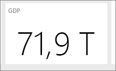

# Tips og tricks til oprettelse af rapporter i Power BI Desktop
For at få mest muligt ud af dine data skal du nogle gange have lidt ekstra hjælp. Vi har samlet nogle tip og tricks, som du kan bruge, når du opretter rapporter i Microsoft Power BI Desktop *og* i Microsoft Excel 2016 eller Excel 2013 Pro-Plus-udgaver, hvor tilføjelsesprogrammet Power Pivot er aktiveret, og Power-forespørgsel er installeret og aktiveret. 

## Lær at bruge forespørgselseditoren
Forespørgselseditoren i Power BI Desktop svarer til funktionaliteten i tilføjelsesprogrammet Power-forespørgsel i Excel 2013. Der findes flere nyttige artikler i Power BI Support, men du kan også gennemse dokumentationen til Power-forespørgsel på support.office.com for at komme i gang.

Du kan få flere oplysninger fra [ressourcecenteret til Power-forespørgsel](https://support.office.com/article/Microsoft-Power-Query-for-Excel-Help-2b433a85-ddfb-420b-9cda-fe0e60b82a94).

Du kan også se [formelreferencen](https://support.office.com/Article/Learn-about-Power-Query-formulas-6bc50988-022b-4799-a709-f8aafdee2b2f).

## Datatyper i forespørgselseditoren
Når vi bruger forespørgselseditoren i Power BI Desktop til at indlæse data, kommer den med et bedste gæt for typen af data. Når du bruger formler, bevares indstillingerne for datatyper for kolonner ikke altid. Kontrollér, at datatypen for kolonner er korrekt, når du har udført følgende handlinger:  Indlæs først data under forespørgselsfanen, Første række som overskrift, Tilføj kolonne, Gruppér efter, Flet og Tilføj inden du trykker for at indlæse dataene for første gang.

Det er vigtigt at huske, at kursiv i datagitteret ikke betyder, at datatypen er angivet korrekt, men blot at dataene ikke betragtes som tekst.

## Referenceforespørgsler i forespørgselseditoren
Når du er i forespørgselseditorens navigator i Power BI Desktop, og du højreklikker på en af forespørgslerne, er der en tilgængelig indstilling for "Reference". Dette er nyttigt af følgende årsag:

* Når du bruger filer som datakilde for en forespørgsel, gemmes den absolutte sti til filen i forespørgslen. Når du deler eller flytter en Power BI Desktop-fil eller Excel-projektmappe, sparer du tid, når du opdaterer stierne, ved kun at opdatere den én gang i stedet for stierne.

Som standard indlæses alle forespørgsler i datamodellen. Nogle forespørgsler er mellemliggende trin og er ikke beregnet til slutbrugere. Når der refereres til forespørgsler som angivet ovenfor, er det ofte tilfældet. Du kan styre funktionsmåden for indlæsning af forespørgsler ved at højreklikke på forespørgslen i navigatoren og slå indstillingen "Aktivér indlæsning" til/fra. Når *Aktivér indlæsning* ikke er markeret, er forespørgslen stadig tilgængelig under forespørgselsfanen, og du kan bruge den sammen med andre forespørgsler. Dette er især nyttigt i forbindelse med transformering med fletning, tilføjelse og referencer. Men da resultaterne af forespørgslen ikke indlæses i datamodellen, laver forespørgslen ikke rod på rapportlisten eller i din datamodel. 

## Punktdiagrammer skal bruge et punkt-id
Her er et eksempel på en simpel tabel med temperaturer og tidspunktet for læsning. Hvis du afbilder dette direkte i et punktdiagram, aggregerer Power BI alle værdierne til et enkelt punkt. Hvis du vil vise individuelle datapunkter, skal du føje et felt til bucket'en Oplysninger i feltet. Det kan du nemt gøre i Power BI Desktop ved at gå til forespørgselsfanen og bruge indstillingen "Tilføj indekskolonne" på båndet "Tilføj kolonne". 

## Referencelinjer i rapporten
Du kan bruge en beregnet kolonne i Power BI Desktop til at definere en referencelinje. Identificer den tabel og den kolonne, som du vil oprette en referencelinje i. Vælg "Ny kolonne" på båndet, og skriv følgende formel i formellinjen:

    Target Value = 100

Denne beregnede kolonne returnerer værdien 100, uanset hvor den bruges. Den nye kolonne vises på feltlisten. Føj den beregnede kolonne i målværdien til et kurvediagram for at vise, hvordan alle serier er relateret til den specifikke referencelinje. 

## Sortér efter en anden kolonne
Når du bruger en kategorisk værdi (streng) i Power BI til diagramakser eller i et udsnitsværktøj eller et filter, er rækkefølgen som standard alfabetisk. Hvis du vil tilsidesætte denne rækkefølge, for eksempel for dage i ugen eller måneder, kan du bede Power BI Desktop om at sortere efter en anden kolonne. Du kan få mere at vide under [Sorter efter kolonne i Power BI Desktop](desktop-sort-by-column.md).

## Opret nemmere kort med tip til Bing
Power BI kan integreres med Bing for at angive standardkortkoordinater (en proces, der kaldes geokodning), så det bliver lettere for dig at oprette kort. Bing bruger nogle algoritmer og tip til at prøve at hente den rette placering, men den gætter. Hvis du vil øge sandsynligheden for en korrekt geokodning, kan du bruge følgende tip:

Når du opretter et kort, ønsker du ofte at afbilde lande, stater og byer. Hvis du i Power BI Desktop bruger navngivne kolonner efter den geografiske betegnelse, hjælper det Bing med at gætte, hvad du ønsker at få vist. Hvis du f.eks. har et felt med amerikanske stater, f.eks. "Californien" og "Washington", returnerer Bing måske placeringen af Washington, DC i stedet for staten Washington for ordet "Washington". Hvis du navngiver kolonnen "Stat" forbedres geokodningen. Det samme gælder kolonner med navnet "Land" og "By". 

Nogle betegnelser er tvetydige, når de ses i forbindelse med flere lande/områder. Hvad et land/område i nogle tilfælde opfatter som en 'stat', behandles måske som en 'provins' eller et 'område' i anden sammenhæng. Du kan øge nøjagtigheden af geokodning ved at oprette kolonner, der kan samle flere felter, og bruge dem til at afbilde dataplaceringer. Et eksempel kunne være at i stedet for kun at skrive "Wiltshire" kan du skrive "Wiltshire, England" for at få et mere nøjagtigt resultat af geokodningen. 

Du kan altid angive specifikke placeringer for breddegrad og længdegrad i Power BI-tjenesten eller Power BI Desktop. Hvis du gør det, skal du også angive et placeringsfelt. Ellers aggregeres dataene som standard, så placeringen af breddegrad og længdegrad måske ikke svarer til det, du forventer.

## Kategoriser geografiske felter for at give et tip til Bings geokodning
En anden måde til at sikre, at felter er geokodet korrekt, er at angive datakategorien i datafelterne. Vælg den ønskede tabel i Power BI Desktop, gå til båndet Avanceret, og angiv derefter Datakategori til Adresse, By, Kontinent, Land/område, Land, Postnummer, Stat eller Provins. Bing bruger disse datakategorier til korrekt kodning af dataene. Du kan finde flere oplysninger under [Kategoriser data i Power BI Desktop](desktop-data-categorization.md).

## Bedre geokodning med mere specifikke placeringer
Nogle gange er det ikke nok at angive datakategorier i forbindelse med kortlægning. Opret en mere specifik placering, f.eks. adressen, ved hjælp af forespørgselseditoren i Power BI Desktop. Brug funktionen Tilføj kolonne til at oprette en brugerdefineret kolonne. Opret derefter den ønskede placering på følgende måde: 

    = [Field1] & " " & [Field2]

Brug derefter dette felt, der oprettes, i kortvisualiseringer. Dette er meget nyttigt, når du skal oprette adresser ud fra felter med leveringsadresse, der er fælles for datasæt. Bemærk dog, at sammenkædningen kun fungerer sammen med tekstfelter. Du kan eventuelt konvertere husnummeret til en tekstdatatype, før du bruger det til at oprette en adresse.

## Histogrammer i forespørgselsfasen
Du kan oprette histogrammer på flere måder i Power BI Desktop. Vi starter med den nemmeste og fortsætter derfra:

De nemmeste histogrammer – Find ud af, hvilken forespørgsel der har det felt, du vil oprette et histogram for. Brug indstillingen "Reference" for forespørgslen til at oprette en ny forespørgsel, og kald den "FieldName Histogram". Brug indstillingen "Gruppér efter" på båndet "Transformering", og vælg aggregeringen "Tæl rækker". Kontrollér, at datatypen er et tal i den resulterende samlingskolonne. Visualiser derefter disse data på rapportsiden. Det er hurtigt og nemt at oprette, men det virker ikke korrekt, hvis du har mange datapunkter, og det giver ikke mulighed for at børste på tværs af visuelle elementer.

Definer buckets for at oprette et histogram – Find ud af, hvilken forespørgsel der har det felt, du vil oprette et histogram for. Brug indstillingen "Reference" for forespørgslen til at oprette en ny forespørgsel, og kald den "FieldName". Definer nu dine buckets med en regel. Brug indstillingen Tilføj brugerdefineret kolonne på båndet Tilføj kolonne, og opret en brugerdefineret regel. En simpel bucketregel kan f.eks. se sådan ud:

    if([FieldName] \< 2) then "\<2 min" else
    if([FieldName] \< 5) then "\<5 min" else
    if([FieldName] \< 10) then "\<10 min" else
    if([FieldName] \< 30) then "\<30 min" else
    "longer")

Kontrollér, at datatypen er et tal i den resulterende samlingskolonne. Du kan nu bruge gruppér efter-metoden, der er beskrevet under Nemmeste histogram, for at få det ønskede histogram. Denne indstilling håndterer flere datapunkter, men hjælper stadig ikke med børstning.

Definition af et histogram, der understøtter børstning – Børstning betyder, at visuelle elementer er kædet sammen, så når en bruger vælger et datapunkt i ét visuelt element, fremhæver eller filtrerer andre visuelle elementer datapunkter, der er relateret til det valgte datapunkt. Da vi manipulerer data på forespørgselstidspunktet, skal vi oprette en relation mellem tabeller og sikre os, at vi ved, hvilket detaljeelement der er relateret til bucket'en i histogrammet, og omvendt.

Start processen ved hjælp af indstillingen "Reference" i den forespørgsel, der har det felt, du vil oprette et histogram for. Kald den nye forespørgsel "Buckets". I dette eksempel kan vi kalde den oprindelige forespørgsel for "Detaljer". Flyt derefter alle kolonner undtagen den kolonne, du vil bruge som bucket for histogrammet. Nu kan du bruge funktionen "Fjern dubletter" i forespørgslen (den er i genvejsmenuen, når du vælger en kolonne), så de resterende værdier bliver entydige værdier i kolonnen. Hvis du har decimaltal, kan du først bruge tippet, der bruges til at definere buckets til oprettelse af et histogram, til at få en sæt buckets, der kan administreres. Nu skal du kontrollere dataene, der vises i forespørgselseksemplet. Hvis du kan se tomme værdier eller null-værdier, skal du rette dette, før du opretter en relation. Se "Opret en relation, hvis mine data har null-værdier eller tomme værdier". Det kan være problematisk at bruge denne fremgangsmåde, da det er nødvendigt at sortere. For at få buckets til at sortere korrekt kan du gå til "Sorteringsrækkefølge: Få vist kategorier i den ønskede rækkefølge". 

>[!NOTE]
>Det er en god ide at tænke over sorteringsrækkefølgen, før du opretter visuelle elementer. 

Næste trin i processen er at definere en relation mellem forespørgslerne "Buckets" og "Detaljer" i bucketkolonnen. I Power BI Desktop skal du klikke på **Administrer relationer** på båndet. Opret en relation, hvor Buckets er i den venstre tabel, og Detaljer er i den højre tabel, og vælg det felt, du bruger til histogrammet. 

Sidste trin er oprettelse af histogrammet. Træk feltet Bucket fra tabellen "Buckets". Fjern standardfeltet fra det søjlediagram, der oprettes. Nu skal du trække histogramfeltet fra tabellen "Detaljer" til det samme visuelle element. I feltoversigten skal du ændre standardaggregatet til Antal. Resultatet er histogrammet. Hvis du opretter endnu et visuelt element, f.eks. en trævisning ud fra tabellen Detaljer, skal du vælge et datapunkt i trævisningen for at se fremhævningen i histogrammet og vise histogrammet for det valgte datapunkt i forhold til tendensen for hele datasættet.

## Histogrammer
I Power BI Desktop kan du bruge et beregnet felt til at definere et histogram. Identificer den tabel og den kolonne, som du vil oprette et histogram for. I beregningsområdet skal du skrive følgende formel:

> Frequency:=COUNTROWS(\<Column Name\>)
> 
> 

Gem dine ændringer, og vend tilbage til din rapport. Føj \<Kolonnenavn\> og Frekvens til en tabel, og konvertér den derefter til et liggende søjlediagram. Sørg for, at \<Kolonnenavn\> er på x-aksen, og at det beregnede felt Frekvens er på y-aksen.

## Tips og tricks til oprettelse af relationer i Power BI Desktop
Når du indlæser detaljedata fra flere kilder, vil problemer som null-værdier, tomme værdier eller dubletværdier ofte forhindre dig i at oprette relationer. 

Lad os tage et kig på et eksempel: 

Hvis vi indlæser datasæt fra aktive anmodninger om kundesupport og et andet datasæt med arbejdsopgaver, der har skemaer som følger:

> CustomerInicdents: {IncidentID, CustomerName, IssueName, OpenedDate, Status} WorkItems: {WorkItemID, IncidentID, WorkItemName, OpenedDate, Status, CustomerName } 
> 
> 

Når vi vil spore alle hændelser og arbejdselementer, der er relateret til et bestemt CustomerName, kan vi ikke blot oprette en relation mellem disse to datasæt. Nogle arbejdselementer er måske ikke relateret til et CustomerName, så dette felt skal være tomt eller NULL. Der kan være flere poster i WorkItems og CustomerIncidents for et hvilket som helst CustomerName. 

### Opret relationer i Power BI Desktop, når dataene har null-værdier eller tomme værdier
Datasæt indeholder ofte kolonner med null-værdier eller tomme værdier. Det kan skabe problemer, når du prøver at bruge relationer. Du kan løse problemerne på to måder. Du kan fjerne de rækker, der indeholder rækker med null-værdier eller tomme værdier. Det kan du enten gøre ved hjælp af filterfunktioner under forespørgselsfanen eller ved at vælge indstillingen "bevar kun matchende rækker", hvis du fletter forespørgsler. Du kan også erstatte null-værdierne eller de tomme værdier med værdier, der fungerer i relationer, typisk strenge som "NULL" og "(Blank)". Der findes ikke en korrekt fremgangsmåde her– Hvis du filtrerer rækker ud i forespørgselsfasen, fjernes rækker, og det kan påvirke oversigtsstatistikker og beregninger. Den sidste fremgangsmåde bevarer disse datarækker, men kan få ikke-relaterede rækker til at se ud, som om de er relateret i modellen, hvilket fører til forkerte beregninger. Hvis du bruger den sidste løsning, skal du sørge for at bruge filtre for visningen/diagrammet, hvor det er relevant, for at sikre, at du får nøjagtige resultater. Det vigtigste er, at du evaluerer, hvilke rækker der skal bevares/fjernes, og overordnet forstår, hvad det betyder for analysen. 

### Opret relationer i Power BI Desktop, når dataene har dublerede værdier
Når du indlæser detaljedata fra flere kilder, vil dubletværdier ofte forhindre dig i at oprette relationer. Du kan løse dette problem ved at oprette en dimensionstabel med entydige værdier fra begge datasæt. 

Lad os tage et kig på et eksempel: 

Hvis vi indlæser datasæt fra aktive anmodninger om kundesupport og et andet datasæt med arbejdsopgaver, der har skemaer som følger:

> CustomerInicdents: {IncidentID, CustomerName, IssueName, OpenedDate, Status} WorkItems: {WorkItemID, IncidentID, WorkItemName, OpenedDate, Status, CustomerName } 
> 
> 

Når vi vil spore alle hændelser og arbejdselementer, der er relateret til et bestemt CustomerName, kan vi ikke blot oprette en relation mellem disse to datasæt. Nogle arbejdselementer er måske ikke relateret til et CustomerName, så dette felt skal være tomt eller NULL. Hvis du har tomme værdier eller null-værdier i tabellen CustomerNames, er det måske stadig ikke muligt at oprette en relation – se Opret relationer, hvis mine data indeholder null-værdier eller tomme værdier. Der kan være flere poster i WorkItems og CustomerIncidents for et enkelt CustomerName. 

Hvis der skal oprettes en relation i dette tilfælde, skal vi oprette et logisk datasæt for alle CustomerNames på tværs af de to datasæt. Under fanen Forespørgsel kan du bruge følgende sekvens til at oprette det logiske datasæt:

1. Dupliker begge forespørgsler, og kald den første **Temp** og den anden **CustomerNames**.
2. I hver forespørgsel skal du fjerne alle kolonner *undtagen* kolonnen CustomerName
3. I hver forespørgsel skal du bruge **Fjern dublet**.
4. I forespørgslen **CustomerNames** skal du vælge indstillingen **Tilføj** på båndet og derefter vælge forespørgslen **Temp**.
5. I forespørgslen **CustomerNames** skal du vælge **Fjern dubletter**.

Du har nu en dimensionstabel, som du kan bruge til at relatere til CustomerIndicents og WorkItems, der indeholder alle værdierne fra dem begge. 

## Mønstre for at komme hurtigt i gang med at bruge forespørgselseditoren
Forespørgselseditoren er et meget effektivt værktøj til manipulation af data, da det kan forme og rydde dem, så de er klar til visualisering og modellering. Der er et par mønstre, som du skal være opmærksom på.

### Midlertidige kolonner kan slettes efter at have beregnet et resultat
Ofte skal du oprette en beregning i Power BI Desktop, der transformerer data fra flere kolonner til enkelt ny kolonne. Det kan være avanceret. En nem måde at løse problemet på er at opdele handlingen i flere trin. Start med at kopiere de første kolonner. Opret så de midlertidige kolonner. Opret derefter kolonnen til det endelige resultat. Du kan derefter slette de midlertidige kolonner, så det endelige datasæt ikke er rodet. Dette er muligt, fordi forespørgselsfanen udfører trinnene i rækkefølge. 

### Dublet- eller referenceforespørgsler, der er efterfulgt af fletning til den oprindelige forespørgsel
Det kan undertiden være nyttigt at beregne oversigtsstatistikker for et datasæt. Den nemme måde at gøre det på er at dublere eller referere til forespørgslen under forespørgselsfanen. Brug derefter **Gruppér efter** til at beregne oversigtsstatistikken. Oversigtsstatistikken kan hjælpe dig med at normalisere dataene i de oprindelige data, så de er nemmere at sammenligne. Dette er især nyttigt, når du vil sammenligne individuelle værdier med helheden. Det kan du gøre ved at gå til den oprindelige forespørgsel og vælge fletteindstillingen. Derefter skal du flette data fra forespørgslen med oversigtsstatistikken for at matche de relevante id'er. Du er nu klar til at normalisere de data, der skal bruges til din analyse.

## Brug DAX for første gang
DAX er sproget til beregning af formler i Power BI Desktop. Det er optimeret til BI-analyser. Det adskiller sig måske en smule fra det, du kender, hvis du kun har brugt en forespørgselssprog, der ligner SQL. Der findes meget gode ressourcer, som du kan læse for at lære at bruge DAX, både online og i andet materiale. 

[Få mere at vide om grundlæggende DAX-funktioner i Power BI Desktop](desktop-quickstart-learn-dax-basics.md)

[Henvisning til DAX (Data Analysis Expressions)](https://msdn.microsoft.com/library/gg413422.aspx)

[DAX-ressourcecenter](https://social.technet.microsoft.com/wiki/contents/articles/1088.dax-resource-center.aspx)

## Power BI service *og* Power BI Desktop

### Læs og/eller se "Sådan designer du visuelt flotte rapporter (og dashboards) i Power BI"
Communitymedlem Miguel Myers er Data Scientist og Graphic Designer.

* [Læs bloggen](https://powerbi.microsoft.com/blog/how-to-design-visually-stunning-reports/)
* [Se webinaret](https://info.microsoft.com/CO-PowerBI-WBNR-FY16-04Apr-19-Design-Reports-in-PowerBI-Registration.html)

### Tænk over din målgruppe
Hvad er de vigtigste målepunkter, der kan hjælpe dem med at træffe beslutninger? Hvordan vil rapporten blive brugt? Hvilke indlærte eller kulturelle forudsætninger kan påvirke designvalg? Hvilke oplysninger skal modtageren bruge for at få succes?

Hvor skal rapporten vises? Hvis den skal vises på en større skærm, kan du lægge mere indhold i den. Hvis læserne skal se den på deres tablets, vil færre visualiseringer gøre den mere læsevenlig.

### Fortæl en historie, og sørg for, at den kun fylder et skærmbillede
Hver rapportside skal fortælle en historie ved første øjekast. Kan du undgå rullepaneler på dine sider? Er rapporten for rodet, eller har den for meget indhold?  Fjern alle uvigtige oplysninger, og behold kun dem, der let kan læses og forstås.

### Gør de vigtigste oplysninger størst
Hvis tekst og visualiseringer på din rapportside har samme størrelse, kan læserne have vanskeligt ved at fokusere på, hvad der er vigtigst. For eksempel er kortvisualiseringer en god måde at fremhæve et vigtigt tal på:  

### Men husk at angive kontekst  

Brug funktioner som tekstfelter og værktøjstip til at føje kontekst til dine visualiseringer.

### Placer de vigtigste oplysninger i øverste hjørne
De fleste læser oppefra og ned, så sæt det højeste detaljeniveau øverst, og vis flere detaljer, efterhånden som du bevæger dig i den retning, modtagerne læser (venstre mod højre, højre mod venstre).

### Brug den rigtige visualisering til dataene, og formatér den, så den er letlæselig
Undgå at variere visualiseringerne bare for variationens skyld.  Visualiseringer skal give et overblik og være enkle at "læse" og forstå.  En enkel grafisk visualisering er nok til visse data og visualiseringer. Men andre data kan kræve en mere kompleks visualisering - brug titler og etiketter og andre brugerdefinerede hjælpemidler til at hjælpe læseren.  

* Vær forsigtig med at bruge diagrammer, der forvrænger virkeligheden, f.eks. 3D-diagrammer og diagrammer, der ikke starter ved nul. Vær opmærksom på, at det er sværere for den menneskelige hjerne at fortolke cirkulære former. Cirkeldiagrammer, kransediagrammer, målere og andre cirkulære diagramtyper kan se flotte ud, men måske der findes andre visualiseringer, du kan bruge i stedet?    
* Vær konsekvent med diagramskalaer på akser, sortering af diagramdimensioner og også de farver, som bruges til dimensionsværdier i diagrammer.    
* Sørg for, at kode kvantitative data pænt. Brug ikke mere end tre eller fire tal ved visning af tal. Vis måleenheder for et eller to tal til venstre for decimalkommaet og skala for tusindtals- eller millionseparatorer, dvs. 3,4 millioner og ikke 3.400.000.    
* Undgå at blande præcisions- og tidsniveauer. Sørg for, at tidsrammerne forstås korrekt.  Undgå at have et diagram, der har sidste måned ud for filtrerede diagrammer fra en bestemt måned i året.    
* Undgå også at blande store og små målinger på samme skala, f.eks. på en linje eller et liggende søjlediagram.  F.eks. kan én måling være i millioner og en anden måling i tusinder.  Med sådan en stor skalainddeling vil det være vanskeligt at se forskellene i den måling, som er i tusinder.  Hvis du er nødt til at blande, skal du vælge en visualisering som et kombinationsdiagram, der tillader brug af en akse mere.    
* Undgå at gøre dine diagrammer rodede med datamærkater, der ikke er nødvendige. Værdierne i liggende søjlediagrammer forstås normalt uden at vise det faktiske tal, ***hvis de er tilstrækkeligt store***.   
* Vær opmærksom på, hvordan [diagrammer sorteres](consumer/end-user-change-sort.md). Hvis du vil fremhæve det højeste eller laveste tal, skal du sortere efter målingen. Hvis du ønsker, at modtagerne hurtigt skal kunne finde en bestemt kategori blandt mange andre kategorier, skal du sortere efter aksen.  
* Cirkeldiagrammer er bedst, hvis de har mindre end otte kategorier. Eftersom du ikke kan sammenligne værdier ved siden af hinanden, er det vanskeligere at sammenligne værdier i et cirkeldiagram end i liggende søjlediagrammer og stående søjlediagrammer. Cirkeldiagrammer kan være gode til visning af dele i forhold til helheder i stedet for at sammenligne delene. Og målerdiagrammer er gode til visning af den aktuelle status i forbindelse med et mål.    

Se [Visualiseringstyper i Power BI](visuals/power-bi-visualization-types-for-reports-and-q-and-a.md) for at få en mere visualiseringsspecifik vejledning.  

### Få mere at vide om den bedste fremgangsmåde i forbindelse med dashboarddesign
Nogle få af vores foretrukne bøger er bl.a.:

* *Storytelling with Data* af Cole Nussbaumer Knafic
* *Data points* af Nathan Yau
* *The truthful Art* af Alberto Cairo
* *Now You See It* af Stephen Few  
* *Envisioning Information* af Edward Tufte  
* *Advanced Presentations Design* af Andrew Abela   

## Næste trin
* [Grundlæggende begreber for designere i Power BI-tjenesten](service-basic-concepts.md)
* [Rapporter i Power BI](consumer/end-user-reports.md)

Har du flere spørgsmål? [Prøv at spørge Power BI-community'et](https://community.powerbi.com/)

