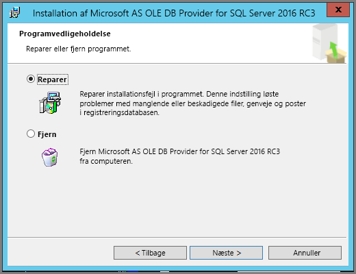

# Fejlfinding af Analysér i Excel
Når du bruger Analysér i Excel, kan du i nogle tilfælde få et uventet resultat, eller funktionen fungerer måske ikke som forventet. Denne side indeholder løsninger på almindelige problemer, når du bruger Analysér i Excel.

> [!NOTE]
> Der findes en separat side, der beskriver og fortæller, hvordan du aktiverer [Analysér i Excel](service-analyze-in-excel.md).
> 
> Hvis der opstår en situation, der ikke er angivet nedenfor, og det medfører problemer for dig, kan du bede om yderligere hjælp på [communitywebstedet](http://community.powerbi.com/), eller du kan oprette en [supportbillet](https://powerbi.microsoft.com/support/).
> 
> 

Denne artikel indeholder følgende afsnit til fejlfinding:

* Opdater Excel-biblioteker for OLE DB-provideren
* Find ud af, om du skal opdatere dine Excel-biblioteker
* Fejlen Der kan ikke oprettes forbindelse
* Fejlen Forbudt
* Ingen datamodeller
* Fejlen Token er udløbet
* Der kan ikke opnås adgang til lokale analysetjenester
* Der kan ikke trækkes noget til området med pivottabelværdier (ingen funktioner)

## Opdater Excel-biblioteker for OLE DB-provideren
Hvis du vil bruge **Analysér i Excel**, skal der være installeret en aktuel AS OLE DB-provider på din computer. Dette [communityindlæg](http://community.powerbi.com/t5/Service/Analyze-in-Excel-Initialization-of-the-data-source-failed/m-p/30837#M8081) er en god kilde til at kontrollere din installation af OLE DB-provideren eller til at downloade en nyere version.

Excel-biblioteker skal stemme overens med din version af Windows i forhold til bit-niveauet. Hvis du har installeret en 64-bit version af Windows, skal du installere 64-bit versionen af OLE DB-provideren.

Hvis du vil downloade de nyeste Excel-biblioteker, skal du gå til Power BI og vælge **pil ned** i øverste højre hjørne af Power BI-tjenesten og derefter vælge **Analysér i Excel-opdateringer**.

I dialogboksen, der vises, skal du vælge **Hent (eksempelvisning)**.

## Find ud af, om du skal opdatere dine Excel-biblioteker
Du kan hente den nyeste version af Excel OLE DB-providerbibliotekerne fra linksene i det forrige afsnit. Når du downloader det rette OLE DB-providerbibliotek og starter installationen, udføres der nogle kontroller i forhold til den aktuelt installerede version.

Hvis klientbibliotekerne til Excel OLE DB-provideren er opdateret, får du vist en dialogboks, der ser sådan ud:

C:\Users\davidi\Desktop\powerbi-content-pr\articles\media\powerbi-desktop-troubleshooting-analyze-in-excel

Eller hvis den nye version, du er ved at installere, er nyere end versionen på din computer, vises følgende dialogboks:

Hvis du ser dialogboksen, hvor du bliver bedt om at opgradere, skal du fortsætte med installationen for at få den nyeste version af OLE DB-provideren installeret på computeren.

## Fejlen Der kan ikke oprettes forbindelse
Den primære årsag til, at der *ikke kan oprettes forbindelse*, er, at klientbibliotekerne til OLE DB-provideren på din computer ikke er opdateret. Du kan finde oplysninger om, hvordan du finder den korrekte opdatering og downloadlinks, under**Opdater Excel-biblioteker for OLE DB-provideren** tidligere i denne artikel.

## Fejlen Forbudt
Nogle brugere har mere end én Power BI-konto, og når Excel forsøger at oprette forbindelse til Power BI ved hjælp af eksisterende legitimationsoplysninger, bruges der måske legitimationsoplysninger, der ikke har adgang til det datasæt eller den rapport, som du vil have adgang til.

Når dette sker, får du måske vist fejlen **Forbudt**, hvilket betyder, at du måske er logget på Power BI med legitimationsoplysninger, der ikke har tilladelse til datasættet. Når du støder på fejlen **Forbudt**, og du bliver bedt om at angive dine legitimationsoplysninger, skal du bruge de legitimationsoplysninger, der har tilladelse til at få adgang til det datasæt, du forsøger at bruge.

Hvis der stadig opstår fejl, skal du logge på Power BI med den konto, der har tilladelse, og kontrollere, at du kan få vist og få adgang til det datasæt i Power BI, du forsøger at få adgang til i Excel.

## Ingen datamodeller
Hvis du støder på fejlen **OLAP-kubemodellen blev ikke fundet**, har det datasæt, du forsøger at få adgang til, ikke en datamodel og kan derfor ikke analyseres i Excel.

## Fejlen Token er udløbet
Hvis du får vist fejlen **Token er udløbet** betyder det, at du ikke for nylig har brugt funktionen **Analysér i Excel** på den computer, du bruger. Du skal blot angive dine legitimationsoplysninger igen eller åbne filen igen, så skulle fejlen forsvinde.

## Der kan ikke opnås adgang til Analysis Services i det lokale miljø
Hvis du forsøger at få adgang til et datasæt, der har forbindelse til Analysis Services-data i det lokale miljø, modtager du måske en fejlmeddelelse. **Analysér i Excel** understøtter oprettelse af forbindelse til datasæt og rapporter om **Analysis Services** i det lokale miljø med en forbindelsesstreng, så længe computeren er på det samme domæne som **Analysis Services**-serveren, og din konto har adgang til denne **Analysis Services**-server.

## Der kan ikke trækkes noget til området med pivottabelværdier (ingen funktioner)
Når **Analysér i Excel** opretter forbindelse til en ekstern OLAP-model (det er på den måde, Excel opretter forbindelse til Power BI), kræver *pivottabellen*[, at der er defineret **målinger** i den eksterne model](https://support.microsoft.com/kb/234700), da alle beregninger udføres på serveren. Dette adskiller sig fra den måde, du arbejder med en lokal datakilde på (f.eks. tabeller i Excel, eller når du arbejder med datasæt i **Power BI Desktop** eller **Power BI-tjenesten**), hvor tabelmodellen er tilgængelig lokalt, og [du kan bruge implicitte målinger](https://msdn.microsoft.com/library/gg399077.aspx), som er målinger, der oprettes dynamisk og ikke gemmes i datamodellen. I disse tilfælde adskiller funktionsmåden i Excel sig fra funktionsmåden i **Power BI Desktop** eller **Power BI-tjenesten**: Der kan være kolonner i dataene, som kan behandles som målinger i Power BI, men de kan ikke bruges som værdier (målinger) i Excel.

Du har et par forskellige muligheder for at løse dette problem:

1. Opret [målinger i din datamodel i **Power BI Desktop**](desktop-tutorial-create-measures.md), publicer datamodellen i **Power BI-tjenesten**, og åbn derefter dette publicerede datasæt i Excel.
2. Opret [målinger i din datamodel fra Excel PowerPivot](https://support.office.com/article/Create-a-Measure-in-Power-Pivot-d3cc1495-b4e5-48e7-ba98-163022a71198).
3. Hvis du har importeret data fra en Excel-projektmappe, der kun indeholdt tabeller (ingen datamodel), kan du [føje tabellerne til datamodellen](https://support.office.com/article/Add-worksheet-data-to-a-Data-Model-using-a-linked-table-d3665fc3-99b0-479d-ba09-a37640f5be42) og derefter udføre trinnene i mulighed 2 ovenfor for at oprette målinger i din datamodel.

Når dine målinger er defineret i modellen i Power BI-tjenesten, kan du bruge dem i området **Værdier** i Excel-pivottabeller.

## Næste trin
[Analysér i Excel](service-analyze-in-excel.md)

[Selvstudium: Opret dine egne målinger i Power BI Desktop](desktop-tutorial-create-measures.md)

[Målinger i PowerPivot](https://msdn.microsoft.com/library/gg399077.aspx)

[Opret en måling i PowerPivot](https://support.office.com/article/Create-a-Measure-in-Power-Pivot-d3cc1495-b4e5-48e7-ba98-163022a71198)

[Føj regnearksdata til en datamodel ved hjælp af en tilknyttet tabel](https://support.office.com/article/Add-worksheet-data-to-a-Data-Model-using-a-linked-table-d3665fc3-99b0-479d-ba09-a37640f5be42)

[Forskelle mellem OLAP- og ikke-OLAP-pivottabeller i Excel](https://support.microsoft.com/kb/234700)

