# Selvstudium: Opret beregnede kolonner i Power BI Desktop

Nogle gange indeholder de data, du analyserer, ikke et bestemt felt, du skal bruge for at få de resultater, du er ude efter. Det er her, *beregnede kolonner* kommer ind i billedet. Beregnede kolonner benytter DAX-formler (Data Analysis Expressions) til at definere en kolonnes værdier, alt fra at lægge tekstværdier sammen ud fra et par forskellige kolonner til beregning af en numerisk værdi fra andre værdier. Lad os f.eks. sige, at dine data har felterne **By** og **Stat**, men du vil gerne have et enkelt felt af typen **Placering**, der indeholder begge som en enkelt værdi, f.eks. Miami, FL. Det er præcis det, beregnede kolonner er beregnede til.

Beregnede kolonner er lig med [målinger](desktop-tutorial-create-measures.md), da begge er baseret på DAX-formler, men adskiller sig fra hinanden på den måde, de bruges på. Du bruger ofte målinger i området **Værdier** for en visualisering til at beregne resultater, der er baseret på andre felter. Du bruger beregnede kolonner som nye **felter** i rækker, akser, forklaringer og gruppeområder for visualiseringer.

I dette selvstudium lærer du, hvordan du kan oprette beregnede kolonner og bruge dem i rapportvisualiseringer i Power BI Desktop. 

### Forudsætninger
- Denne artikel er beregnet til Power BI-brugere, som allerede har erfaring med Power BI Desktop, så de kan oprette mere avancerede modeller. Du bør allerede have kendskab til at bruge **Hent data** og **Forespørgselseditor** til at importere data, arbejde med flere relaterede tabeller og tilføje felter på dit rapportcanvas. Hvis du ikke har erfaring med Power BI Desktop, skal du se [Introduktion til Power BI Desktop](desktop-getting-started.md).
  
- I selvstudiet bruges [Contoso Sales Sample for Power BI Desktop](http://download.microsoft.com/download/4/6/A/46AB5E74-50F6-4761-8EDB-5AE077FD603C/Contoso%20Sales%20Sample%20for%20Power%20BI%20Desktop.zip), som er det samme eksempel, der bruges i selvstudiet [Opret dine egne målinger i Power BI Desktop](desktop-tutorial-create-measures.md). Disse salgsdata fra det fiktive firma Contoso, Inc. blev importeret fra en database, så du behøver ikke at oprette forbindelse til datakilden eller se den i Forespørgselseditor. Download og udpak filen på din computer, og åbn den derefter i Power BI Desktop.

## Opret en beregnet kolonne med værdier fra relaterede tabeller

I din salgsrapport vil du gerne have vist produktkategorier sammen med produktunderkategorier som enkeltværdier, f.eks. mobiltelefoner – tilbehør, mobiltelefoner – smartphones og PDA'er osv. Der er ingen felter på listen **Felter**, der giver dig disse data, men der er et felt af typen **ProductCategory** og et felt af typen **ProductSubcategory** i hver sin tabel. Du kan oprette en beregnet kolonne, der kombinerer værdier fra disse to kolonner. DAX-formler kan udnytte alle fordelene ved den model, vi allerede har, herunder relationerne mellem forskellige tabeller, der allerede findes. 

 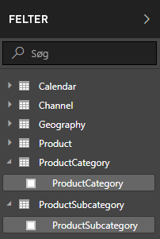

1.  Vælg ellipsen for **flere indstillinger** (...), eller højreklik på tabellen **ProductSubcategory** på listen Felter, og vælg derefter **New Column** (Ny kolonne). Dette opretter den nye kolonne i tabellen ProductSubcategory.
    
    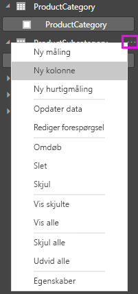
    
    Formellinjen vises langs toppen af rapportcanvasset, hvor du kan navngive kolonnen og angive en DAX-formel.
    
    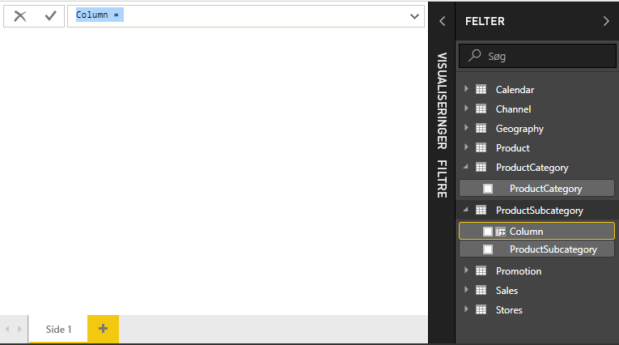
    
2.  En ny beregnet kolonne hedder som standard blot Column (Kolonne). Hvis du ikke omdøber den, navngives nye ekstra kolonner Column 2, Column 3 osv. Din kolonne skal være lettere at identificere, så eftersom navnet **Column** (Kolonne) allerede er markeret på formellinjen, kan du omdøbe den ved at indtaste **ProductFullCategory** og derefter indtaste et lighedstegn (**=**).
    
3.  Værdierne i den nye kolonne skal starte med navnet ProductCategory. Eftersom denne kolonne er i en anden, men relateret tabel, kan du bruge funktionen [RELATED](https://msdn.microsoft.com/library/ee634202.aspx) til at hjælpe med at hente kolonnen.
    
    Skriv et **r** efter lighedstegnet. På en rulleliste vises alle de DAX-funktioner, der begynder med r. Når du vælger en funktion, vises en beskrivelse af funktionens effekt. Efterhånden som du skriver, skaleres forslagslisten tættere på den funktion, du har brug for. Vælg **RELATED**, og tryk derefter på **Enter**.
    
    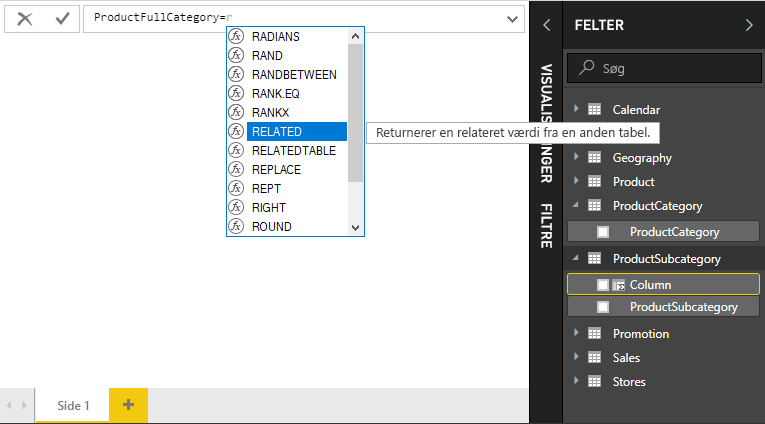
    
    En venstreparentes vises sammen med en anden liste med forslag over de relaterede kolonner, du kan sende til funktionen RELATED, med beskrivelser og oplysninger om forventede parametre. 
    
    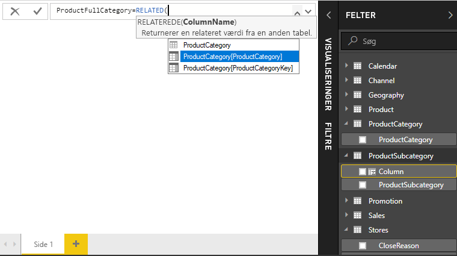
    
4.  I dette tilfælde skal du bruge kolonnen **ProductCategory** i tabellen **ProductCategory**. Vælg **ProductCategory[ProductCategory]**, tryk på **Enter**, og angiv derefter en slutparentes.
    
    > [!TIP]
    > Syntaksfejl skyldes oftest en manglende eller forkert placeret slutparentes, selvom Power BI Desktop nogle gange tilføjer den for dig.
    
4. ProductCategories og ProductSubcategories skal adskilles af tankestreger og mellemrum i de nye værdier, så efter slutparentesen i det første udtryk skal du indtaste et mellemrum, et ampersand (**&**), dobbelte anførselstegn (**"**), mellemrum, tankestreg (**-**), endnu et mellemrum, endnu et dobbelt anførselstegn og endnu et ampersand. Din formel skal se sådan ud:
    
    `ProductFullCategory = RELATED(ProductCategory[ProductCategory]) & " - " &`
    
    > [!TIP]
    > Klik på den nedadvendte pil i højre side af formellinjen for at udvide formeleditoren, hvis du har brug for mere plads. Klik på **Alt + Enter** i teksteditoren for at gå en linje ned og **tabulator** for at flytte ting.
    
5.  Indtast endnu en venstreparentes (**[**), og vælg derefter kolonnen **[ProductSubcategory]** for at afslutte formlen. 
    
    
    
    Du havde ikke brug for endnu en RELATED-funktion til at kalde tabellen ProductSubcategory i det andet udtryk, fordi du er ved at oprette den beregnede kolonne i denne tabel. Du kan indtaste [ProductCategory] med tabelnavnspræfikset (fuldt kvalificeret) eller uden (ikke-kvalificeret).
    
6.  Afslut formlen ved at trykke på **Enter** eller ved at klikke på fluebenet i formellinjen. Formlen valideres, og kolonnenavnet **ProductFullCategory** vises i tabellen **ProductSubcategory** på listen over felter. 
    
    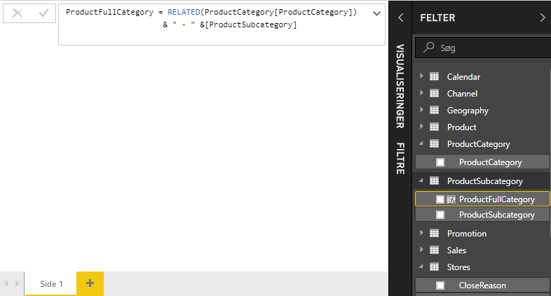
    
    >[!NOTE]
    >I Power BI Desktop får beregnede kolonner et særligt ikon på feltlisten, der viser, at de indeholder formler. I Power BI-tjenesten (dit Power BI-websted) er det ikke muligt at ændre formler, hvorfor beregnede kolonner ikke har et ikon.
    
## Brug den nye kolonne i en rapport

Nu kan du bruge den nye kolonne ProductFullCategory til at kigge på SalesAmount efter ProductFullCategory.

1. Vælg eller træk kolonnen **ProductFullCategory** fra tabellen **ProductSubcategory** til rapportcanvasset for at oprette en tabel, der viser alle ProductFullCategory-navne.
   
   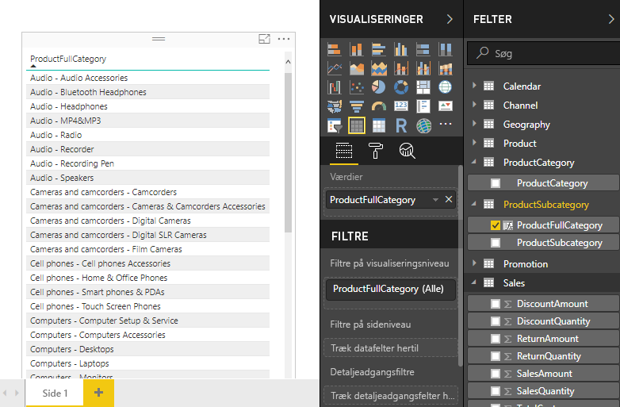
    
2. Vælg eller træk feltet **SalesAmount** fra tabellen **Sales** til tabellen for at få vist salgsbeløbet for hver produktkategori.
   
   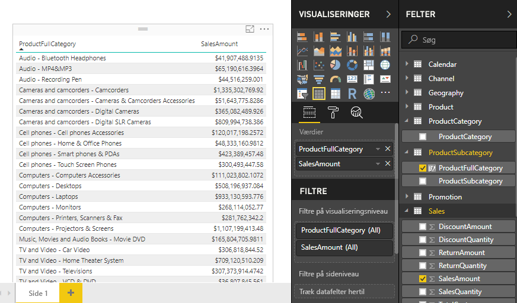
    
## Opret en beregnet kolonne, der benytter en IF-funktion

Contoso Sales-eksemplet indeholder salgsdata for både aktive og inaktive butikker. Du vil sikre, at salget for aktive butikker adskilles tydeligt fra salget i inaktive butikker i din rapport ved at oprette et felt af typen Active StoreName. I den nye beregnede kolonne Active StoreName, vises alle aktive butikker med butikkens fulde navn, mens inaktive butikker grupperes under "Inactive". 

Tabellen Stores indeholder heldigvis en kolonne ved navn **Status** med værdier som "On" for aktive butikker og "Off" for inaktive butikker, som vi kan bruge til at oprette værdier for vores nye kolonne Active StoreName. Din DAX-formel bruger den logiske funktion [IF](https://msdn.microsoft.com/library/ee634824.aspx) til at kontrollere alle butikkernes status og returnerer en bestemt værdi, afhængigt af resultatet. Hvis en butiks status er "On" (Aktiveret), returnerer formlen butikkens navn. Hvis den er "Off" (Deaktiveret), tildeler formlen et "Inactive" til Active StoreName. 

1.  Opret en ny beregnet kolonne med navnet **Active StoreName** i tabellen **Stores** på formellinjen.
    
2.  Efter tegnet **=** skal du begynde at skrive **IF**. På forslagslisten kan du se, hvad du kan tilføje. Vælg **IF**.
    
    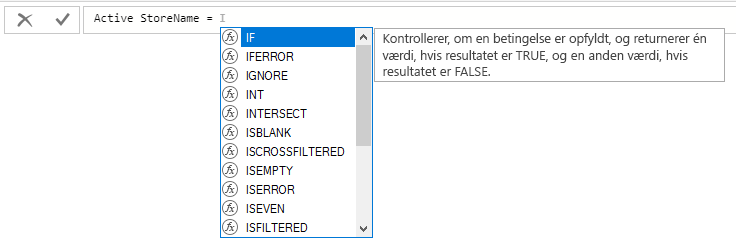
    
3.  Det første argument for IF er en logisk test af, om en butiks status er "On". Indtast en venstreparentes **[**, som oplister kolonner fra tabellen Stores, og vælg **[Status]**.
    
    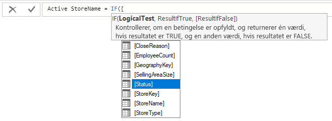
    
4.  Lige efter **[Status]** skal du skrive **= "On"** og derefter skrive et komma (**,**) for at afslutte argumentet. Værktøjstippet foreslår, at du skal tilføje en værdi, der skal returneres, hvis resultatet er TRUE.
    
    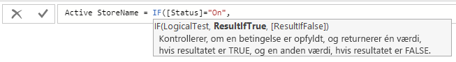
    
5.  Hvis butikkens status er "On" (Aktiveret), vil du have vist butikkens navn. Skriv en venstreparentes **[**, og vælg kolonnen **[StoreName]**, og skriv derefter endnu et komma. Værktøjstippet angiver nu, at du skal tilføje en værdi, der skal returneres, hvis resultatet er FALSE. 
    
    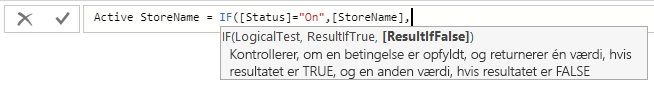
    
6.  Du vil have, at værdien er *Inactive*, så skriv **"Inactive"**, og afslut derefter formlen ved at trykke på **Enter** eller ved at vælge fluebenet i formellinjen. Formlen valideres, og navnet på den nye kolonne vises i tabellen **Stores** på listen over felter.
    
    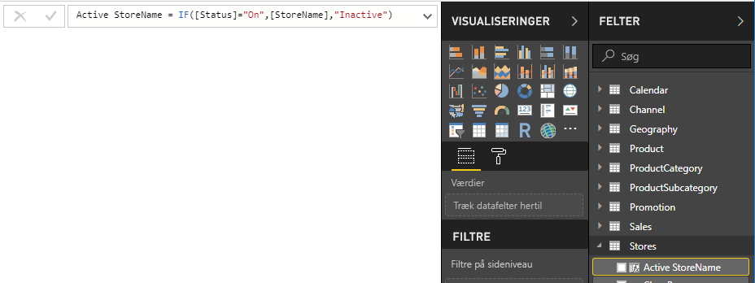
    
8.  Du kan bruge den nye Active StoreName-kolonne i visualiseringer på samme måde som et hvilket som helst andet felt. Hvis du vil have vist SalesAmounts efter Active StoreName, skal du vælge feltet **Active StoreName** og trække det til canvasset, og derefter vælge feltet **SalesAmount** eller trække det til tabellen. I denne tabel vises aktive butikker separat efter navn, mens inaktive butikker er grupperet tilsidst som *Inactive*. 
    
    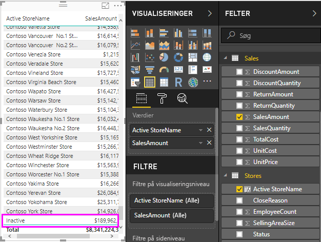
    
## Det har du lært
Beregnede kolonner kan forbedre vores data og give bedre indsigt. Du har lært at oprette beregnede kolonner på feltlisten og formellinjen, bruge forslagslister og værktøjstip til at hjælpe med at oprette formler, kalde DAX-funktioner som f.eks. RELATED og IF med de korrekte argumenter og bruge beregnede kolonner i rapportvisualiseringer.

## Næste trin
Hvis du vil vide mere om DAX-formler og oprette beregnede kolonner med mere avancerede formler, skal du se [Grundlæggende DAX i Power BI Desktop](desktop-quickstart-learn-dax-basics.md). Denne artikel har fokus på de grundlæggende koncepter i DAX, for eksempel syntaks, funktioner og en dybere forståelse af kontekst.

Husk at føje [DAX-reference (Data Analysis Expressions)](https://msdn.microsoft.com/library/gg413422.aspx) til dine favoritter. Det er her, du finder detaljerede oplysninger om DAX-syntaks, operatorer og de mere end 200 DAX-funktioner.

