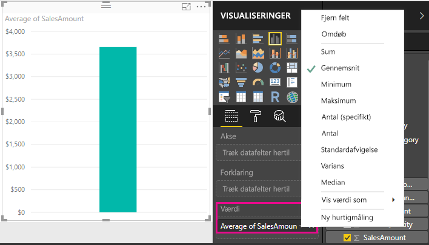
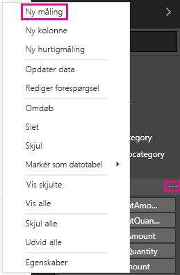
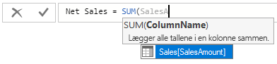
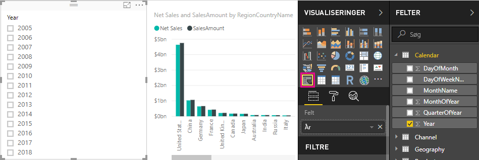
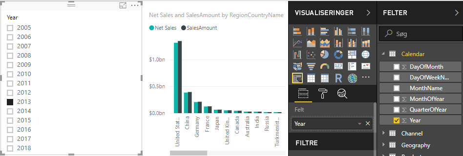
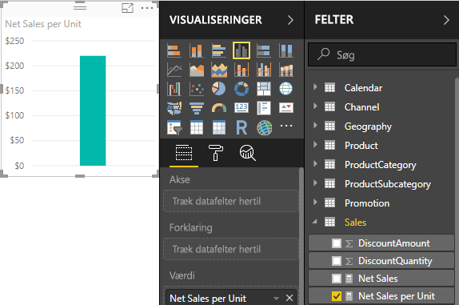
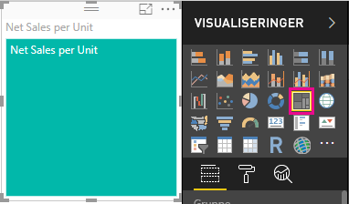

# Selvstudium: Opret dine egne målinger i Power BI Desktop
Ved hjælp af målinger kan du oprette nogle af de mest effektive løsninger til dataanalyse i Power BI Desktop. Målinger hjælper dig med at udføre beregninger på dine data, når du arbejder med dine rapporter. I dette selvstudium lærer du, hvordan du skal forstå målinger, og hvordan du opretter dine egne grundlæggende målinger i Power BI Desktop.

## Forudsætninger

- Denne artikel er beregnet til Power BI-brugere, som allerede har erfaring med Power BI Desktop, så de kan oprette mere avancerede modeller. Du ved sikkert allerede, hvordan du kan bruge Hent data og Forespørgselseditor til at importere data, arbejde med flere relaterede tabeller og tilføje felter på dit rapportlærred. Hvis du ikke har erfaring med Power BI Desktop, skal du se [Introduktion til Power BI Desktop](desktop-getting-started.md).
  
- I dette selvstudium bruges filen [Contoso Sales Sample til Power BI Desktop](https://download.microsoft.com/download/4/6/A/46AB5E74-50F6-4761-8EDB-5AE077FD603C/Contoso%20Sales%20Sample%20for%20Power%20BI%20Desktop.zip), som indeholder data om onlinesalget for den fiktive virksomhed Contoso. Da disse data er importeret fra en database, kan du ikke oprette forbindelse til datakilden eller få dem vist i Forespørgselseditor. Download og udpak filen på din computer.

## Automatiske målinger

Når Power BI Desktop opretter en måling, oprettes den som regel automatisk for dig. Du kan se, hvordan Power BI Desktop opretter en måling, ved at følge disse trin:

1. I Power BI Desktop skal du vælge **Filer** > **Åbn**, gå til filen *Contoso Sales Sample for Power BI Desktop.pbix* og derefter vælge **Åbn**.

2. I ruden **Felter** skal du udvide tabellen **Sales**. Derefter skal du enten markere afkrydsningsfeltet ud for **SalesAmount** eller trække **SalesAmount** til rapportlærredet.

    Der vises en ny visualisering med et søjlediagram, hvor du kan se den samlede sum af alle værdier i kolonnen **SalesAmount** i tabellen **Sales**.

    

Alle felter (kolonner) i ruden **Felter** med et sigmaikon  er numeriske, og værdierne kan lægges sammen. I stedet for at vise en tabel med mange værdier (to millioner rækker for **SalesAmount**) opretter og beregner Power BI Desktop automatisk en måling for at sammenlægge dataene, hvis der registreres en numerisk datatype. Sum er standardsammenlægningen for en numerisk datatype, men du kan nemt anvende forskellige sammenlægninger, f.eks. gennemsnit eller antal. Det er vigtigt at forstå sammenlægninger for at forstå målinger, da alle målinger vil udføre en form for sammenlægning. 

Hvis du vil ændre sammenlægningen i diagrammet, skal du følge disse trin:

1. Vælg visualiseringen **SalesAmount** på rapportlærredet.  

1. I området **Værdi** i ruden **Visualiseringer** skal du vælge pil ned til højre for **SalesAmount**. 

1. Vælg **Gennemsnit** i den viste menu. 

    Visualiseringen ændres til et gennemsnit af alle salgsværdierne i feltet **SalesAmount**.

    

Afhængigt af det ønskede resultat kan du ændre typen af sammenlægning. Det er dog ikke alle typer sammenlægninger, der kan anvendes på alle numeriske datatyper. For feltet **SalesAmount** er Sum og Gennemsnit f.eks. nyttige, og Minimum og Maksimum kan også anvendes. Antal giver dog ikke mening for feltet **SalesAmount**, for selvom værdierne er numeriske, er de reelt valuta.

De værdier, der beregnes ud fra målinger, ændres på baggrund af dine interaktioner i rapporten. Hvis du f.eks. trækker feltet **RegionCountryName** fra tabellen **Geografi** til dit eksisterende **SalesAmount**-diagram, ændres det for at vise de gennemsnitlige salgsbeløb for hvert land.

Når resultatet af en måling ændres på grund af en interaktion med rapporten, påvirkes målingens *kontekst*. Hver gang du arbejder med visualiseringer i rapporten, ændrer du konteksten for, hvordan en måling beregner og viser resultater.

## Opret og brug dine egne målinger

I de fleste tilfælde beregner og returnerer Power BI Desktop automatisk værdier i henhold til de typer af felter og sammenlægninger, du vælger. Men i nogle tilfælde skal du muligvis oprette dine egne målinger for at kunne udføre mere komplekse beregninger. I Power BI Desktop kan du oprette dine egne målinger ved at bruge DAX-formelsproget (Data Analysis Expressions). 

I DAX-formler bruges der mange af de samme funktioner og operatorer samt den samme syntaks som i Excel-formler. DAX-funktionerne er dog designet til at arbejde med relationelle data og udføre mere dynamiske beregninger, når du interagerer med dine rapporter. Der er mere end 200 DAX-funktioner, som kan udføre alt lige fra enkle sammenlægninger, som Sum og Gennemsnit, til mere komplekse statistik- og filtreringsfunktioner. Der findes mange ressourcer, hvor du kan få mere at vide om DAX. Når du er færdig med dette selvstudium, kan du gå til [Grundlæggende DAX i Power BI Desktop](desktop-quickstart-learn-dax-basics.md).

Når du har oprettet din egen måling, kaldes det en *model*måling, og den føjes til listen **Felter** for den tabel, du vælger. Nogle af fordelene ved modelmålinger er, at du kan navngive dem, ligesom du vil, hvilket gør det nemmere at identificere dem. Du kan også bruge dem som argumenter i andre DAX-udtryk, og du kan få dem til at udføre komplekse beregninger hurtigt.

### Hurtigmålinger

Fra og med februar 2018-versionen af Power BI Desktop er mange almindelige beregninger tilgængelige som *hurtigmålinger*, som skriver DAX-formler for dig på baggrund af dine input i et vindue. Disse hurtige, effektive beregninger er også gode til at lære om DAX og forsyne dine egne tilpassede målinger. 

Opret en hurtigmåling ved hjælp af en af disse metoder: 
 - I en tabel i ruden **Felter** skal du højreklikke eller vælge **Flere indstillinger** ( **...** ) og derefter vælge **Ny hurtigmåling** på listen.

 - Under **Beregninger** under fanen **Hjem** på båndet i Power BI Desktop skal du vælge **Ny hurtigmåling**.

Du kan finde flere oplysninger om oprettelse og brug af hurtigmålinger under [Brug hurtigmålinger](desktop-quick-measures.md).

### Opret en måling

Du vil f.eks. analysere din nettoomsætning ved at trække rabatter og returneringer fra det samlede salgsbeløb. Uanset hvilken kontekst du har i din visualisering, har du brug for en måling, der trækker summen af DiscountAmount og ReturnAmount fra summen af SalesAmount. Der er ikke noget felt for nettoomsætning på listen **Felter**, men du har komponenterne til at oprette din egen måling, der kan beregne nettoomsætningen. 

Hvis du vil oprette en måling, skal du følge disse trin:

1. Højreklik på tabellen **Sales** i ruden **Felter**, eller hold markøren over tabellen, og vælg **Flere indstillinger** ( **...** ). 

1. Vælg **Ny måling** i den viste menu. 

    Denne handling gemmer din nye måling i tabellen **Sales**, hvor det er nemt at finde den.
    
    
    
    Du kan også oprette en ny måling ved at vælge **Ny måling** i gruppen **Beregninger** under fanen **Hjem** på Power BI Desktop-båndet.
    
    
    
    >[!TIP]
    >Når du opretter en måling via båndet, kan du oprette den i en hvilken som helst tabel, men du kan nemmere finde den, hvis du opretter den der, hvor du har planlagt at bruge den. Du skal derfor først markere tabellen **Sales** for at aktivere den og derefter vælge **Ny måling**. 
    
    Formellinjen vises langs toppen af rapportlærredet, hvor du kan omdøbe målingen og angive en DAX-formel.
    
    
    
1. Hver ny måling kaldes som standard *Måling*. Hvis du ikke omdøber den, vil yderligere målinger blive kaldt for *Måling 2*, *Måling 3* osv. Da du skal kunne identificere denne måling, skal du fremhæve *Måling* på formellinjen og derefter ændre navnet til *Net Sales*.
    
1. Gå i gang med at skrive din formel. Begynd at skrive *Sum* efter lighedstegnet. I takt med at du skriver, vises der en rullemenu med forslag, hvor alle DAX-funktioner, der starter med det bogstav, du skriver, vises. Rul ned, hvis det er nødvendigt, for at vælge **SUM** på listen, og tryk derefter på **Enter**.
    
    
    
    Der vises en venstreparentes sammen med en rullemenu med en forslagsliste over de tilgængelige kolonner, du kan bruge som argument i SUM-funktionen.
    
    
    
1. Udtryk vises altid mellem en start- og slutparentes. Til dette eksempel indeholder dit udtryk et enkelt argument, som skal bruges i SUM-funktionen: kolonnen **SalesAmount**. Begynd at skrive *SalesAmount*, indtil **Sales(SalesAmount)** er den eneste værdi tilbage på listen. 

    Navnet på kolonnen, som kommer før navnet på tabellen, kaldes for kolonnens fulde navn. Ved at angive kolonnernes fulde navne er det nemmere at læse dine formler.
    
    
    
1. Vælg **Sales[SalesAmount]** på listen, og angiv derefter en højreparentes.
    
    > [!TIP]
    > Syntaksfejl skyldes ofte, at der mangler en slutparentes, eller at den er placeret forkert.
    
    
    
1. Træk de to andre kolonner i formlen fra:

    a. Skriv et mellemrum, et minustegn (-) og endnu et mellemrum efter højreparentesen for det første udtryk. 

    b. Angiv en anden SUM-funktion, og begynd at skrive *DiscountAmount*, indtil du kan vælge kolonnen **Sales[DiscountAmount]** som argument. Tilføj en slutparentes. 

    c. Angiv et mellemrum, et minustegn, et mellemrum, en anden SUM-funktion med **Sales[ReturnAmount]** som argument og derefter en højreparentes.
    
    
    
1. Tryk på **Enter**, eller vælg **Anvend** (ikonet med fluebenet) på formellinjen for at afslutte og validere formlen. 

    Den validerede **Net Sales**-måling er nu klar til brug i tabellen **Sales** i ruden **Felter**.
    
    
    
1. Hvis du løber tør for plads til angivelse af en formel eller vil angive den over flere linjer, skal du vælge pil ned til højre på formellinjen for at skabe mere plads. 

    Pil ned ændres til pil op, og der vises et stort felt.

    

1. Du kan adskille dele i formlen ved at trykke på **Alt** + **Enter** for særskilte linjer eller ved at trykke på **Tab** for at tilføje tabulatorafstand.

   

### Brug målingen i rapporten
Føj din nye **Net Sales**-måling til rapportlærredet, og beregn nettoomsætningen for alle andre felter, du føjer til rapporten. 

Sådan ser du nettoomsætning efter land:

1. Markér målingen **Net Sales** i tabellen **Sales**, eller træk den ind i rapportcanvasset.
    
1. Markér feltet **RegionCountryName** i tabellen **Geography**, eller træk det til diagrammet **Net Sales**.
    
    
    
1. Hvis du vil se forskellen mellem nettoomsætning og samlet salg efter land, skal du vælge feltet **SalesAmount** eller trække det til diagrammet. 

    

    Diagrammet bruger nu to målinger: **SalesAmount**, som Power BI automatisk har opsummeret, samt målingen **Net Sales**, som du har oprettet manuelt. Hver måling blev beregnet i henhold til konteksten i et andet felt, **RegionCountryName**.
    
### Brug målingen sammen med et udsnitsværktøj

Tilføj et udsnit, så du kan filtrere nettoomsætningen og salgsbeløbet yderligere efter kalenderår:
    
1. Vælg et tomt område ved siden af diagrammet. Vælg visualiseringen **Tabel** i ruden **Visualiseringer**. 

    Denne handling opretter en tom tabelvisualisering på dit rapportlærred.
    
    
    
1. Træk feltet **Year** fra tabellen **Calendar** til den nye tomme tabelvisualisering. 
    
    Da **Year** er et numerisk felt, vil Power BI Desktop lægge værdierne sammen. Denne opsummering fungerer ikke godt som en sammenlægning. Det ser vi på i næste trin.

    
    
3. I feltet **Værdier** i ruden **Visualiseringer** skal du vælge pil ned ud for **Year** og derefter vælge **Opsummer ikke** på listen. De enkelte år vises nu i tabellen.
    
    
    
4.  Vælg ikonet **Udsnitsværktøj** i ruden **Visualiseringer** for at konvertere den nye tabel til et udsnit. Hvis visualiseringen viser en skyder i stedet for en liste, skal du vælge **Liste** på rullelisten for skyderen.

    
    
5.  Vælg en vilkårlig værdi i udsnittet **Year** for at filtrere diagrammet **Net Sales and Sales Amount by RegionCountryName** i overensstemmelse hermed. Målingerne **Net Sales** og **SalesAmount** genberegner og viser resultater i henhold til konteksten i det valgte felt for **Year**. 
    
    

### Brug din måling i en anden måling

Antag, at du vil finde ud af, hvilke produkter der har den højeste nettoomsætning pr. solgt enhed. Du skal bruge en måling, der opdeler nettosalg efter antallet af solgte enheder. Opret en ny måling, der opdeler resultatet af målingen **Net Sales** efter summen af **Sales[SalesQuantity]** .

1.  Opret en ny måling med navnet **Net Sales per unit** i tabellen **Sales** i ruden **Felter**.
    
1. Begynd at skrive *Net Sales* i formellinjen. På listen over forslag kan du se, hvad du kan tilføje. Vælg **[Net Sales]** .
    
    
    
1. Du kan også referere til en måling ved blot at begynde at skrive en startparentes ( **[** ). På listen over forslag kan du kun se målinger, du kan føje til formlen.
    
    
    
1. Angiv et mellemrum, en divisionsoperator (/), endnu et mellemrum, en SUM-funktion, og skriv derefter *Quantity*. På listen over forslag kan du se alle de kolonner, hvor *Quantity* indgår i navnet. Vælg **Sales[SalesQuantity]** , skriv højreparentesen, og tryk på **Enter**, eller markér afkrydsningsfeltet **Anvend** (ikonet med flueben) for at validere formlen. 

    Den oprettede formel ser sådan ud:
    
    `Net Sales per Unit = [Net Sales] / SUM(Sales[SalesQuantity])`
    
1. Markér målingen **Net Sales per Unit** i tabellen **Sales**, eller træk den ind i et tomt område på rapportlærredet. 

    I diagrammet kan du se nettoomsætningen pr. enhed for alle solgte produkter. Dette diagram er ikke specielt informativt. Det ser vi på i næste trin.
    
    
    
1. Ret diagrammets visualiseringstype til **Træstruktur** for at få et andet layout.
    
    
    
1. Markér feltet **Product Category**, eller træk det til træstrukturen eller feltet **Gruppe** i ruden **Visualiseringer**. Nu har du nogle gode oplysninger!
    
    
    
7. Prøv at fjerne feltet **ProductCategory** og i stedet trække feltet **ProductName** til diagrammet. 
    
    
    
   Nu leger vi bare lidt med tingene, men du må indrømme, at det er ret smart. Eksperimentér med andre måder at filtrere og formatere visualiseringen på.

## Det har du lært
Målinger kan give dig den ønskede indsigt i dine data. Du har lært, hvordan du opretter målinger ved hjælp af formellinjen, navngiver dem, så de giver mest mening, og finder og vælger de korrekte formelelementer ved hjælp af DAX-forslagslisten. Du har også fået en introduktion til kontekst, hvor resultatet af beregninger i målinger ændres i henhold til andre felter eller andre udtryk i formlerne.

## De næste trin
- Hvis du vil vide mere om hurtigmålinger i Power BI Desktop, der udfører mange almindelige beregninger for dig, skal du se [Brug hurtigmålinger til nemt at udføre almindelige og effektive beregninger](desktop-quick-measures.md).
  
- Hvis du vil vide mere om DAX-formler og oprette mere avancerede målinger, skal du se [Grundlæggende DAX i Power BI Desktop](desktop-quickstart-learn-dax-basics.md). Denne artikel har fokus på de grundlæggende koncepter i DAX, for eksempel syntaks, funktioner og en dybere forståelse af kontekst.
  
- Husk at føje [DAX-reference (Data Analysis Expressions)](https://docs.microsoft.com/dax/index) til dine favoritter. I dette referencemateriale kan du finde detaljerede oplysninger om DAX-syntaks, operatorer og mere end 200 DAX-funktioner.

