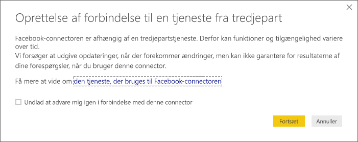
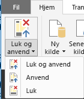
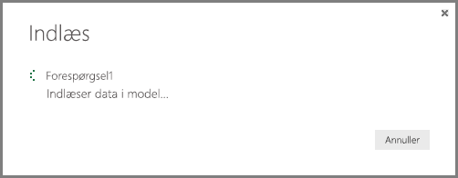
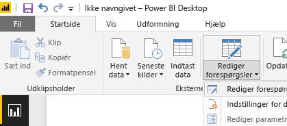

# Selvstudium: Facebook-analyse ved hjælp af Power BI Desktop
I dette selvstudium lærer du, hvordan du kan importere og visualisere data fra **Facebook**. I løbet af selvstudiet lærer du, hvordan du opretter forbindelse til en specifik Facebook-side (Power BI-siden), anvender trin til transformation af data og opretter nogle visualiseringer.

Her er de trin, som du skal igennem:

* **Opgave 1:** Opret forbindelse til en Facebook-side
* **Opgave 2**: Opret visualiseringer ved hjælp af rapportvisningen
  
  * **Trin 1**: Opret en træstrukturvisualisering
* **Opgave 3**: Form data i forespørgselsvisningen
  
  * **Trin 1**: Opdel kolonnen med dato/klokkeslæt i to
  * **Trin 2**: Tilføj en aggregeret værdi fra en relateret tabel
* **Opgave 4**: Opret flere visualiseringer ved hjælp af rapportvisning
  
  * **Trin 1**: Indlæs forespørgslen i rapporten
  * **Trin 2**: Opret et kurvediagram og et liggende søjlediagram

## **Opgave 1: Opret forbindelse til en Facebook-side**
I denne opgave skal du importere data fra webstedet [Microsoft Power BI Facebook](https://www.facebook.com/microsoftbi) (her er det webadressen: *https://www.facebook.com/microsoftbi)*.

Alle kan oprette forbindelse til den side og følge disse trin. Det kræver ingen særlige legitimationsoplysninger (ud over til din egen Facebook-konto, som du kan bruge i disse trin).

1. Vælg **Hent data** i dialogboksen **Introduktion** eller under fanen **Hjem** på båndet.
2. Dialogboksen **Hent data** vises, hvor du kan vælge mellem forskellige datakilder. Vælg **Facebook** under gruppen **Onlinetjenester**.
   
   
   
   Når du vælger **Opret forbindelse**, vises der en dialogboks med en advarsel om risikoen ved at bruge en tredjepartstjeneste.
   
   
3. Når du vælger Fortsæt, vises dialogboksen **Facebook**, hvor du kan indsætte sidenavnet (**microsoftbi**) i tekstfeltet **Brugernavn**. Vælg **Indlæg** på rullelisten **Forbindelse**.
   
   
4. Klik på **OK**.
5. Når du bliver bedt om dine legitimationsoplysninger, skal du logge på med din egen Facebook-konto og give Power BI adgang via din konto.
   
   

Når du har oprettet forbindelse til siden, kan du se, at der indlæses data til modellen. 

Dataene vises i **Forespørgselseditor**. **Forespørgselseditor** er en del af Power BI Desktop, men det indlæses i et separat vindue. Det er her, du kan udføre alle transformationer på dine dataforbindelser.

Når dine data ser ud, som du vil have det, kan du indlæse dem i Power BI Desktop. Vælg **Luk og indlæs** under fanen **Hjem** på båndet.

Der vises en dialogboks med statussen for indlæsningen af data i Power BI Desktop-datamodellen.

Når dataene er indlæst, kommer du til visningen **Rapport**, hvor kolonnerne fra tabellen kan ses på listen **Felter** i højre side.

## **Opgave 2: Opret visualiseringer ved hjælp af rapportvisningen**
Nu, hvor dataene er indlæst fra tabellen, kan du hurtigt og nemt få indsigt i dataene ved hjælp af visualiseringer.

**Trin 1**: Opret en træstrukturvisualisering

Det er nemt at oprette en visualisering. Du skal blot trække et felt fra **listen Felter** over på dit **rapportcanvas**.

Træk feltet **type** til dit **rapportcanvas**. Power BI Desktop opretter en ny visualisering på dit **rapportcanvas**. Derefter kan du trække **type** fra **Felter** (det samme felt, som du lige har trukket til dit **rapportcanvas**) til området **Værdi** for at oprette en visualisering af typen **Liggende søjlediagram**.

Det er nemt at ændre typen af visualisering ved at vælge et andet ikon i ruden **Visualiseringer**. Jeg prøver at ændre typen til **Træstruktur** ved at vælge ikonet fra **Visualiseringer**, som du kan se det i det følgende billede.

Nu vil jeg tilføje en forklaring og ændre farve på et datapunkt. Vælg ikonet **Format** i ruden **Visualiseringer**. Ikonet **Format** ligner en malerulle.

Når du vælger pil ned ud for **Forklaring**, udvides sektionen for at vise, hvordan du kan tilpasse forklaringen for den valgte visualisering. Her har jeg valgt følgende:

* Jeg flyttede skyderen **Forklaring** til **Til**, så der vises en forklaring.
* Jeg valgte **Højre** på rullelisten **Placering**.
* Jeg flyttede skyderen **Titel** til **Til**, så der vises en forklaring.
* Jeg skrev **type** som titel til forklaringen

I følgende billede kan du allerede se disse ændringer.

Nu vil jeg ændre farven på et af datapunkterne. Linkdatapunktet skal være blåt, så det er tættere på standardfarven for links.

Vælg pilen ud for **Datafarver** for at udvide den sektion. Datapunkterne vises med en vælgerpil ud for hver farve, som gør det muligt at vælge forskellige farver for hvert datapunkt.

Når du klikker på rullepilen med farver ud for et datapunkt, vises der en dialogboks, hvor du kan vælge en farve. Her har jeg valgt lyseblå.

Det var bedre. I det efterfølgende billede kan du se, hvordan farven er blevet anvendt på datapunktet i visualiseringen, og at forklaringen blev opdateret automatisk med værdierne fra **Datafarver**.

## **Opgave 3: Form data i tabellen**
Nu, hvor du har importeret tabellen og er begyndt at visualisere den, vil du nok bemærke, at det er vigtigt at udføre forskellige typer formning og oprydning i data, for at du kan få mest muligt ud af dem.

**Trin 1**: Opdel kolonnen med dato/klokkeslæt i to

I dette trin opdeler jeg kolonnen **created\_time** for både at få fat i datoværdien og klokkeslætsværdien. Når du er i Power BI Desktop, og du vil ændre en eksisterende forespørgsel, skal du starte **Forespørgselseditor**. Det gør du ved at vælge **Rediger forespørgsler** under fanen **Hjem**.

1. I gitteret i **Forespørgselseditor** skal du rulle til højre, indtil du finder kolonnen **created\_time**.
2. Højreklik på en kolonneoverskrift i gitteret med **forespørgselseksemplet**, og klik på **Opdel kolonne \> Efter afgrænser** for at opdele kolonnen. Vælg **Brugerdefineret** i rullelisten med afgrænsere, og skriv **"T"**. Bemærk, at denne funktion også kan vælges i gruppen **Administrer kolonner** under fanen **Hjem** på båndet.
   
   
   
   
3. Jeg omdøber de oprettede kolonner til **created\_date** og **created\_time**.
4. Vælg den nye kolonne **created\_time**, og gå til fanen **Tilføj kolonne** under **Forespørgselsvisning**, og vælg **Klokkeslæt\>Time** i gruppen **Fra dato og klokkeslæt**. Dette tilføjer en ny kolonne, som kun indeholder timekomponenten fra klokkeslættet.
   
   
5. Ret typen for den nye **Hour**-kolonne til **Heltal** ved at gå til fanen **Hjem** og vælge rullelisten **Datatype** eller ved at højreklikke på kolonnen og vælge **Transformér\>Heltal**.
   
   

**Trin 2**: Tilføj en aggregeret værdi fra en relateret tabel

I dette trin skal du tilføje antallet af delinger fra den indlejrede værdi, så du kan bruge den i visualiseringerne.

1. Fortsæt med at rulle til højre, indtil du kan se kolonnen **shares**. Den indlejrede værdi angiver, at vi skal foretage endnu en transformering for at kunne få fat i de faktiske værdier.
2. Øverst til højre i kolonneoverskriften skal du vælge ikonet  for at åbne **Udvid/Aggreger**. Vælg **count**, og tryk på **OK**. Dette filføjer antallet af delinger for hver række i tabellen.
   
   
   
   Når dataene er indlæst, omdøber jeg kolonnen til **shares** ved at dobbeltklikke på kolonnenavnet, højreklikke på kolonnen eller på båndet under **Forespørgselsvisning**, vælger **Omdøb** i gruppen **En hvilken som helt kolonne** under fanen **Transformér** .
3. Til sidst ændrer jeg den nye kolonne **shares** til **Heltal**. Med kolonnen valgt kan typen ændres ved at højreklikke på kolonnen og vælge **Transformér\>Heltal** eller ved at navigere til fanen **Hjem** og vælge rullelisten **Datatype**.

### Oprettede forespørgselstrin
Når du udfører transformeringer i forespørgselsvisning, oprettes og vises forespørgselstrinnene på listen **ANVENDTE TRIN** i ruden **Forespørgselsindstillinger**. Hvert forespørgselstrin har en tilsvarende forespørgselsformel, som også kaldes "M"-sproget.

| Opgave | Forespørgselstrin | Formel |
| --- | --- | --- |
| Opret forbindelse til en Facebook-datakilde |Kilde |Facebook.Graph  (&quot;https://graph.facebook.com/microsoftbi/posts&quot;) |
| **Opdel kolonner** for at få de værdier, du skal bruge |Opdel kolonne efter afgrænser |Table.SplitColumn  (Source,&quot;created_time&quot;,Splitter.SplitTextByDelimiter(&quot;T&quot;),{&quot;created_time.1&quot;, &quot;created_time.2&quot;}) |
| **Ret typen** for de nye kolonner (automatisk trin) |Ændret type |Table.TransformColumnTypes  (#&quot;Opdel kolonne efter afgrænser&quot;,{{&quot;created_time.1&quot;, type date}, {&quot;created_time.2&quot;, type time}}) |
| Omdøb en kolonne |Omdøbte kolonner |Table.RenameColumns  (#&quot;Ændret type&quot;,{{&quot;created_time.1&quot;, &quot;created_date&quot;}, {&quot;created_time.2&quot;, &quot;created_time&quot;}}) |
| Indsæt en kolonne |Indsat time |Table.AddColumn  (#&quot;Omdøbte kolonner&quot;, &quot;Hour&quot;, each Time.Hour([created_time]), type number) |
| Ret typen |Ændret type1 |Table.TransformColumnTypes  (#&quot;Indsat time&quot;,{{&quot;Hour&quot;, type text}}) |
| Udvid værdierne i en indlejret tabel |Udvid shares |Table.ExpandRecordColumn  (#&quot;Ændret type1&quot;, &quot;shares&quot;, {&quot;count&quot;}, {&quot;shares.count&quot;}) |
| Omdøb kolonnen |Omdøbte kolonner1 |Table.RenameColumns  (#&quot; Udvid shares&quot;,{{&quot;shares.count&quot;, &quot;shares&quot;}}) |
| **Ret typen** |Ændret type2 |Table.TransformColumnTypes  (#&quot;Omdøbte kolonner1&quot;,{{&quot;shares&quot;, Int64.Type}}) |

## **Opgave 4: Opret flere visualiseringer ved hjælp af rapportvisning**
Nu, hvor dataene er konverteret til de former, vi skal bruge i resten af analysen, kan vi indlæse den færdige tabel i vores rapport og oprette flere visualiseringer.

**Trin 1**: Indlæs forespørgslen i rapporten

Når forespørgselsresultaterne skal indlæses i rapporten, skal vi vælge **Luk og anvend** i **Forespørgselseditor**. Dette indlæser ændringerne i Power BI Desktop og lukker **Forespørgselseditor**.

I Power BI Desktop skal vi sikre, at vi er i visningen **Rapport**. Vælg ikonet fra den øverste venstre linje i Power BI Desktop.

**Trin 2**: Opret et kurvediagram og et liggende søjlediagram

Når du vil oprette en visualisering, kan du trække felter fra listen **Felter** og placere dem på dit **rapportcanvas**.

1. Træk feltet **shares** til dit **rapportcanvas** for at oprette et liggende søjlediagram. Træk derefter feltet created\_date til diagrammet, hvorefter Power BI Desktop ændrer visualiseringen til et **Kurvediagram**.
   
   
2. Derefter skal du trække feltet **shares** og placere det på dit **rapportcanvas**. Træk nu feltet **Hour** til sektionen **Akse** på listen **Felter**.
   
   
3. Det er nemt at ændre typen af visualisering ved at klikke på et andet ikon i ruden **Visualiseringer**. Pilen i billedet herunder peger på ikonet **Liggende søjlediagram**.
   
   
4. Ret visualiseringen typen til **Liggende søjlediagram**.
5. Dit **liggende søjlediagram** oprettes, men akserne ser ikke ud, som de gerne skulle. Jeg synes, at de skal sorteres i den omvendte rækkefølge (fra højeste til laveste). Vælg pil ned ud for **Y-akse** for at udvide den sektion. Jeg ændrer typen af aksen fra **Fortløbende** til **Efter kategori** for at få den sorteret, som jeg gerne vil (i billedet herunder vises aksen før valget – i det næste billede kan du se resultatet).

Det var bedre. Nu er der tre visualiseringer på siden, og jeg kan tilpasse størrelsen på dem, så de fylder hele rapportsiden.

Som du kan se, er det nemt at tilpasse visualiseringer i din rapport, så du kan præsentere dataene på den måde, du vil. Med Power BI Desktop er det nemt at hente data fra en lang række forskellige datakilder og forme dem til dine behov for at kunne fremvise analyser visuelt og interaktivt. Når din rapport er færdig, kan du [uploade den til Power BI](desktop-upload-desktop-files.md) og oprette dashboards ud fra den, som du derefter kan dele med andre Power BI-brugere.

Du kan hente slutresultatet fra dette selvstudium [her](http://download.microsoft.com/download/1/4/E/14EDED28-6C58-4055-A65C-23B4DA81C4DE/FacebookAnalytics.pbix)

### Hvor kan jeg finde flere oplysninger?
* [Læs andre selvstudier til Power BI Desktop](http://go.microsoft.com/fwlink/?LinkID=521937)
* [Se videoer om Power BI Desktop](http://go.microsoft.com/fwlink/?LinkID=519322)
* [Besøg Power BI-forummet](http://go.microsoft.com/fwlink/?LinkID=519326)
* [Læs Power BI-bloggen](http://go.microsoft.com/fwlink/?LinkID=519327)

