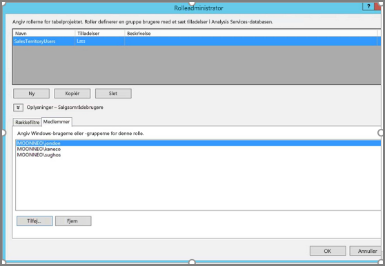
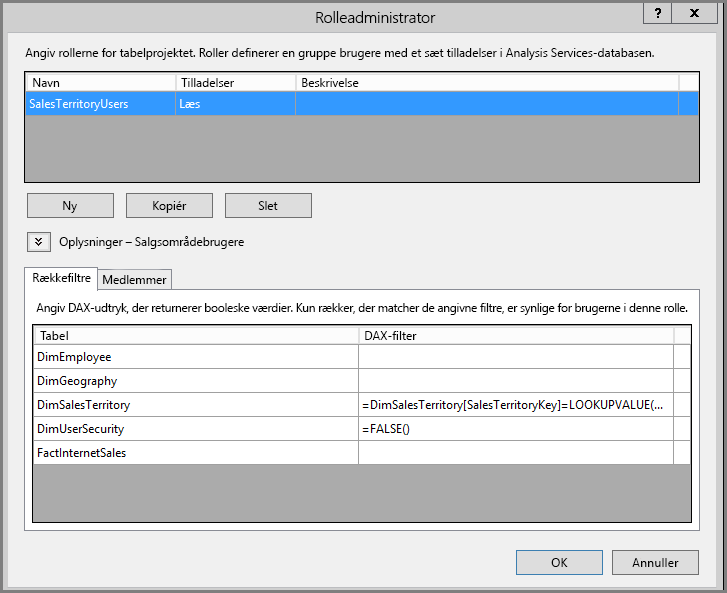
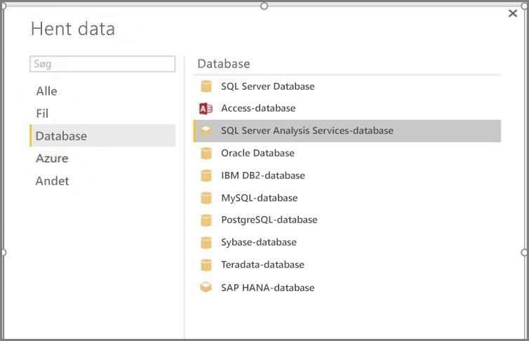
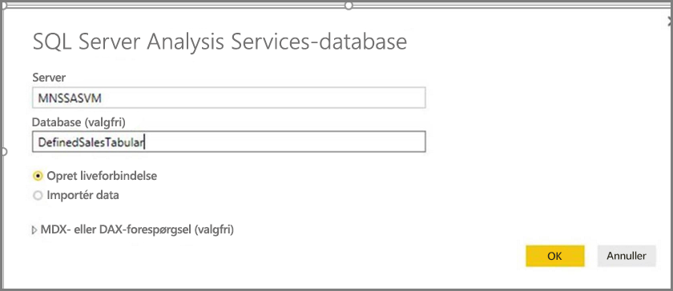
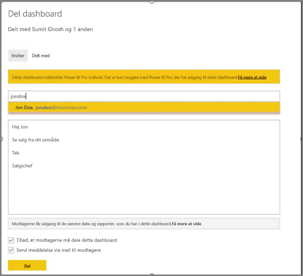
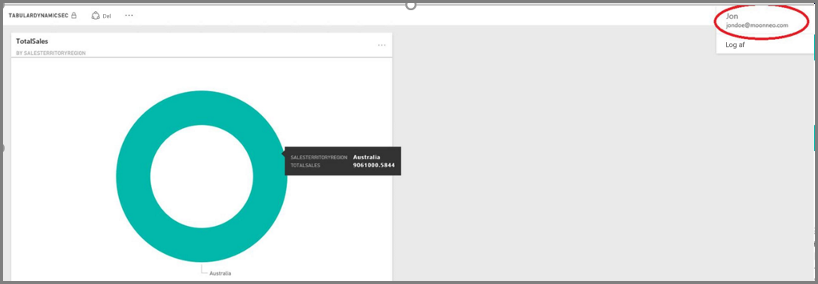

# <a name="tutorial-dynamic-row-level-security-with-analysis-services-tabular-model"></a>Selvstudium: Dynamisk sikkerhed på rækkeniveau med Analysis Services-tabelmodel
I denne vejledning vises de trin, der er nødvendige for at implementere **sikkerhed på rækkeniveau** i din **Analysis Services-tabelmodel**, og det vises, hvordan du bruger det i en rapport i Power BI. Trinnene i dette selvstudium er designet for at give dig mulighed for at følge med i og lære at udføre de nødvendige trin ved at gennemføre et eksempel på et datasæt.

I løbet af dette selvstudium beskrives trinnene nedenfor udførligt, hvilket hjælper dig med at forstå, hvad du skal gøre for at implementere dynamisk sikkerhed på rækkeniveau med Analysis Services-tabelmodellen:

* Opret en ny sikkerhedstabel i databasen **AdventureworksDW2012**
* Opret tabelmodellen med de nødvendige fakta- og dimensionstabeller
* Definer rollerne og tilladelserne for brugerne
* Modellen skal udrulles i en forekomst af en **Analysis Services-tabel**
* Du kan bruge Power BI Desktop til at oprette en rapport, der viser de data, som er knyttet til den bruger, der har adgang til rapporten
* Udrul rapporten for **Power BI-tjenesten**
* Opret et nyt dashboard baseret på rapporten, og endelig
* Del dashboardet med dine kolleger

Hvis du vil følge fremgangsmåden i dette selvstudium, skal du bruge databasen **AdventureworksDW2012**, som du kan downloade **[her](http://msftdbprodsamples.codeplex.com/releases/view/55330)**.

## <a name="task-1-create-the-user-security-table-and-define-data-relationship"></a>Opgave 1: Opret brugersikkerhedstabellen, og definer datarelationen
Der er udgivet mange artikler, som beskriver, hvordan du definerer dynamisk sikkerhed på rækkeniveau med **SSAS-tabelmodellen (SQL Server Analysis Services)**. [I dette eksempel følger vi denne artikel.](https://msdn.microsoft.com/library/hh479759.aspx) Følgende trin fører dig gennem den første opgave i dette selvstudium.

1. I vores eksempel bruger vi relationsdatabasen **AdventureworksDW2012**. I denne database skal du oprette tabellen **DimUserSecurity**, som vist på følgende billede. I dette eksempel bruger vi SSMS (SQL Server Management Studio) til at oprette tabellen.
   
   
2. Når tabellen er oprettet og gemt, skal vi oprette relationen mellem kolonnen **SalesTerritoryID** i tabellen **DimUserSecurity** og kolonnen **SalesTerritoryKey** i tabellen **DimSalesTerritory**, som vist på følgende billede. Det kan du gøre fra **SSMS** ved at højreklikke på tabellen **DimUserSecurity** og vælge **Rediger**.
   
   
3. Gem tabellen, og føj derefter et par rækker med brugeroplysninger til tabellen ved igen at højreklikke på tabellen **DimUserSecurity** og derefter vælge **Rediger de første 200 rækker**. Når du har tilføjet disse brugere, ser rækkerne i tabellen **DimUserSecurity** ud som på følgende billede:
   
   
   
   Vi vender tilbage til disse brugere i senere opgaver.
4. Derefter opretter vi en *indre joinforbindelse* til tabellen **DimSalesTerritory**, der viser de områdeoplysninger, der er knyttet til brugeren. I følgende kode udføres den *indre joinforbindelse*, og på næste billede kan du se, hvordan tabellen ser ud, når den *indre joinforbindelse* er oprettet.
   
       **select b.SalesTerritoryCountry, b.SalesTerritoryRegion, a.EmployeeKey, a.FirstName, a.LastName, a.UserName from [dbo].[DimUserSecurity] as a join  [dbo].[DimSalesTerritory] as b on a.[SalesTerritoryKey] = b.[SalesTerritoryKey]**
   
   
5. Bemærk, at billedet ovenfor viser oplysninger om, hvilken bruger der er ansvarlig for hvilket salgsområde. Dataene vises på grund af den relation, vi oprettede i **trin 2**. Bemærk også, at brugeren **Jon Doe er en del af det australske salgsområde**. Vi vender tilbage til John Doe i senere trin og opgaver.

## <a name="task-2-create-the-tabular-model-with-facts-and-dimension-tables"></a>Opgave 2: Opret tabelmodellen med fakta- og dimensionstabeller
1. Når relationsdatalageret er på plads, skal du definere din tabelmodel. Du kan oprette modellen ved hjælp af **SQL Server Data Tools (SSDT)**. Du kan få flere oplysninger om, hvordan du definerer en tabelmodel, i [denne artikel](https://msdn.microsoft.com/library/hh231689.aspx).
2. Importér alle de nødvendige tabeller til modellen som vist nedenfor.
   
    
3. Når du har importeret de nødvendige tabeller, skal du definere en rolle, der kaldes **SalesTerritoryUsers** med **læse**tilladelse. Det kan du gøre ved at klikke på menuen **Model** i SQL Server Data Tools og derefter klikke på **Roller**. I dialogboksen **Rolleadministrator** skal du klikke på **Ny**.
4. Under fanen **Medlemmer** i **Rolleadministrator** skal du tilføje de brugere, vi har defineret i tabellen **DimUserSecurity** i **Opgave 1 – Trin 3**.
   
    
5. Tilføj derefter de rette funktioner for tabellerne **DimSalesTerritory** og **DimUserSecurity** som vist nedenfor under fanen **Rækkefiltre**.
   
    
6. I dette trin bruger vi funktionen **LOOKUPVALUE** til at returnere værdier for en kolonne, hvor Windows-brugernavnet er det samme som det brugernavn, der returneres af funktionen **USERNAME**. Forespørgsler kan derefter begrænses, hvor de værdier, der returneres af **LOOKUPVALUE**, stemmer overens med værdier i den samme eller en relateret tabel. I kolonnen **DAX Filter** skal du skrive følgende formel:
   
       =DimSalesTerritory[SalesTerritoryKey]=LOOKUPVALUE(DimUserSecurity[SalesTerritoryID], DimUserSecurity[UserName], USERNAME(), DimUserSecurity[SalesTerritoryID], DimSalesTerritory[SalesTerritoryKey])
7. I denne formel returnerer funktionen **LOOKUPVALUE** alle værdier for kolonnen **DimUserSecurity[SalesTerritoryID]**, hvor **DimUserSecurity[UserName]** er det samme som det Windows-brugernavn, der i øjeblikket er logget på, og **DimUserSecurity[SalesTerritoryID]** er det samme som **DimSalesTerritory[SalesTerritoryKey]**.
   
   Sættet af SalesTerritoryKeys for salg, der returneres af **LOOKUPVALUE**, bruges derefter til at begrænse de rækker, der vises i **DimSalesTerritory**. Det er kun rækker, hvor **SalesTerritoryKey** for rækken er angivet af id'er, som returneres af funktionen **LOOKUPVALUE**, der vises.
8. I kolonnen **DAX Filter** for tabellen **DimUserSecurity** skal du skrive følgende formel.
   
       =FALSE()
9. Denne formel angiver, at alle kolonner skal opfylde den falske booleske betingelse. Derfor kan der ikke forespørges om kolonner i tabellen **DimUserSecurity**.
10. Nu skal vi behandle og udrulle modellen. [I denne artikel](https://msdn.microsoft.com/library/hh231693.aspx) kan du få hjælp til installation af modellen.

## <a name="task-3-adding-data-sources-within-your-on-premises-data-gateway"></a>Opgave 3: Tilføjelse af datakilder i din datagateway i det lokale miljø
1. Når din tabelmodel er installeret og klar til forbrug, skal du tilføje en datakildeforbindelse til din lokale Analysis Services-tabelserver på din Power BI-portal.
2. Hvis du vil give **Power BI tjenesten** adgang til din analysetjeneste i det lokale miljø, skal du i dit miljø have installeret og konfigureret en **[datagateway i det lokale miljø](service-gateway-onprem.md)**.
3. Når gatewayen er konfigureret korrekt, skal du oprette en datakildeforbindelse til din forekomst af **Analysis Services**-tabellen. I denne artikel kan du få hjælp til at [tilføje datakilden på Power BI-portalen](service-gateway-enterprise-manage-ssas.md).
   
   
4. Når det forrige trin er fuldført, er gatewayen konfigureret og klar til at interagere med din lokale **Analysis Services**-datakilde.

## <a name="task-4-creating-report-based-on-analysis-services-tabular-model-using-power-bi-desktop"></a>Opgave 4: Opret rapport, der er baseret på Analysis Services-tabelmodellen, ved hjælp af Power BI Desktop
1. Start **Power BI Desktop**, og vælg **Hent data > Database**.
2. På listen over datakilder skal du vælge **SQL Server Analysis Services-databasen** og vælge **Opret forbindelse**.
   
   
3. Udfyld dine oplysninger i din forekomst af **Analysis Services**-tabellen, og vælg **Opret liveforbindelse**. Vælg OK. Med **Power BI** fungerer dynamisk sikkerhed kun sammen med **Direkte forbindelse**.
   
   
4. Du kan se, at modellen er installeret i **Analysis Services**-forekomsten. Vælg den pågældende model, og vælg **OK**.
   
   
5. I **Power BI Desktop** vises nu alle tilgængelige felter til højre for lærredet i ruden **Felter**.
6. I ruden **Felter** til højre skal du vælge målingen **SalesAmount** i tabellen **FactInternetSales** og dimensionen **SalesTerritoryRegion** i tabellen **SalesTerritory**.
7. Vi vil oprette en simpel rapport, så vi vil i øjeblikket ikke tilføje flere kolonner. Hvis du vil have en mere meningsfuld visning af dataene, kan vi ændre visualiseringen til et **kransdiagram**.
   
   
8. Når rapporten er klar, kan du udgive den direkte på Power BI-portalen. På båndet **Hjem** i **Power BI Desktop** skal du vælge **Udgiv**.

## <a name="task-5-creating-and-sharing-a-dashboard"></a>Opgave 5: Opret og del et dashboard
1. Du har oprettet rapporten og klikket på **Udgiv** i **Power BI Desktop**, så rapporten er udgivet i **Power BI**-tjenesten. Nu, hvor den er i tjenesten, kan vores modelsikkerhedsscenarie vises ved hjælp af det eksempel, vi oprettede i de forrige trin.
   
   I sin rolle som **Sales Manager** kan Sumit se data fra alle de forskellige salgsområder. Så han opretter denne rapport (den rapport, der er oprettet i de forrige opgavetrin) og udgiver den i Power BI-tjenesten.
   
   Når han udgiver rapporten, opretter han et dashboard i Power BI-tjenesten, der kaldes **TabularDynamicSec**, baseret på denne rapport. På det følgende billede skal du lægge mærke til, at Sales Manager (Sumit) kan se de data, der er knyttet til hele salgsområdet.
   
   
2. Nu deler Sumit dashboardet med sin kollega, Jon Doe, der er ansvarlig for salg i det australske område.
   
   
   
   
3. Når Jon Doe logger på **Power BI**-tjenesten og ser det delte dashboard, som Sumit har oprettet, kan Jon Doe **kun** se salg fra det område, han er ansvarlig for. Så Jon Doe logger på, får adgang til det dashboard, som Sumit har delt med ham, og Jon Doe ser **kun** salg fra det australske område.
   
   
4. Tillykke! Den dynamiske sikkerhed på rækkeniveau, der er defineret i den lokale **Analysis Services**-tabelmodel, er blevet afspejlet og udrullet i **Power BI**-tjenesten. Power BI bruger egenskaben **effectiveusername** til at sende de aktuelle Power BI-brugeroplysninger til datakilden i det lokale miljø for at køre forespørgslerne.

## <a name="task-6-understanding-what-happens-behind-the-scenes"></a>Opgave 6: Forstå, hvad der sker i baggrunden
1. Denne opgave forudsætter, at du kender SQL Profiler, da du skal registrere en SQL Server Profiler-sporing på din lokale SSAS-tabelforekomst.
2. Sessionen initialiseres, så snart brugeren (i dette tilfælde Jon Doe) får adgang til dashboardet i Power BI-tjenesten. Du kan se, at rollen **salesterritoryusers** træder i kraft med det samme og bruger det gældende brugernavn **<EffectiveUserName>jondoe@moonneo.com</EffectiveUserName>**
   
       <PropertyList><Catalog>DefinedSalesTabular</Catalog><Timeout>600</Timeout><Content>SchemaData</Content><Format>Tabular</Format><AxisFormat>TupleFormat</AxisFormat><BeginRange>-1</BeginRange><EndRange>-1</EndRange><ShowHiddenCubes>false</ShowHiddenCubes><VisualMode>0</VisualMode><DbpropMsmdFlattened2>true</DbpropMsmdFlattened2><SspropInitAppName>PowerBI</SspropInitAppName><SecuredCellValue>0</SecuredCellValue><ImpactAnalysis>false</ImpactAnalysis><SQLQueryMode>Calculated</SQLQueryMode><ClientProcessID>6408</ClientProcessID><Cube>Model</Cube><ReturnCellProperties>true</ReturnCellProperties><CommitTimeout>0</CommitTimeout><ForceCommitTimeout>0</ForceCommitTimeout><ExecutionMode>Execute</ExecutionMode><RealTimeOlap>false</RealTimeOlap><MdxMissingMemberMode>Default</MdxMissingMemberMode><DisablePrefetchFacts>false</DisablePrefetchFacts><UpdateIsolationLevel>2</UpdateIsolationLevel><DbpropMsmdOptimizeResponse>0</DbpropMsmdOptimizeResponse><ResponseEncoding>Default</ResponseEncoding><DirectQueryMode>Default</DirectQueryMode><DbpropMsmdActivityID>4ea2a372-dd2f-4edd-a8ca-1b909b4165b5</DbpropMsmdActivityID><DbpropMsmdRequestID>2313cf77-b881-015d-e6da-eda9846d42db</DbpropMsmdRequestID><LocaleIdentifier>1033</LocaleIdentifier><EffectiveUserName>jondoe@moonneo.com</EffectiveUserName></PropertyList>
3. Baseret på anmodningen om gældende brugernavn konverterer Analysis Services anmodningen til de faktiske legitimationsoplysninger moonneo\jondoe, efter at der er sendt en forespørgsel til det lokale Active Directory. Når **Analysis Services** får de faktiske legitimationsoplysninger fra Active Directory, returnerer **Analysis Services** de eneste data, som brugeren har tilladelse til, baseret på den adgangstilladelse, som brugeren har til dataene.
4. Hvis der forekommer mere aktivitet på dashboardet, hvis f.eks. Jon Doe går fra dashboardet til den underliggende rapport, kan du med SQL Profiler se en bestemt forespørgsel, der vender tilbage til Analysis Services-tabelmodellen som en DAX-forespørgsel.
   
   
5. Nedenfor kan du også se den DAX-forespørgsel, der udføres for at udfylde dataene til rapporten.
   
   ```
   EVALUATE
     ROW(
       "SumEmployeeKey", CALCULATE(SUM(Employee[EmployeeKey]))
     )
   
   <PropertyList xmlns="urn:schemas-microsoft-com:xml-analysis">``
             <Catalog>DefinedSalesTabular</Catalog>
             <Cube>Model</Cube>
             <SspropInitAppName>PowerBI</SspropInitAppName>
             <EffectiveUserName>jondoe@moonneo.com</EffectiveUserName>
             <LocaleIdentifier>1033</LocaleIdentifier>
             <ClientProcessID>6408</ClientProcessID>
             <Format>Tabular</Format>
             <Content>SchemaData</Content>
             <Timeout>600</Timeout>
             <DbpropMsmdRequestID>8510d758-f07b-a025-8fb3-a0540189ff79</DbpropMsmdRequestID>
             <DbPropMsmdActivityID>f2dbe8a3-ef51-4d70-a879-5f02a502b2c3</DbPropMsmdActivityID>
             <ReturnCellProperties>true</ReturnCellProperties>
             <DbpropMsmdFlattened2>true</DbpropMsmdFlattened2>
             <DbpropMsmdActivityID>f2dbe8a3-ef51-4d70-a879-5f02a502b2c3</DbpropMsmdActivityID>
           </PropertyList>
   ```

## <a name="considerations"></a>Overvejelser
Der er et par overvejelser, du skal huske på, når du arbejder med sikkerhed på rækkeniveau, SSAS og Power BI.

1. I det lokale miljø er sikkerhed på rækkeniveau med Power BI kun tilgængelig med en direkte forbindelse.
2. Hvorvidt ændringer af dataene efter behandling af modellen straks er tilgængelige for brugere, der har adgang til rapporten, afhænger af en **direkte forbindelse** fra Power BI-tjenesten.

