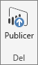
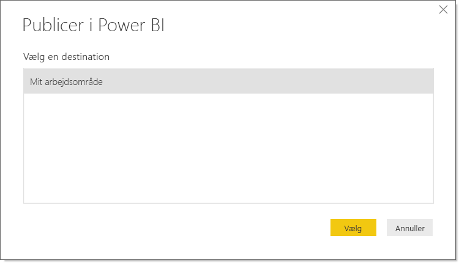
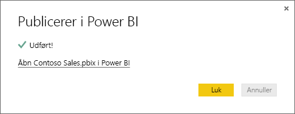

# Udgiv fra Power BI Desktop
Når du udgiver en **Power BI Desktop**-fil i **Power BI-tjenesten**, udgives dataene i modellen og de rapporter, du har oprettet i visningen **Rapport**, på dit Power BI-arbejdsområde. Du kan se et nyt datasæt med det samme navn og alle rapporter i navigatoren til dit arbejdsområde.

Hvis du udgiver fra **Power BI Desktop**, har det samme effekt, som hvis du bruger **Hent data** i Power BI til at oprette forbindelse til og overføre en **Power BI Desktop**-fil.

> [!NOTE]
> De ændringer, du foretager i Power BI-rapporten, f.eks. tilføjelse, sletning eller ændring af visualiseringer i rapporter, gemmes ikke i den oprindelige **Power BI Desktop**-fil.
> 
> 

## Sådan udgiver du Power BI Desktop-datasæt og -rapporter
1. I Power BI Desktop skal du vælge \> **Filer** \> **Udgiv** \> **Udgiv i Power BI** eller klikke på **Udgiv** på båndet.  

   

2. Log på Power BI.
3. Vælg en destination.

   

Når det er fuldført, modtager du et link til rapporten. Klik på linket for at åbne rapporten på dit Power BI-websted.

## Udgiv igen eller erstat et datasæt, der er udgivet i Power BI Desktop
Når du udgiver en **Power BI Desktop**-fil, overføres datasættet og eventuelle rapporter, du har oprettet i **Power BI Desktop**, til Power BI-webstedet. Når du udgiver din **Power BI Desktop**-fil igen, erstattes datasættet på dit Power BI-websted med det opdaterede datasæt fra **Power BI Desktop**-filen.

Alt dette er ret ligetil, men der er et par ting, du skal vide:

* Hvis du allerede har to eller flere datasæt i Power BI med samme navn som **Power BI Desktop**-filen, lykkes udgivelsen måske ikke. Kontrollér, at du kun har ét datasæt i Power BI med det samme navn. Du kan også omdøbe filen og udgive den og dermed oprette et nyt datasæt med samme navn som filen.
* Hvis du omdøber eller sletter en kolonne eller måling, kan eventuelle visualiseringer, du allerede har i Power BI med dette felt, blive brudt. 
* Power BI ignorerer nogle formatændringer af eksisterende kolonner. Hvis du f.eks. ændrer formatet for en kolonne fra 0,25 til 25 %.
* Hvis du har en tidsplan for opdateringer, der er konfigureret for dit eksisterende datasæt i Power BI, og du føjer nye datakilder til din fil og derefter genudgiver dem, skal du logge på dem i *Administrer datakilder* før næste planlagte opdatering.

