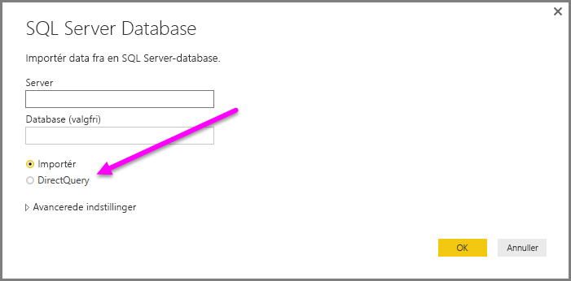
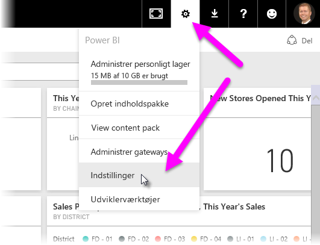
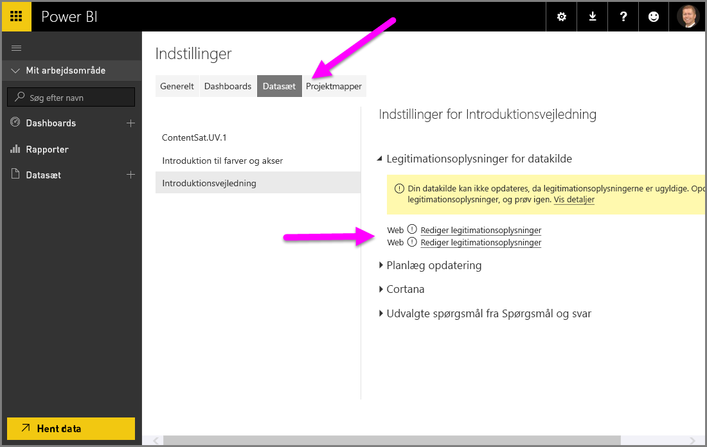

# Brug DirectQuery i Power BI Desktop
Når du opretter forbindelse til din datakilde i **Power BI Desktop**, er det altid muligt at importere en kopi af dataene til **Power BI Desktop**. For nogle datakilder findes der en anden mulighed: du kan oprette direkte forbindelse til datakilden med **DirectQuery**.

## Understøttede datakilder
Hvis du vil se en komplet liste over de datakilder, der understøtter **DirectQuery**, skal du se [Datakilder, der understøttes af DirectQuery](desktop-directquery-data-sources.md).

## Sådan opretter du forbindelse ved hjælp af DirectQuery
Når du bruger **Hent data** til at oprette forbindelse til en datakilde, der understøttes af **DirectQuery**, kan du i forbindelsesvinduet vælge, hvordan du vil oprette forbindelse.  

Der er følgende forskelle mellem at vælge **Importér** og **DirectQuery**:

**Importér** – de valgte tabeller og kolonner importeres i **Power BI Desktop**. Når du opretter eller interagerer med en visualisering, bruger **Power BI Desktop** de importerede data. Du skal opdatere dataene, hvilket vil importere hele datasættet igen, for at se eventuelle ændringer i de underliggende data siden den oprindelige import eller seneste opdatering.

**DirectQuery** – der bliver ikke importeret eller kopieret data til **Power BI Desktop**. For relationelle datakilder vises de valgte tabeller og kolonner på listen **Felter**. For flerdimensionelle datakilder som SAP Business Warehouse vises dimensioner og målinger for den valgte kube på listen **Felter**. Når du opretter eller interagerer med en visualisering, sender **Power BI Desktop** en forespørgsel til den underliggende datakilde, og det betyder, at du altid får vist aktuelle data.

Du kan vælge mange datamodelleringer og datatransformationer, når du bruger **DirectQuery** – dog med nogle begrænsninger. Når du opretter eller interagerer med en visualisering, skal der sendes en forespørgsel til den underliggende datakilde, og den tid, det tager at opdatere visualiseringen, afhænger af ydeevnen for den underliggende datakilde. Hvis der for nylig er sendt en anmodning, vil Power BI Desktop bruge de seneste data til at reducere den tid, der kræves til at vise visualiseringen. Hvis du vælger **Opdater** under fanen **Hjem**, bliver alle visualiseringerne opdateret med de aktuelle data.

I artiklen [Power BI og DirectQuery](desktop-directquery-about.md) kan du læse mere om **DirectQuery**. Se også følgende afsnit for at få oplysninger om de fordele, begrænsninger og vigtige overvejelser, du skal være opmærksom på, når du bruger **DirectQuery**.

## Fordele ved at bruge DirectQuery
Der er nogle få fordele ved at bruge **DirectQuery**:

* Med **DirectQuery** kan du bygge visualiseringer over meget store datasæt, hvor det ellers ikke vil være muligt først at importere alle dataene.
* De underliggende dataændringer kan kræve, at dataene opdateres, og for nogle rapporter kan det kræve store dataoverførsler at vise aktuelle data, hvilket vil gøre det uhensigtsmæssigt at importere dataene igen. I modsætning til det vil de rapporter, der bruger **DirectQuery**, altid vise aktuelle data.
* Grænsen for datasæt på 1 GB gælder *ikke* for **DirectQuery**

## Begrænsninger i DirectQuery
Der er i øjeblikket nogle få begrænsninger ved at bruge **DirectQuery**:

* Alle tabeller skal komme fra den samme database.
* Hvis forespørgslen i **Forespørgselseditor** er for kompliceret, vil der opstå en fejl. Når du skal løse fejlen, skal du enten slette det fejlbehæftede trin i **Forespørgselseditor**, eller du skal i stedet *importere* dataene i stedet for at bruge **DirectQuery**. For flerdimensionelle datakilder som SAP Business Warehouse er der ingen **Forespørgselseditor**
* Filtrering af relationer er begrænset til en enkelt retning i stedet for begge retninger (selvom det er muligt at aktivere krydsfiltrering i begge retninger for **DirectQuery** som en prøveversion). For flerdimensionelle datakilder som SAP Business Warehouse er der ikke defineret nogen relationer i modellen
* Funktionerne for tidsintelligens findes ikke i **DirectQuery**. Eksempelvis understøttes særlig behandling af datokolonner (år, kvartal, måned, dag osv.) ikke i **DirectQuery**-tilstand.
* Som standard er de begrænsninger, der gælder for DAX-udtryk, tilladt i målinger. Du kan se flere oplysninger efter denne punktopstilling.
* Der er en grænse på 1 million rækker for returnering af data, når du bruger **DirectQuery**. Dette påvirker ikke de aggregeringer eller beregninger, der bruges til at oprette det datasæt, der returneres ved hjælp af **DirectQuery**. Det påvirker kun de returnerede rækker. Du kan for eksempel aggregere 10 millioner rækker med en forespørgsel, der kører på datakilden, og præcist returnere resultaterne for den aggregering til Power BI ved hjælp af **DirectQuery**, så længe der returneres mindre end 1 million rækker til Power BI. Hvis der ville blive returneret mere end 1 million rækker fra **DirectQuery**, vil Power BI returnere en fejl.

For at sikre at de forespørgsler, der sendes til den underliggende datakilde, har en acceptabel ydeevne, pålægges der som standard begrænsninger på målingerne. Avancerede brugere kan vælge at tilsidesætte denne begrænsning ved at vælge **Fil > Indstillinger** og derefter vælge **Indstillinger > Indstillinger og indstillinger > DirectQuery** og derefter vælge indstillingen *Tillad ubegrænsede foranstaltninger i DirectQuery-tilstand*. Når du har valgt denne indstilling, kan du bruge ethvert DAX-udtryk, der er gyldigt for en måling. Brugerne skal dog være opmærksomme på, at nogle udtryk, der har en god ydeevne, når dataene importeres, kan være langsomme i backend-kilden, når der bruges DirectQuery-tilstand.

## Vigtige overvejelser i forbindelse med brugen af DirectQuery
Der skal tages højde for følgende tre punkter, når der bruges **DirectQuery**:

* **Ydeevne og belastning** – Alle **DirectQuery**-anmodninger sendes til kildedatabasen, så den tid, der kræves for at opdatere en visualisering, er afhængig af, hvor lang tid der går, inden backend-datakilden svarer med resultater fra forespørgslen (eller forespørgslerne). Den anbefalede svartid (inklusiv returnering af de data, der er anmodet om) ved brug af **DirectQuery** til visualiseringer, er fem sekunder eller mindre. Den maksimalt anbefalede svartid for resultater er 30 sekunder. Hvis svartiden bliver længere, bliver brugeroplevelsen i rapporten uacceptabel. Når en rapport er publiceret til Power BI-tjenesten, vil de forespørgsler, der tager mere end nogle få minutter, få timeout, og brugeren får vist en fejl.
  
  Der skal også tages højde for belastningen af kildedatabasen baseret på, hvor mange Power BI-brugere der skal bruge den publicerede rapport. Når der bruges *Sikkerhed på rækkeniveau*, kan det også have en stor indflydelse. Hvis flere brugere deles om et dashboardfelt, der ikke bruger sikkerhed på rækkeniveau, medfører det en enkelt forespørgsel til databasen. Hvis der bruges sikkerhed på rækkeniveau for et dashboardfelt, vil det som regel medføre, at opdatering af feltet kræver en forespørgsel *pr. bruger*, og det vil give en væsentlig større belastning af kildedatabasen og potentielt påvirke ydeevnen.
  
  Power BI opretter forespørgsler, der er så effektive som muligt. I visse situationer vil den genererede forespørgsel muligvis ikke være tilstrækkeligt effektiv til at undgå, at en opdatering medfører fejl. Et eksempel på denne situation er, når den genererede forespørgsel henter et stort antal rækker (mere end 1 million) fra backend-datakilden, hvilket vil give følgende fejl:
  
      The resultset of a query to external data source has exceeded
      the maximum allowed size of '1000000' rows.
  
  Denne situation kan opstå med et simpelt diagram, der indeholder en kolonne med høj kardinalitet, hvor indstillingen for aggregering er angivet til *Opsummer ikke*. Visualiseringen skal kun have kolonner med en kardinalitet under 1 million, eller der skal være anvendt relevante filtre.
* **Sikkerhed** – Alle de brugere, der anvender en publiceret rapport, opretter forbindelse til backend-datakilden ved hjælp af de legitimationsoplysninger, der angives efter publiceringen til Power BI-tjenesten. Det er samme situation som for de data, der er importeret: alle brugere ser de samme data, uanset hvilke sikkerhedsregler der er defineret i backend-kilden. De kunder, der ønsker sikkerhed pr. bruger, implementerer med DirectQuery-kilder og bruger RLS. [Få mere at vide om RLS](service-admin-rls.md).
* **Understøttede funktioner**  – Det er ikke alle funktioner i **Power BI Desktop**, der understøttes i **DirectQuery**-tilstand, eller som har begrænsninger. Desuden er der nogle funktioner i Power BI-tjenesten (som *Hurtige indsigter*), der ikke er tilgængelige for de datasæt, hvor der bruges **DirectQuery**. Når du skal beslutte, om du vil bruge **DirectQuery**, skal du derfor tage højde for begrænsningerne for sådanne funktioner i forbindelse med brug af **DirectQuery**.   

## Publicer til Power BI-tjenesten
De rapporter, der oprettes ved hjælp af **DirectQuery**, kan publiceres til Power BI-tjenesten.

Hvis datakilden ikke behøver **datagatewayen i det lokale miljø**  (**Azure SQL Database**, **Azure SQL Data Warehouse** eller **Redshift**), skal der angives legitimationsoplysninger, før den publicerede rapport vises i Power BI-tjenesten.

Du kan angive legitimationsoplysninger ved at vælge tandhjulsikonet **Indstillinger** i Power BI og derefter vælge **Indstillinger**.

Vinduet **Indstillinger** vises i Power BI. Der skal du vælge fanen **Datasæt** og vælge det datasæt, der bruger **DirectQuery**, og vælge **Rediger legitimationsoplysninger**.

Indtil der er angivet legitimationsoplysninger, vil det medføre fejl, når der åbnes en publiceret rapport eller et datasæt udforskes med en **DirectQuery**-forbindelse til sådanne datakilder.

For andre datakilder end **Azure SQL Database**, **Azure SQL Data Warehouse** og **Redshift**, der bruger DirectQuery, skal der installeres en **datagateway i det lokale miljø**, og datakilden skal være registreret, for at der kan oprettes en dataforbindelse. Du kan [læse mere om datagateways i det lokale miljø](http://go.microsoft.com/fwlink/p/?LinkID=627094).

## Næste trin
Du kan finde flere oplysninger om **DirectQuery** i følgende ressourcer:

* [DirectQuery i Power BI](desktop-directquery-about.md)
* [Datakilder, der understøttes af DirectQuery](desktop-directquery-data-sources.md)
* [DirectQuery og SAP BW](desktop-directquery-sap-bw.md)
* [DirectQuery og SAP HANA](desktop-directquery-sap-hana.md)
* [Datagateway i det lokale miljø](service-gateway-onprem.md)

